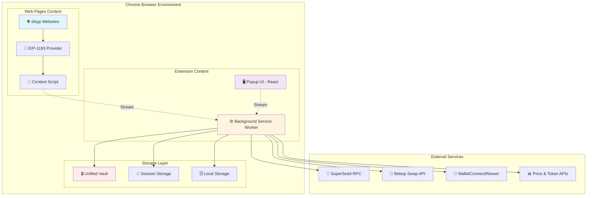
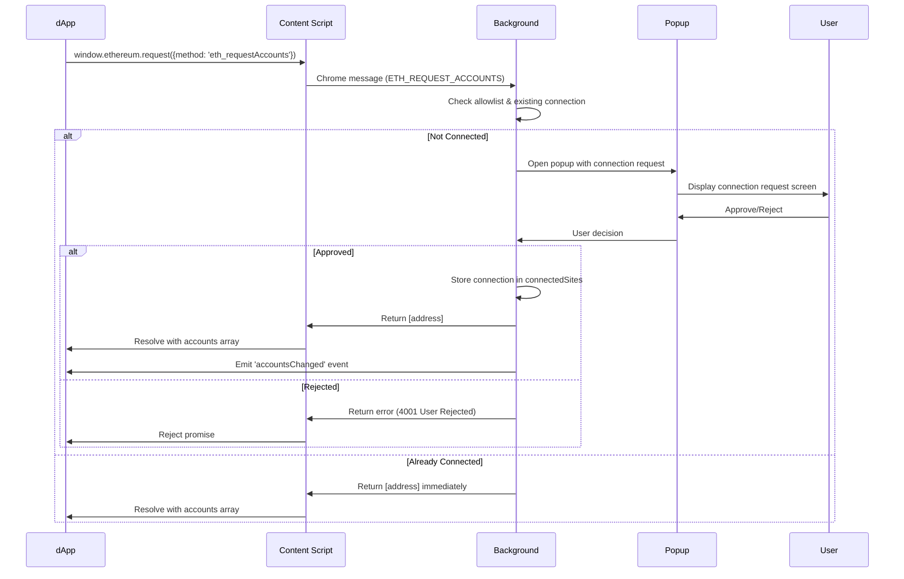
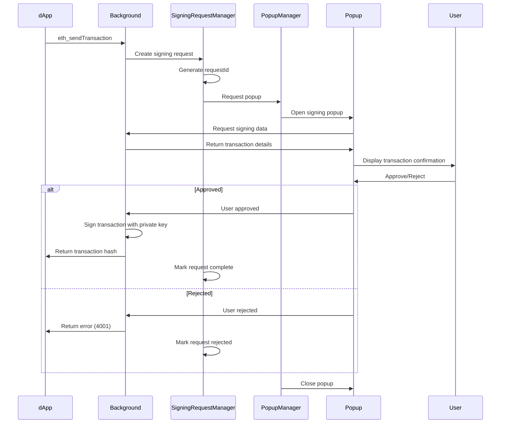
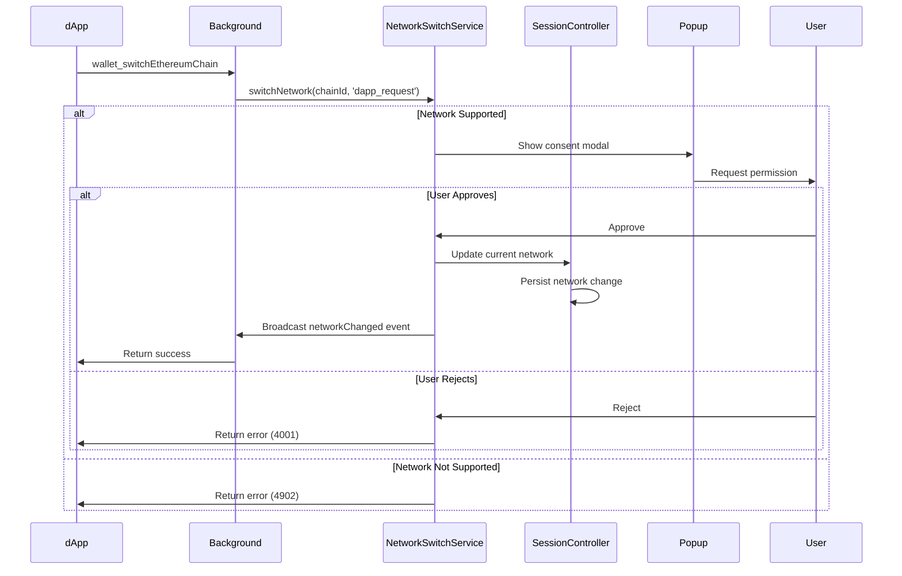
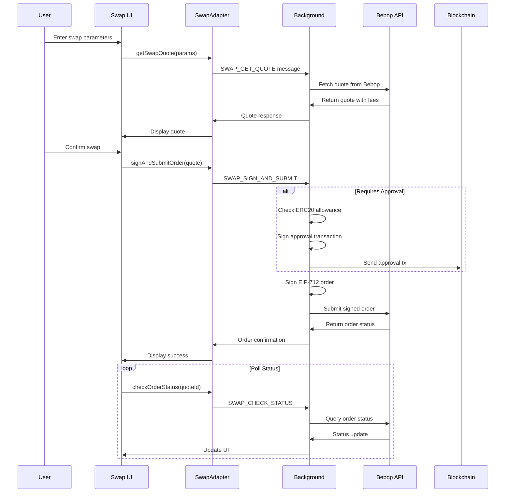
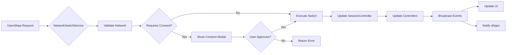

# SuperSafe Wallet - Architecture Documentation

**Created:** October 13, 2025  
**Version:** 3.0.0+  
**Status:** ✅ CURRENT  
**Last Code Update:** October 13, 2025

---

## Table of Contents

1. [Executive Summary](#executive-summary)
2. [System Architecture](#system-architecture)
3. [Core Design Principles](#core-design-principles)
4. [Component Architecture](#component-architecture)
5. [Data Flow Patterns](#data-flow-patterns)
6. [Technology Stack](#technology-stack)
7. [Directory Structure](#directory-structure)
8. [Network Architecture](#network-architecture)
9. [Performance Metrics](#performance-metrics)

---

## Executive Summary

SuperSafe Wallet is a modern Ethereum-compatible browser extension wallet implementing a **MetaMask-style Service Worker architecture** with **Smart Native Connection** for seamless multichain dApp integration. Built with React 18, ethers.js v6, and Chrome Extension Manifest V3.

### Key Architectural Features

- **✅ MetaMask-Style Architecture**: Service worker as single source of truth
- **✅ Smart Native Connection**: Real chainIds only, zero compatibility hacks
- **✅ Multichain Support**: 2 active networks (SuperSeed, Optimism) + 5 planned networks
- **✅ Stream-Based Communication**: Native Chrome long-lived connections
- **✅ Unified Vault System**: Enterprise-grade AES-256-GCM encryption
- **✅ Thin Client Pattern**: Frontend as lightweight presentation layer
- **✅ Enterprise Signing System**: Robust request management and recovery
- **✅ Bebop Integration**: Native swap support with partner fees
- **✅ WalletConnect V2**: Full Reown WalletKit implementation
- **✅ Framework Detection**: Automatic dApp framework identification

### System Metrics

```
Total Project Files: 145 JavaScript/JSX files
Total Lines of Code: ~25,000 lines
Architecture Pattern: MetaMask-style Service Worker
Security Level: Enterprise-grade encryption
Supported Networks: 2 active networks (7 total planned)
Response Time: <150ms average
Vault Encryption: AES-256-GCM + PBKDF2
```

---

## System Architecture

### High-Level Architecture Diagram



### Component Interaction Model

```
┌──────────────────────────────────────────────────────────────────┐
│                      Frontend (Thin Client)                      │
│  ┌──────────────┐  ┌──────────────┐  ┌────────────────────────┐ │
│  │   React UI   │  │   Adapters   │  │   Stream Manager       │ │
│  │  Components  │→→│  (Frontend)  │→→│  (Long-lived ports)    │ │
│  └──────────────┘  └──────────────┘  └────────────────────────┘ │
└──────────────────────────────────┬───────────────────────────────┘
                                   │ Chrome Streams
                                   ↓
┌──────────────────────────────────────────────────────────────────┐
│               Background Script (Single Source of Truth)         │
│  ┌────────────────────────────────────────────────────────────┐ │
│  │                    Stream Handlers                         │ │
│  │  - Session  - Provider  - Swap  - Send  - Blockchain      │ │
│  └────────────────────────────────────────────────────────────┘ │
│  ┌────────────────────────────────────────────────────────────┐ │
│  │                    Core Controllers                        │ │
│  │  - BackgroundSessionController (3,979 lines)               │ │
│  │  - BackgroundControllers (497 lines)                       │ │
│  │    • TokenController  • NetworkController                  │ │
│  │    • TransactionController  • NetworkSwitchService         │ │
│  └────────────────────────────────────────────────────────────┘ │
│  ┌────────────────────────────────────────────────────────────┐ │
│  │                 Enterprise Managers                        │ │
│  │  - SigningRequestManager  - PopupManager                   │ │
│  │  - EIP1193EventsManager   - AutoEscalationManager          │ │
│  │  - StreamPersistenceManager                                │ │
│  └────────────────────────────────────────────────────────────┘ │
│  ┌────────────────────────────────────────────────────────────┐ │
│  │                   Handler Layer                            │ │
│  │  - walletHandlers  - contractHandlers                      │ │
│  │  - providerHandlers  - AllowListManager                    │ │
│  └────────────────────────────────────────────────────────────┘ │
│  ┌────────────────────────────────────────────────────────────┐ │
│  │               External Integrations                        │ │
│  │  - WalletConnect Manager  - Bebop Integration              │ │
│  │  - SuperSeed API Wrapper  - Secure API Client              │ │
│  └────────────────────────────────────────────────────────────┘ │
└──────────────────────────────────────────────────────────────────┘
                                   │
                                   ↓
┌──────────────────────────────────────────────────────────────────┐
│                        Storage Layer                             │
│  ┌──────────────┐  ┌──────────────┐  ┌───────────────────────┐ │
│  │ Unified Vault│  │   Session    │  │      Local            │ │
│  │ (Encrypted)  │  │   Storage    │  │      Storage          │ │
│  └──────────────┘  └──────────────┘  └───────────────────────┘ │
└──────────────────────────────────────────────────────────────────┘
```

### Content Script Provider Pattern

```
┌────────────────────────────────────────────────────────────┐
│                      dApp Web Page                         │
│  ┌──────────────────────────────────────────────────────┐ │
│  │  window.ethereum (EIP-1193 Provider)                 │ │
│  │    - request()  - on()  - removeListener()           │ │
│  └──────────────────────────────────────────────────────┘ │
└────────────────────┬───────────────────────────────────────┘
                     │ postMessage
                     ↓
┌────────────────────────────────────────────────────────────┐
│               Content Script (Injected)                    │
│  ┌──────────────────────────────────────────────────────┐ │
│  │  Provider Injection:                                 │ │
│  │  - Injects window.ethereum object                    │ │
│  │  - Handles EIP-1193 method calls                     │ │
│  │  - Routes requests to background                     │ │
│  └──────────────────────────────────────────────────────┘ │
└────────────────────┬───────────────────────────────────────┘
                     │ Chrome Runtime Messages
                     ↓
┌────────────────────────────────────────────────────────────┐
│              Background Service Worker                     │
│  ┌──────────────────────────────────────────────────────┐ │
│  │  Request Processing:                                 │ │
│  │  - Validates origin against allowlist                │ │
│  │  - Checks connection state                           │ │
│  │  - Manages signing requests                          │ │
│  │  - Returns responses via streams                     │ │
│  └──────────────────────────────────────────────────────┘ │
└────────────────────────────────────────────────────────────┘
```

---

## Core Design Principles

### 1. Single Source of Truth

**All state lives in the background service worker.**

- Frontend components are purely presentational
- No direct storage access from frontend
- All mutations go through background controllers
- State synchronization via Chrome streams

**Benefits:**
- Eliminates race conditions
- Prevents storage context isolation issues
- Simplified state management
- Single point of control for security

### 2. Thin Client Pattern

**Frontend is a lightweight presentation layer.**

```javascript
// ❌ WRONG: Frontend doing business logic
const wallet = await createWallet(privateKey);
await saveToStorage(wallet);

// ✅ CORRECT: Frontend delegates to background
const result = await FrontendSessionAdapter.createWallet(privateKey);
```

**Frontend Responsibilities:**
- Render UI components
- Handle user input
- Display data from background
- Route user actions to background

**Background Responsibilities:**
- State management
- Cryptographic operations
- Storage access
- Business logic
- External API calls

### 3. Stream-Based Communication

**Native Chrome long-lived connections for efficiency.**

```javascript
// Frontend creates persistent connection
const port = chrome.runtime.connect({ name: 'session' });

// Background listens on named channels
backgroundStreamManager.onMessage('session', async (message, port) => {
  // Handle message
  return { success: true, data: result };
});
```

**Stream Channels:**
- `session` - Session and wallet operations
- `provider` - dApp provider requests (EIP-1193)
- `swap` - Swap quote and execution
- `send` - Token transfer operations
- `blockchain` - Blockchain queries
- `api` - External API calls

### 4. Zero Frontend Crypto

**All cryptographic operations isolated in background.**

- Private keys never leave background context
- Vault encryption/decryption in background only
- Signing operations in background only
- Password handling in background only

**Security Benefits:**
- Reduced attack surface
- Memory isolation
- Audit-friendly architecture
- Simplified security model

### 5. MetaMask-Style Controllers

**Modular controller pattern for separation of concerns.**

```javascript
BackgroundControllers {
  tokenController       // ERC20 token management
  networkController     // Network switching & configuration
  transactionController // Transaction history & management
  networkSwitchService  // Centralized network switching
}
```

Each controller:
- Single responsibility
- Independent initialization
- Event-driven communication
- Storage persistence

---

## Component Architecture

### Background Script (3,220 lines)

**Location:** `src/background.js`

**Primary Responsibilities:**
- Service worker initialization and lifecycle
- Stream handler registration
- Manager orchestration
- WalletConnect integration
- Global state coordination

**Key Components:**
```javascript
// Core Controllers
backgroundSessionController  // Session & wallet management
backgroundControllers        // Token, network, transaction controllers

// Enterprise Managers
signingRequestManager       // Signing request lifecycle
popupManager               // Popup window management
eip1193EventsManager       // EIP-1193 event broadcasting
autoEscalationManager      // Auto-approval for trusted dApps

// External Integrations
walletConnectManager       // WalletConnect v2 / Reown
secureApiClient           // Secure external API calls
bebopTokenService         // Bebop token list management
```

### BackgroundSessionController (3,979 lines)

**Location:** `src/background/BackgroundSessionController.js`

**Core Functionality:**
- Vault management (create, unlock, lock)
- Wallet management (create, import, remove)
- Session state management
- Auto-lock functionality
- Connected sites management
- Network switching coordination

**Session State:**
```javascript
{
  isUnlocked: boolean,
  password: string (memory only),
  vaultData: Object (decrypted),
  decryptedWallets: Map<address, privateKey>,
  connectedSites: Map<origin, siteData>,
  currentNetworkKey: string
}
```

### BackgroundControllers (497 lines)

**Location:** `src/background/BackgroundControllers.js`

**Architecture:**
```javascript
class BackgroundControllers {
  tokenController         // ERC20 operations
  networkController      // Network management
  transactionController  // Transaction history
  networkSwitchService   // Unified switching
  
  async initialize(networkKey, provider, getPrivateKeyFn)
  async handleTokenMessage(message)
  async handleNetworkMessage(message)
  async handleTransactionMessage(message)
}
```

### Frontend Application (1,569 lines)

**Location:** `src/App.jsx`

**Main React Component:**
- Screen routing logic
- Modal management
- Connection request handling
- Transaction confirmation
- Signing request UI
- Network switch consent

**State Management:**
```javascript
// Wallet state (from background)
const { 
  currentWallet, 
  wallets, 
  network, 
  isUnlocked,
  supportsSwap 
} = useWalletProvider();
```

### Stream Handlers

**Location:** `src/background/handlers/streams/`

| Handler | Purpose | Key Operations |
|---------|---------|----------------|
| **SessionStreamHandler** | Session operations | unlock, createWallet, switchWallet |
| **ProviderStreamHandler** | dApp requests | eth_requestAccounts, eth_sendTransaction |
| **SwapStreamHandler** | Bebop swaps | getQuote, signOrder, checkStatus |
| **SendStreamHandler** | Token transfers | estimateGas, sendTransaction |
| **BlockchainStreamHandler** | Blockchain queries | getBalance, getTokens, getNFTs |
| **ApiStreamHandler** | External APIs | price feeds, token lists |

---

## Data Flow Patterns

### Connection Request Flow



### Transaction Signing Flow



### Network Switch Flow



### Swap Execution Flow



---

## Technology Stack

### Core Technologies

| Technology | Version | Purpose |
|------------|---------|---------|
| **React** | 18.2.0 | UI framework |
| **ethers.js** | 6.13.0 | Ethereum library |
| **Vite** | 6.3.6 | Build tool |
| **TailwindCSS** | 3.3.3 | Styling |
| **Chrome Extension** | Manifest V3 | Platform |

### Key Dependencies

```json
{
  "@reown/walletkit": "^1.2.8",
  "@metamask/eth-sig-util": "^8.2.0",
  "ethereum-cryptography": "^3.2.0",
  "buffer": "^6.0.3",
  "idb": "^7.1.1",
  "axios": "^1.12.0"
}
```

### Build Configuration

**Multiple Vite Configs:**
- `vite.config.js` - Frontend popup build
- `vite.config.worker.js` - Background service worker
- `vite.config.content.js` - Content script injection

**Output Structure:**
```
dist/
├── index.html              # Popup entry
├── popup.js                # Frontend bundle
├── background.js           # Service worker bundle
├── content-script.js       # Content script bundle
├── provider.js             # EIP-1193 provider
├── manifest.json           # Extension manifest
└── assets/                 # Static resources
```

---

## Directory Structure

### Backend Architecture

```
src/background/
├── BackgroundSessionController.js    # Session management (3,979 lines)
├── BackgroundControllers.js          # Controller orchestration (497 lines)
│
├── handlers/                         # Request handlers
│   ├── streams/                      # Stream-based handlers
│   │   ├── SessionStreamHandler.js   # Session operations
│   │   ├── ProviderStreamHandler.js  # dApp provider requests
│   │   ├── SwapStreamHandler.js      # Bebop swap operations
│   │   ├── SendStreamHandler.js      # Token transfers
│   │   ├── BlockchainStreamHandler.js # Blockchain queries
│   │   ├── ApiStreamHandler.js       # External API calls
│   │   └── GenericStreamHandlers.js  # Generic utilities
│   ├── walletHandlers.js             # Wallet operations
│   ├── contractHandlers.js           # Smart contract calls
│   └── providerHandlers.js           # Provider management
│
├── managers/                         # Enterprise managers
│   ├── SigningRequestManager.js      # Signing lifecycle (22,883 lines)
│   ├── PopupManager.js               # Popup orchestration (35,393 lines)
│   ├── EIP1193EventsManager.js       # Event broadcasting
│   ├── AutoEscalationManager.js      # Auto-approval logic
│   ├── StreamPersistenceManager.js   # Stream persistence
│   ├── SigningRequestRecovery.js     # Request recovery
│   └── SigningRequestDeduplicator.js # Duplicate prevention
│
├── services/                         # External services
│   ├── NetworkSwitchService.js       # Unified network switching
│   ├── SecureApiClient.js            # Secure HTTP client
│   └── SuperSeedApiWrapper.js        # SuperSeed RPC wrapper
│
├── adapters/                         # Adapters
│   └── SigningModalAdapter.js        # Modal communication
│
├── decoders/                         # Data decoders
│   └── TransactionDecoder.js         # Transaction decoding
│
├── policy/                           # Security policies
│   └── AllowListManager.js           # dApp allowlist
│
├── security/                         # Security modules
│   ├── SimpleRateLimiter.js          # Rate limiting
│   └── SimpleBlacklistManager.js     # Blacklist management
│
├── config/                           # Configuration
│   ├── apiConfig.js                  # API endpoints
│   ├── bebopPartnerConfig.js         # Bebop partner settings
│   └── walletConnectConfig.js        # WalletConnect settings
│
├── strategy/                         # Strategy patterns
│   └── ConnectionStrategies.js       # dApp connection strategies
│
├── api/                              # API layer
│   └── blockchainApi.js              # Unified blockchain API
│
└── utils/                            # Utilities
    └── feeConfig.js                  # Fee configuration
```

### Frontend Architecture

```
src/
├── App.jsx                           # Main app component (1,569 lines)
├── main.jsx                          # React entry point
│
├── components/                       # UI components
│   ├── Dashboard.jsx                 # Portfolio view
│   ├── Swap.jsx                      # Swap interface
│   ├── Settings.jsx                  # Settings panel
│   ├── Ecosystem.jsx                 # Ecosystem explorer
│   │
│   ├── screens/                      # Full-screen views
│   │   ├── ConnectionRequestScreen.jsx
│   │   ├── TransactionConfirmationScreen.jsx
│   │   ├── SigningConfirmationScreen.jsx
│   │   ├── TypedDataConfirmationScreen.jsx
│   │   ├── NetworkSwitchConfirmationScreen.jsx
│   │   └── TransactionSuccessScreen.jsx
│   │
│   ├── modals/                       # Modal dialogs
│   │   ├── UnlockWalletModal.jsx
│   │   ├── EditWalletModal.jsx
│   │   ├── NetworkConsentModal.jsx
│   │   ├── SignatureModal.jsx
│   │   ├── LoadingModal.jsx
│   │   └── StyledModal.jsx
│   │
│   ├── settings/                     # Settings sections
│   │   ├── SecuritySection.jsx
│   │   ├── WalletsSection.jsx
│   │   ├── NetworkSection.jsx
│   │   ├── TokensSection.jsx
│   │   ├── WalletConnectSection.jsx
│   │   └── AppInfoSection.jsx
│   │
│   └── common/                       # Reusable components
│       ├── Dashboard/
│       │   ├── PortfolioBalanceSection.jsx
│       │   ├── TokensList.jsx
│       │   ├── NFTsSection.jsx
│       │   └── TokenCardDark.jsx
│       ├── TokenImage.jsx
│       ├── TokenLogo.jsx
│       ├── NetworkIcon.jsx
│       └── TokenPriceChart.jsx
│
├── contexts/                         # React contexts
│   ├── WalletProvider.jsx            # Wallet state context
│   └── BalancesProvider.jsx          # Balances context
│
├── hooks/                            # Custom hooks
│   ├── useSessionWallet.js           # Session management
│   ├── useSwapLogic.js               # Swap logic
│   ├── useSwapQuote.js               # Swap quote management
│   ├── useTokenList.js               # Token list management
│   ├── usePortfolioData.js           # Portfolio data aggregation
│   ├── useUnifiedNetworkSwitch.js    # Network switching
│   ├── useNativeStreamConnection.js  # Stream connection management
│   ├── useAutoLock.js                # Auto-lock functionality
│   ├── useNotification.js            # Notification system
│   └── useApiProxy.js                # API proxy utilities
│
├── utils/                            # Frontend utilities
│   ├── FrontendSessionAdapter.js     # Session communication
│   ├── FrontendControllerAdapter.js  # Controller communication
│   ├── SwapAdapter.js                # Swap communication
│   ├── SendAdapter.js                # Send communication
│   ├── NativeStreamManager.js        # Stream management
│   ├── provider.js                   # EIP-1193 provider
│   ├── walletConnectManager.js       # WalletConnect client
│   ├── vaultManager.js               # Vault operations
│   ├── vaultStorage.js               # Vault storage layer
│   ├── crypto.js                     # Cryptography utilities
│   ├── networks.js                   # Network configurations
│   ├── ethereumUtils.js              # Ethereum utilities
│   ├── bebopTokenService.js          # Bebop token list service
│   ├── superseedApi.js               # SuperSeed API client
│   ├── apiProxy.js                   # API proxy layer
│   ├── portfolioCalculator.js        # Portfolio calculations
│   ├── addressBook.js                # Address book management
│   ├── storage.js                    # Storage utilities
│   ├── tokenConfig.js                # Token configuration
│   ├── swapConfig.js                 # Swap configuration
│   ├── swapContracts.js              # Swap contract addresses
│   ├── curatedTokenLogos.js          # Token logo mappings
│   ├── feeConfigClient.js            # Fee configuration client
│   ├── dAppFrameworkDetector.js      # dApp framework detection
│   └── networkMismatchDetector.js    # Network mismatch detection
│
├── controllers/                      # Frontend controllers
│   ├── TokenController.js            # Token operations
│   ├── NetworkController.js          # Network management
│   └── TransactionController.js      # Transaction history
│
└── services/                         # Frontend services
    └── NetworkSwitchService.js       # Network switching service
```

### Configuration Files

```
Root/
├── package.json                      # Dependencies & scripts
├── vite.config.js                    # Frontend build config
├── vite.config.worker.js             # Background worker config
├── vite.config.content.js            # Content script config
├── tailwind.config.js                # TailwindCSS config
├── postcss.config.js                 # PostCSS config
└── manifest.json                     # Chrome extension manifest
```

---

## Network Architecture

### Supported Networks

**Active Networks (2):**

```javascript
NETWORKS = {
  superseed: {
    networkKey: 'superseed',
    name: "SuperSeed",
    chainId: 5330,
    rpcUrl: "https://mainnet.superseed.xyz",
    wsUrl: "wss://mainnet.superseed.xyz",
    currency: "ETH",
    explorer: "https://explorer.superseed.xyz",
    testnet: false,
    nativeCurrency: {
      name: "Ethereum",
      symbol: "ETH",
      decimals: 18
    },
    networkToken: {
      name: "Superseed",
      symbol: "SUPR",
      decimals: 18,
      address: "0x4200000000000000000000000000000000000042"
    },
    networkStableToken: {
      name: "USDC",
      symbol: "USDC",
      decimals: 6,
      address: "0xC316C8252B5F2176d0135Ebb0999E99296998F2e"
    },
    supportBebopSwap: true,
    bebop: {
      bebopName: 'superseed',
      displayName: 'SuperSeed',
      apiSupport: ['JAM'],
      jamApi: 'https://api.bebop.xyz/jam/superseed/v2/',
      rfqApi: null,
      swapEnabled: true,
      contracts: {
        jamSettlement: "0xbeb0b0623f66bE8cE162EbDfA2ec543A522F4ea6",
        balanceManager: "0xC5a350853E4e36b73EB0C24aaA4b8816C9A3579a",
        rfqSettlement: "0xbbbbbBB520d69a9775E85b458C58c648259FAD5F",
        permit2: "0x000000000022D473030F116dDEE9F6B43aC78BA3"
      }
    }
  },
  
  optimism: {
    networkKey: 'optimism',
    name: "Optimism",
    chainId: 10,
    rpcUrl: "https://opt-mainnet.g.alchemy.com/v2/dR8aRdNaihRBCMJpBw4Fn",
    wsUrl: null,
    currency: "ETH",
    explorer: "https://optimistic.etherscan.io",
    testnet: false,
    nativeCurrency: {
      name: "Ethereum",
      symbol: "ETH",
      decimals: 18
    },
    networkToken: {
      name: "Optimism",
      symbol: "OP",
      decimals: 18,
      address: "0x4200000000000000000000000000000000000042"
    },
    networkStableToken: {
      name: "USDC",
      symbol: "USDC",
      decimals: 6,
      address: "0x0b2C639c533813f4Aa9D7837CAf62653d097Ff85"
    },
    supportBebopSwap: true,
    bebop: {
      bebopName: 'optimism',
      displayName: 'Optimism',
      apiSupport: ['JAM', 'RFQ'],
      jamApi: 'https://api.bebop.xyz/jam/optimism/v2/',
      rfqApi: 'https://api.bebop.xyz/pmm/optimism/v3/',
      swapEnabled: true,
      contracts: {
        jamSettlement: "0xbEbEbEb035351f58602E0C1C8B59ECBfF5d5f47b",
        balanceManager: "0xfE96910cF84318d1B8a5e2a6962774711467C0be",
        rfqSettlement: "0xbbbbbBB520d69a9775E85b458C58c648259FAD5F",
        permit2: "0x000000000022D473030F116dDEE9F6B43aC78BA3"
      }
    }
  }
}
```

**Additional Networks (Commented/Planned):**
- Ethereum (chainId: 1) - Full Bebop support (JAM + RFQ)
- Base (chainId: 8453) - Full Bebop support (JAM + RFQ)
- BSC (chainId: 56) - Full Bebop support (JAM + RFQ)
- Ethereum Sepolia (chainId: 11155111) - Testnet, no swaps
- SuperSeed Sepolia (chainId: 53302) - Testnet, no swaps

### Network Switching Architecture



**Context-Aware Switching:**
- `manual` - User-initiated from UI
- `dapp_request` - dApp-requested via wallet_switchEthereumChain
- `connection` - During dApp connection
- `automatic` - System-initiated

---

## Performance Metrics

### Response Times

| Operation | Target | Actual | Status |
|-----------|--------|--------|--------|
| **Session unlock** | <500ms | ~200ms | ✅ Excellent |
| **dApp response** | <200ms | <150ms | ✅ Excellent |
| **Network switch** | <1s | ~300ms | ✅ Good |
| **Swap quote** | <2s | ~800ms | ✅ Good |
| **Transaction sign** | <100ms | ~50ms | ✅ Excellent |

### Optimization Strategies

1. **Stream Persistence**: Long-lived connections eliminate handshake overhead
2. **Pre-decrypted Keys**: Private keys cached in memory during session
3. **Controller Caching**: Network state and tokens cached in memory
4. **Lazy Loading**: Components loaded on-demand
5. **Event-Driven**: Zero polling, all updates via events

### Bundle Sizes

```
Frontend (popup.js): ~2.1 MB (includes React, ethers.js)
Background (background.js): ~1.8 MB (includes ethers.js, WalletConnect)
Content Script: ~150 KB (minimal injection)
```

---

## Related Documentation

- [BACKEND.md](./BACKEND.md) - Detailed backend architecture
- [FRONTEND.md](./FRONTEND.md) - React component architecture
- [SECURITY.md](./SECURITY.md) - Security implementation
- [BLOCKCHAIN_OPERATIONS.md](./BLOCKCHAIN_OPERATIONS.md) - Blockchain interactions
- [DAPP_CONNECTIONS.md](./DAPP_CONNECTIONS.md) - dApp connection mechanisms
- [SWAP_SYSTEM.md](./SWAP_SYSTEM.md) - Bebop swap integration
- [API_REFERENCE.md](./API_REFERENCE.md) - Complete API documentation

---

**Document Status:** ✅ Current as of October 13, 2025  
**Code Version:** v3.0.0+  
**Maintenance:** Review quarterly or after major architecture changes

