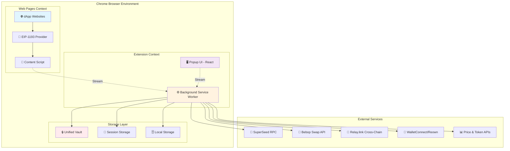
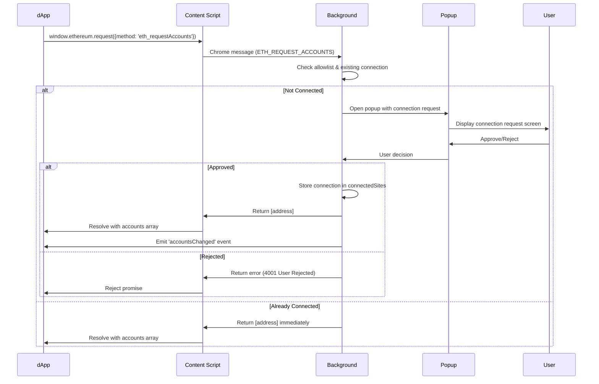
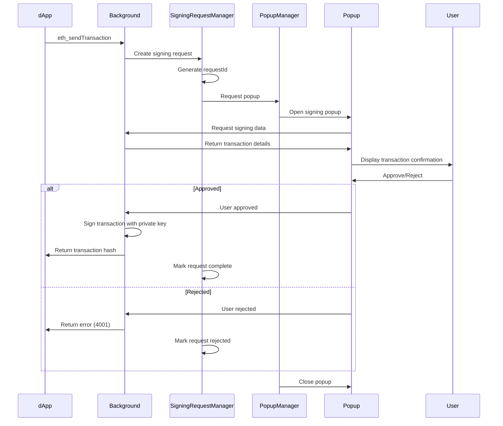
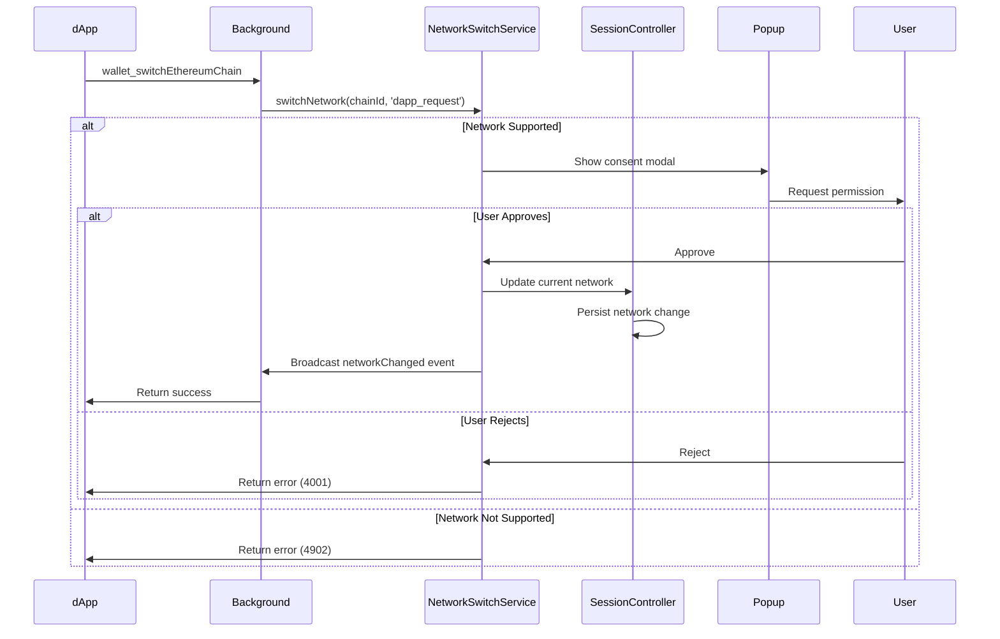
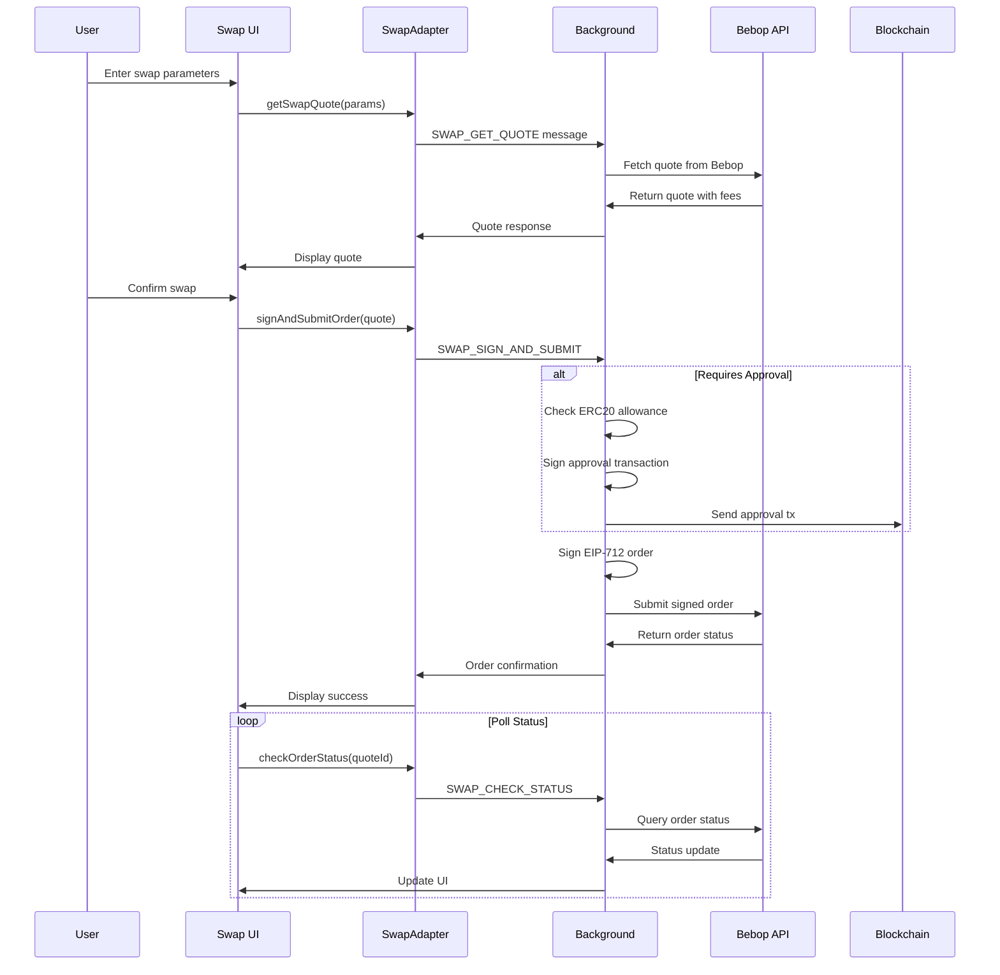
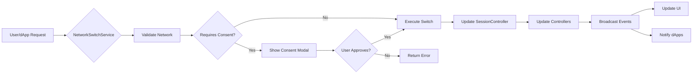
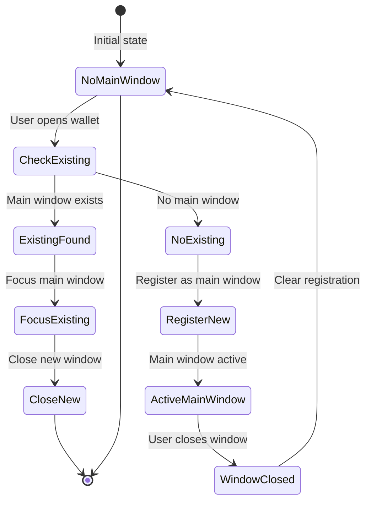
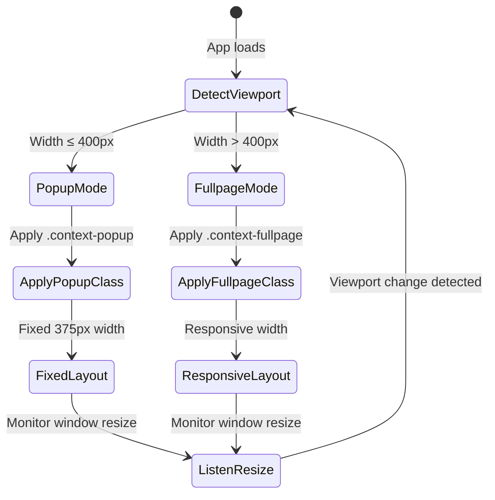

# SuperSafe Wallet - Architecture Documentation

**Created:** October 13, 2025  
**Last Updated:** February 9, 2026  
**Version:** 3.1.8  
**Status:** ✅ CURRENT  
**Last Code Update:** February 9, 2026

---

## Table of Contents

1. [Executive Summary](#executive-summary)
2. [System Architecture](#system-architecture)
3. [Core Design Principles](#core-design-principles)
4. [Component Architecture](#component-architecture)
5. [Transaction Decoder Architecture](#transaction-decoder-architecture)
6. [Signing System Architecture](#signing-system-architecture)
7. [dApp Connection Architecture](#dapp-connection-architecture)
8. [Service Worker Lifecycle](#service-worker-lifecycle)
9. [Data Flow Patterns](#data-flow-patterns)
10. [Technology Stack](#technology-stack)
11. [Directory Structure](#directory-structure)
12. [Network Architecture](#network-architecture)
13. [Performance Metrics](#performance-metrics)
14. [One Window Policy Architecture](#one-window-policy-architecture) 🆕
15. [Responsive Design Architecture](#responsive-design-architecture) 🆕

---

## Executive Summary

SuperSafe Wallet is a modern Ethereum-compatible browser extension wallet implementing a **MetaMask-style Service Worker architecture** with **Smart Native Connection** for seamless multichain dApp integration. Built with React 18, ethers.js v6, and Chrome Extension Manifest V3.

### Key Architectural Features

- **✅ MetaMask-Style Architecture**: Service worker as single source of truth
- **✅ Smart Native Connection**: Real chainIds only, zero compatibility hacks
- **✅ Multichain Support**: 8 active networks (SuperSeed, Optimism, Ethereum, Base, BSC, Arbitrum, Monad, Shardeum)
- **✅ Stream-Based Communication**: Native Chrome long-lived connections
- **✅ Unified Vault System**: Military-grade AES-256-GCM encryption
- **✅ Thin Client Pattern**: Frontend as lightweight presentation layer
- **✅ Enterprise Signing System**: Robust request management and recovery
- **✅ Bebop Integration**: Native swap support with partner fees
- **✅ Uniswap Integration**: UniswapX and Classic routing (v3.1.6+)
- **✅ Relay.link Integration**: Cross-chain swaps across 85+ blockchains
- **✅ WalletConnect V2**: Full Reown WalletKit implementation
- **✅ Framework Detection**: Automatic dApp framework identification
- **✅ Backend Health Monitoring**: Real-time service status alerts (v3.1.8) 🆕


### System Metrics

```
Total Project Files: 183 JavaScript/JSX files
Total Lines of Code: ~25,000 lines
Architecture Pattern: MetaMask-style Service Worker
Security Level: Military-grade encryption
Supported Networks: 8 active networks
Response Time: <150ms average
Vault Encryption: AES-256-GCM + PBKDF2
```

---

## System Architecture

### High-Level Architecture Diagram


```mermaid
graph TB
    subgraph "Chrome Browser Environment"
        subgraph "Web Pages Context"
            DAPP[🌐 dApp Websites]
            PROVIDER[📡 EIP-1193 Provider]
            CONTENT[📜 Content Script]
        end
        
        subgraph "Extension Context"
            POPUP[🖥️ Popup UI - React]
            BACKGROUND[⚙️ Background Service Worker]
        end
        
        subgraph "Storage Layer"
            VAULT[🔒 Unified Vault]
            SESSION[💾 Session Storage]
            LOCAL[🗄️ Local Storage]
        end
    end
    
    subgraph "External Services"
        SUPERSEED[🌟 SuperSeed RPC]
        BEBOP[🔄 Bebop Swap API]
        RELAY[🌉 Relay.link Cross-Chain]
        WALLETCONNECT[🔗 WalletConnect/Reown]
        APIS[📊 Price & Token APIs]
    end
    
    %% Communication Flow
    DAPP --> PROVIDER
    PROVIDER --> CONTENT
    CONTENT -.Stream.-> BACKGROUND
    POPUP -.Stream.-> BACKGROUND
    
    BACKGROUND --> VAULT
    BACKGROUND --> SESSION
    BACKGROUND --> LOCAL
    
    BACKGROUND --> SUPERSEED
    BACKGROUND --> BEBOP
    BACKGROUND --> RELAY
    BACKGROUND --> WALLETCONNECT
    BACKGROUND --> APIS
    
    style DAPP fill:#e1f5fe
    style POPUP fill:#f3e5f5
    style BACKGROUND fill:#fff3e0
    style VAULT fill:#ffebee
```

### Component Interaction Model

```
┌──────────────────────────────────────────────────────────────────┐
│                      Frontend (Thin Client)                      │
│  ┌──────────────┐  ┌──────────────┐  ┌────────────────────────┐ │
│  │   React UI   │  │   Adapters   │  │   Stream Manager       │ │
│  │  Components  │→→│  (Frontend)  │→→│  (Long-lived ports)    │ │
│  └──────────────┘  └──────────────┘  └────────────────────────┘ │
└──────────────────────────────────┬───────────────────────────────┘
                                   │ Chrome Streams
                                   ↓
┌──────────────────────────────────────────────────────────────────┐
│               Background Script (Single Source of Truth)         │
│  ┌────────────────────────────────────────────────────────────┐ │
│  │                    Stream Handlers                         │ │
│  │  - Session  - Provider  - Swap  - Send  - Blockchain      │ │
│  └────────────────────────────────────────────────────────────┘ │
│  ┌────────────────────────────────────────────────────────────┐ │
│  │                    Core Controllers                        │ │
│  │  - BackgroundSessionController (3,979 lines)               │ │
│  │  - BackgroundControllers (497 lines)                       │ │
│  │    • TokenController  • NetworkController                  │ │
│  │    • TransactionController  • NetworkSwitchService         │ │
│  └────────────────────────────────────────────────────────────┘ │
│  ┌────────────────────────────────────────────────────────────┐ │
│  │                 Enterprise Managers                        │ │
│  │  - SigningRequestManager  - PopupManager                   │ │
│  │  - EIP1193EventsManager   - AutoEscalationManager          │ │
│  │  - StreamPersistenceManager                                │ │
│  └────────────────────────────────────────────────────────────┘ │
│  ┌────────────────────────────────────────────────────────────┐ │
│  │                   Handler Layer                            │ │
│  │  - walletHandlers  - contractHandlers                      │ │
│  │  - providerHandlers  - AllowListManager                    │ │
│  └────────────────────────────────────────────────────────────┘ │
│  ┌────────────────────────────────────────────────────────────┐ │
│  │               External Integrations                        │ │
│  │  - WalletConnect Manager  - Bebop Integration              │ │
│  │  - Relay.link Integration  - Cross-chain swaps             │ │
│  │  - Transaction History Service  - Explorer Adapters        │ │
│  │  - SuperSeed API Wrapper  - Secure API Client              │ │
│  └────────────────────────────────────────────────────────────┘ │
└──────────────────────────────────────────────────────────────────┘
                                   │
                                   ↓
┌──────────────────────────────────────────────────────────────────┐
│                        Storage Layer                             │
│  ┌──────────────┐  ┌──────────────┐  ┌───────────────────────┐ │
│  │ Unified Vault│  │   Session    │  │      Local            │ │
│  │ (Encrypted)  │  │   Storage    │  │      Storage          │ │
│  └──────────────┘  └──────────────┘  └───────────────────────┘ │
└──────────────────────────────────────────────────────────────────┘
```

### Content Script Provider Pattern

```
┌────────────────────────────────────────────────────────────┐
│                      dApp Web Page                         │
│  ┌──────────────────────────────────────────────────────┐ │
│  │  window.ethereum (EIP-1193 Provider)                 │ │
│  │    - request()  - on()  - removeListener()           │ │
│  └──────────────────────────────────────────────────────┘ │
└────────────────────┬───────────────────────────────────────┘
                     │ postMessage
                     ↓
┌────────────────────────────────────────────────────────────┐
│               Content Script (Injected)                    │
│  ┌──────────────────────────────────────────────────────┐ │
│  │  Provider Injection:                                 │ │
│  │  - Injects window.ethereum object                    │ │
│  │  - Handles EIP-1193 method calls                     │ │
│  │  - Routes requests to background                     │ │
│  └──────────────────────────────────────────────────────┘ │
└────────────────────┬───────────────────────────────────────┘
                     │ Chrome Runtime Messages
                     ↓
┌────────────────────────────────────────────────────────────┐
│              Background Service Worker                     │
│  ┌──────────────────────────────────────────────────────┐ │
│  │  Request Processing:                                 │ │
│  │  - Validates origin against allowlist                │ │
│  │  - Checks connection state                           │ │
│  │  - Manages signing requests                          │ │
│  │  - Returns responses via streams                     │ │
│  └──────────────────────────────────────────────────────┘ │
└────────────────────────────────────────────────────────────┘
```

---

## Core Design Principles

### 1. Single Source of Truth

**All state lives in the background service worker.**

- Frontend components are purely presentational
- No direct storage access from frontend
- All mutations go through background controllers
- State synchronization via Chrome streams

**Benefits:**
- Eliminates race conditions
- Prevents storage context isolation issues
- Simplified state management
- Single point of control for security

### 2. Thin Client Pattern

**Frontend is a lightweight presentation layer.**

```javascript
// ❌ WRONG: Frontend doing business logic
const wallet = await createWallet(privateKey);
await saveToStorage(wallet);

// ✅ CORRECT: Frontend delegates to background
const result = await FrontendSessionAdapter.createWallet(privateKey);
```

**Frontend Responsibilities:**
- Render UI components
- Handle user input
- Display data from background
- Route user actions to background

**Background Responsibilities:**
- State management
- Cryptographic operations
- Storage access
- Business logic
- External API calls

### 3. Stream-Based Communication

**Native Chrome long-lived connections for efficiency.**

```javascript
// Frontend creates persistent connection
const port = chrome.runtime.connect({ name: 'session' });

// Background listens on named channels
backgroundStreamManager.onMessage('session', async (message, port) => {
  // Handle message
  return { success: true, data: result };
});
```

**Stream Channels:**
- `session` - Session and wallet operations
- `provider` - dApp provider requests (EIP-1193)
- `swap` - Swap quote and execution
- `send` - Token transfer operations
- `blockchain` - Blockchain queries
- `api` - External API calls

### 8. Zero Frontend Crypto

**All cryptographic operations isolated in background.**

- Private keys never leave background context
- Vault encryption/decryption in background only
- Signing operations in background only
- Password handling in background only

**Security Benefits:**
- Reduced attack surface
- Memory isolation
- Audit-friendly architecture
- Simplified security model

### 5. MetaMask-Style Controllers

**Modular controller pattern for separation of concerns.**

```javascript
BackgroundControllers {
  tokenController       // ERC20 token management
  networkController     // Network switching & configuration
  transactionController // Transaction history & management
  networkSwitchService  // Centralized network switching
}
```

Each controller:
- Single responsibility
- Independent initialization
- Event-driven architecture
- Stateless where possible

### 6. Multichain Transaction History

**Pluggable adapter architecture for different explorers.**

SuperSafe implements a universal transaction history system that automatically selects the appropriate blockchain explorer API based on the network:

```javascript
TransactionHistoryService {
  getAdapter(chainId) → BlockscoutAdapter | MoralisAdapter | EtherscanAdapter
  getTransactionHistory(address, chainId) → transactions[]
  getTokenTransfers(address, chainId) → transfers[]
  getCombinedHistory(address, chainId) → combined[]
}
```

**Supported Explorer Types:**
- **Blockscout**: SuperSeed
- **Moralis**: Ethereum, Optimism, Base, BSC, Arbitrum
- **Etherscan**: Ethereum (via Moralis adapter)

**Key Benefits:**
- Network-agnostic API interface
- Automatic adapter selection
- Per-network rate limiting
- Extensible for new networks
- Unified data format

See [MULTICHAIN_TRANSACTION_HISTORY.md](./MULTICHAIN_TRANSACTION_HISTORY.md) for complete documentation.

### 7. No Frontend Crypto
- Event-driven communication
- Storage persistence

---

## Component Architecture

### Background Script (3,220 lines)

**Location:** `src/background.js`

**Primary Responsibilities:**
- Service worker initialization and lifecycle
- Stream handler registration
- Manager orchestration
- WalletConnect integration
- Global state coordination

**Key Components:**
```javascript
// Core Controllers
backgroundSessionController  // Session & wallet management
backgroundControllers        // Token, network, transaction controllers

// Enterprise Managers
signingRequestManager       // Signing request lifecycle
popupManager               // Popup window management
eip1193EventsManager       // EIP-1193 event broadcasting
autoEscalationManager      // Auto-approval for trusted dApps

// External Integrations
walletConnectManager       // WalletConnect v2 / Reown
secureApiClient           // Secure external API calls
backendHealthService       // Backend health monitoring (v3.1.8) 🆕
                             // Includes Uniswap proxy health checks & duplicate fetch prevention
bebopTokenService         // Bebop token list management
```

### BackgroundSessionController (3,979 lines)

**Location:** `src/background/BackgroundSessionController.js`

**Core Functionality:**
- Vault management (create, unlock, lock)
- Wallet management (create, import, remove)
- Session state management
- Auto-lock functionality
- Connected sites management
- Network switching coordination

**Session State:**
```javascript
{
  isUnlocked: boolean,
  password: string (memory only),
  vaultData: Object (decrypted),
  decryptedWallets: Map<address, privateKey>,
  connectedSites: Map<origin, siteData>,
  currentNetworkKey: string
}
```

### BackgroundControllers (497 lines)

**Location:** `src/background/BackgroundControllers.js`

**Architecture:**
```javascript
class BackgroundControllers {
  tokenController         // ERC20 operations
  networkController      // Network management
  transactionController  // Transaction history
  networkSwitchService   // Unified switching
  
  async initialize(networkKey, provider, getPrivateKeyFn)
  async handleTokenMessage(message)
  async handleNetworkMessage(message)
  async handleTransactionMessage(message)
}
```

### Frontend Application (1,569 lines)

**Location:** `src/App.jsx`

**Main React Component:**
- Screen routing logic
- Modal management
- Connection request handling
- Transaction confirmation
- Signing request UI
- Network switch consent

**State Management:**
```javascript
// Wallet state (from background)
const { 
  currentWallet, 
  wallets, 
  network, 
  isUnlocked,
  supportsSwap 
} = useWalletProvider();
```

### Swap Architecture (v3.1.8 + Khalani / HyperStream)

**Design Philosophy:** Unified panel architecture for provider-agnostic swap interface.

**Structure:**
```
Swap.jsx (~115 lines)              # Container/Orchestrator
  ├─ SwapProviderSelector          # Tab selector (Uniswap | Relay | Khalani | Bebop)
  ├─ SlippageControl               # Shared slippage configuration
  └─ Conditional Rendering:
      ├─ UniswapSwapPanel.jsx      # UniswapX + Classic routing
      ├─ RelaySwapPanel.jsx        # Relay.link cross-chain
      ├─ KhalaniSwapPanel.jsx      # HyperStream intent routing
      └─ BebopSwapPanel.jsx        # Bebop JAM protocol
```

**Key Benefits:**
1. ✅ **Consistency**: All provider panels follow the same architectural pattern
2. ✅ **Maintainability**: Each panel is self-contained and independently testable
3. ✅ **Scalability**: Easy to add new providers without rewriting existing panels
4. ✅ **Separation of Concerns**: `Swap.jsx` only handles routing, not implementation
5. ✅ **Reduced Complexity**: From 2,206 lines monolith to 115-line orchestrator

**UniswapSwapPanel:**
- Same-chain UniswapX and Classic routing
- Curated token lists and approval confirmation
- Uses Uniswap adapter/proxy for API calls

**KhalaniSwapPanel:**
- Cross-chain intent routes through HyperStream
- Quote expiry, route sorting, and order lifecycle tracking
- Uses `KhalaniAdapter` and `KhalaniStreamHandler` for background-only execution

**BebopSwapPanel (~1,400 lines):**
- Gasless MEV-protected swaps via Bebop JAM protocol
- Permit2 approvals (one-time per token)
- Internal components: `LoadingDots`, `PriceDeviationTooltip`, `SwapDetails`
- Uses `SwapAdapter` for all backend communication
- NO ethers imports (architecture compliance)

**RelaySwapPanel (~1,288 lines):**
- Cross-chain swaps via Relay.link
- Network selection: Origin fixed (active network), Destination selectable
- Internal components: `UsdBalanceDisplay`, `formatTokenAmount`
- Uses `RelayAdapter` for all backend communication
- Advanced features: Route visualization, gas estimation, bridge time

**Shared Components (`src/components/swap/`):**
- `CompactNetworkSelector.jsx` - Network dropdown for cross-chain
- `RouteVisualization.jsx` - Visual swap route display
- `BridgeTimeDisplay.jsx` - Bridge time estimation
- `GasEstimateDisplay.jsx` - Gas cost estimation
- `LoadingDots.jsx` - Loading animation

**Props Interface (Both Panels):**
```javascript
{
  onTransactionComplete: () => {},
  preselectedToken: null,
  onClearPreselection: () => {},
  walletTokensWithBalance: [],
  nativeTokenBalance: null,
  slippage: 0.5  // Shared via Swap.jsx
}
```

### Stream Handlers

**Location:** `src/background/handlers/streams/`

| Handler | Purpose | Key Operations |
|---------|---------|----------------|
| **SessionStreamHandler** | Session operations | unlock, createWallet, switchWallet |
| **ProviderStreamHandler** | dApp requests | eth_requestAccounts, eth_sendTransaction |
| **SwapStreamHandler** | Bebop swaps | getQuote, signOrder, checkStatus |
| **SendStreamHandler** | Token transfers | estimateGas, sendTransaction |
| **BlockchainStreamHandler** | Blockchain queries | getBalance, getTokens, getNFTs |
| **ApiStreamHandler** | External APIs | price feeds, token lists |

### Managers

**Location:** `src/background/managers/`

| Manager | Purpose | Key Features |
|---------|---------|--------------|
| **SigningRequestManager** | Signing request lifecycle | Timeout protection, request recovery |
| **PopupManager** | Popup window management | Mutual exclusion, priority system |
| **EIP1193EventsManager** | Event broadcasting | accountsChanged, chainChanged |
| **AutoEscalationManager** | Auto-approval system | Trusted dApp whitelist |
| **WalletConnectManager** | WalletConnect v2 | Lazy-initialized session management (v3.1.8) |

### Services

**Location:** `src/background/services/`

| Service | Purpose | Implementation |
|---------|---------|----------------|
| **TokenMetadataService** | Token metadata lookup | Multi-layer: Cache → BebopTokenService → RPC |
| **BebopTokenService** | Token list management | Local database, 2000+ tokens |
| **NetworkSwitchService** | Unified network switching | Bidirectional dApp-wallet sync |

### Logo Resolution System

**Location:** `src/utils/logoProviders/` & `src/utils/logoOrchestrator.js`

**Purpose:** Modular, extensible system for fetching token logos from multiple sources with intelligent caching and fallback.

**Architecture:**
```
┌─────────────────────────────────────────────────────────┐
│                  React Components                       │
│        (TokenLogo, TokenImage, Dashboard, etc.)         │
└────────────────────┬────────────────────────────────────┘
                     │ useTokenLogo / resolveLogoURL
                     ↓
┌─────────────────────────────────────────────────────────┐
│              Logo Orchestrator                          │
│  - Provider cascade (priority order)                    │
│  - In-memory + persistent cache                         │
│  - URL validation (HEAD/GET)                            │
│  - Request deduplication                                │
└────────────────────┬────────────────────────────────────┘
                     │ Try providers in order
                     ↓
┌─────────────────────────────────────────────────────────┐
│                Logo Providers                           │
│  0. Curated (510 tokens, local, instant)                │
│  1. Backend (from existing metadata)                    │
│  2. TrustWallet (GitHub CDN, EIP-55)                    │
│  3. SmolDapp (GitHub CDN, multiple formats)             │
│  4. Bebop (S3 bucket)                                   │
└─────────────────────────────────────────────────────────┘
```

**Key Features:**
- **510 Curated Tokens**: Instant loading for top tokens across 6 chains
- **Zero Privacy Leaks**: Local curated list checked first
- **Offline Support**: Works without network for curated tokens
- **Intelligent Caching**: In-memory + chrome.storage.local persistence
- **Automatic Fallback**: Cascades through providers until logo found
- **EIP-55 Compliance**: Proper checksummed addresses for compatibility

**Provider Priority:**
1. **Curated** (Priority 0) - `/assets/tokens/<chainId>/<symbol>-<address>.png`
   - 510 tokens: ETH(100), OPT(101), BSC(100), BASE(101), ARB(101), SEED(7)
   - Native tokens + major DeFi tokens (USDT, USDC, WBTC, etc.)
   
2. **Backend** (Priority 1) - Extracts from existing token metadata
3. **TrustWallet** (Priority 2) - Official TrustWallet assets repository
4. **SmolDapp** (Priority 3) - Community-maintained assets
5. **Bebop** (Priority 4) - Bebop aggregator S3 bucket

**Usage in Components:**
```javascript
// Using the hook (recommended)
import { useTokenLogo } from '../hooks/useTokenLogoNew';

const { logoUrl, isLoading } = useTokenLogo({
  chainId: 56,
  address: '0x0000000000000000000000000000000000000000',
  metadata: tokenData // Optional
});

// Direct usage
import { resolveLogoURL } from '../utils/logoOrchestrator';

const logoUrl = await resolveLogoURL({
  chainId: 56,
  address: '0x0000000000000000000000000000000000000000'
});
```

**Performance:**
- Curated logos: < 1ms (instant)
- Backend provider: < 1ms (no external request)
- TrustWallet: ~50-200ms (GitHub CDN)
- Cache hit: < 1ms (in-memory)

**Documentation:** See [FRONTEND.md#token-logos-integration](./FRONTEND.md#token-logos-integration) for complete details.

### Decoders

**Location:** `src/background/decoders/`

| Decoder | Purpose | Protocols |
|---------|---------|-----------|
| **TransactionDecoder** | Main orchestrator | Routes to specialized decoders |
| **UniversalRouterDecoder** | Universal Router | Uniswap V2/V3/V4, Velodrome |
| **UniversalRouterDecoderPancake** | PancakeSwap Infinity | Concentrated liquidity swaps |

---

## Transaction Decoder Architecture

### Overview

SuperSafe Wallet implements a professional-grade transaction decoding system that transforms raw blockchain transactions into human-readable information. The system supports major DEX protocols (Uniswap V2/V3/V4, PancakeSwap Infinity, Velodrome, Aerodrome) across 7 EVM networks with a strict "no fallbacks" security policy.

### Core Components

**TransactionDecoder** - Main orchestrator (`src/background/decoders/TransactionDecoder.js`)
- Routes transactions to specialized decoders based on function selector
- Manages token metadata resolution
- Enforces strict "no fallbacks" policy

**UniversalRouterDecoder** - Universal Router transactions (`src/background/decoders/UniversalRouterDecoder.js`)
- Decodes Uniswap and Velodrome Universal Router transactions
- Supports 11 command types (V2/V3/V4 swaps, wrap/unwrap, permit2)
- Context-aware opcode interpretation (detects Uniswap vs PancakeSwap)

**UniversalRouterDecoderPancake** - PancakeSwap Infinity (`src/background/decoders/UniversalRouterDecoderPancake.js`)
- Specialized decoder for PancakeSwap Infinity concentrated liquidity swaps
- Heuristic-based decoding for complex CL structures
- Handles both native (BNB) and ERC-20 inputs

**TokenMetadataService** - Token metadata management (`src/background/services/TokenMetadataService.js`)
- Multi-layer lookup: Cache → BebopTokenService → On-Chain RPC
- LRU cache with 1000 entry limit
- Strict validation with no fallbacks
- Request deduplication to prevent redundant RPC calls

### Protocol Support

| Protocol | Networks | Status |
|----------|----------|--------|
| Uniswap V2/V3/V4 | ETH, OPT, BASE | ✅ Full support |
| Universal Router | ETH, OPT, BASE, BSC | ✅ Full support |
| PancakeSwap Infinity | BSC | ✅ Heuristic decode |
| Velodrome | Optimism | ✅ Full support |
| Aerodrome | Base | ✅ Full support |
| ERC-20 Operations | All networks | ✅ Full support |
| Permit2 | All networks | ✅ Single/batch |

### "No Fallbacks" Security Policy

**Core Principle:** Never use default or guessed values for critical transaction parameters.

**Examples:**
```javascript
// ✅ CORRECT
const metadata = await tokenMetadataService.getTokenMetadata(address, chainId, provider);
if (!metadata) {
  throw new Error(`Cannot fetch metadata for token ${address}`);
}

// ❌ NEVER DO THIS
const decimals = metadata?.decimals || 18; // Dangerous!
```

**Rationale:**
- Better to show error than incorrect amounts/tokens
- Prevents user from signing wrong information
- Eliminates network mismatch risks

---

## Signing System Architecture

### Overview

Unified signing system handling all signing request types (transactions, personal messages, typed data) with consistent request management, network validation, and security controls.

### Core Components

**SigningRequestManager** (`src/background/managers/SigningRequestManager.js`)
- Centralized manager for all signing requests
- Request lifecycle management (created → pending → completed/rejected/expired)
- Timeout protection (5 minutes default)
- Request recovery on popup crash

**SigningModalAdapter** (`src/background/adapters/SigningModalAdapter.js`)
- Transforms raw RPC requests into user-friendly modal data
- Handles personal_sign hex-to-UTF8 decoding
- Parses eth_signTypedData_v4 structured data
- Detects Permit2 approvals for enhanced UI

### Supported Signing Methods

| Method | Status | Purpose |
|--------|--------|---------|
| `personal_sign` | ✅ Active | SIWE, message authentication |
| `eth_signTypedData_v4` | ✅ Active | Permit2, structured data |
| `eth_signTypedData_v3` | ✅ Active | Legacy support |
| `eth_sign` | ❌ Disabled | Blind signing risk |

**Snake_case Support:** Both `personal_sign` and `personalSign` work (industry compatibility).

### Request Lifecycle
1. createRequest() → Generate requestId, set timeout
2. buildModalRequestFromRpc() → Transform to modal format
3. createSigningPopup() → Show popup to user
4. User approves/rejects
5. handleResponse() → Process response
6. Complete/reject/expire →ent:**
- Permanently disabled for security
- Returns error code 4200
- Users must use personal_sign or eth_signTypedData_v4

---

## dApp Connection Architecture

### Allowlist System

**Version:** 3.1 (Enhanced Security - Nov 2025)

SuperSafe implements a three-layer allowlist system for dApp authorization:

**Layer 1: Provider Injection Gate**
- Content script checks with background before injecting `window.ethereum`
- Message type: `CS_CAN_INJECT`
- Handler: `ProviderStreamHandler.js` (line 555)
- **Result:** Unauthorized origins never see the provider

**Layer 2: Connection Request Authorization**
- Validates origin on `eth_requestAccounts` / `wallet_requestPermissions`
- Strict origin matching (no fallbacks)
- Handler: `ProviderStreamHandler.js` (line 633)
- Rate limiting: 5 attempts per minute
- **Result:** Blocked attempts logged and rate-limited

**Layer 3: WalletConnect Validation**
- Origin-based validation for mobile connections
- No name-based fallbacks (security fix Nov 2025)
- Handler: `SessionStreamHandler.js` (line 840)
- URL normalization and validation
- Rate limiting + comprehensive logging
- **Result:** Same security as web connections

**Security Features:**
- ✅ Wildcard subdomain support (`*.domain.com`)
- ✅ Rate limiting (5 attempts/minute, 5-minute block)
- ✅ Blocked attempts logging (last 100 per origin)
- ✅ Origin format validation and normalization
- ✅ Fail-safe defaults (deny-all on error)

**Manager:** `src/background/policy/AllowListManager.js`  
**Allowlist:** `public/assets/allowlist.json` (7 authorized dApps)  
**Security:** See [SECURITY.md](./SECURITY.md#allowlist-security-system) for complete details

**November 2025 Security Enhancements:**
1. Eliminated WalletConnect name-based fallback (CRITICAL vulnerability)
2. Added origin validation and normalization
3. Implemented rate limiting for connection attempts
4. Added comprehensive logging system
5. Implemented wildcard subdomain support

See [Allowlist Security Enhancements Audit](./Audits/2025-11-21_ALLOWLIST_SECURITY_ENHANCEMENTS.md) for complete details.

### PopupManager Mutual Exclusion

**Purpose:** Ensures extension UI and popup windows never coexist (MetaMask-style UX).

**Implementation:**
- When popup opens → Extension closes
- When extension opens while popup active → Extension closes, popup gains focus
- Applies to ALL popup types

**Popup Priority Order:**
1. Personal Sign
2. Typed Data
3. Transaction
4. Network Switch
5. Connection
6. Unlock

**Triple Verification:**
1. `main.jsx:66-83` - Pre-render check
2. `App.jsx:58-81` - Post-render safety net
3. `PopupManager.checkAndFocusExistingPopups()` - Centralized verification

### Network Management

**Bidirectional Network Switching:**

SuperSafe supports network switching initiated from both sides:

1. **Extension → dApp**: User changes network in wallet → `eth_chainChanged` event propagated to all connected dApps
2. **dApp → Wallet**: dApp requests network switch via `wallet_switchEthereumChain` → Popup shown to user

**Network Validation:**

```javascript
validateSigningNetwork(chainId, supportedNetworks, origin)
```

- Validates signing requests against dApp's supported networks
- Prevents cross-network signing attacks
- Shows clear error for unsupported networks

**Unsupported Network Handling:**

When dApp requests unsupported network:
1. Show `UnsupportedNetworkScreen` popup
2. Display network details and error message
3. User can dismiss or manually switch to supported network
4. Request automatically rejected if network mismatch

### Stream Architecture

**Long-Lived Connections:**

SuperSafe uses native Chrome message ports for bidirectional communication:

```javascript
// Content Script → Background
const port = chrome.runtime.connect({ name: 'provider-stream' });

// Background maintains open connections
providerStreams.set(origin, { port, metadata });
```

**Stream Types:**
- **Provider Stream** - dApp RPC requests (eth_sendTransaction, personal_sign, etc.)
- **Session Stream** - Extension UI communication
- **WalletConnect Stream** - Mobile wallet protocol

**Lifecycle Management:**
- Streams auto-reconnect on service worker restart
- Pending requests recovered from memory
- Disconnect cleanup removes stale connections

---

## Service Worker Lifecycle

### Manifest V3 Architecture

SuperSafe runs as Manifest V3 service worker with different lifecycle than traditional background pages.

**Lifecycle States:**
- Installing → Activated → Running → Idle (30s) → Terminated (5min)
- Wake-up events restart from Terminated to Running

### Wakeup Mechanism

**Problem:** Service workers terminate after inactivity, breaking long-lived connections.

**Solution:** Proactive keep-alive ping system.

**Implementation:**
```javascript
// Keep service worker alive with periodic ping
setInterval(() => {
  chrome.runtime.getPlatformInfo(() => {
    // Ping prevents termination
  });
}, 20000); // Every 20 seconds
```

**Benefits:**
- Maintains stream connections
- Prevents timeout-related disconnections
- Ensures WalletConnect sessions stay alive
- Preserves in-memory session state

### Persistence Strategy

- **Critical State** → Chrome Storage (encrypted vault, network selection)
- **Session State** → In-memory with auto-lock timeout
- **Transient State** → Streams with reconnection logic

### Session Recovery

**Automatic Corruption Detection:**

SuperSafe implements self-healing session restoration that automatically detects and cleans corrupted session data:

```javascript
// checkPersistentSession() in BackgroundSessionController
const success = await this.restoreSessionWithLoginToken(loginToken, timeElapsed);

if (!success) {
  // Auto-cleanup corrupted session data
  await this.clearSessionState();
  return false;  // User sees login screen
}
```

**Recovery Triggers:**
- Decryption failure (OperationError)
- Invalid credentials (vault mismatch)
- Restoration exceptions

**Benefits:**
- ✅ Prevents error loops on every extension open
- ✅ Self-healing without user intervention
- ✅ Maintains vault integrity (only clears session state)

See [SECURITY.md](./SECURITY.md#corrupted-session-recovery) for detailed security implementation.

---

## Transaction Decoder Architecture

### Overview

SuperSafe Wallet implements a professional-grade transaction decoding system that transforms raw blockchain transactions into human-readable information. The system supports major DEX protocols (Uniswap V2/V3/V4, PancakeSwap Infinity, Velodrome, Aerodrome) across 7 EVM networks with a strict "no fallbacks" security policy.

### Core Components

**TransactionDecoder** - Main orchestrator (`src/background/decoders/TransactionDecoder.js`)
- Routes transactions to specialized decoders based on function selector
- Manages token metadata resolution
- Enforces strict "no fallbacks" policy

**UniversalRouterDecoder** - Universal Router transactions (`src/background/decoders/UniversalRouterDecoder.js`)
- Decodes Uniswap and Velodrome Universal Router transactions
- Supports 11 command types (V2/V3/V4 swaps, wrap/unwrap, permit2)
- Context-aware opcode interpretation (detects Uniswap vs PancakeSwap)

**UniversalRouterDecoderPancake** - PancakeSwap Infinity (`src/background/decoders/UniversalRouterDecoderPancake.js`)
- Specialized decoder for PancakeSwap Infinity concentrated liquidity swaps
- Heuristic-based decoding for complex CL structures
- Handles both native (BNB) and ERC-20 inputs

**TokenMetadataService** - Token metadata management (`src/background/services/TokenMetadataService.js`)
- Multi-layer lookup: Cache → BebopTokenService → On-Chain RPC
- LRU cache with 1000 entry limit
- Strict validation with no fallbacks
- Request deduplication to prevent redundant RPC calls

### Protocol Support

| Protocol | Networks | Status |
|----------|----------|--------|
| Uniswap V2/V3/V4 | ETH, OPT, BASE | ✅ Full support |
| Universal Router | ETH, OPT, BASE, BSC | ✅ Full support |
| PancakeSwap Infinity | BSC | ✅ Heuristic decode |
| Velodrome | Optimism | ✅ Full support |
| Aerodrome | Base | ✅ Full support |
| ERC-20 Operations | All networks | ✅ Full support |
| Permit2 | All networks | ✅ Single/batch |

### "No Fallbacks" Security Policy

**Core Principle:** Never use default or guessed values for critical transaction parameters.

**Examples:**

```javascript
// ✅ CORRECT
const metadata = await tokenMetadataService.getTokenMetadata(address, chainId, provider);
if (!metadata) {
  throw new Error(`Cannot fetch metadata for token ${address}`);
}

// ❌ NEVER DO THIS
const decimals = metadata?.decimals || 18; // Dangerous!
```

**Rationale:**
- Better to show error than incorrect amounts/tokens
- Prevents user from signing wrong information
- Eliminates network mismatch risks

---

## Signing System Architecture

### Overview

Unified signing system handling all signing request types (transactions, personal messages, typed data) with consistent request management, network validation, and security controls.

### Core Components

**SigningRequestManager** (`src/background/managers/SigningRequestManager.js`)
- Centralized manager for all signing requests
- Request lifecycle management (created → pending → completed/rejected/expired)
- Timeout protection (5 minutes default)
- Request recovery on popup crash

**SigningModalAdapter** (`src/background/adapters/SigningModalAdapter.js`)
- Transforms raw RPC requests into user-friendly modal data
- Handles personal_sign hex-to-UTF8 decoding
- Parses eth_signTypedData_v4 structured data
- Detects Permit2 approvals for enhanced UI

### Supported Signing Methods

| Method | Status | Purpose |
|--------|--------|---------|
| `personal_sign` | ✅ Active | SIWE, message authentication |
| `eth_signTypedData_v4` | ✅ Active | Permit2, structured data |
| `eth_signTypedData_v3` | ✅ Active | Legacy support |
| `eth_sign` | ❌ Disabled | Blind signing risk |

**Snake_case Support:** Both `personal_sign` and `personalSign` work (industry compatibility).

### Request Lifecycle

```
1. createRequest() → Generate requestId, set timeout
2. buildModalRequestFromRpc() → Transform to modal format
3. createSigningPopup() → Show popup to user
4. User approves/rejects
5. handleResponse() → Process response
6. Complete/reject/expire → Cleanup
```

### Security Validation

**Network Validation:**

```javascript
validateSigningNetwork(chainId, supportedNetworks, origin)
```

- Prevents signing on unsupported networks
- Clear error messages
- Protects against replay attacks

**eth_sign Disablement:**
- Permanently disabled for security
- Returns error code 4200
- Users must use personal_sign or eth_signTypedData_v4

---

## Data Flow Patterns

### Connection Request Flow


```mermaid
sequenceDiagram
    participant D as dApp
    participant C as Content Script
    participant BG as Background
    participant P as Popup
    participant U as User

    D->>C: window.ethereum.request({method: 'eth_requestAccounts'})
    C->>BG: Chrome message (ETH_REQUEST_ACCOUNTS)
    BG->>BG: Check allowlist & existing connection
    
    alt Not Connected
        BG->>P: Open popup with connection request
        P->>U: Display connection request screen
        U->>P: Approve/Reject
        P->>BG: User decision
        
        alt Approved
            BG->>BG: Store connection in connectedSites
            BG->>C: Return [address]
            C->>D: Resolve with accounts array
            BG->>D: Emit 'accountsChanged' event
        else Rejected
            BG->>C: Return error (4001 User Rejected)
            C->>D: Reject promise
        end
    else Already Connected
        BG->>C: Return [address] immediately
        C->>D: Resolve with accounts array
    end
```

### Transaction Signing Flow


```mermaid
sequenceDiagram
    participant D as dApp
    participant BG as Background
    participant SM as SigningRequestManager
    participant PM as PopupManager
    participant P as Popup
    participant U as User

    D->>BG: eth_sendTransaction
    BG->>SM: Create signing request
    SM->>SM: Generate requestId
    SM->>PM: Request popup
    PM->>P: Open signing popup
    P->>BG: Request signing data
    BG->>P: Return transaction details
    P->>U: Display transaction confirmation
    U->>P: Approve/Reject
    
    alt Approved
        P->>BG: User approved
        BG->>BG: Sign transaction with private key
        BG->>D: Return transaction hash
        SM->>SM: Mark request complete
    else Rejected
        P->>BG: User rejected
        BG->>D: Return error (4001)
        SM->>SM: Mark request rejected
    end
    
    PM->>P: Close popup
```

### Network Switch Flow


```mermaid
sequenceDiagram
    participant D as dApp
    participant BG as Background
    participant NS as NetworkSwitchService
    participant SC as SessionController
    participant P as Popup

    D->>BG: wallet_switchEthereumChain
    BG->>NS: switchNetwork(chainId, 'dapp_request')
    
    alt Network Supported
        NS->>P: Show consent modal
        P->>User: Request permission
        
        alt User Approves
            User->>NS: Approve
            NS->>SC: Update current network
            SC->>SC: Persist network change
            NS->>BG: Broadcast networkChanged event
            BG->>D: Return success
        else User Rejects
            User->>NS: Reject
            NS->>D: Return error (4001)
        end
    else Network Not Supported
        NS->>D: Return error (4902)
    end
```

### Swap Execution Flow


```mermaid
sequenceDiagram
    participant U as User
    participant UI as Swap UI
    participant SA as SwapAdapter
    participant BG as Background
    participant B as Bebop API

    U->>UI: Enter swap parameters
    UI->>SA: getSwapQuote(params)
    SA->>BG: SWAP_GET_QUOTE message
    BG->>B: Fetch quote from Bebop
    B->>BG: Return quote with fees
    BG->>SA: Quote response
    SA->>UI: Display quote
    
    U->>UI: Confirm swap
    UI->>SA: signAndSubmitOrder(quote)
    SA->>BG: SWAP_SIGN_AND_SUBMIT
    
    alt Requires Approval
        BG->>BG: Check ERC20 allowance
        BG->>BG: Sign approval transaction
        BG->>Blockchain: Send approval tx
    end
    
    BG->>BG: Sign EIP-712 order
    BG->>B: Submit signed order
    B->>BG: Return order status
    BG->>SA: Order confirmation
    SA->>UI: Display success
    
    loop Poll Status
        UI->>SA: checkOrderStatus(quoteId)
        SA->>BG: SWAP_CHECK_STATUS
        BG->>B: Query order status
        B->>BG: Status update
        BG->>UI: Update UI
    end
```

### Relay Network Selection Architecture

**Last Updated:** January 11, 2026

#### Design Philosophy

Relay swap panel implements a **restricted network selection model** where the origin network is always the active wallet network. This design choice aligns with fundamental blockchain security requirements and provides a consistent user experience across all swap interfaces.

#### Network Selection Rules

| Section | Network Source | User Control | Rationale |
|---------|---------------|--------------|-----------|
| **Pay (Origin)** | Active network only (`networkKey` prop) | ❌ No control within panel | Transaction signing requires active network |
| **Receive (Destination)** | Any supported network | ✅ Full control via `CompactNetworkSelector` | Destination can be any chain |

#### Implementation Details

```javascript
// Pay section - ALWAYS uses active network
const { tokens: fromTokens } = useTokenList(networkKey);
// Uses walletTokensWithBalance and nativeTokenBalance props directly
// (these are always available for active network)

// Receive section - User can select destination
const [toNetworkKey, setToNetworkKey] = useState(networkKey);
const { tokens: toTokens } = useTokenList(toNetworkKey);
// Fetches balances dynamically for selected destination network
```

#### Key Benefits

1. **Security:** Origin must be active network (required for transaction signing)
2. **Performance:** No need to fetch balances for non-active networks
3. **Consistency:** Same behavior as Bebop swap and standard wallets (MetaMask, Rainbow, etc.)
4. **Reliability:** Balances for origin network are always available (cached in Dashboard)
5. **Simplicity:** Reduces cognitive load (one less decision for users)
6. **Bug Prevention:** Eliminates edge cases with token addresses across different networks

#### User Workflow

**For Same-Network Swap (e.g., Arbitrum → Arbitrum):**
1. User is on Arbitrum (active network)
2. Select pay token from Arbitrum tokens (with balances)
3. Select receive token from Arbitrum tokens
4. Execute swap

**For Cross-Chain Swap (e.g., Arbitrum → Ethereum):**
1. User is on Arbitrum (active network)
2. Select pay token from Arbitrum tokens (with balances)
3. Select Ethereum as destination network (via selector)
4. Select receive token from Ethereum tokens
5. Execute cross-chain swap

**To swap FROM Ethereum TO Arbitrum:**
1. User must first **switch active network to Ethereum** (via AppHeader)
2. Then follow cross-chain flow above

#### Technical Components

- **`RelaySwapPanel.jsx`**: Main component implementing this architecture
- **`CompactNetworkSelector`**: Only present in "Receive" section
- **Pay Section**: No network display (identical to Bebop's design), implicitly uses active network
- **Balance Fetching**: Origin uses props, destination uses dynamic fetch via `getWalletBalances`
- **Token Context**: Uses `context="swap-pay"` and `context="swap-receive"` for proper balance display within selectors

#### Migration Notes

**Previous Design (v1.0.0):**
- Had `CompactNetworkSelector` in both Pay and Receive sections
- Used `fromNetworkKey` state for origin network
- Attempted to fetch balances for any selected origin network
- Led to issues: balances not available, incorrect token addresses in cross-chain swaps

**Current Design (v2.0.0):**
- Removed `CompactNetworkSelector` from Pay section
- Replaced `fromNetworkKey` with direct use of `networkKey` prop
- Origin always uses active network (consistent with transaction signing requirements)
- Eliminated balance fetching problems and cross-chain address mismatches

---

## Technology Stack

### Core Technologies

| Technology | Version | Purpose |
|------------|---------|---------|
| **React** | 18.2.0 | UI framework |
| **ethers.js** | 6.13.0 | Ethereum library |
| **Vite** | 6.3.6 | Build tool |
| **TailwindCSS** | 3.3.3 | Styling |
| **Chrome Extension** | Manifest V3 | Platform |

### Key Dependencies

```json
{
  "@reown/walletkit": "^1.2.8",
  "@reservoir0x/relay-sdk": "^2.4.0",
  "@metamask/eth-sig-util": "^8.2.0",
  "ethereum-cryptography": "^3.2.0",
  "buffer": "^6.0.3",
  "idb": "^7.1.1",
  "axios": "^1.12.0"
}
```

### Build Configuration

**Multiple Vite Configs:**
- `vite.config.js` - Frontend popup build
- `vite.config.worker.js` - Background service worker
- `vite.config.content.js` - Content script injection

**Output Structure:**
```
dist/
├── index.html              # Popup entry
├── popup.js                # Frontend bundle
├── background.js           # Service worker bundle
├── content-script.js       # Content script bundle
├── provider.js             # EIP-1193 provider
├── manifest.json           # Extension manifest
└── assets/                 # Static resources
```

---

## API Proxy Architecture

> **Security Migration (December 2025)**: All sensitive API keys now stored server-side via SuperSafe proxy.

### Overview

The extension uses a centralized API proxy system to protect sensitive API keys. All calls to Moralis, CoinGecko, and RPC endpoints route through `api.supersafe.cool`.

### Architecture Diagram

```
┌─────────────────┐      ┌──────────────────────┐      ┌─────────────────┐
│   Extension     │      │   SuperSafe Proxy    │      │   External API  │
│   (Background)  │ ───► │   api.supersafe.cool │ ───► │   (Moralis,     │
│                 │      │                      │      │   CoinGecko,    │
│ Installation    │      │   API Keys stored    │      │   RPC nodes)    │
│ Token Auth      │      │   server-side        │      │                 │
└─────────────────┘      └──────────────────────┘      └─────────────────┘
```

### Components

| File | Purpose |
|------|---------|
| `src/background/api/InstallationManager.js` | Token lifecycle (register, validate, refresh) |
| `src/background/api/SuperSafeProxyClient.js` | HTTP client with auth injection, retry logic |
| `src/background/api/ProxyServices.js` | Service-specific methods (moralisProxy, coingeckoProxy, rpcProxy) |

### Token Lifecycle

1. **Installation**: `chrome.runtime.onInstalled` → Generate UUID → Register with API → Store token
2. **Startup**: `chrome.runtime.onStartup` → Validate token → Refresh if invalid
3. **API Calls**: `X-Installation-Token` header injected automatically
4. **Token Invalid (401)**: Auto re-register → Get new token → Retry request

### Proxy Services

```javascript
// Moralis (wallet tokens, history, transfers)
import { moralisProxy } from './background/api/ProxyServices.js';
const tokens = await moralisProxy.getWalletTokens(address, chainId);

// CoinGecko (price data)
import { coingeckoProxy } from './background/api/ProxyServices.js';
const prices = await coingeckoProxy.getPrices(['ethereum', 'bitcoin']);

// RPC (eth_gasPrice, eth_call, eth_sendRawTransaction)
import { rpcProxy } from './background/api/ProxyServices.js';
const gasPrice = await rpcProxy.getGasPrice(chainId);
```

### Security Benefits

- **No API Keys in Bundle**: Keys stored server-side only
- **Rate Limit Protection**: Server-side control of rate limits
- **Key Rotation**: Server can rotate keys without extension update
- **Audit Trail**: Server logs all API usage per installation

---

## Directory Structure

### Backend Architecture

```
src/background/
├── BackgroundSessionController.js    # Session management (3,979 lines)
├── BackgroundControllers.js          # Controller orchestration (497 lines)
│
├── handlers/                         # Request handlers
│   ├── streams/                      # Stream-based handlers
│   │   ├── SessionStreamHandler.js   # Session operations
│   │   ├── ProviderStreamHandler.js  # dApp provider requests
│   │   ├── SwapStreamHandler.js      # Bebop swap operations
│   │   ├── SendStreamHandler.js      # Token transfers
│   │   ├── BlockchainStreamHandler.js # Blockchain queries
│   │   ├── ApiStreamHandler.js       # External API calls
│   │   └── GenericStreamHandlers.js  # Generic utilities
│
├── api/                              # API Proxy System (Dec 2025)
│   ├── InstallationManager.js        # Token lifecycle management
│   ├── SuperSafeProxyClient.js       # HTTP client with auth
│   └── ProxyServices.js              # moralisProxy, coingeckoProxy, rpcProxy
│   ├── walletHandlers.js             # Wallet operations
│   ├── contractHandlers.js           # Smart contract calls
│   └── providerHandlers.js           # Provider management
│
├── managers/                         # Enterprise managers
│   ├── SigningRequestManager.js      # Signing lifecycle (22,883 lines)
│   ├── PopupManager.js               # Popup orchestration (35,393 lines)
│   ├── EIP1193EventsManager.js       # Event broadcasting
│   ├── AutoEscalationManager.js      # Auto-approval logic
│   ├── StreamPersistenceManager.js   # Stream persistence
│   ├── SigningRequestRecovery.js     # Request recovery
│   └── SigningRequestDeduplicator.js # Duplicate prevention
│
├── services/                         # External services
│   ├── NetworkSwitchService.js       # Unified network switching
│   ├── SecureApiClient.js            # Secure HTTP client
│   └── SuperSeedApiWrapper.js        # SuperSeed RPC wrapper
│
├── adapters/                         # Adapters
│   └── SigningModalAdapter.js        # Modal communication
│
├── decoders/                         # Data decoders
│   └── TransactionDecoder.js         # Transaction decoding
│
├── policy/                           # Security policies
│   └── AllowListManager.js           # dApp allowlist
│
├── security/                         # Security modules
│   ├── SimpleRateLimiter.js          # Rate limiting
│   └── SimpleBlacklistManager.js     # Blacklist management
│
├── config/                           # Configuration
│   ├── apis.config.js                # Unified API configuration (v3.1.0)
│   ├── networkConfig.js              # RPC and network configuration
│   ├── explorerConfig.js             # Block explorer configuration
│   └── relayConfig.js                # Relay.link cross-chain config
│
├── strategy/                         # Strategy patterns
│   └── ConnectionStrategies.js       # dApp connection strategies
│
├── api/                              # API layer
│   └── blockchainApi.js              # Unified blockchain API
│
└── utils/                            # Utilities
    └── feeConfig.js                  # Fee configuration
```

### Frontend Architecture

```
src/
├── App.jsx                           # Main app component (1,569 lines)
├── main.jsx                          # React entry point
│
├── components/                       # UI components
│   ├── Dashboard.jsx                 # Portfolio view
│   ├── Swap.jsx                      # Swap container/orchestrator (~115 lines)
│   ├── SwapProviderSelector.jsx      # Uniswap/Relay/Khalani/Bebop provider selector
│   ├── Settings.jsx                  # Settings panel
│   ├── Ecosystem.jsx                 # Ecosystem explorer
│   │
│   ├── swap/                         # Swap-specific components
│   │   ├── UniswapSwapPanel.jsx      # Uniswap swap implementation
│   │   ├── KhalaniSwapPanel.jsx      # HyperStream intent implementation
│   │   ├── BebopSwapPanel.jsx        # Bebop swap implementation (~1,400 lines)
│   │   ├── RelaySwapPanel.jsx        # Relay swap implementation (~1,288 lines)
│   │   ├── CompactNetworkSelector.jsx # Compact network selector for cross-chain
│   │   ├── RouteVisualization.jsx    # Visual swap route display
│   │   ├── BridgeTimeDisplay.jsx     # Bridge time estimation
│   │   ├── GasEstimateDisplay.jsx    # Gas cost estimation
│   │   └── LoadingDots.jsx           # Loading animation
│   │
│   ├── screens/                      # Full-screen views
│   │   ├── ConnectionRequestScreen.jsx
│   │   ├── TransactionConfirmationScreen.jsx
│   │   ├── SigningConfirmationScreen.jsx
│   │   ├── TypedDataConfirmationScreen.jsx
│   │   ├── NetworkSwitchConfirmationScreen.jsx
│   │   └── TransactionSuccessScreen.jsx
│   │
│   ├── modals/                       # Modal dialogs
│   │   ├── UnlockWalletModal.jsx
│   │   ├── EditWalletModal.jsx
│   │   ├── NetworkConsentModal.jsx
│   │   ├── SignatureModal.jsx
│   │   ├── LoadingModal.jsx
│   │   └── StyledModal.jsx
│   │
│   ├── settings/                     # Settings sections
│   │   ├── SecuritySection.jsx
│   │   ├── WalletsSection.jsx
│   │   ├── NetworkSection.jsx
│   │   ├── TokensSection.jsx
│   │   ├── WalletConnectSection.jsx
│   │   └── AppInfoSection.jsx
│   │
│   └── common/                       # Reusable components
│       ├── Dashboard/
│       │   ├── PortfolioBalanceSection.jsx
│       │   ├── TokensList.jsx
│       │   ├── NFTsSection.jsx
│       │   └── TokenCardDark.jsx
│       ├── TokenImage.jsx
│       ├── TokenLogo.jsx
│       ├── NetworkIcon.jsx
│       └── TokenPriceChart.jsx
│
├── contexts/                         # React contexts
│   ├── WalletProvider.jsx            # Wallet state context
│   └── BalancesProvider.jsx          # Balances context
│
├── hooks/                            # Custom hooks
│   ├── useSessionWallet.js           # Session management
│   ├── useSwapLogic.js               # Swap logic
│   ├── useSwapQuote.js               # Swap quote management
│   ├── useTokenList.js               # Token list management
│   ├── usePortfolioData.js           # Portfolio data aggregation
│   ├── useUnifiedNetworkSwitch.js    # Network switching
│   ├── useNativeStreamConnection.js  # Stream connection management
│   ├── useAutoLock.js                # Auto-lock functionality
│   ├── useNotification.js            # Notification system
│   └── useApiProxy.js                # API proxy utilities
│
├── utils/                            # Frontend utilities
│   ├── FrontendSessionAdapter.js     # Session communication
│   ├── FrontendControllerAdapter.js  # Controller communication
│   ├── SwapAdapter.js                # Swap communication
│   ├── SendAdapter.js                # Send communication
│   ├── NativeStreamManager.js        # Stream management
│   ├── provider.js                   # EIP-1193 provider
│   ├── walletConnectManager.js       # WalletConnect client
│   ├── vaultManager.js               # Vault operations
│   ├── vaultStorage.js               # Vault storage layer
│   ├── crypto.js                     # Cryptography utilities
│   ├── networks.js                   # Network configurations
│   ├── ethereumUtils.js              # Ethereum utilities
│   ├── bebopTokenService.js          # Bebop token list service
│   ├── superseedApi.js               # SuperSeed API client
│   ├── apiProxy.js                   # API proxy layer
│   ├── portfolioCalculator.js        # Portfolio calculations
│   ├── addressBook.js                # Address book management
│   ├── storage.js                    # Storage utilities
│   ├── tokenConfig.js                # Token configuration
│   ├── swapConfig.js                 # Swap configuration
│   ├── swapContracts.js              # Swap contract addresses
│   ├── curatedTokenLogos.js          # Token logo mappings
│   ├── feeConfigClient.js            # Fee configuration client
│   ├── dAppFrameworkDetector.js      # dApp framework detection
│   └── networkMismatchDetector.js    # Network mismatch detection
│
├── controllers/                      # Frontend controllers
│   ├── TokenController.js            # Token operations
│   ├── NetworkController.js          # Network management
│   └── TransactionController.js      # Transaction history
│
└── services/                         # Frontend services
    └── NetworkSwitchService.js       # Network switching service
```

### Configuration Files

```
Root/
├── package.json                      # Dependencies & scripts
├── vite.config.js                    # Frontend build config
├── vite.config.worker.js             # Background worker config
├── vite.config.content.js            # Content script config
├── tailwind.config.js                # TailwindCSS config
├── postcss.config.js                 # PostCSS config
└── manifest.json                     # Chrome extension manifest
```

---

## Network Architecture

### Supported Networks

**Active Networks (7):**

| Network | Chain ID | Swap Support | Relay Support | Status |
|---------|----------|-------------|---------------|--------|
| **SuperSeed** | 5330 | ✅ Bebop (JAM) | ✅ Cross-chain | ✅ Active |
| **Optimism** | 10 | ✅ Bebop (JAM+RFQ) | ✅ Cross-chain | ✅ Active |
| **Ethereum** | 1 | ✅ Bebop (JAM+RFQ) | ✅ Cross-chain | ✅ Active |
| **Base** | 8453 | ✅ Bebop (JAM+RFQ) | ✅ Cross-chain | ✅ Active |
| **BNB Chain** | 56 | ✅ Bebop (JAM+RFQ) | ✅ Cross-chain | ✅ Active |
| **Arbitrum One** | 42161 | ✅ Bebop (JAM+RFQ) | ✅ Cross-chain | ✅ Active |
| **Shardeum** | 8118 | ❌ Not supported | ❌ Not supported | ✅ Active |

**Inactive/Testnet Networks:**
- Ethereum Sepolia (chainId: 11155111) - Testnet, no swaps
- SuperSeed Sepolia (chainId: 53302) - Testnet, no swaps
- Injective (chainId: 1776) - Inactive

**Network Configuration Example:**

```javascript
NETWORKS = {
  superseed: {
    active: true,
    networkKey: 'superseed',
    name: "SuperSeed",
    chainId: 5330,
    rpcUrl: "https://mainnet.superseed.xyz",
    supportBebopSwap: true,
    bebop: {
      apiSupport: ['JAM'], // JAM only (no RFQ)
      jamApi: 'https://api.bebop.xyz/jam/superseed/v2/'
    },
    relay: {
      enabled: true,
      relayChainId: 5330,
      crossChainEnabled: true
    }
  },
  // ... 6 other active networks follow similar structure
}
```

**Key Features:**
- **Bebop Support**: 6 networks support Bebop swaps (JAM and/or RFQ)
- **Relay.link Support**: 6 networks support cross-chain swaps via Relay.link
- **Network Tokens**: Each network has wrapped native token (WETH, WBNB, etc.)
- **Stable Tokens**: USDC/USDT configured per network
- **Explorer APIs**: Moralis (ETH, OPT, BASE, BSC, ARB), Blockscout (SuperSeed)

### Network Switching Architecture


```mermaid
graph LR
    A[User/dApp Request] --> B{NetworkSwitchService}
    B --> C[Validate Network]
    C --> D{Requires Consent?}
    D -->|Yes| E[Show Consent Modal]
    D -->|No| F[Execute Switch]
    E --> G{User Approves?}
    G -->|Yes| F
    G -->|No| H[Return Error]
    F --> I[Update SessionController]
    I --> J[Update Controllers]
    J --> K[Broadcast Events]
    K --> L[Update UI]
    K --> M[Notify dApps]
```

**Context-Aware Switching:**
- `manual` - User-initiated from UI
- `dapp_request` - dApp-requested via wallet_switchEthereumChain
- `connection` - During dApp connection
- `automatic` - System-initiated

### Pre-Switch Coordination System

**Purpose:** Ensures all components are ready before network switch completes, preventing race conditions and state inconsistencies.

**Architecture:** Promise-based coordination replaces fragile timing-based delays with deterministic handler execution.

```javascript
// Pre-switch handler registration
preSwitchCoordinator.registerHandler(
  'portfolio-data-lock',
  async (targetNetworkKey) => {
    // Prepare for network switch
    isNetworkSwitchingRef.current = true;
    pendingNetworkSwitchRef.current = targetNetworkKey;
  },
  { name: 'Portfolio Lock', timeout: 500 }
);

// Coordinated execution during switch
await preSwitchCoordinator.executeHandlers(targetNetworkKey, {
  context: 'manual',
  abortOnError: true  // Abort switch on handler failure
});
```

**Key Features:**
- **Deterministic Execution**: Waits for actual handler completion, not arbitrary delays
- **Abort-on-Failure**: Network switch aborts if any handler fails/times out
- **Per-Handler Timeouts**: Individual 2s timeout protection (configurable)
- **Global Timeout**: 5s safety net prevents infinite hangs
- **Detailed Logging**: Full visibility into handler execution and failures
- **Cleanup Support**: Automatic unregistration on component unmount

**Security Benefits:**
- Prevents showing one network while signing on another
- Eliminates race conditions in portfolio data fetching
- Ensures UI state consistency across network switches
- No silent failures - all errors surfaced to user

**Registered Handlers:**
- **Portfolio Data Lock** (`usePortfolioData`) - Sets network switching flag before state updates

**Migration from Event-Based:**

```javascript
// ❌ OLD: Fragile timing-based approach
window.dispatchEvent(new CustomEvent('supersafe-network-pre-switch', {...}));
await new Promise(resolve => setTimeout(resolve, 50)); // Arbitrary delay

// ✅ NEW: Promise-based coordination
await preSwitchCoordinator.executeHandlers(targetNetworkKey, {
  abortOnError: true
});
```

**Benefits over Events:**
1. **Deterministic**: No guessing on timing
2. **Error Visibility**: Know exactly which handler failed
3. **Configurable Timeouts**: Per-handler and global protection
4. **Abort-on-Failure**: Prevents inconsistent states
5. **Observable**: Full execution metrics logged

See [NETWORK_SWITCHING.md](./NETWORK_SWITCHING.md) for complete documentation.

---

## Performance Metrics

### Response Times

| Operation | Target | Actual | Status |
|-----------|--------|--------|--------|
| **Session unlock** | <500ms | ~200ms | ✅ Excellent |
| **dApp response** | <200ms | <150ms | ✅ Excellent |
| **Network switch** | <1s | ~300ms | ✅ Good |
| **Swap quote** | <2s | ~800ms | ✅ Good |
| **Transaction sign** | <100ms | ~50ms | ✅ Excellent |

### Optimization Strategies

1. **Stream Persistence**: Long-lived connections eliminate handshake overhead
2. **Pre-decrypted Keys**: Private keys cached in memory during session
3. **Controller Caching**: Network state and tokens cached in memory
4. **Lazy Loading**: Components loaded on-demand
5. **Event-Driven**: Zero polling, all updates via events

### Bundle Sizes

```
Frontend (popup.js): ~2.1 MB (includes React, ethers.js)
Background (background.js): ~1.8 MB (includes ethers.js, WalletConnect)
Content Script: ~150 KB (minimal injection)
```

---

## Unified Configuration System

**Added:** November 19, 2025  
**Version:** 3.0.3

### Overview

SuperSafe implements a **two-tier unified configuration system** following MetaMask industry standards. All configuration is centralized with strict separation between public metadata and sensitive credentials.

### Architecture

```
Public Configuration (Frontend-Safe)
├── src/config/
│   ├── index.js              # Single public entry point
│   ├── networks.config.js    # Network metadata (NO RPC URLs)
│   ├── apis.config.js        # Public API endpoints (NO keys)
│   ├── features.config.js    # Feature flags
│   ├── dapps.config.js       # Known dApps directory
│   └── gas.config.js         # Gas thresholds

Backend Configuration (Sensitive)
└── src/background/config/
    ├── index.js              # Single backend entry point
    ├── networkConfig.js      # RPC URLs with API keys
    ├── apis.config.js        # API keys & credentials
    └── [helpers...]          # Specialized configs
```

### Key Principles

1. **Single Import Point**
   ```javascript
   // Frontend
   import { NETWORKS, FEATURE_FLAGS } from '../config'
   
   // Backend
   import { getRpcUrl, MORALIS_CONFIG } from './config'
   ```

2. **Security Separation**
   - Frontend bundle: 0 credentials, only public metadata
   - Backend bundle: All credentials + public metadata

3. **No Duplication**
   - Each configuration item has exactly one source
   - Backend re-exports public configs for convenience

4. **Fail-Fast Validation**
   - Missing required vars → Application fails at startup
   - Context validation prevents frontend importing backend configs

### Configuration Categories

**Networks** (`networks.config.js` - 26 KB)
- 8 networks with complete metadata
- Bebop/Relay/Khalani integration settings
- 40+ utility functions
- ERC-20 ABI definitions

**APIs** (`apis.config.js` - Public: 3.9 KB, Backend: 15 KB)
- Moralis (multi-key rotation)
- Bebop (partner fees)
- Relay.link (cross-chain)
- Khalani / HyperStream (cross-chain intents)
- WalletConnect (Web3 modal)
- Explorers & Price feeds

**Features** (`features.config.js` - 8.3 KB)
- 20+ global feature toggles
- Per-network feature support
- Experimental features control

**dApps** (`dapps.config.js` - 8.7 KB)
- Known dApps directory (Uniswap, Aave, OpenSea, etc.)
- Contract addresses per network
- Category system

**Gas** (`gas.config.js` - 10 KB)
- Gas price thresholds (7 networks)
- Validation settings
- Alert levels

### Benefits

**For Developers:**
- 📍 Single location for each config type
- 🔍 Easy to find and update
- 🚀 Single file change to add networks
- 📝 Self-documenting structure

**For Security:**
- ✅ Zero credentials in frontend bundle
- ✅ Context validation prevents misuse
- ✅ Clear separation of concerns
- ✅ Audit-ready architecture

**For Maintenance:**
- ✅ No duplication
- ✅ Centralized validation
- ✅ Consistent patterns
- ✅ Future TypeScript ready

See [CONFIGURATION.md](./CONFIGURATION.md) for complete documentation.

---

## One Window Policy Architecture

**Version:** 3.1.6  
**Implementation Date:** January 11, 2026  
**Status:** ✅ Production

### Overview

The One Window Policy prevents race conditions and state conflicts by ensuring only one main wallet window is active at any time. This architecture eliminates:
- ❌ Race conditions when multiple windows modify state
- ❌ Conflicting streams between popup and tab
- ❌ Inconsistent state displayed across windows
- ❌ Transaction interruptions from window conflicts

### Architecture Components

#### 1. PopupManager Window Tracking

**Location:** `src/background/managers/PopupManager.js`

**State Properties:**
```javascript
{
  mainWindowId: number | null,        // Window ID of active main window
  mainWindowType: 'popup' | 'tab' | null,  // Type of main window
  mainWindowTimestamp: number | null  // Registration timestamp
}
```

**Key Methods:**
- `registerMainWindow(windowId, windowType)` - Register new main window
- `checkMainWindow()` - Check if main window exists
- `focusMainWindow(windowId)` - Focus existing main window
- `clearMainWindow()` - Clear main window registration
- `handleMainWindowClosed(windowId)` - Cleanup on window close

#### 2. Session Stream Handlers

**Location:** `src/background/handlers/streams/SessionStreamHandler.js`

**New Message Types:**
```javascript
// Check if main window exists
{
  type: 'CHECK_MAIN_WINDOW'
  // Returns: { exists: boolean, windowId: number, windowType: string }
}

// Register new main window
{
  type: 'REGISTER_MAIN_WINDOW',
  windowId: number,
  windowType: 'popup' | 'tab'
  // Returns: { success: boolean, registered: boolean }
}

// Focus existing main window
{
  type: 'FOCUS_MAIN_WINDOW',
  windowId: number
  // Returns: { success: boolean }
}
```

#### 3. Frontend Enforcement

**Location:** `src/main.jsx`

**Enforcement Flow:**
```javascript
async function enforceOneWindowPolicy() {
  const windowId = await getCurrentWindowId();
  const windowType = await getWindowType();
  
  // 1. Check for existing main window
  const existingWindow = await sessionStream.send({
    type: 'CHECK_MAIN_WINDOW'
  });
  
  if (existingWindow.exists) {
    // 2. Focus existing window and close this one
    await sessionStream.send({
      type: 'FOCUS_MAIN_WINDOW',
      windowId: existingWindow.windowId
    });
    window.close();
    return;
  }
  
  // 3. Register as main window
  await sessionStream.send({
    type: 'REGISTER_MAIN_WINDOW',
    windowId,
    windowType
  });
}

// Execute on app initialization
enforceOneWindowPolicy();
```

#### 4. Background Cleanup

**Location:** `src/background/BackgroundSessionController.js`

**Window Close Handler:**
```javascript
handleWindowClosed(windowId) {
  // ... existing cleanup ...
  
  // 🪟 ONE WINDOW POLICY: Clean up main window tracking
  if (this.popupManager) {
    this.popupManager.handleMainWindowClosed(windowId);
  }
}
```

### Window Type Priority

**Main Windows** (only one allowed):
- Popup (375px window from extension icon)
- Tab (full browser tab with `chrome-extension://[id]/index.html`)

**Action Popups** (can coexist with main window):
- Transaction confirmation popup
- Signing confirmation popup
- Connection request popup
- Network switch popup

**Rationale:** Action popups are **read-only** until user approves/rejects, so they don't cause state conflicts with the main window.

### Behavioral Scenarios

#### Scenario 1: Tab Open → Click Icon
```
Initial State: Tab open with Dashboard
User Action: Clicks extension icon
Expected Result:
  ✅ Tab auto-focuses
  ❌ Popup does NOT open
  💡 User sees existing tab
```

#### Scenario 2: Popup Open → Open Tab
```
Initial State: Popup open (375px)
User Action: Opens chrome-extension://[id]/index.html in new tab
Expected Result:
  ✅ Popup remains focused
  ❌ Tab closes immediately
  💡 User sees existing popup
```

#### Scenario 3: Tab Open → dApp Requests Signature
```
Initial State: Tab open with Dashboard
External Event: dApp requests signature
Expected Result:
  ✅ Tab remains open (main window)
  ✅ Action popup opens for confirmation
  ⚠️ Two windows coexist (intentional)
  💡 User can review dashboard while signing
```

### State Diagram


```mermaid
stateDiagram-v2
    [*] --> NoMainWindow: Initial state
    NoMainWindow --> CheckExisting: User opens wallet
    CheckExisting --> ExistingFound: Main window exists
    CheckExisting --> NoExisting: No main window
    ExistingFound --> FocusExisting: Focus main window
    FocusExisting --> CloseNew: Close new window
    CloseNew --> [*]
    NoExisting --> RegisterNew: Register as main window
    RegisterNew --> ActiveMainWindow: Main window active
    ActiveMainWindow --> WindowClosed: User closes window
    WindowClosed --> NoMainWindow: Clear registration
    NoMainWindow --> [*]
```

### Debugging

**Check Main Window State:**
```javascript
// In background console (chrome://extensions → SuperSafe → background service worker)
backgroundSessionController.popupManager.mainWindowId
// → null (no main window) or number (window ID)

backgroundSessionController.popupManager.mainWindowType
// → null, 'popup', or 'tab'

backgroundSessionController.popupManager.mainWindowTimestamp
// → null or timestamp (when registered)
```

**View Console Logs:**
```
[main] 🪟 ONE WINDOW POLICY: Checking for existing windows...
[main] 🪟 ONE WINDOW POLICY: Registering as main window: { windowId: 123, windowType: 'tab' }
[PopupManager] 🪟 ONE WINDOW POLICY: Main window registered successfully
[PopupManager] 🪟 ONE WINDOW POLICY: Main window closed: 123
```

### Security Benefits

- ✅ **Prevents Race Conditions** - Only one window can modify state
- ✅ **Ensures Consistency** - Single source of truth for UI state
- ✅ **Protects Transactions** - No interruptions from window conflicts
- ✅ **Reduces Attack Surface** - Fewer communication channels to exploit

### Performance Impact

- **Registration Check:** < 10ms (local state check)
- **Focus Operation:** < 50ms (browser window focus)
- **Window Close:** < 5ms (cleanup)
- **Memory Overhead:** +3 properties in PopupManager (negligible)

**Related Documentation:** See also [One Window Policy in FRONTEND.md](./FRONTEND.md#one-window-policy) for frontend implementation details.

---

## Responsive Design Architecture

**Version:** 3.1.6  
**Implementation Date:** January 11, 2026  
**Status:** ✅ Production

### Overview

SuperSafe Wallet implements a **professional responsive design system** that adapts seamlessly between:
- **Popup Mode** (375px) - Extension icon popup (original behavior preserved)
- **Fullpage Mode** (responsive) - Browser tab with adaptive width

This matches the UX of professional wallets like MetaMask, providing flexibility without breaking existing layouts.

### Architecture Components

#### 1. Viewport Detection Utilities

**Location:** `src/utils/viewportUtils.js`

**API Functions:**
```javascript
// Check if in popup mode (≤400px width)
isPopupView(): boolean

// Check if in fullpage mode (>400px width)
isFullPageView(): boolean

// Get current mode
getViewMode(): 'popup' | 'fullpage'

// Get CSS class for current mode
getViewModeClass(): 'context-popup' | 'context-fullpage'

// Listen for viewport changes
onViewModeChange(callback: (mode: string) => void): () => void
```

**Implementation:**
```javascript
export function isPopupView() {
  return window.innerWidth <= 400;
}

export function isFullPageView() {
  return window.innerWidth > 400;
}

export function getViewMode() {
  return isPopupView() ? 'popup' : 'fullpage';
}

export function getViewModeClass() {
  return isPopupView() ? 'context-popup' : 'context-fullpage';
}

export function onViewModeChange(callback) {
  let previousMode = getViewMode();
  
  function handleResize() {
    const currentMode = getViewMode();
    if (currentMode !== previousMode) {
      previousMode = currentMode;
      callback(currentMode);
    }
  }
  
  window.addEventListener('resize', handleResize);
  return () => window.removeEventListener('resize', handleResize);
}
```

#### 2. Dynamic CSS Classes

**Location:** `src/main.jsx`

**Class Application:**
```javascript
import { getViewModeClass, onViewModeChange } from './utils/viewportUtils.js';

function applyViewModeClass() {
  const viewModeClass = getViewModeClass();
  document.body.classList.remove('context-popup', 'context-fullpage');
  document.body.classList.add(viewModeClass);
  logger.debug(`🪟 Responsive mode detected: ${viewModeClass}`);
}

// Apply initial class
applyViewModeClass();

// Listen for window resize
const cleanupViewModeListener = onViewModeChange((newMode) => {
  logger.debug(`🪟 View mode changed to: ${newMode}`);
  applyViewModeClass();
});
```

#### 3. Responsive CSS System

**Location:** `src/index.css`

**Base Layout:**
```css
body {
  /* 🪟 RESPONSIVE: Default to fullpage mode */
  width: 100%;
  max-width: 100vw;
  height: 100vh;
  overflow: hidden;
}

/* * POPUP MODE: Small window (≤400px) - Fixed width */
@media (max-width: 400px) {
  body {
    width: 375px;
    max-width: 375px;
  }
}

/* * FULLPAGE MODE: Large window (>400px) - Responsive */
@media (min-width: 401px) {
  body {
    width: 100%;
    max-width: 100vw;
  }
}
```

**Context-Based Classes:**
```css
/* * CSS CLASS-BASED RESPONSIVE */
body.context-popup {
  width: 375px;
  max-width: 375px;
}

body.context-fullpage {
  width: 100%;
  max-width: 100vw;
}

/* Responsive containers for modals and screens */
body.context-fullpage .modal-container,
body.context-fullpage .screen-container {
  max-width: min(90vw, 500px) !important;
  width: 100% !important;
}

/* Larger on tablets+ (≥768px) */
@media (min-width: 768px) {
  body.context-fullpage .modal-container,
  body.context-fullpage .screen-container {
    max-width: min(80vw, 600px) !important;
  }
}

/* Even larger on desktops (≥1024px) */
@media (min-width: 1024px) {
  body.context-fullpage .modal-container,
  body.context-fullpage .screen-container {
    max-width: min(70vw, 700px) !important;
  }
}
```

### Breakpoint Strategy

| Breakpoint | Width | Mode | Container Width |
|------------|-------|------|-----------------|
| Mobile Popup | ≤400px | `popup` | Fixed 375px |
| Mobile Fullpage | 401-767px | `fullpage` | 90vw (max 500px) |
| Tablet | 768-1023px | `fullpage` | 80vw (max 600px) |
| Desktop | ≥1024px | `fullpage` | 70vw (max 700px) |

### Component Updates

**Components with Responsive Support:**
- ✅ `ConnectionRequestScreen.jsx` - Added `.screen-container` class
- ✅ `UnsupportedNetworkScreen.jsx` - Added `.screen-container` class
- ✅ `StyledModal.jsx` - Added `.modal-container` class
- ✅ `TransactionConfirmationScreen.jsx` - Already responsive (inherits)
- ✅ `SigningConfirmationScreen.jsx` - Already responsive (inherits)
- ✅ `NetworkSwitchConfirmationScreen.jsx` - Already responsive (inherits)
- ✅ `TypedDataConfirmationScreen.jsx` - Already responsive (inherits)
- ✅ `App.jsx` - Uses Tailwind responsive utilities
- ✅ `Dashboard.jsx` - Uses Tailwind responsive utilities

**Example Component Update:**
```javascript
// BEFORE (fixed width)
<div className="connection-screen">
  {/* content */}
</div>

// AFTER (responsive)
<div className="connection-screen screen-container">
  {/* content */}
</div>
```

### Responsive Behavior

#### Popup Mode (≤400px)
```
Window Width: 375px (fixed)
Container Width: 375px
Scroll: Vertical if content overflows
Layout: Original design preserved
Use Case: Extension icon popup
```

#### Fullpage Mode (>400px)
```
Window Width: 100vw (responsive)
Container Width: 
  - Mobile (401-767px): 90vw, max 500px
  - Tablet (768-1023px): 80vw, max 600px
  - Desktop (≥1024px): 70vw, max 700px
Scroll: Vertical if content overflows
Layout: Responsive, centered
Use Case: Browser tab
```

### State Diagram


```mermaid
stateDiagram-v2
    [*] --> DetectViewport: App loads
    DetectViewport --> PopupMode: Width ≤ 400px
    DetectViewport --> FullpageMode: Width > 400px
    PopupMode --> ApplyPopupClass: Apply .context-popup
    FullpageMode --> ApplyFullpageClass: Apply .context-fullpage
    ApplyPopupClass --> FixedLayout: Fixed 375px width
    ApplyFullpageClass --> ResponsiveLayout: Responsive width
    FixedLayout --> ListenResize: Monitor window resize
    ResponsiveLayout --> ListenResize: Monitor window resize
    ListenResize --> DetectViewport: Viewport change detected
```

### Debugging

**Check Current Mode:**
```javascript
// In browser console
import { getViewMode, getViewModeClass } from './utils/viewportUtils.js';

console.log('Current mode:', getViewMode());
// → 'popup' or 'fullpage'

console.log('Current class:', getViewModeClass());
// → 'context-popup' or 'context-fullpage'

console.log('Window width:', window.innerWidth);
// → Current viewport width in pixels

console.log('Body classes:', document.body.classList);
// → Should include 'context-popup' or 'context-fullpage'
```

**View Console Logs:**
```
[main] 🪟 Responsive mode detected: context-fullpage
[main] 🪟 View mode changed to: context-popup
```

### Advantages

- ✅ **Backwards Compatible** - Popup mode (375px) works exactly as before
- ✅ **Industry Standard** - Matches MetaMask and other professional wallets
- ✅ **Easy to Maintain** - Centralized CSS with clear breakpoints
- ✅ **Flexible** - Easily adjust breakpoints or container sizes
- ✅ **No Breaking Changes** - Original popup behavior preserved 100%
- ✅ **Professional UX** - Adaptive layout improves usability in fullpage mode

### Performance Impact

- **Viewport Detection:** < 1ms (read window.innerWidth)
- **Class Application:** < 5ms (DOM class manipulation)
- **Resize Listener:** < 2ms per resize event (debounced by browser)
- **CSS Cascade:** No performance impact (native browser rendering)
- **Memory Overhead:** +1 resize listener per app instance (negligible)

**Related Documentation:** See also [Responsive Design System in FRONTEND.md](./FRONTEND.md#responsive-design-system) for frontend implementation details.

---

## Related Documentation

- [CONFIGURATION.md](./CONFIGURATION.md) - **NEW** - Complete configuration system guide
- [BACKEND.md](./BACKEND.md) - Detailed backend architecture
- [FRONTEND.md](./FRONTEND.md) - React component architecture
- [SECURITY.md](./SECURITY.md) - Security implementation
- [BLOCKCHAIN_OPERATIONS.md](./BLOCKCHAIN_OPERATIONS.md) - Blockchain interactions
- [DAPP_CONNECTIONS.md](./DAPP_CONNECTIONS.md) - dApp connection mechanisms
- [SWAP_SYSTEM.md](./SWAP_SYSTEM.md) - Bebop swap integration
- [FRONTEND.md#token-logos-integration](./FRONTEND.md#token-logos-integration) - Token logo resolution system
- [API_REFERENCE.md](./API_REFERENCE.md) - Complete API documentation

---
