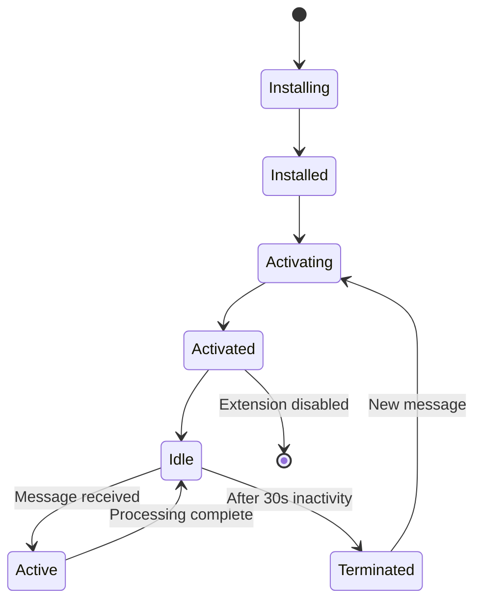
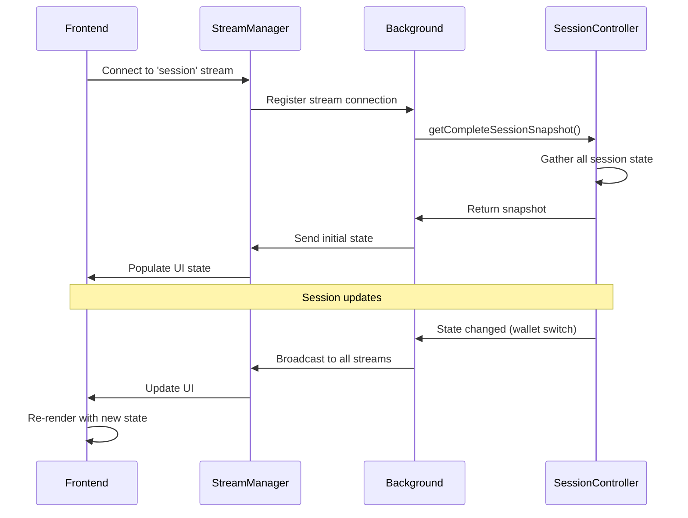
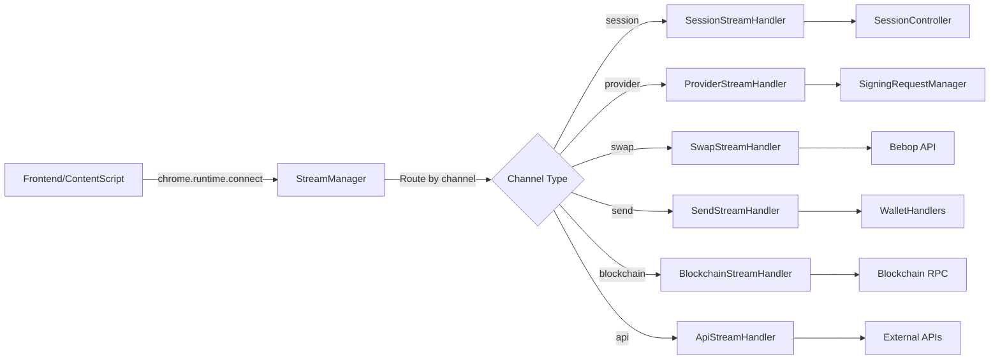

# SuperSafe Wallet - Backend Architecture

**Created:** October 13, 2025  
**Version:** 3.0.0+  
**Status:** ✅ CURRENT  
**Last Code Update:** October 13, 2025

---

## Table of Contents

1. [Backend Overview](#backend-overview)
2. [Service Worker Architecture](#service-worker-architecture)
3. [Core Components](#core-components)
4. [Session Management](#session-management)
5. [Controller System](#controller-system)
6. [Stream Handler Architecture](#stream-handler-architecture)
7. [Manager System](#manager-system)
8. [Handler Layer](#handler-layer)
9. [External Integrations](#external-integrations)
10. [Message Routing](#message-routing)

---

## Backend Overview

SuperSafe Wallet's backend implements a **MetaMask-style Service Worker architecture** as the single source of truth for all wallet operations. The backend is built on Chrome Extension Manifest V3 with persistent service workers.

### Key Characteristics

- **✅ Single Source of Truth**: All state management centralized
- **✅ MetaMask-Style Controllers**: Modular controller pattern
- **✅ Stream-Based Communication**: Long-lived Chrome connections
- **✅ Enterprise Managers**: Robust signing and popup management
- **✅ Zero Frontend Logic**: All business logic in background
- **✅ Event-Driven Architecture**: No polling, pure events

### Backend Metrics

```
Total Backend Files: 32 files
Total Lines of Code: ~15,000 lines
Main Background Script: 3,220 lines
Session Controller: 3,979 lines
Response Time: <150ms average
Architecture Pattern: MetaMask-compatible
```

---

## Service Worker Architecture

### High-Level Backend Architecture

```
┌────────────────────────────────────────────────────────────────┐
│                  Background Service Worker                     │
│                      (src/background.js)                       │
├────────────────────────────────────────────────────────────────┤
│                                                                │
│  ┌──────────────────────────────────────────────────────────┐ │
│  │                Core Controllers                          │ │
│  │  • BackgroundSessionController (3,979 lines)             │ │
│  │  • BackgroundControllers (497 lines)                     │ │
│  │    - TokenController                                     │ │
│  │    - NetworkController                                   │ │
│  │    - TransactionController                               │ │
│  │    - NetworkSwitchService                                │ │
│  └──────────────────────────────────────────────────────────┘ │
│                                                                │
│  ┌──────────────────────────────────────────────────────────┐ │
│  │                Stream Handlers                           │ │
│  │  • SessionStreamHandler - Session operations             │ │
│  │  • ProviderStreamHandler - dApp requests (EIP-1193)      │ │
│  │  • SwapStreamHandler - Bebop swap operations             │ │
│  │  • SendStreamHandler - Token transfers                   │ │
│  │  • BlockchainStreamHandler - Blockchain queries          │ │
│  │  • ApiStreamHandler - External API calls                 │ │
│  └──────────────────────────────────────────────────────────┘ │
│                                                                │
│  ┌──────────────────────────────────────────────────────────┐ │
│  │                Enterprise Managers                       │ │
│  │  • SigningRequestManager - Signing lifecycle             │ │
│  │  • PopupManager - Popup orchestration                    │ │
│  │  • EIP1193EventsManager - Event broadcasting             │ │
│  │  • AutoEscalationManager - Auto-approval                 │ │
│  │  • StreamPersistenceManager - Stream recovery            │ │
│  └──────────────────────────────────────────────────────────┘ │
│                                                                │
│  ┌──────────────────────────────────────────────────────────┐ │
│  │                Handler & Policy Layer                    │ │
│  │  • walletHandlers - Wallet operations                    │ │
│  │  • contractHandlers - Smart contract calls               │ │
│  │  • providerHandlers - Provider management                │ │
│  │  • AllowListManager - dApp authorization                 │ │
│  └──────────────────────────────────────────────────────────┘ │
│                                                                │
│  ┌──────────────────────────────────────────────────────────┐ │
│  │                External Services                         │ │
│  │  • WalletConnect Manager - WalletConnect v2/Reown        │ │
│  │  • Bebop Token Service - Token list management           │ │
│  │  • Secure API Client - HTTP client with security         │ │
│  │  • SuperSeed API Wrapper - RPC abstraction               │ │
│  └──────────────────────────────────────────────────────────┘ │
│                                                                │
└────────────────────────────────────────────────────────────────┘
                             ↕
┌────────────────────────────────────────────────────────────────┐
│                     Chrome Storage Layer                       │
│  • chrome.storage.local - Encrypted vault (persistent)        │
│  • chrome.storage.session - Session state (temporary)         │
└────────────────────────────────────────────────────────────────┘
```

### Service Worker Lifecycle



**Key Points:**
- Service worker can terminate after 30 seconds of inactivity
- All state must survive termination (persistence required)
- Long-lived streams keep worker alive during active operations
- Background script automatically restarts on new messages

---

## Core Components

### 1. Background.js (3,220 lines)

**Location:** `src/background.js`

**Primary Responsibilities:**
```javascript
// Service worker initialization
chrome.runtime.onInstalled.addListener(async (details) => {
  console.log('[SuperSafe Background] 🚀 Extension installed/updated');
  
  // Initialize allowlist
  await loadAllowlist();
  
  // Initialize WalletConnect
  await initializeWalletConnect();
  
  // Set up badge
  chrome.action.setBadgeText({ text: '' });
});

// Stream handler registration
setupSessionStreamHandler(backgroundStreamManager, dependencies);
setupProviderStreamHandler(backgroundStreamManager, dependencies);
setupSwapStreamHandler(backgroundStreamManager, dependencies);
setupSendStreamHandler(backgroundStreamManager, dependencies);
setupBlockchainStreamHandler(backgroundStreamManager, dependencies);
setupApiStreamHandler(backgroundStreamManager, dependencies);

// Manager initialization
signingRequestManager = new SigningRequestManager(
  backgroundSessionController,
  popupManager
);

popupManager = new PopupManager(
  backgroundSessionController,
  backgroundControllers
);
```

**Global State:**
```javascript
// Enterprise managers
let signingRequestManager;
let popupManager;
let eip1193EventsManager;
let autoEscalationManager;

// Connection tracking
const pendingConnectRpc = new Map();
const connectedSites = {};

// WalletConnect state
let pendingWCProposal = null;
let pendingWCRequest = null;
let wcPopupId = null;

// Security
const secureApiClient = new SecureApiClient(API_CONFIG);
const simpleRateLimiter = new SimpleRateLimiter();
```

### 2. BackgroundSessionController (3,979 lines)

**Location:** `src/background/BackgroundSessionController.js`

**Core Responsibilities:**
- Vault lifecycle management (create, unlock, lock)
- Wallet management (create, import, remove, switch)
- Session state management
- Connected sites tracking
- Auto-lock functionality
- Network coordination

**Class Structure:**
```javascript
class BackgroundSessionController {
  constructor() {
    // Session state (memory only)
    this.isUnlocked = false;
    this.password = null;
    this.vaultData = null;
    this.decryptedWallets = new Map();
    
    // Connected sites
    this.connectedSites = new Map();
    
    // Auto-lock
    this.autoLockTimer = null;
    this.autoLockTimeoutMs = 15 * 60 * 1000;  // 15 minutes
    
    // Rate limiting
    this.unlockAttempts = [];
    this.maxAttempts = 5;
    this.lockoutDuration = 15 * 60 * 1000;
  }
  
  // Vault operations
  async createVault(wallets, settings, password)
  async unlock(password, origin, tokenController)
  async lock()
  
  // Wallet operations
  async createWallet(name, emoji)
  async importWallet(privateKey, name, emoji)
  async removeWalletAtIndex(index)
  async switchWallet(index, origin)
  
  // Connected sites
  async connectSite(origin, accounts, tabId, walletInfo, policy)
  async disconnectSite(origin, eip1193EventsManager, updateBadge)
  
  // Network management
  async switchNetwork(networkKey, provider, getPrivateKeyFunction)
  
  // Session state
  async getCompleteSessionSnapshot(tokenController)
  async persistSessionState()
  async checkPersistentSession()
}
```

**Key Methods:**

**Unlock Flow:**
```javascript
async unlock(password, origin = null, tokenController = null) {
  console.log('[SessionController] 🔓 Unlocking vault...');
  
  // 1. Load encrypted vault
  const encryptedVault = await vaultStorage.loadVault();
  if (!encryptedVault) {
    throw new Error('No vault found');
  }
  
  // 2. Decrypt vault
  try {
    const decryptedData = await vaultManager.unlockVault(encryptedVault, password);
    
    // 3. Store in memory
    this.vaultData = decryptedData;
    this.password = password;
    this.isUnlocked = true;
    
    // 4. Extract private keys
    this.decryptedWallets.clear();
    for (const wallet of decryptedData.wallets) {
      const privateKey = await this.decryptWalletKey(wallet, password);
      this.decryptedWallets.set(wallet.address, privateKey);
    }
    
    // 5. Initialize network and tokens
    const networkKey = decryptedData.settings?.currentNetworkKey || 'superseed';
    this.currentNetworkKey = networkKey;
    
    // 6. Start auto-lock
    this.startAutoLockTimer();
    
    // 7. Persist session
    await this.persistSessionState();
    
    console.log('[SessionController] ✅ Unlock successful');
    return { success: true, wallets: decryptedData.wallets };
    
  } catch (error) {
    // Rate limiting
    this.recordUnlockAttempt();
    throw new Error('Invalid password');
  }
}
```

### 3. BackgroundControllers (497 lines)

**Location:** `src/background/BackgroundControllers.js`

**Architecture:**
```javascript
class BackgroundControllers {
  constructor() {
    this.tokenController = new TokenController();
    this.networkController = new NetworkController();
    this.transactionController = new TransactionController();
    this.networkSwitchService = null;  // Initialized later
    this.getPrivateKeyFunction = null;
  }
  
  async initialize(networkKey, provider, getPrivateKeyFn) {
    // Initialize each controller
    await this.tokenController.initialize(networkKey, provider, getPrivateKeyFn);
    await this.networkController.initialize(networkKey, provider, getPrivateKeyFn);
    await this.transactionController.initialize(networkKey, provider, getPrivateKeyFn);
    
    // Initialize network switch service
    this.networkSwitchService = initializeNetworkSwitchService(
      this.networkController,
      getPrivateKeyFn?.sessionController
    );
    
    // Load persistent data
    await this.loadAllPersistentData();
    
    this.isInitialized = true;
  }
  
  // Message handlers
  async handleTokenMessage(message) { /* ... */ }
  async handleNetworkMessage(message) { /* ... */ }
  async handleTransactionMessage(message) { /* ... */ }
}
```

**Controller Responsibilities:**

| Controller | Purpose | Key Operations |
|------------|---------|----------------|
| **TokenController** | ERC20 token management | loadTokens, addCustomToken, removeToken |
| **NetworkController** | Network configuration | getCurrentNetwork, switchNetwork, addCustomNetwork |
| **TransactionController** | Transaction history | addTransaction, getHistory, updateStatus |
| **NetworkSwitchService** | Unified switching | switchNetwork(networkKey, context, metadata) |

---

## Session Management

### Session State Model

```javascript
// Complete session state structure
SessionState {
  // Authentication
  isUnlocked: boolean,
  hasVault: boolean,
  
  // Current context
  currentWalletIndex: number,
  currentNetworkKey: string,
  
  // Wallets (non-sensitive)
  wallets: [
    {
      address: string,
      name: string,
      emoji: string,
      isHD: boolean
    }
  ],
  
  // Network info
  currentNetwork: {
    chainId: number,
    name: string,
    rpcUrl: string,
    explorer: string
  },
  
  // Settings
  settings: {
    autoLockMinutes: number,
    currency: string,
    language: string
  },
  
  // Connected sites
  connectedSites: Map<origin, {
    accounts: string[],
    connectedAt: timestamp,
    lastUsed: timestamp,
    policy: Object
  }>
}
```

### Session Synchronization



---

## Controller System

### Controller Architecture

```
BackgroundControllers
├── TokenController
│   ├── State: Map<networkKey, tokens[]>
│   ├── Methods:
│   │   ├── loadTokens(networkKey, address)
│   │   ├── addCustomToken(networkKey, token)
│   │   ├── removeToken(networkKey, address)
│   │   └── getTokenBalance(token, wallet)
│   └── Storage: chrome.storage.local['tokens_{network}']
│
├── NetworkController
│   ├── State: currentNetwork, customNetworks
│   ├── Methods:
│   │   ├── getCurrentNetwork()
│   │   ├── switchNetwork(networkKey)
│   │   ├── addCustomNetwork(config)
│   │   └── getNetworkList()
│   └── Storage: chrome.storage.local['currentNetwork']
│
├── TransactionController
│   ├── State: Map<networkKey+address, transactions[]>
│   ├── Methods:
│   │   ├── addTransaction(tx)
│   │   ├── getHistory(network, address)
│   │   ├── updateStatus(txHash, status)
│   │   └── clearHistory(network, address)
│   └── Storage: chrome.storage.local['txHistory_{network}_{address}']
│
└── NetworkSwitchService
    ├── Dependencies: NetworkController, SessionController
    ├── Methods:
    │   ├── switchNetwork(networkKey, context, metadata)
    │   ├── requestNetworkSwitch(dAppOrigin, chainId)
    │   └── validateNetworkSwitch(current, target, policy)
    └── Context-Aware: manual | dapp_request | connection | automatic
```

### Controller Communication

```javascript
// Inter-controller event handling
_setupControllerEventHandlers() {
  // When network changes, update all controllers
  this.networkController.on('networkChanged', async (networkKey) => {
    console.log('[BackgroundControllers] 🔄 Network changed:', networkKey);
    
    // Update token controller
    await this.tokenController.onNetworkChange(networkKey);
    
    // Update transaction controller
    await this.transactionController.onNetworkChange(networkKey);
    
    // Broadcast to frontend
    this.broadcastNetworkChange(networkKey);
  });
}
```

---

## Stream Handler Architecture

### Stream Communication Model

```
Frontend/Content Script
       │
       │ chrome.runtime.connect({ name: 'session' })
       ↓
┌────────────────┐
│  Stream Port   │ ← Long-lived connection
└────────┬───────┘
         │ postMessage({ type: 'GET_SESSION_STATE' })
         ↓
┌─────────────────────────────────────────┐
│  BackgroundStreamManager                │
│  onMessage('session', handler)          │
└────────┬────────────────────────────────┘
         │ Route to SessionStreamHandler
         ↓
┌─────────────────────────────────────────┐
│  SessionStreamHandler                   │
│  switch (message.type) {                │
│    case 'GET_SESSION_STATE':            │
│      return sessionSnapshot;            │
│  }                                      │
└────────┬────────────────────────────────┘
         │ Response
         ↓
    Return to Frontend
```

### Stream Handlers Overview

| Handler | Channel | Purpose | Key Messages |
|---------|---------|---------|--------------|
| **SessionStreamHandler** | `session` | Session & wallet operations | GET_SESSION_STATE, CREATE_WALLET, SWITCH_WALLET, UNLOCK, LOCK |
| **ProviderStreamHandler** | `provider` | dApp EIP-1193 requests | ETH_REQUEST_ACCOUNTS, ETH_SEND_TRANSACTION, ETH_SIGN, WALLET_SWITCH_ETHEREUM_CHAIN |
| **SwapStreamHandler** | `swap` | Bebop swap operations | SWAP_GET_QUOTE, SWAP_SIGN_AND_SUBMIT, SWAP_CHECK_STATUS |
| **SendStreamHandler** | `send` | Token transfer operations | SEND_ESTIMATE_GAS, SEND_TRANSACTION |
| **BlockchainStreamHandler** | `blockchain` | Blockchain queries | GET_BALANCE, GET_TOKENS, GET_NFTS, GET_TRANSACTION_HISTORY |
| **ApiStreamHandler** | `api` | External API calls | FETCH_TOKEN_PRICE, FETCH_GAS_PRICE |

### Stream Handler Implementation

```javascript
// Location: src/background/handlers/streams/SessionStreamHandler.js
export function setupSessionStreamHandler(backgroundStreamManager, dependencies) {
  const { backgroundSessionController, backgroundControllers } = dependencies;
  
  backgroundStreamManager.onMessage('session', async (message, port) => {
    console.log('[SessionStreamHandler] 📨 Message:', message.type);
    
    switch (message.type) {
      case 'GET_SESSION_STATE': {
        // Check persistent session
        if (!backgroundSessionController.isUnlocked) {
          await backgroundSessionController.checkPersistentSession();
        }
        
        const snapshot = await backgroundSessionController.getCompleteSessionSnapshot(
          backgroundControllers?.tokenController
        );
        
        return { success: true, data: snapshot };
      }
      
      case 'UNLOCK': {
        const { password } = message.payload;
        const result = await backgroundSessionController.unlock(
          password,
          null,
          backgroundControllers?.tokenController
        );
        
        return { success: true, data: result };
      }
      
      case 'CREATE_WALLET': {
        const { name, emoji } = message.payload;
        const result = await backgroundSessionController.createWallet(name, emoji);
        
        return { success: true, data: result };
      }
      
      case 'SWITCH_WALLET': {
        const { index } = message.payload;
        await backgroundSessionController.switchWallet(index);
        
        return { success: true };
      }
      
      default:
        throw new Error(`Unknown session message type: ${message.type}`);
    }
  });
}
```

---

## Manager System

### Enterprise Manager Architecture

```
Manager Layer
├── SigningRequestManager (22,883 lines)
│   ├── Request lifecycle management
│   ├── Deduplication
│   ├── Concurrent request handling
│   ├── Stream persistence
│   └── Recovery system
│
├── PopupManager (35,393 lines)
│   ├── Popup window orchestration
│   ├── Multi-popup support
│   ├── Context routing
│   ├── Window state management
│   └── Cleanup on close
│
├── EIP1193EventsManager
│   ├── accountsChanged event broadcasting
│   ├── chainChanged event broadcasting
│   ├── connect/disconnect events
│   └── Multi-stream broadcasting
│
├── AutoEscalationManager
│   ├── Trusted dApp identification
│   ├── Auto-approval logic
│   ├── Risk assessment
│   └── User preference storage
│
└── StreamPersistenceManager
    ├── Stream reconnection
    ├── Request recovery
    ├── State synchronization
    └── Connection health monitoring
```

### SigningRequestManager

**Purpose:** Enterprise-grade management of all signing requests (personal_sign, eth_signTypedData, eth_sendTransaction).

**Architecture:**
```javascript
class SigningRequestManager {
  constructor(sessionController, popupManager) {
    this.sessionController = sessionController;
    this.popupManager = popupManager;
    
    // Request tracking
    this.pendingRequests = new Map();
    this.requestQueue = [];
    this.requestDeduplicator = new SigningRequestDeduplicator();
    
    // Sub-managers
    this.modalAdapter = new SigningModalAdapter();
    this.streamManager = new StreamPersistenceManager();
    this.recoverySystem = new SigningRequestRecovery(this);
    
    // Stats
    this.requestStats = {
      total: 0,
      approved: 0,
      rejected: 0,
      deduplicated: 0,
      errors: 0
    };
  }
  
  async submitRequest(request) {
    // 1. Deduplication check
    const hash = await this.requestDeduplicator.getRequestHash(request);
    const existingId = this.requestDeduplicator.checkDuplicate(hash);
    
    if (existingId) {
      return this.pendingRequests.get(existingId).promise;
    }
    
    // 2. Create signing request
    const signingRequest = await this.createSigningRequest(requestId, request, hash);
    
    // 3. Register and queue
    this.pendingRequests.set(requestId, signingRequest);
    this.requestQueue.push(signingRequest);
    
    // 4. Process queue
    this.processQueue();
    
    return signingRequest.promise;
  }
  
  async processQueue() {
    if (this.isProcessing || this.requestQueue.length === 0) {
      return;
    }
    
    this.isProcessing = true;
    
    while (this.requestQueue.length > 0) {
      const request = this.requestQueue.shift();
      await this.processRequest(request);
    }
    
    this.isProcessing = false;
  }
}
```

### PopupManager

**Purpose:** Orchestrate popup windows for different contexts (connection, signing, network switch).

```javascript
class PopupManager {
  constructor(sessionController, controllers) {
    this.sessionController = sessionController;
    this.controllers = controllers;
    
    this.popups = new Map();  // context -> popupId
    this.popupContexts = new Map();  // popupId -> context
  }
  
  async openPopup(context, data) {
    // Build popup URL with query params
    const url = this.buildPopupUrl(context, data);
    
    // Create popup window
    const popup = await chrome.windows.create({
      url: url,
      type: 'popup',
      width: 400,
      height: 600,
      focused: true
    });
    
    // Track popup
    this.popups.set(context, popup.id);
    this.popupContexts.set(popup.id, context);
    
    return popup.id;
  }
  
  async closePopup(popupId) {
    await chrome.windows.remove(popupId);
    
    // Cleanup tracking
    const context = this.popupContexts.get(popupId);
    if (context) {
      this.popups.delete(context);
      this.popupContexts.delete(popupId);
    }
  }
}
```

---

## Handler Layer

### Handler Organization

```
src/background/handlers/
├── streams/                    # Stream-based handlers
│   ├── SessionStreamHandler.js
│   ├── ProviderStreamHandler.js
│   ├── SwapStreamHandler.js
│   ├── SendStreamHandler.js
│   ├── BlockchainStreamHandler.js
│   └── ApiStreamHandler.js
├── walletHandlers.js           # Wallet operations
├── contractHandlers.js         # Smart contract interactions
└── providerHandlers.js         # Provider management
```

### Wallet Handlers

**Location:** `src/background/handlers/walletHandlers.js`

```javascript
export async function sendTransaction(transactionRequest, privateKey, provider) {
  console.log('[WalletHandlers] 💸 Sending transaction...');
  
  // 1. Create wallet instance
  const wallet = new ethers.Wallet(privateKey, provider);
  
  // 2. Estimate gas if not provided
  if (!transactionRequest.gasLimit) {
    transactionRequest.gasLimit = await wallet.estimateGas(transactionRequest);
  }
  
  // 3. Get gas price if not provided
  if (!transactionRequest.gasPrice && !transactionRequest.maxFeePerGas) {
    const feeData = await provider.getFeeData();
    if (feeData.maxFeePerGas) {
      transactionRequest.maxFeePerGas = feeData.maxFeePerGas;
      transactionRequest.maxPriorityFeePerGas = feeData.maxPriorityFeePerGas;
    } else {
      transactionRequest.gasPrice = feeData.gasPrice;
    }
  }
  
  // 4. Send transaction
  const tx = await wallet.sendTransaction(transactionRequest);
  console.log('[WalletHandlers] ✅ Transaction sent:', tx.hash);
  
  return {
    hash: tx.hash,
    from: tx.from,
    to: tx.to,
    value: tx.value.toString(),
    nonce: tx.nonce
  };
}
```

---

## External Integrations

### WalletConnect Manager

**Purpose:** Handle WalletConnect v2 / Reown WalletKit integration.

```javascript
// Location: src/utils/walletConnectManager.js
class WalletConnectManager {
  constructor() {
    this.walletKit = null;
    this.activeSessions = new Map();
    this.onSessionProposal = null;
    this.onSessionRequest = null;
  }
  
  async initialize(projectId, metadata) {
    const { WalletKit } = await import('@reown/walletkit');
    
    this.walletKit = await WalletKit.init({
      projectId: projectId,
      metadata: metadata
    });
    
    this.setupEventListeners();
  }
  
  setupEventListeners() {
    this.walletKit.on('session_proposal', (proposal) => {
      if (this.onSessionProposal) {
        this.onSessionProposal(proposal);
      }
    });
    
    this.walletKit.on('session_request', (request) => {
      if (this.onSessionRequest) {
        this.onSessionRequest(request);
      }
    });
  }
  
  async approveSession(proposal, accounts) {
    const session = await this.walletKit.approveSession({
      id: proposal.id,
      namespaces: this.buildNamespaces(proposal, accounts)
    });
    
    this.activeSessions.set(session.topic, session);
    return session;
  }
}
```

### Bebop Integration

**Location:** `src/background/handlers/streams/SwapStreamHandler.js`

```javascript
case 'SWAP_GET_QUOTE': {
  const { sellToken, buyToken, sellAmount, takerAddress, slippage, chain } = payload;
  
  // Validate network
  const networkKey = mapChainNameToNetworkKey(chain.name);
  const networkValidation = validateSwapNetwork(networkKey);
  
  if (!networkValidation.valid) {
    return { success: false, error: networkValidation.reason };
  }
  
  // Get Bebop API endpoint
  const bebopApiUrl = getBebopApiEndpoint(networkKey, 'JAM');
  
  // Get fee configuration
  const feeConfig = getFeeConfiguration();
  
  // Build quote request
  const quoteParams = new URLSearchParams({
    sell_tokens: sellToken.address,
    buy_tokens: buyToken.address,
    sell_amounts: amountInWei,
    taker_address: takerAddress,
    approval_type: isNative ? 'Standard' : 'Permit2',
    slippage: slippage * 100,  // Convert to basis points
    // Partner fee parameters
    receiver_address: feeConfig.partnerInfo.receiverAddress,
    buy_tokens_ratios: feeConfig.feeBps
  });
  
  // Fetch quote
  const response = await fetch(`${bebopApiUrl}quote?${quoteParams}`);
  const quoteData = await response.json();
  
  return { success: true, data: quoteData };
}
```

---

## Message Routing

### Message Flow Architecture



### Stream Registration

```javascript
// Background script stream setup
function setupAllStreamHandlers() {
  const dependencies = {
    backgroundSessionController,
    backgroundControllers,
    ethers,
    NETWORKS,
    signingRequestManager,
    popupManager,
    eip1193EventsManager
  };
  
  // Register all handlers
  setupSessionStreamHandler(backgroundStreamManager, dependencies);
  setupProviderStreamHandler(backgroundStreamManager, dependencies);
  setupSwapStreamHandler(backgroundStreamManager, dependencies);
  setupSendStreamHandler(backgroundStreamManager, dependencies);
  setupBlockchainStreamHandler(backgroundStreamManager, dependencies);
  setupApiStreamHandler(backgroundStreamManager, dependencies);
}
```

---

## Related Documentation

- [ARCHITECTURE.md](./ARCHITECTURE.md) - Overall system architecture
- [SECURITY.md](./SECURITY.md) - Security implementation details
- [FRONTEND.md](./FRONTEND.md) - React frontend architecture
- [API_REFERENCE.md](./API_REFERENCE.md) - Complete API documentation
- [DAPP_CONNECTIONS.md](./DAPP_CONNECTIONS.md) - dApp connection handling

---

**Document Status:** ✅ Current as of October 13, 2025  
**Code Version:** v3.0.0+  
**Maintenance:** Review after major backend changes

