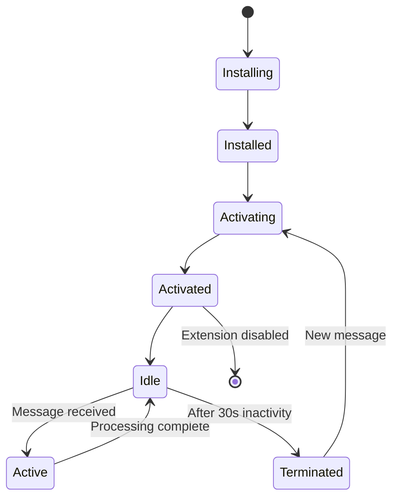
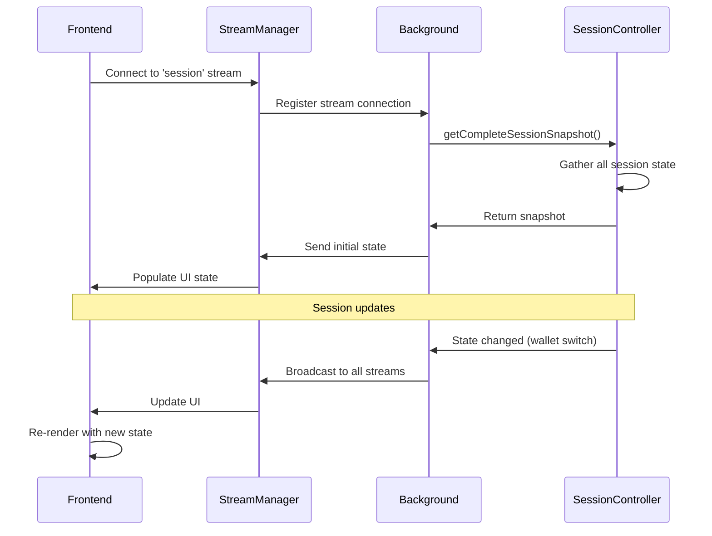
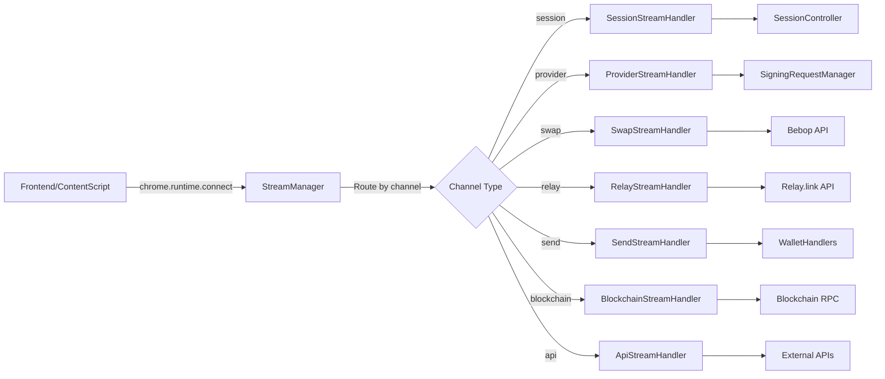

# SuperSafe Wallet - Backend Architecture

**Created:** October 13, 2025  
**Last Updated:** November 15, 2025  
**Version:** 3.0.2+  
**Status:** ✅ CURRENT  
**Last Code Update:** November 15, 2025

---

## Table of Contents

1. [Backend Overview](#backend-overview)
2. [Service Worker Architecture](#service-worker-architecture)
3. [Core Components](#core-components)
4. [Session Management](#session-management)
5. [Controller System](#controller-system)
6. [Stream Handler Architecture](#stream-handler-architecture)
7. [Manager System](#manager-system)
8. [Handler Layer](#handler-layer)
9. [External Integrations](#external-integrations)
10. [Message Routing](#message-routing)
11. [Services](#services)
12. [Transaction Decoders](#transaction-decoders)

---

## Backend Overview

SuperSafe Wallet's backend implements a **Professionally Standardized Service Worker architecture** as the single source of truth for all wallet operations. The backend is built on Chrome Extension Manifest V3 with persistent service workers.

### Key Characteristics

- **✅ Single Source of Truth**: All state management centralized
- **✅ Professionally Standardized Controllers**: Modular controller pattern
- **✅ Stream-Based Communication**: Long-lived Chrome connections
- **✅ Enterprise Managers**: Robust signing and popup management
- **✅ Zero Frontend Logic**: All business logic in background
- **✅ Event-Driven Architecture**: No polling, pure events

### Backend Metrics

```
Total Backend Files: 32 files
Total Lines of Code: ~15,000 lines
Main Background Script: 3,220 lines
Session Controller: 3,979 lines
Response Time: <150ms average
Architecture Pattern: MetaMask-compatible
```

---

## Service Worker Architecture

### High-Level Backend Architecture

```
┌────────────────────────────────────────────────────────────────┐
│                  Background Service Worker                     │
│                      (src/background.js)                       │
├────────────────────────────────────────────────────────────────┤
│                                                                │
│  ┌──────────────────────────────────────────────────────────┐ │
│  │                Core Controllers                          │ │
│  │  • BackgroundSessionController (3,979 lines)             │ │
│  │  • BackgroundControllers (497 lines)                     │ │
│  │    - TokenController                                     │ │
│  │    - NetworkController                                   │ │
│  │    - TransactionController                               │ │
│  │    - NetworkSwitchService                                │ │
│  └──────────────────────────────────────────────────────────┘ │
│                                                                │
│  ┌──────────────────────────────────────────────────────────┐ │
│  │                Stream Handlers                           │ │
│  │  • SessionStreamHandler - Session operations             │ │
│  │  • ProviderStreamHandler - dApp requests (EIP-1193)      │ │
│  │  • SwapStreamHandler - Bebop swap operations             │ │
│  │  • RelayStreamHandler - Relay.link cross-chain swaps     │ │
│  │  • SendStreamHandler - Token transfers                   │ │
│  │  • BlockchainStreamHandler - Blockchain queries          │ │
│  │  • ApiStreamHandler - External API calls                 │ │
│  └──────────────────────────────────────────────────────────┘ │
│                                                                │
│  ┌──────────────────────────────────────────────────────────┐ │
│  │                Enterprise Managers                       │ │
│  │  • SigningRequestManager - Signing lifecycle             │ │
│  │  • PopupManager - Popup orchestration                    │ │
│  │  • EIP1193EventsManager - Event broadcasting             │ │
│  │  • AutoEscalationManager - Auto-approval                 │ │
│  │  • StreamPersistenceManager - Stream recovery            │ │
│  └──────────────────────────────────────────────────────────┘ │
│                                                                │
│  ┌──────────────────────────────────────────────────────────┐ │
│  │                Handler & Policy Layer                    │ │
│  │  • walletHandlers - Wallet operations                    │ │
│  │  • contractHandlers - Smart contract calls               │ │
│  │  • providerHandlers - Provider management                │ │
│  │  • AllowListManager - dApp authorization                 │ │
│  └──────────────────────────────────────────────────────────┘ │
│                                                                │
│  ┌──────────────────────────────────────────────────────────┐ │
│  │                External Services                         │ │
│  │  • WalletConnect Manager - WalletConnect v2/Reown        │ │
│  │  • Bebop Token Service - Token list management           │ │
│  │  • Relay.link Integration - Cross-chain swaps            │ │
│  │  • Secure API Client - HTTP client with security         │ │
│  │  • SuperSeed API Wrapper - RPC abstraction               │ │
│  └──────────────────────────────────────────────────────────┘ │
│                                                                │
└────────────────────────────────────────────────────────────────┘
                             ↕
┌────────────────────────────────────────────────────────────────┐
│                     Chrome Storage Layer                       │
│  • chrome.storage.local - Encrypted vault (persistent)        │
│  • chrome.storage.session - Session state (temporary)         │
└────────────────────────────────────────────────────────────────┘
```

### Service Worker Lifecycle


```mermaid
stateDiagram-v2
    [*] --> Installing
    Installing --> Installed
    Installed --> Activating
    Activating --> Activated
    Activated --> Idle
    Idle --> Active: Message received
    Active --> Idle: Processing complete
    Idle --> Terminated: After 30s inactivity
    Terminated --> Activating: New message
    Activated --> [*]: Extension disabled
```

**Key Points:**
- Service worker can terminate after 30 seconds of inactivity
- All state must survive termination (persistence required)
- Long-lived streams keep worker alive during active operations
- Background script automatically restarts on new messages

---

## Core Components

### 1. Background.js (3,220 lines)

**Location:** `src/background.js`

**Primary Responsibilities:**
```javascript
// Service worker initialization
chrome.runtime.onInstalled.addListener(async (details) => {
  console.log('[SuperSafe Background] 🚀 Extension installed/updated');
  
  // Initialize allowlist
  await loadAllowlist();
  
  // Initialize WalletConnect
  await initializeWalletConnect();
  
  // Set up badge
  chrome.action.setBadgeText({ text: '' });
});

// Stream handler registration
setupSessionStreamHandler(backgroundStreamManager, dependencies);
setupProviderStreamHandler(backgroundStreamManager, dependencies);
setupSwapStreamHandler(backgroundStreamManager, dependencies);
setupRelayStreamHandler(backgroundStreamManager, dependencies);
setupSendStreamHandler(backgroundStreamManager, dependencies);
setupBlockchainStreamHandler(backgroundStreamManager, dependencies);
setupApiStreamHandler(backgroundStreamManager, dependencies);

// Manager initialization
signingRequestManager = new SigningRequestManager(
  backgroundSessionController,
  popupManager
);

popupManager = new PopupManager(
  backgroundSessionController,
  backgroundControllers
);
```

**Global State:**
```javascript
// Enterprise managers
let signingRequestManager;
let popupManager;
let eip1193EventsManager;
let autoEscalationManager;

// Connection tracking
const pendingConnectRpc = new Map();
const connectedSites = {};

// WalletConnect state
let pendingWCProposal = null;
let pendingWCRequest = null;
let wcPopupId = null;

// Security
const secureApiClient = new SecureApiClient(API_CONFIG);
const simpleRateLimiter = new SimpleRateLimiter();
```

### 2. BackgroundSessionController (3,979 lines)

**Location:** `src/background/BackgroundSessionController.js`

**Core Responsibilities:**
- Vault lifecycle management (create, unlock, lock)
- Wallet management (create, import, remove, switch)
- Session state management
- Connected sites tracking
- Auto-lock functionality
- Network coordination

**Class Structure:**
```javascript
class BackgroundSessionController {
  constructor() {
    // Session state (memory only)
    this.isUnlocked = false;
    this.password = null;
    this.vaultData = null;
    this.decryptedWallets = new Map();
    
    // Connected sites
    this.connectedSites = new Map();
    
    // Auto-lock
    this.autoLockTimer = null;
    this.autoLockTimeoutMs = 15 * 60 * 1000;  // 15 minutes
    
    // Rate limiting
    this.unlockAttempts = [];
    this.maxAttempts = 5;
    this.lockoutDuration = 15 * 60 * 1000;
  }
  
  // Vault operations
  async createVault(wallets, settings, password)
  async unlock(password, origin, tokenController)
  async lock()
  
  // Wallet operations
  async createWallet(name, emoji)
  async importWallet(privateKey, name, emoji)
  async removeWalletAtIndex(index)
  async switchWallet(index, origin)
  
  // Connected sites
  async connectSite(origin, accounts, tabId, walletInfo, policy)
  async disconnectSite(origin, eip1193EventsManager, updateBadge)
  
  // Network management
  async switchNetwork(networkKey, provider, getPrivateKeyFunction)
  
  // Session state
  async getCompleteSessionSnapshot(tokenController)
  async persistSessionState()
  async checkPersistentSession()
}
```

**Key Methods:**

**Unlock Flow:**
```javascript
async unlock(password, origin = null, tokenController = null) {
  console.log('[SessionController] 🔓 Unlocking vault...');
  
  // 1. Load encrypted vault
  const encryptedVault = await vaultStorage.loadVault();
  if (!encryptedVault) {
    throw new Error('No vault found');
  }
  
  // 2. Decrypt vault
  try {
    const decryptedData = await vaultManager.unlockVault(encryptedVault, password);
    
    // 3. Store in memory
    this.vaultData = decryptedData;
    this.password = password;
    this.isUnlocked = true;
    
    // 4. Extract private keys
    this.decryptedWallets.clear();
    for (const wallet of decryptedData.wallets) {
      const privateKey = await this.decryptWalletKey(wallet, password);
      this.decryptedWallets.set(wallet.address, privateKey);
    }
    
    // 5. Initialize network and tokens
    const networkKey = decryptedData.settings?.currentNetworkKey || 'superseed';
    this.currentNetworkKey = networkKey;
    
    // 6. Start auto-lock
    this.startAutoLockTimer();
    
    // 7. Persist session
    await this.persistSessionState();
    
    console.log('[SessionController] ✅ Unlock successful');
    return { success: true, wallets: decryptedData.wallets };
    
  } catch (error) {
    // Rate limiting
    this.recordUnlockAttempt();
    throw new Error('Invalid password');
  }
}
```

**Session Restoration Flow:**
```javascript
async checkPersistentSession() {
  console.log('🔍 Checking expert-recommended session persistence...');
  
  // 1. Read session state from chrome.storage
  const isDevMode = chrome.runtime.getManifest().update_url === undefined;
  const storage = isDevMode ? chrome.storage.local : chrome.storage.session;
  const { supersafe_session_state } = await storage.get('supersafe_session_state');
  
  if (!supersafe_session_state?.expertApproach) {
    return false; // No session to restore
  }
  
  // 2. Validate session timing
  const { unlockTime, expirationTime, loginToken, tempPassword } = supersafe_session_state;
  const currentTime = Date.now();
  
  if (currentTime > expirationTime) {
    await this.clearSessionState();
    return false; // Session expired
  }
  
  // 3. Restore session credentials
  this.currentLoginToken = loginToken;
  this.tempSessionPassword = tempPassword;
  
  // 4. Restore session with loginToken
  const timeElapsed = currentTime - unlockTime;
  const success = await this.restoreSessionWithLoginToken(loginToken, timeElapsed);
  
  return success;
}

async restoreSessionWithLoginToken(loginTokenData, timeElapsed) {
  // 1. Validate loginToken with password
  const decryptedVaultData = await this.validateLoginTokenWithPassword(
    loginTokenData, 
    this.tempSessionPassword
  );
  
  if (!decryptedVaultData) {
    return false; // Invalid credentials
  }
  
  // 2. Restore session state (CRITICAL: Must restore vaultData!)
  this.vaultData = decryptedVaultData;  // ✅ FIX: This was missing, causing bugs
  this.isUnlocked = true;
  this.currentLoginToken = loginTokenData;
  
  // 3. Pre-decrypt wallet keys
  await this.preDecryptWalletKeys();
  
  // 4. Setup auto-lock timer with remaining time
  const remainingTime = this.autoLockTimeoutMs - timeElapsed;
  if (remainingTime > 0) {
    this.setupAutoLockTimer(remainingTime);
  }
  
  console.log('✅ Session restored successfully');
  return true;
}
```

**Key Points:**
- Session persists through Service Worker restarts (Professionally Standardized)
- Uses `loginToken` metadata (no password export) for security
- Automatically restores `vaultData` and decrypted keys
- Maintains remaining auto-lock time
- ✅ **Bug Fix (Nov 2025)**: Added missing `this.vaultData = decryptedVaultData` assignment

### 3. BackgroundControllers (497 lines)

**Location:** `src/background/BackgroundControllers.js`

**Architecture:**
```javascript
class BackgroundControllers {
  constructor() {
    this.tokenController = new TokenController();
    this.networkController = new NetworkController();
    this.transactionController = new TransactionController();
    this.networkSwitchService = null;  // Initialized later
    this.getPrivateKeyFunction = null;
  }
  
  async initialize(networkKey, provider, getPrivateKeyFn) {
    // Initialize each controller
    await this.tokenController.initialize(networkKey, provider, getPrivateKeyFn);
    await this.networkController.initialize(networkKey, provider, getPrivateKeyFn);
    await this.transactionController.initialize(networkKey, provider, getPrivateKeyFn);
    
    // Initialize network switch service
    this.networkSwitchService = initializeNetworkSwitchService(
      this.networkController,
      getPrivateKeyFn?.sessionController
    );
    
    // Load persistent data
    await this.loadAllPersistentData();
    
    this.isInitialized = true;
  }
  
  // Message handlers
  async handleTokenMessage(message) { /* ... */ }
  async handleNetworkMessage(message) { /* ... */ }
  async handleTransactionMessage(message) { /* ... */ }
}
```

**Controller Responsibilities:**

| Controller | Purpose | Key Operations |
|------------|---------|----------------|
| **TokenController** | ERC20 token management | loadTokens, addCustomToken, removeToken |
| **NetworkController** | Network configuration | getCurrentNetwork, switchNetwork, addCustomNetwork |
| **TransactionController** | Transaction history | addTransaction, getHistory, updateStatus |
| **NetworkSwitchService** | Unified switching | switchNetwork(networkKey, context, metadata) |

---

## Session Management

### Session State Model

```javascript
// Complete session state structure
SessionState {
  // Authentication
  isUnlocked: boolean,
  hasVault: boolean,
  
  // Current context
  currentWalletIndex: number,
  currentNetworkKey: string,
  
  // Wallets (non-sensitive)
  wallets: [
    {
      address: string,
      name: string,
      emoji: string,
      isHD: boolean
    }
  ],
  
  // Network info
  currentNetwork: {
    chainId: number,
    name: string,
    rpcUrl: string,
    explorer: string
  },
  
  // Settings
  settings: {
    autoLockMinutes: number,
    currency: string,
    language: string
  },
  
  // Connected sites
  connectedSites: Map<origin, {
    accounts: string[],
    connectedAt: timestamp,
    lastUsed: timestamp,
    policy: Object
  }>
}
```

### Session Synchronization


```mermaid
sequenceDiagram
    participant F as Frontend
    participant SM as StreamManager
    participant BG as Background
    participant SC as SessionController

    F->>SM: Connect to 'session' stream
    SM->>BG: Register stream connection
    BG->>SC: getCompleteSessionSnapshot()
    SC->>SC: Gather all session state
    SC->>BG: Return snapshot
    BG->>SM: Send initial state
    SM->>F: Populate UI state
    
    Note over F,SC: Session updates
    
    SC->>BG: State changed (wallet switch)
    BG->>SM: Broadcast to all streams
    SM->>F: Update UI
    F->>F: Re-render with new state
```

---

## Controller System

### Controller Architecture

```
BackgroundControllers
├── TokenController
│   ├── State: Map<networkKey, tokens[]>
│   ├── Methods:
│   │   ├── loadTokens(networkKey, address)
│   │   ├── addCustomToken(networkKey, token)
│   │   ├── removeToken(networkKey, address)
│   │   └── getTokenBalance(token, wallet)
│   └── Storage: chrome.storage.local['tokens_{network}']
│
├── NetworkController
│   ├── State: currentNetwork, customNetworks
│   ├── Methods:
│   │   ├── getCurrentNetwork()
│   │   ├── switchNetwork(networkKey)
│   │   ├── addCustomNetwork(config)
│   │   └── getNetworkList()
│   └── Storage: chrome.storage.local['currentNetwork']
│
├── TransactionController
│   ├── State: Map<networkKey+address, transactions[]>
│   ├── Methods:
│   │   ├── addTransaction(tx)
│   │   ├── getHistory(network, address)
│   │   ├── updateStatus(txHash, status)
│   │   └── clearHistory(network, address)
│   └── Storage: chrome.storage.local['txHistory_{network}_{address}']
│
└── NetworkSwitchService
    ├── Dependencies: NetworkController, SessionController
    ├── Methods:
    │   ├── switchNetwork(networkKey, context, metadata)
    │   ├── requestNetworkSwitch(dAppOrigin, chainId)
    │   └── validateNetworkSwitch(current, target, policy)
    └── Context-Aware: manual | dapp_request | connection | automatic
```

### Controller Communication

```javascript
// Inter-controller event handling
_setupControllerEventHandlers() {
  // When network changes, update all controllers
  this.networkController.on('networkChanged', async (networkKey) => {
    console.log('[BackgroundControllers] 🔄 Network changed:', networkKey);
    
    // Update token controller
    await this.tokenController.onNetworkChange(networkKey);
    
    // Update transaction controller
    await this.transactionController.onNetworkChange(networkKey);
    
    // Broadcast to frontend
    this.broadcastNetworkChange(networkKey);
  });
}
```

---

## Stream Handler Architecture

### Stream Communication Model

```
Frontend/Content Script
       │
       │ chrome.runtime.connect({ name: 'session' })
       ↓
┌────────────────┐
│  Stream Port   │ ← Long-lived connection
└────────┬───────┘
         │ postMessage({ type: 'GET_SESSION_STATE' })
         ↓
┌─────────────────────────────────────────┐
│  BackgroundStreamManager                │
│  onMessage('session', handler)          │
└────────┬────────────────────────────────┘
         │ Route to SessionStreamHandler
         ↓
┌─────────────────────────────────────────┐
│  SessionStreamHandler                   │
│  switch (message.type) {                │
│    case 'GET_SESSION_STATE':            │
│      return sessionSnapshot;            │
│  }                                      │
└────────┬────────────────────────────────┘
         │ Response
         ↓
    Return to Frontend
```

### Stream Handlers Overview

| Handler | Channel | Purpose | Key Messages |
|---------|---------|---------|--------------|
| **SessionStreamHandler** | `session` | Session & wallet operations | GET_SESSION_STATE, CREATE_WALLET, SWITCH_WALLET, UNLOCK, LOCK |
| **ProviderStreamHandler** | `provider` | dApp EIP-1193 requests | ETH_REQUEST_ACCOUNTS, ETH_SEND_TRANSACTION, ETH_SIGN, WALLET_SWITCH_ETHEREUM_CHAIN |
| **SwapStreamHandler** | `swap` | Bebop swap operations | SWAP_GET_QUOTE, SWAP_SIGN_AND_SUBMIT, SWAP_CHECK_STATUS |
| **RelayStreamHandler** | `relay` | Relay.link cross-chain swaps | RELAY_GET_QUOTE, RELAY_EXECUTE_SWAP, RELAY_GET_STATUS, RELAY_GET_FEE_CONFIG |
| **SendStreamHandler** | `send` | Token transfer operations | SEND_ESTIMATE_GAS, SEND_TRANSACTION |
| **BlockchainStreamHandler** | `blockchain` | Blockchain queries | GET_BALANCE, GET_TOKENS, GET_NFTS, GET_TRANSACTION_HISTORY |
| **ApiStreamHandler** | `api` | External API calls (SuperSafe Price API) | API_CALCULATE_PORTFOLIO_CHANGE_24H, API_CALCULATE_TOKEN_CHANGE_24H, API_FORMAT_TOKEN_AMOUNT, API_GET_TRANSACTION_HISTORY, API_GET_TOKEN_TRANSFERS, API_GET_COMBINED_HISTORY |

### Stream Handler Implementation

```javascript
// Location: src/background/handlers/streams/SessionStreamHandler.js
export function setupSessionStreamHandler(backgroundStreamManager, dependencies) {
  const { backgroundSessionController, backgroundControllers } = dependencies;
  
  backgroundStreamManager.onMessage('session', async (message, port) => {
    console.log('[SessionStreamHandler] 📨 Message:', message.type);
    
    switch (message.type) {
      case 'GET_SESSION_STATE': {
        // Check persistent session
        if (!backgroundSessionController.isUnlocked) {
          await backgroundSessionController.checkPersistentSession();
        }
        
        const snapshot = await backgroundSessionController.getCompleteSessionSnapshot(
          backgroundControllers?.tokenController
        );
        
        return { success: true, data: snapshot };
      }
      
      case 'UNLOCK': {
        const { password } = message.payload;
        const result = await backgroundSessionController.unlock(
          password,
          null,
          backgroundControllers?.tokenController
        );
        
        return { success: true, data: result };
      }
      
      case 'CREATE_WALLET': {
        const { name, emoji } = message.payload;
        const result = await backgroundSessionController.createWallet(name, emoji);
        
        return { success: true, data: result };
      }
      
      case 'SWITCH_WALLET': {
        const { index } = message.payload;
        await backgroundSessionController.switchWallet(index);
        
        return { success: true };
      }
      
      default:
        throw new Error(`Unknown session message type: ${message.type}`);
    }
  });
}
```

---

## Manager System

### Enterprise Manager Architecture

```
Manager Layer
├── SigningRequestManager (22,883 lines)
│   ├── Request lifecycle management
│   ├── Deduplication
│   ├── Concurrent request handling
│   ├── Stream persistence
│   └── Recovery system
│
├── PopupManager (35,393 lines)
│   ├── Popup window orchestration
│   ├── Multi-popup support
│   ├── Context routing
│   ├── Window state management
│   └── Cleanup on close
│
├── EIP1193EventsManager
│   ├── accountsChanged event broadcasting
│   ├── chainChanged event broadcasting
│   ├── connect/disconnect events
│   └── Multi-stream broadcasting
│
├── AutoEscalationManager
│   ├── Trusted dApp identification
│   ├── Auto-approval logic
│   ├── Risk assessment
│   └── User preference storage
│
└── StreamPersistenceManager
    ├── Stream reconnection
    ├── Request recovery
    ├── State synchronization
    └── Connection health monitoring
```

### SigningRequestManager

**Location:** `src/background/managers/SigningRequestManager.js`

**Purpose:** Enterprise-grade management of all signing requests (personal_sign, eth_signTypedData, eth_sendTransaction) with unified lifecycle, timeout protection, and request recovery.

**Key Features:**
- ✅ Unified request lifecycle for all signing types
- ✅ Timeout protection (5 minutes default)
- ✅ Request recovery on popup crash
- ✅ Deduplication of identical requests
- ✅ Queue-based processing
- ✅ Snake_case method support (personal_sign, personalSign)

**Architecture:**
```javascript
class SigningRequestManager {
  constructor(sessionController, popupManager) {
    this.sessionController = sessionController;
    this.popupManager = popupManager;
    
    // Request tracking
    this.pendingRequests = new Map();
    this.requestQueue = [];
    this.requestDeduplicator = new SigningRequestDeduplicator();
    
    // Sub-managers
    this.modalAdapter = new SigningModalAdapter();
    this.streamManager = new StreamPersistenceManager();
    this.recoverySystem = new SigningRequestRecovery(this);
    
    // Timeout configuration
    this.REQUEST_TIMEOUT = 5 * 60 * 1000; // 5 minutes
    
    // Stats
    this.requestStats = {
      total: 0,
      approved: 0,
      rejected: 0,
      deduplicated: 0,
      expired: 0,
      errors: 0
    };
  }
  
  async createRequest(method, params, origin, metadata = {}) {
    const requestId = this.generateRequestId();
    
    // Create request object
    const request = {
      id: requestId,
      method,
      params,
      origin,
      metadata,
      createdAt: Date.now(),
      status: 'created'
    };
    
    // Set timeout
    const timeoutId = setTimeout(() => {
      this.expireRequest(requestId);
    }, this.REQUEST_TIMEOUT);
    
    request.timeoutId = timeoutId;
    
    // Store request
    this.pendingRequests.set(requestId, request);
    this.requestStats.total++;
    
    return requestId;
  }
  
  async handleResponse(requestId, response) {
    const request = this.pendingRequests.get(requestId);
    if (!request) {
      console.warn(`[SigningRequestManager] Request ${requestId} not found`);
      return;
    }
    
    // Clear timeout
    if (request.timeoutId) {
      clearTimeout(request.timeoutId);
    }
    
    // Update stats
    if (response.success) {
      this.requestStats.approved++;
    } else {
      this.requestStats.rejected++;
    }
    
    // Remove from pending
    this.pendingRequests.delete(requestId);
    
    // Resolve promise
    if (request.resolve) {
      request.resolve(response);
    }
  }
  
  expireRequest(requestId) {
    const request = this.pendingRequests.get(requestId);
    if (!request) return;
    
    console.warn(`[SigningRequestManager] Request ${requestId} expired`);
    
    this.requestStats.expired++;
    this.pendingRequests.delete(requestId);
    
    // Reject with timeout error
    if (request.reject) {
      request.reject(new Error('Request timeout'));
    }
  }
  
  recoverPendingRequests() {
    const pendingRequests = Array.from(this.pendingRequests.values());
    
    for (const request of pendingRequests) {
      const age = Date.now() - request.createdAt;
      
      if (age > this.REQUEST_TIMEOUT) {
        // Expire old requests
        this.expireRequest(request.id);
      } else {
        // Re-create popup for active requests
        this.popupManager.createSigningPopup(request);
      }
    }
  }
}
```

**Supported Methods:**
- `personal_sign` / `personalSign` - Personal message signing (SIWE)
- `eth_signTypedData_v4` - EIP-712 structured data signing (Permit2)
- `eth_signTypedData_v3` - Legacy typed data
- `eth_signTypedData` - Legacy typed data
- `eth_sendTransaction` - Transaction signing
- `eth_sign` - ❌ Permanently disabled (security risk)

### PopupManager

**Location:** `src/background/managers/PopupManager.js`

**Purpose:** Orchestrate popup windows for different contexts with mutual exclusion (Professionally Standardized UX).

**Key Features:**
- ✅ Mutual exclusion with extension UI
- ✅ Priority-based popup system
- ✅ Automatic focus management
- ✅ Triple verification system
- ✅ Cleanup on close

**Popup Types & Priority:**

| Priority | Type | Purpose |
|----------|------|---------|
| 1 | personal_sign | Personal message signing |
| 2 | typed_data | EIP-712 structured data |
| 3 | transaction | Transaction confirmation |
| 4 | network_switch | Network change consent |
| 5 | unsupported_network | Unsupported network error |
| 6 | connection | dApp connection request |
| 7 | unlock | Wallet unlock |

**Architecture:**
```javascript
class PopupManager {
  constructor(sessionController, controllers) {
    this.sessionController = sessionController;
    this.controllers = controllers;
    
    this.activePopups = new Map();  // type -> popupId
    this.popupData = new Map();     // popupId -> data
    
    // Popup priority (lower = higher priority)
    this.POPUP_PRIORITY = {
      personal_sign: 1,
      typed_data: 2,
      transaction: 3,
      network_switch: 4,
      unsupported_network: 5,
      connection: 6,
      unlock: 7
    };
  }
  
  async checkAndFocusExistingPopups() {
    const windows = await chrome.windows.getAll({ windowTypes: ['popup'] });
    
    if (windows.length === 0) {
      return { shouldClose: false, focusedPopup: null };
    }
    
    // Find highest priority popup
    let highestPriorityPopup = null;
    let lowestPriority = Infinity;
    
    for (const [type, popupId] of this.activePopups) {
      const priority = this.POPUP_PRIORITY[type] || 999;
      if (priority < lowestPriority) {
        lowestPriority = priority;
        highestPriorityPopup = { type, popupId };
      }
    }
    
    if (highestPriorityPopup) {
      // Focus highest priority popup
      await chrome.windows.update(highestPriorityPopup.popupId, { focused: true });
      return { shouldClose: true, focusedPopup: highestPriorityPopup.type };
    }
    
    return { shouldClose: false, focusedPopup: null };
  }
  
  async createConnectionPopup(origin, networkKey, supportedNetworks) {
    // Check for existing popups
    const existingCheck = await this.checkAndFocusExistingPopups();
    if (existingCheck.shouldClose) {
      return existingCheck.focusedPopup;
    }
    
    // Build popup URL
    const url = chrome.runtime.getURL(
      `index.html?screen=connection&origin=${encodeURIComponent(origin)}&network=${networkKey}`
    );
    
    // Create popup window
    const popup = await chrome.windows.create({
      url,
      type: 'popup',
      width: 375,
      height: 600,
      focused: true
    });
    
    // Track popup
    this.activePopups.set('connection', popup.id);
    this.popupData.set(popup.id, { origin, networkKey, supportedNetworks });
    
    return popup.id;
  }
  
  async createUnsupportedNetworkPopup(chainIdHex, origin) {
    const url = chrome.runtime.getURL(
      `index.html?screen=unsupported_network&chainId=${chainIdHex}&origin=${encodeURIComponent(origin)}`
    );
    
    const popup = await chrome.windows.create({
      url,
      type: 'popup',
      width: 375,
      height: 500,
      focused: true
    });
    
    this.activePopups.set('unsupported_network', popup.id);
    
    return popup.id;
  }
  
  async closePopup(popupId) {
    try {
      await chrome.windows.remove(popupId);
    } catch (error) {
      console.warn(`[PopupManager] Failed to close popup ${popupId}:`, error);
    }
    
    // Cleanup tracking
    for (const [type, id] of this.activePopups) {
      if (id === popupId) {
        this.activePopups.delete(type);
        break;
      }
    }
    
    this.popupData.delete(popupId);
  }
}
```

**Mutual Exclusion Implementation:**

1. **Pre-render Check** (`main.jsx`)
   - Before React renders, check for existing popups
   - Close extension if popup exists

2. **Post-render Safety Net** (`App.jsx`)
   - After React renders, verify no coexistence
   - Emergency closure if popup detected

3. **Centralized Verification** (`PopupManager.checkAndFocusExistingPopups()`)
   - Single source of truth for popup state
   - Enforces priority system
   - Focuses highest priority popup

**Benefits:**
- User never sees multiple SuperSafe windows
- Clear focus on current action
- Professional wallet UX (MetaMask-compatible)
- Prevents confusion and errors

### WalletConnectManager

**Location:** `src/background/managers/WalletConnectManager.js`

**Purpose:** Manage WalletConnect v2 (Reown) sessions and requests.

**Key Features:**
- ✅ Session management (pairing, approval, disconnect)
- ✅ Request handling (transactions, signing)
- ✅ Event broadcasting (chainChanged, accountsChanged)
- ✅ Multi-session support

**Architecture:**
```javascript
class WalletConnectManager {
  constructor(web3wallet) {
    this.web3wallet = web3wallet;
    this.activeSessions = new Map();
  }
  
  async respondSessionRequest(topic, id, result) {
    await this.web3wallet.respondSessionRequest({
      topic,
      response: {
        id,
        jsonrpc: '2.0',
        result
      }
    });
  }
  
  async rejectSessionRequest(topic, id, message) {
    await this.web3wallet.respondSessionRequest({
      topic,
      response: {
        id,
        jsonrpc: '2.0',
        error: {
          code: 4001,
          message
        }
      }
    });
  }
}
```

---

## Handler Layer

### Handler Organization

```
src/background/handlers/
├── streams/                    # Stream-based handlers
│   ├── SessionStreamHandler.js
│   ├── ProviderStreamHandler.js
│   ├── SwapStreamHandler.js
│   ├── RelayStreamHandler.js
│   ├── SendStreamHandler.js
│   ├── BlockchainStreamHandler.js
│   ├── ApiStreamHandler.js
│   └── GenericStreamHandlers.js
├── walletHandlers.js           # Wallet operations
├── contractHandlers.js         # Smart contract interactions
└── providerHandlers.js         # Provider management
```

### Wallet Handlers

**Location:** `src/background/handlers/walletHandlers.js`

```javascript
export async function sendTransaction(transactionRequest, privateKey, provider) {
  console.log('[WalletHandlers] 💸 Sending transaction...');
  
  // 1. Create wallet instance
  const wallet = new ethers.Wallet(privateKey, provider);
  
  // 2. Estimate gas if not provided
  if (!transactionRequest.gasLimit) {
    transactionRequest.gasLimit = await wallet.estimateGas(transactionRequest);
  }
  
  // 3. Get gas price if not provided
  if (!transactionRequest.gasPrice && !transactionRequest.maxFeePerGas) {
    const feeData = await provider.getFeeData();
    if (feeData.maxFeePerGas) {
      transactionRequest.maxFeePerGas = feeData.maxFeePerGas;
      transactionRequest.maxPriorityFeePerGas = feeData.maxPriorityFeePerGas;
    } else {
      transactionRequest.gasPrice = feeData.gasPrice;
    }
  }
  
  // 4. Send transaction
  const tx = await wallet.sendTransaction(transactionRequest);
  console.log('[WalletHandlers] ✅ Transaction sent:', tx.hash);
  
  return {
    hash: tx.hash,
    from: tx.from,
    to: tx.to,
    value: tx.value.toString(),
    nonce: tx.nonce
  };
}
```

---

## External Integrations

### WalletConnect Manager

**Purpose:** Handle WalletConnect v2 / Reown WalletKit integration.

```javascript
// Location: src/utils/walletConnectManager.js
class WalletConnectManager {
  constructor() {
    this.walletKit = null;
    this.activeSessions = new Map();
    this.onSessionProposal = null;
    this.onSessionRequest = null;
  }
  
  async initialize(projectId, metadata) {
    const { WalletKit } = await import('@reown/walletkit');
    
    this.walletKit = await WalletKit.init({
      projectId: projectId,
      metadata: metadata
    });
    
    this.setupEventListeners();
  }
  
  setupEventListeners() {
    this.walletKit.on('session_proposal', (proposal) => {
      if (this.onSessionProposal) {
        this.onSessionProposal(proposal);
      }
    });
    
    this.walletKit.on('session_request', (request) => {
      if (this.onSessionRequest) {
        this.onSessionRequest(request);
      }
    });
  }
  
  async approveSession(proposal, accounts) {
    const session = await this.walletKit.approveSession({
      id: proposal.id,
      namespaces: this.buildNamespaces(proposal, accounts)
    });
    
    this.activeSessions.set(session.topic, session);
    return session;
  }
}
```

### Bebop Integration

**Location:** `src/background/handlers/streams/SwapStreamHandler.js`

**Purpose:** Handle Bebop JAM and RFQ swap operations for same-chain swaps.

```javascript
case 'SWAP_GET_QUOTE': {
  const { sellToken, buyToken, sellAmount, takerAddress, slippage, chain } = payload;
  
  // Validate network
  const networkKey = mapChainNameToNetworkKey(chain.name);
  const networkValidation = validateSwapNetwork(networkKey);
  
  if (!networkValidation.valid) {
    return { success: false, error: networkValidation.reason };
  }
  
  // Get Bebop API endpoint
  const bebopApiUrl = getBebopApiEndpoint(networkKey, 'JAM');
  
  // Get fee configuration
  const feeConfig = getFeeConfiguration();
  
  // Build quote request
  const quoteParams = new URLSearchParams({
    sell_tokens: sellToken.address,
    buy_tokens: buyToken.address,
    sell_amounts: amountInWei,
    taker_address: takerAddress,
    approval_type: isNative ? 'Standard' : 'Permit2',
    slippage: slippage * 100,  // Convert to basis points
    // Partner fee parameters
    receiver_address: feeConfig.partnerInfo.receiverAddress,
    buy_tokens_ratios: feeConfig.feeBps
  });
  
  // Fetch quote
  const response = await fetch(`${bebopApiUrl}quote?${quoteParams}`);
  const quoteData = await response.json();
  
  return { success: true, data: quoteData };
}
```

### Relay.link Integration

**Location:** `src/background/handlers/streams/RelayStreamHandler.js`

**Purpose:** Handle Relay.link cross-chain swap operations across 85+ blockchains.

**Key Features:**
- ✅ Cross-chain swaps (bridge + swap in one transaction)
- ✅ AppFees support (unified fee system with Bebop)
- ✅ Meta-aggregation across DEXs and bridges
- ✅ Optimized gas costs via relayer network
- ✅ 6 active networks supported (SuperSeed, Ethereum, Optimism, Base, BSC, Arbitrum)

**Architecture:**
```javascript
export function setupRelayStreamHandler(backgroundStreamManager, dependencies) {
  const { ethers, NETWORKS, backgroundSessionController } = dependencies;
  
  backgroundStreamManager.onMessage('relay', async (message, port) => {
    const { type, payload } = message;
    
    switch (type) {
      case 'RELAY_GET_QUOTE': {
        // Get cross-chain swap quote
        return await handleGetQuote(payload, { ethers, NETWORKS, backgroundSessionController });
      }
      
      case 'RELAY_EXECUTE_SWAP': {
        // Execute cross-chain swap
        return await handleExecuteSwap(payload, { ethers, NETWORKS, backgroundSessionController });
      }
      
      case 'RELAY_GET_STATUS': {
        // Check transaction status
        return await handleGetStatus(payload, { ethers, NETWORKS, backgroundSessionController });
      }
      
      case 'RELAY_GET_FEE_CONFIG': {
        // Get fee configuration (unified with Bebop)
        return await handleGetFeeConfig();
      }
    }
  });
}
```

**Supported Operations:**
- `RELAY_GET_QUOTE` - Get cross-chain swap quote with route details
- `RELAY_EXECUTE_SWAP` - Execute cross-chain swap transaction
- `RELAY_GET_STATUS` - Check transaction status and bridge progress
- `RELAY_GET_FEE_CONFIG` - Get unified fee configuration

**Unified Fee System:**
Relay.link uses the same fee configuration as Bebop (via `feeConfig.js`):
- Same fee basis points (feeBps)
- Same partner recipient address
- Consistent fee structure across swap providers

**Network Support:**
All SuperSafe EVM networks support Relay.link cross-chain swaps:
- SuperSeed (5330) ✅
- Ethereum (1) ✅
- Optimism (10) ✅
- Base (8453) ✅
- BSC (56) ✅
- Arbitrum (42161) ✅

---

## Message Routing

### Message Flow Architecture


```mermaid
graph LR
    A[Frontend/ContentScript] -->|chrome.runtime.connect| B[StreamManager]
    B -->|Route by channel| C{Channel Type}
    C -->|session| D[SessionStreamHandler]
    C -->|provider| E[ProviderStreamHandler]
    C -->|swap| F[SwapStreamHandler]
    C -->|relay| R[RelayStreamHandler]
    C -->|send| G[SendStreamHandler]
    C -->|blockchain| H[BlockchainStreamHandler]
    C -->|api| I[ApiStreamHandler]
    
    D --> J[SessionController]
    E --> K[SigningRequestManager]
    F --> L[Bebop API]
    R --> RL[Relay.link API]
    G --> M[WalletHandlers]
    H --> N[Blockchain RPC]
    I --> O[External APIs]
```

### Stream Registration

```javascript
// Background script stream setup
function setupAllStreamHandlers() {
  const dependencies = {
    backgroundSessionController,
    backgroundControllers,
    ethers,
    NETWORKS,
    signingRequestManager,
    popupManager,
    eip1193EventsManager
  };
  
  // Register all handlers
  setupSessionStreamHandler(backgroundStreamManager, dependencies);
  setupProviderStreamHandler(backgroundStreamManager, dependencies);
  setupSwapStreamHandler(backgroundStreamManager, dependencies);
  setupRelayStreamHandler(backgroundStreamManager, dependencies);
  setupSendStreamHandler(backgroundStreamManager, dependencies);
  setupBlockchainStreamHandler(backgroundStreamManager, dependencies);
  setupApiStreamHandler(backgroundStreamManager, dependencies);
}
```

---

## Services

### Token Metadata Service

**Location:** `src/background/services/TokenMetadataService.js`

**Purpose:** Fetch and cache token metadata (symbol, decimals, name) with strict validation and no fallbacks.

**Multi-Layer Lookup Strategy:**

1. **Cache Layer** - LRU cache (1000 entries), <1ms latency
2. **BebopTokenService** - Local token database, ~5ms latency
3. **On-Chain RPC** - Direct smart contract calls, 50-500ms latency

**Architecture:**
```javascript
class TokenMetadataService {
  constructor() {
    // LRU cache with 1000 entry limit
    this.cache = new Map();
    this.cacheMaxSize = 1000;
    
    // Request deduplication
    this.pendingRequests = new Map();
  }
  
  async getTokenMetadata(address, chainId, provider) {
    // 1. Check cache
    const cacheKey = `${chainId}:${address}`;
    if (this.cache.has(cacheKey)) {
      return this.cache.get(cacheKey);
    }
    
    // 2. Deduplicate concurrent requests
    if (this.pendingRequests.has(cacheKey)) {
      return await this.pendingRequests.get(cacheKey);
    }
    
    // 3. Create fetch promise
    const fetchPromise = this._fetchMetadata(address, chainId, provider);
    this.pendingRequests.set(cacheKey, fetchPromise);
    
    try {
      const metadata = await fetchPromise;
      
      // 4. Cache result
      this._addToCache(cacheKey, metadata);
      
      return metadata;
    } finally {
      // 5. Cleanup pending request
      this.pendingRequests.delete(cacheKey);
    }
  }
  
  async _fetchMetadata(address, chainId, provider) {
    // Try BebopTokenService first
    const bebopMetadata = bebopTokenService.getTokenByAddress(address);
    if (bebopMetadata) {
      return {
        symbol: bebopMetadata.symbol,
        decimals: bebopMetadata.decimals,
        name: bebopMetadata.name,
        address: ethers.getAddress(address)
      };
    }
    
    // Fallback to on-chain RPC
    if (!provider) {
      throw new Error(`Cannot fetch token metadata for ${address} on chain ${chainId}: no provider`);
    }
    
    const contract = new ethers.Contract(address, ERC20_ABI, provider);
    
    try {
      const [symbol, decimals, name] = await Promise.all([
        contract.symbol(),
        contract.decimals(),
        contract.name()
      ]);
      
      // ! SECURITY: Strict validation, no fallbacks
      if (!symbol || symbol.length === 0) {
        throw new Error(`Invalid symbol for token ${address}`);
      }
      
      const decimalsNum = Number(decimals);
      if (decimalsNum < 0 || decimalsNum > 18) {
        throw new Error(`Invalid decimals: ${decimalsNum}`);
      }
      
      return {
        symbol,
        decimals: decimalsNum,
        name: name || symbol,
        address: ethers.getAddress(address)
      };
    } catch (error) {
      throw new Error(`Cannot fetch token metadata for ${address} on chain ${chainId}: ${error.message}`);
    }
  }
  
  _addToCache(key, metadata) {
    // LRU eviction
    if (this.cache.size >= this.cacheMaxSize) {
      const firstKey = this.cache.keys().next().value;
      this.cache.delete(firstKey);
    }
    
    this.cache.set(key, metadata);
  }
}
```

**"No Fallbacks" Security Policy:**
- **Never** use default decimals (18) or placeholder symbols ("TOKEN", "Unknown")
- **Always** throw error if metadata unavailable
- **Always** validate decimals range (0-18)
- **Better** to show error than incorrect information

**Benefits:**
- Prevents user from signing transactions with wrong amounts
- Eliminates risk of displaying incorrect token symbols
- Ensures accurate transaction decoding
- Professional error handling

### BebopTokenService

**Location:** `src/services/BebopTokenService.js`

**Purpose:** Local token database with 2000+ tokens across supported networks.

**Features:**
- ✅ Pre-loaded token list (no network requests)
- ✅ Fast lookup by address or symbol
- ✅ Multi-chain support
- ✅ Fallback for common tokens

**Usage:**
```javascript
const token = bebopTokenService.getTokenByAddress('0xa0b86991c6218b36c1d19d4a2e9eb0ce3606eb48');
// Returns: { symbol: 'USDC', decimals: 6, name: 'USD Coin', ... }
```

### NetworkSwitchService

**Location:** `src/background/services/NetworkSwitchService.js`

**Purpose:** Unified network switching with bidirectional dApp synchronization.

**Features:**
- ✅ Extension → dApp propagation (chainChanged events)
- ✅ dApp → Extension consent (wallet_switchEthereumChain)
- ✅ Unsupported network detection
- ✅ Network validation before signing

**Architecture:**
```javascript
class NetworkSwitchService {
  async switchNetwork(networkKey) {
    // 1. Update wallet state
    await backgroundSessionController.switchNetwork(networkKey);
    
    // 2. Get new chainId
    const chainId = getChainIdByNetworkKey(networkKey);
    
    // 3. Broadcast to all connected dApps
    await this.propagateNetworkChangeToConnectedDApps(chainId);
  }
  
  async propagateNetworkChangeToConnectedDApps(chainId) {
    const connectedSites = await backgroundSessionController.getConnectedSites();
    
    for (const [origin, siteData] of connectedSites) {
      if (siteData.isConnected) {
        await eip1193EventsManager.notifyChainChanged(origin, chainId);
      }
    }
  }
}
```

---

## Transaction Decoders

### TransactionDecoder

**Location:** `src/background/decoders/TransactionDecoder.js`

**Purpose:** Main orchestrator for transaction decoding, routing to specialized decoders based on function selector.

**Supported Transaction Types:**
- Universal Router (0x3593564c, 0x24856bc3)
- ERC-20 Operations (transfer, approve, transferFrom)
- ERC-721/1155 NFT Operations
- DEX Swaps (Uniswap V2/V3, PancakeSwap, Velodrome)
- Multicall Operations

**Architecture:**
```javascript
class TransactionDecoder {
  async buildTransactionModalRequest(tx, context = {}) {
    const { chainId, provider, origin } = context;
    
    // Extract function selector
    const selector = tx.data.slice(0, 10).toLowerCase();
    
    // Route to specialized decoder
    if (this.isUniversalRouter(tx.to)) {
      return await this.decodeUniversalRouter(tx, chainId, provider);
    }
    
    if (this.isERC20Operation(selector)) {
      return await this.decodeERC20(tx, chainId, provider);
    }
    
    // ... other decoders
    
    // Fallback: generic contract interaction
    return this.buildGenericContractInteraction(tx);
  }
  
  isUniversalRouter(address) {
    const addressBook = ADDRESS_BOOK[address.toLowerCase()];
    return addressBook?.type === 'UNIVERSAL_ROUTER';
  }
}
```

**ADDRESS_BOOK Integration:**
```javascript
const ADDRESS_BOOK = {
  '0x3fc91a3afd70395cd496c647d5a6cc9d4b2b7fad': {
    name: 'Uniswap Universal Router',
    type: 'UNIVERSAL_ROUTER',
    protocol: 'Uniswap',
    networks: [1, 10, 8453, 42161]
  },
  '0xd9c500dff816a1da21a48a732d3498bf09dc9aeb': {
    name: 'PancakeSwap Universal Router',
    type: 'UNIVERSAL_ROUTER',
    protocol: 'PancakeSwap',
    networks: [56]
  }
};
```

### UniversalRouterDecoder

**Location:** `src/background/decoders/UniversalRouterDecoder.js`

**Purpose:** Decode Universal Router transactions (Uniswap V2/V3/V4, Velodrome, Aerodrome).

**Supported Commands:**
- V2_SWAP_EXACT_IN (0x08)
- V3_SWAP_EXACT_IN (0x00)
- V4_SWAP (0x10) - Uniswap V4
- INFI_SWAP (0x10) - PancakeSwap Infinity (context-aware)
- WRAP_ETH (0x0b)
- UNWRAP_WETH (0x0c)
- PERMIT2_PERMIT (0x0a)
- SWEEP (0x04)
- PAY_PORTION (0x06)
- BALANCE_CHECK (0x0e)

**Context-Aware Opcode Interpretation:**
```javascript
_parseCommands(commands, data, isPancakeSwap) {
  const decodedCommands = [];
  
  for (let i = 0; i < commands.length; i++) {
    const opcode = commands[i];
    
    // Context-aware interpretation
    if (opcode === 0x10) {
      if (isPancakeSwap) {
        decodedCommands.push({ type: 'INFI_SWAP', input: data[i] });
      } else {
        decodedCommands.push({ type: 'V4_SWAP', input: data[i] });
      }
    }
    // ... other opcodes
  }
  
  return decodedCommands;
}
```

**Token Metadata Integration:**
```javascript
async _buildSwapResult(swapCmd, decodedCommands, value, chainId, provider, isPancakeSwap) {
  // Fetch token metadata for all tokens in path
  const tokenMetadata = await Promise.all(
    swapCmd.tokens.map(address => 
      tokenMetadataService.getTokenMetadata(address, chainId, provider)
    )
  );
  
  // ! SECURITY: If any metadata fetch fails, entire decode fails (no fallbacks)
  
  return {
    type: isPancakeSwap ? 'PancakeSwap Swap' : 'Uniswap Swap',
    tokenIn: tokenMetadata[0],
    tokenOut: tokenMetadata[tokenMetadata.length - 1],
    amountIn: formatUnits(swapCmd.amountIn, tokenMetadata[0].decimals),
    amountOutMin: formatUnits(swapCmd.amountOutMin, tokenMetadata[tokenMetadata.length - 1].decimals),
    path: tokenMetadata,
    // ...
  };
}
```

### UniversalRouterDecoderPancake

**Location:** `src/background/decoders/UniversalRouterDecoderPancake.js`

**Purpose:** Specialized decoder for PancakeSwap Infinity concentrated liquidity swaps.

**Decoding Strategy:**
- **Heuristic-based**: Scans transaction data for patterns (amountIn, amountOutMin, token addresses)
- **Native Token Detection**: Identifies BNB input via tx.value
- **Sweep Pattern Matching**: Extracts output token from SWEEP actions
- **Fallback-Safe**: Returns partial decode with warnings if full decode fails

**Architecture:**
```javascript
class UniversalRouterDecoderPancake {
  async decode(input, txValue, chainId, provider, canRevert) {
    // 1. Decode execute(bytes commands, bytes[] inputs)
    const [commands, inputs] = this.abiCoder.decode(['bytes', 'bytes[]'], input);
    
    // 2. Determine tokenIn and amountIn
    const amountIn = BigInt(txValue ?? '0x0');
    const tokenIn = amountIn > 0n ? 'NATIVE_BNB' : 'ERC20_INPUT';
    
    // 3. Find tokenOut via sweep pattern or known addresses
    let tokenOut = this._findTokenOutViaSweep(inputs);
    if (!tokenOut) {
      tokenOut = this._scanForKnownAddresses(inputs); // USDT, etc.
    }
    
    // 4. Find amountOutMin by word after amountIn
    const amountOutMin = this._findAmountOutMin(inputs, amountIn);
    
    // 5. Fetch metadata
    const tokenOutMetadata = await this._fetchTokenMetadata(tokenOut, chainId, provider);
    
    return {
      type: 'INFI_SWAP',
      name: 'PancakeSwap Infinity Swap',
      amountIn: amountIn.toString(),
      amountOutMin: amountOutMin ? amountOutMin.toString() : '0',
      tokenIn: { symbol: tokenIn === 'NATIVE_BNB' ? 'BNB' : 'Unknown', decimals: 18 },
      tokenOut: tokenOutMetadata,
      badges: ['PancakeSwap Infinity', '⚠️ Heuristic decode'],
      risks: ['Output amount is an estimate. Verify carefully.']
    };
  }
}
```

**Benefits:**
- Handles complex PancakeSwap Infinity payloads
- Graceful degradation for partial decodes
- Clear warnings for heuristic decodes
- User always sees best available information

---

## Related Documentation

- [ARCHITECTURE.md](./ARCHITECTURE.md) - Overall system architecture
- [SECURITY.md](./SECURITY.md) - Security implementation details
- [FRONTEND.md](./FRONTEND.md) - React frontend architecture
- [API_REFERENCE.md](./API_REFERENCE.md) - Complete API documentation
- [DAPP_CONNECTIONS.md](./DAPP_CONNECTIONS.md) - dApp connection handling

---

**Document Status:** ✅ Current as of November 15, 2025  
**Code Version:** v3.0.0+  
**Maintenance:** Review after major backend changes

