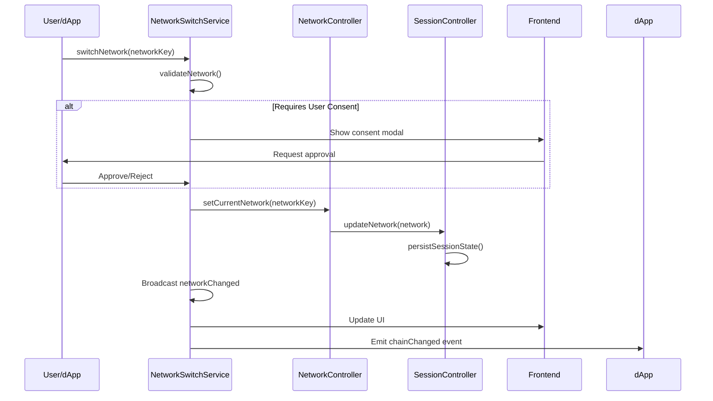

# SuperSafe Wallet - Blockchain Operations

**Created:** October 13, 2025  
**Version:** 3.0.0+  
**Status:** ✅ CURRENT

---

## Table of Contents

1. [Blockchain Overview](#blockchain-overview)
2. [Multi-Chain Support](#multi-chain-support)
3. [Network Architecture](#network-architecture)
4. [Transaction Management](#transaction-management)
5. [Smart Contract Interactions](#smart-contract-interactions)
6. [Provider Implementation](#provider-implementation)

---

## Blockchain Overview

SuperSafe Wallet provides comprehensive blockchain operations across multiple EVM-compatible networks (currently 2 active: SuperSeed & Optimism), implementing EIP-1193 provider specification with ethers.js v6 integration.

### Supported Operations

- **✅ Account Management**: Create, import, switch wallets
- **✅ Balance Queries**: Native & ERC20 token balances
- **✅ Transaction Signing**: eth_sendTransaction, personal_sign, eth_signTypedData
- **✅ Contract Interactions**: ERC20, ERC721, custom contracts
- **✅ Gas Estimation**: Dynamic fee calculation
- **✅ Network Switching**: Multi-chain support with consent

---

## Multi-Chain Support

### Active Networks (2)

| Network | Chain ID | RPC | Swap Support | Status |
|---------|----------|-----|--------------|--------|
| **SuperSeed** | 5330 | https://mainnet.superseed.xyz | ✅ Bebop (JAM) | ✅ Active |
| **Optimism** | 10 | Alchemy RPC | ✅ Bebop (JAM+RFQ) | ✅ Active |

### Planned Networks (5)

| Network | Chain ID | Swap Support | Status |
|---------|----------|--------------|--------|
| **Ethereum** | 1 | ✅ Bebop (JAM+RFQ) | 💤 Commented |
| **Base** | 8453 | ✅ Bebop (JAM+RFQ) | 💤 Commented |
| **BNB Chain** | 56 | ✅ Bebop (JAM+RFQ) | 💤 Commented |
| **Ethereum Sepolia** | 11155111 | ❌ Testnet | 💤 Commented |
| **SuperSeed Sepolia** | 53302 | ❌ Testnet | 💤 Commented |

### Network Configuration

**Location:** `src/utils/networks.js`

```javascript
export const NETWORKS = {
  superseed: {
    networkKey: 'superseed',
    name: "SuperSeed",
    chainId: 5330,
    rpcUrl: "https://mainnet.superseed.xyz",
    currency: "ETH",
    explorer: "https://explorer.superseed.xyz",
    nativeCurrency: {
      name: "Ethereum",
      symbol: "ETH",
      decimals: 18
    },
    bebop: {
      bebopName: 'superseed',
      swapEnabled: true,
      jamApi: 'https://api.bebop.xyz/jam/superseed/v2/'
    }
  },
  // ... other networks
};
```

---

## Network Architecture

### Network Switching Flow



### Network Switch Service

**Location:** `src/services/NetworkSwitchService.js`

```javascript
export class NetworkSwitchService {
  async switchNetwork(networkKey, context, metadata = {}) {
    console.log('[NetworkSwitch] Switching to:', networkKey);
    
    // 1. Validate network
    const network = NETWORKS[networkKey];
    if (!network) {
      throw new Error('Network not supported');
    }
    
    // 2. Check if consent required
    if (context === 'dapp_request' && this.requiresUserConsent(networkKey)) {
      const approved = await this.requestUserConsent(networkKey);
      if (!approved) {
        throw new Error('User rejected network switch');
      }
    }
    
    // 3. Update session controller
    await this.sessionController.switchNetwork(networkKey);
    
    // 4. Update controllers
    await this.networkController.setCurrentNetwork(networkKey);
    
    // 5. Broadcast events
    this.broadcastNetworkChange(network);
    
    return { success: true, network };
  }
}
```

---

## Transaction Management

### Transaction Lifecycle

```
┌──────────────┐
│   Pending    │ ← Transaction created
└──────┬───────┘
       │ Broadcast to network
       ↓
┌──────────────┐
│   Submitted  │ ← TX hash received
└──────┬───────┘
       │ Mining
       ↓
┌──────────────┐
│  Confirmed   │ ← Block confirmation
└──────┬───────┘
       │ Final
       ↓
┌──────────────┐
│   Finalized  │ ← Irreversible
└──────────────┘
```

### Send Transaction

**Location:** `src/background/handlers/walletHandlers.js`

```javascript
export async function sendTransaction(txRequest, privateKey, provider) {
  // 1. Create wallet
  const wallet = new ethers.Wallet(privateKey, provider);
  
  // 2. Estimate gas
  if (!txRequest.gasLimit) {
    txRequest.gasLimit = await wallet.estimateGas(txRequest);
  }
  
  // 3. Get fee data (EIP-1559 or legacy)
  if (!txRequest.maxFeePerGas) {
    const feeData = await provider.getFeeData();
    if (feeData.maxFeePerGas) {
      // EIP-1559
      txRequest.maxFeePerGas = feeData.maxFeePerGas;
      txRequest.maxPriorityFeePerGas = feeData.maxPriorityFeePerGas;
    } else {
      // Legacy
      txRequest.gasPrice = feeData.gasPrice;
    }
  }
  
  // 4. Send transaction
  const tx = await wallet.sendTransaction(txRequest);
  
  // 5. Store in history
  await transactionController.addTransaction({
    hash: tx.hash,
    from: tx.from,
    to: tx.to,
    value: tx.value.toString(),
    timestamp: Date.now(),
    status: 'submitted'
  });
  
  return tx;
}
```

---

## Smart Contract Interactions

### ERC20 Token Operations

```javascript
// Location: src/background/handlers/contractHandlers.js

const ERC20_ABI = [
  'function balanceOf(address) view returns (uint256)',
  'function transfer(address to, uint256 amount) returns (bool)',
  'function approve(address spender, uint256 amount) returns (bool)',
  'function allowance(address owner, address spender) view returns (uint256)'
];

export async function getERC20Balance(tokenAddress, walletAddress, provider) {
  const contract = new ethers.Contract(tokenAddress, ERC20_ABI, provider);
  const balance = await contract.balanceOf(walletAddress);
  return balance.toString();
}

export async function approveERC20(tokenAddress, spenderAddress, amount, privateKey, provider) {
  const wallet = new ethers.Wallet(privateKey, provider);
  const contract = new ethers.Contract(tokenAddress, ERC20_ABI, wallet);
  
  const tx = await contract.approve(spenderAddress, amount);
  await tx.wait();
  
  return tx.hash;
}
```

---

## Provider Implementation

### EIP-1193 Provider

**Location:** `src/utils/provider.js`

```javascript
function createSuperSafeProvider(policy = null) {
  const provider = {
    isMetaMask: true,  // MetaMask compatibility
    isSuperSafe: true,
    
    // EIP-1193 request method
    request: async ({ method, params }) => {
      console.log('[Provider] Request:', method);
      
      switch (method) {
        case 'eth_requestAccounts':
          return await requestAccounts();
          
        case 'eth_accounts':
          return await getAccounts();
          
        case 'eth_chainId':
          return await getChainId();
          
        case 'eth_sendTransaction':
          return await sendTransaction(params[0]);
          
        case 'personal_sign':
          return await personalSign(params[0], params[1]);
          
        case 'eth_signTypedData_v4':
          return await signTypedData(params[0], params[1]);
          
        case 'wallet_switchEthereumChain':
          return await switchChain(params[0].chainId);
          
        default:
          throw new Error(`Method ${method} not supported`);
      }
    },
    
    // Event emitter
    on: (event, handler) => {
      console.log('[Provider] Listener added:', event);
      eventEmitter.on(event, handler);
    },
    
    removeListener: (event, handler) => {
      eventEmitter.removeListener(event, handler);
    }
  };
  
  return provider;
}
```

### Provider Injection

**Location:** `src/content-script.js`

```javascript
// Inject provider into page
const injectProvider = () => {
  const script = document.createElement('script');
  script.src = chrome.runtime.getURL('provider.js');
  script.onload = () => {
    console.log('[Content Script] Provider injected');
    script.remove();
  };
  (document.head || document.documentElement).appendChild(script);
};

injectProvider();

// Forward messages between page and background
window.addEventListener('message', async (event) => {
  if (event.source !== window) return;
  if (!event.data.type || event.data.type !== 'SUPERSAFE_PROVIDER') return;
  
  // Forward to background
  const response = await chrome.runtime.sendMessage({
    type: 'PROVIDER_REQUEST',
    payload: event.data.payload
  });
  
  // Send response back to page
  window.postMessage({
    type: 'SUPERSAFE_PROVIDER_RESPONSE',
    id: event.data.id,
    response: response
  }, '*');
});
```

---

## Related Documentation

- [ARCHITECTURE.md](./ARCHITECTURE.md) - System architecture
- [BACKEND.md](./BACKEND.md) - Backend implementation
- [DAPP_CONNECTIONS.md](./DAPP_CONNECTIONS.md) - dApp integration
- [SECURITY.md](./SECURITY.md) - Security model

---

**Document Status:** ✅ Current as of October 13, 2025  
**Code Version:** v3.0.0+

