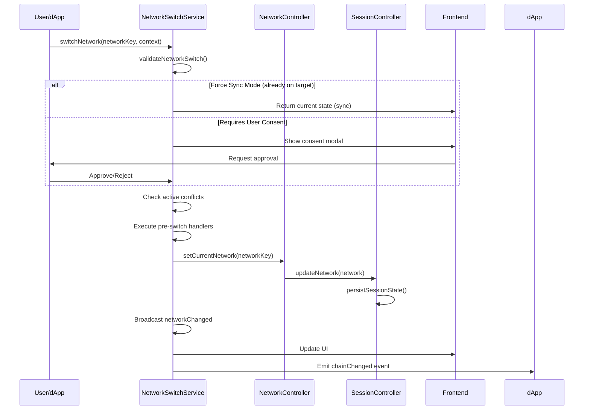

# SuperSafe Wallet - Blockchain Operations

**Created:** October 13, 2025  
**Last Updated:** November 15, 2025  
**Version:** 3.0.0+  
**Status:** ✅ CURRENT

---

## Table of Contents

1. [Blockchain Overview](#blockchain-overview)
2. [Multi-Chain Support](#multi-chain-support)
3. [Network Architecture](#network-architecture)
4. [Transaction Management](#transaction-management)
5. [Smart Contract Interactions](#smart-contract-interactions)
6. [Provider Implementation](#provider-implementation)

---

## Blockchain Overview

SuperSafe Wallet provides comprehensive blockchain operations across multiple EVM-compatible networks (currently **7 active networks**), implementing EIP-1193 and EIP-6963 provider specifications with ethers.js v6 integration.

### Supported Operations

- **✅ Account Management**: Create, import, switch wallets
- **✅ Balance Queries**: Native & ERC20 token balances
- **✅ Transaction Signing**: eth_sendTransaction, personal_sign, eth_signTypedData
- **✅ Contract Interactions**: ERC20, ERC721, custom contracts
- **✅ Gas Estimation**: Dynamic fee calculation (EIP-1559 and legacy)
- **✅ Network Switching**: Multi-chain support with consent
- **✅ Token Swaps**: Bebop JAM and RFQ integration
- **✅ Cross-Chain**: Relay.link integration for cross-chain operations

---

## Multi-Chain Support

### Active Networks (7)

| Network | Chain ID | RPC | Swap Support | Explorer API | Status |
|---------|----------|-----|--------------|--------------|--------|
| **SuperSeed** | 5330 | https://mainnet.superseed.xyz | ✅ Bebop (JAM) | Blockscout | ✅ Active |
| **Optimism** | 10 | Alchemy RPC | ✅ Bebop (JAM+RFQ) | Moralis | ✅ Active |
| **Ethereum** | 1 | Alchemy RPC | ✅ Bebop (JAM+RFQ) | Etherscan | ✅ Active |
| **Base** | 8453 | Base RPC | ✅ Bebop (JAM+RFQ) | Moralis | ✅ Active |
| **BNB Chain** | 56 | BSC RPC | ✅ Bebop (JAM+RFQ) | Moralis | ✅ Active |
| **Arbitrum One** | 42161 | Public RPC | ✅ Bebop (JAM+RFQ) | Arbiscan | ✅ Active |
| **Shardeum** | 8118 | Shardeum RPC | ❌ Not supported | Shardeum Explorer | ✅ Active |

### Inactive/Testnet Networks

| Network | Chain ID | Swap Support | Status |
|---------|----------|--------------|--------|
| **Ethereum Sepolia** | 11155111 | ❌ Testnet | 💤 Inactive |
| **SuperSeed Sepolia** | 53302 | ❌ Testnet | 💤 Inactive |
| **Injective** | 1776 | ❌ Not supported | 💤 Inactive |

**Notes:**
- Base, Optimism, BSC, Ethereum, and Arbitrum use Moralis API for balance and transaction history queries
- Base network includes curated token whitelist for enhanced security
- SuperSeed uses Blockscout API for transaction history
- All active networks support Relay.link cross-chain operations (except Shardeum)

### Network Configuration

**Location:** `src/utils/networks.js`

**Complete Network Structure:**

```javascript
export const NETWORKS = {
  superseed: {
    active: true,
    networkKey: 'superseed',
    name: "SuperSeed",
    chainId: 5330,
    rpcUrl: "https://mainnet.superseed.xyz",
    wsUrl: "wss://mainnet.superseed.xyz",
    currency: "ETH",
    explorer: "https://explorer.superseed.xyz",
    testnet: false,
    localLogoNetworkPath: "assets/networks/5330_network.png",
    nativeCurrency: {
      name: "Ethereum",
      symbol: "ETH",
      decimals: 18
    },
    networkToken: {
      name: "Superseed",
      symbol: "SUPR",
      decimals: 18,
      address: "0x4200000000000000000000000000000000000042"
    },
    networkStableToken: {
      name: "USDC",
      symbol: "USDC",
      decimals: 6,
      address: "0xC316C8252B5F2176d0135Ebb0999E99296998F2e"
    },
    supportBebopSwap: true,
    bebop: {
      bebopName: 'superseed',
      displayName: 'SuperSeed',
      apiSupport: ['JAM'], // JAM only (no RFQ)
      jamApi: 'https://api.bebop.xyz/jam/superseed/v2/',
      rfqApi: null,
      swapEnabled: true,
      contracts: {
        jamSettlement: "0xbeb0b0623f66bE8cE162EbDfA2ec543A522F4ea6",
        balanceManager: "0xC5a350853E4e36b73EB0C24aaA4b8816C9A3579a",
        permit2: "0x000000000022D473030F116dDEE9F6B43aC78BA3"
      }
    },
    relay: {
      enabled: true,
      relayChainId: 5330,
      displayName: 'SuperSeed',
      crossChainEnabled: true
    }
  },
  // ... other networks follow similar structure
};
```

**Key Configuration Fields:**

- `active`: Boolean flag indicating if network is enabled
- `networkToken`: Wrapped native token (WETH, WBNB, etc.)
- `networkStableToken`: Primary stablecoin (USDC, USDT)
- `bebop.apiSupport`: Array of supported Bebop APIs (`['JAM']` or `['JAM', 'RFQ']`)
- `relay`: Relay.link cross-chain configuration
- `localLogoNetworkPath`: Path to network logo asset

**Utility Functions:**

```javascript
// Get only active networks
export function getActiveNetworks() {
  return Object.fromEntries(
    Object.entries(NETWORKS).filter(([, network]) => network.active === true)
  );
}

// Check if network is active
export function isNetworkActive(networkKey) {
  return NETWORKS[networkKey]?.active === true;
}

// Get network key by chainId (strict validation, no fallbacks)
export function getNetworkKeyByChainId(chainId) {
  const targetChainId = parseInt(chainId, 10);
  for (const [networkKey, networkConfig] of Object.entries(NETWORKS)) {
    if (networkConfig.chainId === targetChainId) {
      return networkKey;
    }
  }
  throw new Error(`Unsupported chainId: ${chainId}`);
}
```

---

## Network Architecture

### Network Switching Flow


```mermaid
sequenceDiagram
    participant U as User/dApp
    participant NS as NetworkSwitchService
    participant NC as NetworkController
    participant SC as SessionController
    participant UI as Frontend

    U->>NS: switchNetwork(networkKey, context)
    NS->>NS: validateNetworkSwitch()
    
    alt Force Sync Mode (already on target)
        NS->>UI: Return current state (sync)
    else Requires User Consent
        NS->>UI: Show consent modal
        UI->>U: Request approval
        U->>NS: Approve/Reject
    end
    
    NS->>NS: Check active conflicts
    NS->>NS: Execute pre-switch handlers
    NS->>NC: setCurrentNetwork(networkKey)
    NC->>SC: updateNetwork(network)
    SC->>SC: persistSessionState()
    
    NS->>NS: Broadcast networkChanged
    NS->>UI: Update UI
    NS->>dApp: Emit chainChanged event
```

### Network Switch Service

**Location:** `src/services/NetworkSwitchService.js`

**Key Features:**
- ✅ Strict validation (no fallbacks)
- ✅ Force sync mode detection
- ✅ Pre-switch coordination handlers
- ✅ Conflict detection and resolution
- ✅ Switch history tracking
- ✅ Context-aware switching (manual, connection, dapp-requested)

**Implementation:**

```javascript
export class NetworkSwitchService {
  constructor(networkController, sessionController) {
    this.networkController = networkController;
    this.sessionController = sessionController;
    this.switchHistory = [];
  }

  async switchNetwork(targetNetworkKey, context = 'manual', options = {}) {
    const switchId = this.generateSwitchId(context);
    
    // 1. ✅ STRICT VALIDATION - No fallbacks allowed
    const validationResult = await this.validateNetworkSwitch(
      targetNetworkKey, 
      context, 
      options
    );
    
    if (!validationResult.valid && !validationResult.forceSyncMode) {
      throw new Error(`Network switch validation failed: ${validationResult.reason}`);
    }

    // 2. ✅ FORCE SYNC MODE - Backend already on target network
    if (validationResult.forceSyncMode) {
      return {
        success: true,
        networkKey: validationResult.currentNetworkKey,
        network: validationResult.currentNetwork,
        syncMode: true
      };
    }

    // 3. ✅ CHECK FOR ACTIVE CONFLICTS
    const conflictCheck = await this.checkActiveConflicts(targetNetworkKey, context);
    if (conflictCheck.hasConflict) {
      throw new Error(`Active conflict detected: ${conflictCheck.reason}`);
    }

    // 4. ✅ EXECUTE PRE-SWITCH HANDLERS
    await this.executePreSwitchHandlers(targetNetworkKey, context, options);

    // 5. ✅ UPDATE CONTROLLERS
    await this.networkController.switchNetwork(targetNetworkKey);
    await this.sessionController.switchNetwork(targetNetworkKey);

    // 6. ✅ BROADCAST EVENTS
    this.broadcastNetworkChange(network);

    // 7. ✅ RECORD HISTORY
    this.recordSwitchHistory(switchId, targetNetworkKey, context, result);

    return { success: true, network };
  }
}
```

**Context Types:**

- `manual`: User-initiated switching (AppHeader, Settings)
- `connection`: Connection-time network mismatch resolution
- `dapp-requested`: dApp-requested network switching via `wallet_switchEthereumChain`

---

## Transaction Management

### Transaction Lifecycle

```
┌──────────────┐
│   Pending    │ ← Transaction created
└──────┬───────┘
       │ Broadcast to network
       ↓
┌──────────────┐
│   Submitted  │ ← TX hash received
└──────┬───────┘
       │ Mining
       ↓
┌──────────────┐
│  Confirmed   │ ← Block confirmation
└──────┬───────┘
       │ Final
       ↓
┌──────────────┐
│   Finalized  │ ← Irreversible
└──────────────┘
```

### Send Transaction

**Location:** `src/background/handlers/walletHandlers.js`

**Features:**
- Automatic gas estimation
- EIP-1559 fee calculation (with legacy fallback)
- Transaction history storage
- Error handling and retry logic

```javascript
export async function sendTransaction(txRequest, privateKey, provider) {
  // 1. Create wallet
  const wallet = new ethers.Wallet(privateKey, provider);
  
  // 2. Estimate gas
  if (!txRequest.gasLimit) {
    txRequest.gasLimit = await wallet.estimateGas(txRequest);
  }
  
  // 3. Get fee data (EIP-1559 or legacy)
  if (!txRequest.maxFeePerGas) {
    const feeData = await provider.getFeeData();
    if (feeData.maxFeePerGas) {
      // EIP-1559
      txRequest.maxFeePerGas = feeData.maxFeePerGas;
      txRequest.maxPriorityFeePerGas = feeData.maxPriorityFeePerGas;
    } else {
      // Legacy
      txRequest.gasPrice = feeData.gasPrice;
    }
  }
  
  // 4. Send transaction
  const tx = await wallet.sendTransaction(txRequest);
  
  // 5. Store in history
  await transactionController.addTransaction({
    hash: tx.hash,
    from: tx.from,
    to: tx.to,
    value: tx.value.toString(),
    timestamp: Date.now(),
    status: 'submitted'
  });
  
  return tx;
}
```

---

## Smart Contract Interactions

### ERC20 Token Operations

**Location:** `src/utils/networks.js` (ERC20_ABI exported)

**Complete ERC20 ABI:**

```javascript
export const ERC20_ABI = [
  // Read-only functions
  "function name() view returns (string)",
  "function symbol() view returns (string)",
  "function decimals() view returns (uint8)",
  "function balanceOf(address) view returns (uint256)",
  "function totalSupply() view returns (uint256)",
  "function allowance(address owner, address spender) view returns (uint256)",
  // Write functions
  "function transfer(address to, uint amount) returns (bool)",
  "function approve(address spender, uint amount) returns (bool)",
  // Events
  "event Transfer(address indexed from, address indexed to, uint amount)",
  "event Approval(address indexed owner, address indexed spender, uint amount)"
];
```

**Usage Example:**

```javascript
// Get ERC20 balance
export async function getERC20Balance(tokenAddress, walletAddress, provider) {
  const contract = new ethers.Contract(tokenAddress, ERC20_ABI, provider);
  const balance = await contract.balanceOf(walletAddress);
  return balance.toString();
}

// Approve ERC20 spending
export async function approveERC20(tokenAddress, spenderAddress, amount, privateKey, provider) {
  const wallet = new ethers.Wallet(privateKey, provider);
  const contract = new ethers.Contract(tokenAddress, ERC20_ABI, wallet);
  
  const tx = await contract.approve(spenderAddress, amount);
  await tx.wait();
  
  return tx.hash;
}
```

---

## Provider Implementation

### EIP-1193 & EIP-6963 Provider

**Location:** `src/utils/provider.js`

**Key Features:**
- ✅ EIP-1193 standard compliance
- ✅ EIP-6963 provider discovery (RainbowKit, Wagmi compatibility)
- ✅ Policy-based injection (AllowList security)
- ✅ Event deduplication
- ✅ Account caching for performance
- ✅ MetaMask compatibility flags

**Provider Creation:**

```javascript
function createSuperSafeProvider(policy = null) {
  const provider = {
    isMetaMask: true,  // MetaMask compatibility
    isSuperSafe: true,
    
    // EIP-1193 request method
    request: async ({ method, params }) => {
      logger.debug('[Provider] Request:', method);
      
      switch (method) {
        case 'eth_requestAccounts':
          return await requestAccounts();
          
        case 'eth_accounts':
          return await getAccounts();
          
        case 'eth_chainId':
          return await getChainId();
          
        case 'eth_sendTransaction':
          return await sendTransaction(params[0]);
          
        case 'personal_sign':
          return await personalSign(params[0], params[1]);
          
        case 'eth_signTypedData_v4':
          return await signTypedData(params[0], params[1]);
          
        case 'wallet_switchEthereumChain':
          return await switchChain(params[0].chainId);
          
        default:
          throw new Error(`Method ${method} not supported`);
      }
    },
    
    // Event emitter (EIP-1193)
    on: (event, handler) => {
      logger.debug('[Provider] Listener added:', event);
      eventEmitter.on(event, handler);
    },
    
    removeListener: (event, handler) => {
      eventEmitter.removeListener(event, handler);
    }
  };
  
  return provider;
}
```

### EIP-6963 Provider Discovery

**Implementation:**

```javascript
// Announce provider via EIP-6963
window.dispatchEvent(new CustomEvent('eip6963:announceProvider', {
  detail: {
    info: {
      uuid: 'super-safe-wallet',
      name: 'SuperSafe',
      icon: 'data:image/svg+xml;base64,...',
      rdns: 'cool.supersafe'
    },
    provider: createSuperSafeProvider(policy)
  }
}));

// Listen for provider requests
window.addEventListener('eip6963:requestProvider', () => {
  window.dispatchEvent(new CustomEvent('eip6963:announceProvider', {
    detail: { info, provider }
  }));
});
```

### Provider Injection

**Location:** `src/content-script.js`

**Injection Flow:**

1. **Policy Injection**: Content script injects policy into DOM
2. **Provider Script**: Injects `provider.js` script tag
3. **Policy Reading**: Provider reads policy from DOM element
4. **Provider Creation**: Creates provider instance with policy
5. **Window Exposure**: Exposes `window.ethereum` and EIP-6963 provider

**Implementation:**

```javascript
// Content script: Inject policy into DOM
const policyElement = document.createElement('div');
policyElement.id = '__supersafe_policy';
policyElement.textContent = JSON.stringify(policy);
document.documentElement.appendChild(policyElement);

// Inject provider script
const script = document.createElement('script');
script.src = chrome.runtime.getURL('provider.js');
script.onload = () => script.remove();
(document.head || document.documentElement).appendChild(script);

// Provider script: Read policy and create provider
function injectSuperSafeProvider() {
  const policyElement = document.getElementById('__supersafe_policy');
  const policy = JSON.parse(policyElement.textContent);
  
  // Create singleton provider
  if (!window.__supersafeProvider) {
    window.__supersafeProvider = createSuperSafeProvider(policy);
  }
  
  // Expose as window.ethereum
  window.ethereum = window.__supersafeProvider;
  
  // Announce via EIP-6963
  announceProvider(policy);
}
```

**Event Forwarding:**

```javascript
// Content script forwards EIP-1193 events to page
window.addEventListener('message', (event) => {
  if (event.data?.type === 'EIP1193_EVENT' && event.data?.__supersafe) {
    // Forward to page provider
    window.postMessage({
      __supersafe: true,
      type: 'EIP1193_EVENT',
      event: event.data.event,
      payload: event.data.payload
    }, '*');
  }
});
```

---

## Related Documentation

- [ARCHITECTURE.md](./ARCHITECTURE.md) - System architecture
- [BACKEND.md](./BACKEND.md) - Backend implementation
- [DAPP_CONNECTIONS.md](./DAPP_CONNECTIONS.md) - dApp integration
- [SECURITY.md](./SECURITY.md) - Security model
- [SWAP_SYSTEM.md](./SWAP_SYSTEM.md) - Bebop swap integration
- [NETWORK_SWITCHING.md](./NETWORK_SWITCHING.md) - Network switching details

---

**Document Status:** ✅ Current as of November 15, 2025  
**Code Version:** v3.0.0+
