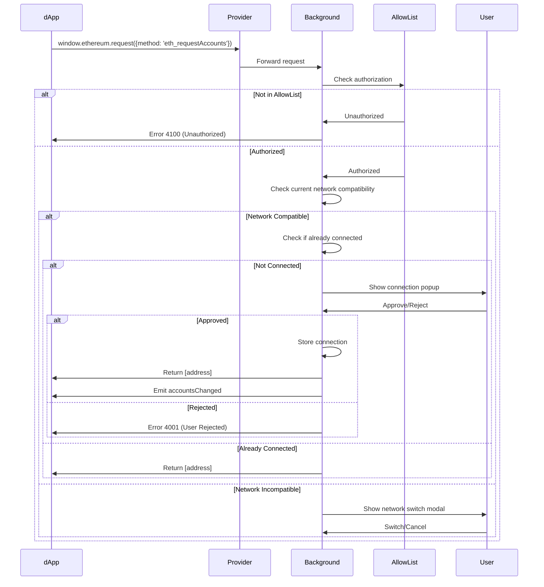
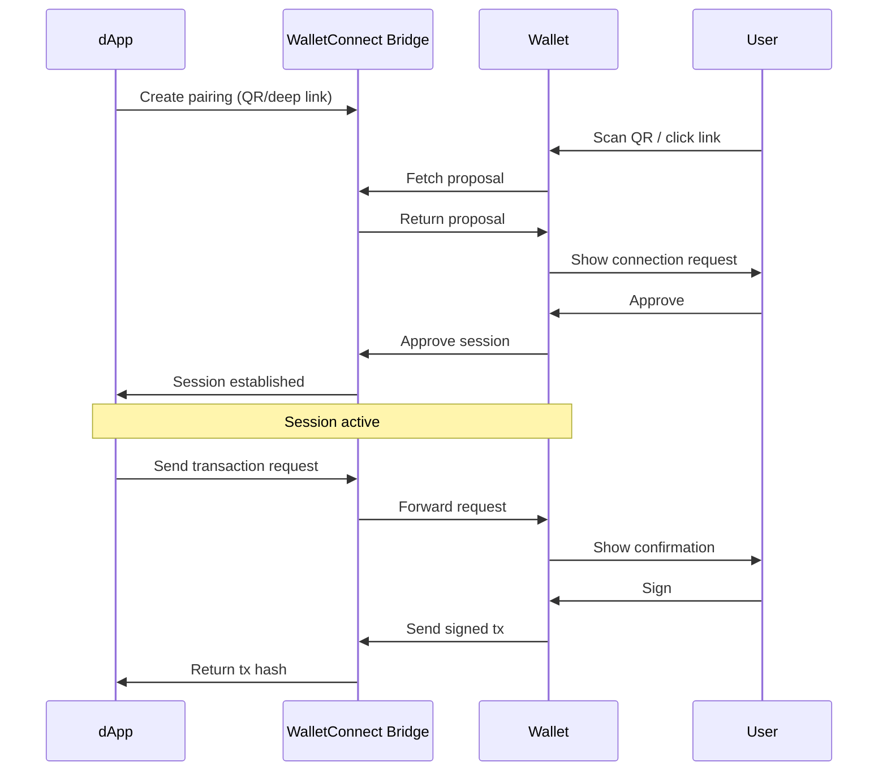

# SuperSafe Wallet - dApp Connections

**Created:** October 13, 2025  
**Version:** 3.0.0+  
**Status:** ✅ CURRENT

---

## Table of Contents

1. [Connection Overview](#connection-overview)
2. [Smart Native Connection](#smart-native-connection)
3. [AllowList System](#allowlist-system)
4. [Connection Mechanisms](#connection-mechanisms)
5. [WalletConnect V2](#walletconnect-v2)
6. [Framework Detection](#framework-detection)

---

## Connection Overview

SuperSafe Wallet implements **Smart Native Connection Architecture** supporting multiple dApp connection methods: direct injection (RainbowKit, Wagmi), WalletConnect v2/Reown, and Dynamic framework.

### Supported Connection Methods

- **✅ Direct Injection**: window.ethereum EIP-1193 provider
- **✅ WalletConnect V2**: Reown WalletKit integration
- **✅ RainbowKit**: Full compatibility
- **✅ Dynamic**: Framework detection and adaptation
- **✅ Wagmi**: React hooks compatibility

---

## Smart Native Connection

### Architecture Principles

1. **Real ChainIds Only**: No fake chainIds or compatibility hacks
2. **Network-First**: Respect dApp's supported chains
3. **User Consent**: Always ask permission for network changes
4. **Automatic Detection**: Identify dApp framework automatically
5. **Graceful Disconnection**: Auto-disconnect on unsupported networks

### Connection Flow



---

## AllowList System

### Purpose

The AllowList system provides whitelist-based authorization for trusted dApps, preventing phishing and malicious connections.

### AllowList Structure

**Location:** `public/assets/allowlist.json`

```json
{
  "version": "1.0.0",
  "policies": {
    "https://velodrome.finance": {
      "name": "Velodrome Finance",
      "supportedChains": [10, 5330],
      "defaultChain": 10,
      "autoApprove": false,
      "requiresConsent": true,
      "framework": "rainbowkit"
    },
    "https://app.uniswap.org": {
      "name": "Uniswap",
      "supportedChains": [1, 10, 42161, 8453, 137],
      "defaultChain": 1,
      "autoApprove": false,
      "framework": "web3-react"
    }
  }
}
```

### Policy Enforcement

**Location:** `src/background/policy/AllowListManager.js`

```javascript
export function getPolicyForOrigin(origin) {
  const policies = getAllowlistConfig().policies || {};
  
  // Exact match
  if (policies[origin]) {
    return policies[origin];
  }
  
  // Subdomain match
  for (const [policyOrigin, policy] of Object.entries(policies)) {
    if (origin.endsWith(policyOrigin.replace('https://', ''))) {
      return policy;
    }
  }
  
  return null;  // Unauthorized
}

export function validateNetworkCompatibility(policy, currentChainId) {
  if (!policy || !policy.supportedChains) {
    return { compatible: false, reason: 'No policy' };
  }
  
  if (!policy.supportedChains.includes(currentChainId)) {
    return {
      compatible: false,
      reason: `Current network (${currentChainId}) not supported by dApp`,
      supportedChains: policy.supportedChains
    };
  }
  
  return { compatible: true };
}
```

---

## Connection Mechanisms

### Direct Injection (RainbowKit/Wagmi)

**Provider Injection:**

```javascript
// Location: src/utils/provider.js
function injectProvider() {
  // Create EIP-1193 provider
  const provider = {
    isMetaMask: true,
    isSuperSafe: true,
    
    request: async ({ method, params }) => {
      // Route to background
      return await sendToBackground(method, params);
    },
    
    on: (event, handler) => {
      eventEmitter.on(event, handler);
    },
    
    removeListener: (event, handler) => {
      eventEmitter.removeListener(event, handler);
    }
  };
  
  // Inject into window
  window.ethereum = provider;
  
  // Announce to dApp
  window.dispatchEvent(new Event('ethereum#initialized'));
}
```

### Connection Request Handling

**Location:** `src/background/handlers/streams/ProviderStreamHandler.js`

```javascript
case 'ETH_REQUEST_ACCOUNTS': {
  const origin = message.origin;
  
  // 1. Check allowlist
  const policy = getPolicyForOrigin(origin);
  if (!policy) {
    return rpcError(4100, 'Origin not authorized');
  }
  
  // 2. Check if already connected
  const existingConnection = backgroundSessionController.connectedSites.get(origin);
  if (existingConnection) {
    return rpcSuccess(existingConnection.accounts);
  }
  
  // 3. Check network compatibility
  const currentNetwork = backgroundControllers.networkController.getCurrentNetwork();
  const networkCheck = validateNetworkCompatibility(policy, currentNetwork.chainId);
  
  if (!networkCheck.compatible) {
    // Show network switch modal
    return await handleNetworkMismatch(origin, policy, currentNetwork);
  }
  
  // 4. Show connection popup
  const popupId = await popupManager.openPopup('connection', {
    origin: origin,
    dAppName: policy.name,
    supportedChains: policy.supportedChains
  });
  
  // 5. Wait for user decision
  const decision = await waitForUserDecision(popupId);
  
  if (decision.approved) {
    // Store connection
    await backgroundSessionController.connectSite(
      origin,
      [currentWallet.address],
      tabId,
      currentWallet,
      policy
    );
    
    // Emit events
    eip1193EventsManager.emitAccountsChanged(origin, [currentWallet.address]);
    
    return rpcSuccess([currentWallet.address]);
  } else {
    return rpcError(4001, 'User rejected request');
  }
}
```

---

## WalletConnect V2

### Architecture

SuperSafe implements WalletConnect v2 using Reown's WalletKit SDK.

**Location:** `src/utils/walletConnectManager.js`

```javascript
class WalletConnectManager {
  async initialize(projectId, metadata) {
    const { WalletKit } = await import('@reown/walletkit');
    
    this.walletKit = await WalletKit.init({
      projectId: projectId,
      metadata: {
        name: 'SuperSafe Wallet',
        description: 'Modern Ethereum Wallet',
        url: 'https://supersafe.xyz',
        icons: ['https://supersafe.xyz/icon.png']
      }
    });
    
    this.setupEventListeners();
  }
  
  setupEventListeners() {
    // Session proposal (connection request)
    this.walletKit.on('session_proposal', async (proposal) => {
      console.log('[WC] Session proposal:', proposal);
      
      // Validate networks
      const requestedChains = proposal.params.requiredNamespaces.eip155.chains;
      const currentChainId = `eip155:${getCurrentNetwork().chainId}`;
      
      if (!requestedChains.includes(currentChainId)) {
        // Show network switch or reject
        await this.handleNetworkMismatch(proposal, requestedChains);
        return;
      }
      
      // Show connection popup
      await this.showConnectionPopup(proposal);
    });
    
    // Session request (sign/send tx)
    this.walletKit.on('session_request', async (request) => {
      console.log('[WC] Session request:', request);
      await this.handleSessionRequest(request);
    });
  }
  
  async approveSession(proposal, accounts) {
    const session = await this.walletKit.approveSession({
      id: proposal.id,
      namespaces: {
        eip155: {
          accounts: accounts.map(addr => `eip155:${getCurrentChainId()}:${addr}`),
          methods: [
            'eth_sendTransaction',
            'eth_signTransaction',
            'eth_sign',
            'personal_sign',
            'eth_signTypedData',
            'eth_signTypedData_v4'
          ],
          events: ['chainChanged', 'accountsChanged']
        }
      }
    });
    
    return session;
  }
}
```

### WalletConnect Flow



---

## Framework Detection

### Automatic Detection System

**Location:** `src/utils/dAppFrameworkDetector.js`

```javascript
export function detectDAppFramework(origin, injectedObjects = {}) {
  const detectionResults = {
    framework: 'unknown',
    confidence: 'low',
    indicators: []
  };
  
  // Check for RainbowKit
  if (injectedObjects.isRainbowKit || 
      window.location.href.includes('rainbow')) {
    detectionResults.framework = 'rainbowkit';
    detectionResults.confidence = 'high';
    detectionResults.indicators.push('RainbowKit detected');
  }
  
  // Check for Wagmi
  else if (injectedObjects.isWagmi) {
    detectionResults.framework = 'wagmi';
    detectionResults.confidence = 'high';
    detectionResults.indicators.push('Wagmi detected');
  }
  
  // Check for Dynamic
  else if (window.dynamic || injectedObjects.isDynamic) {
    detectionResults.framework = 'dynamic';
    detectionResults.confidence = 'high';
    detectionResults.indicators.push('Dynamic detected');
  }
  
  // Check for Web3-React
  else if (injectedObjects.isWeb3React) {
    detectionResults.framework = 'web3-react';
    detectionResults.confidence = 'medium';
  }
  
  return detectionResults;
}
```

### Framework-Specific Strategies

**Location:** `src/background/strategy/ConnectionStrategies.js`

```javascript
export function getConnectionStrategy(framework) {
  const strategies = {
    rainbowkit: {
      name: 'RainbowKit',
      requiresImmediateResponse: true,
      supportsAccountsChanged: true,
      supportsChainChanged: true,
      handshake: null  // Smart Native Connection
    },
    
    wagmi: {
      name: 'Wagmi',
      requiresImmediateResponse: true,
      supportsAccountsChanged: true,
      supportsChainChanged: true,
      handshake: null
    },
    
    walletconnect: {
      name: 'WalletConnect',
      requiresSession: true,
      supportsMultiChain: true,
      usesNamespaces: true
    }
  };
  
  return strategies[framework] || strategies.rainbowkit;
}
```

---

## Related Documentation

- [ARCHITECTURE.md](./ARCHITECTURE.md) - System architecture
- [BACKEND.md](./BACKEND.md) - Backend implementation
- [SECURITY.md](./SECURITY.md) - Security model
- [BLOCKCHAIN_OPERATIONS.md](./BLOCKCHAIN_OPERATIONS.md) - Blockchain operations

---

**Document Status:** ✅ Current as of October 13, 2025  
**Code Version:** v3.0.0+

