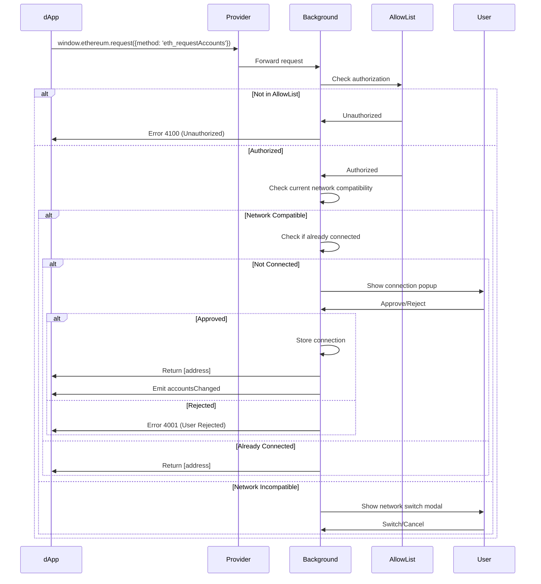
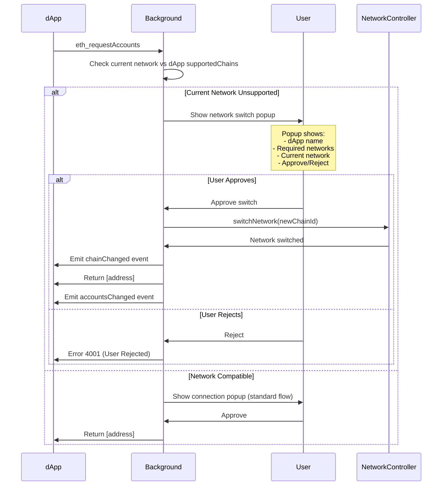
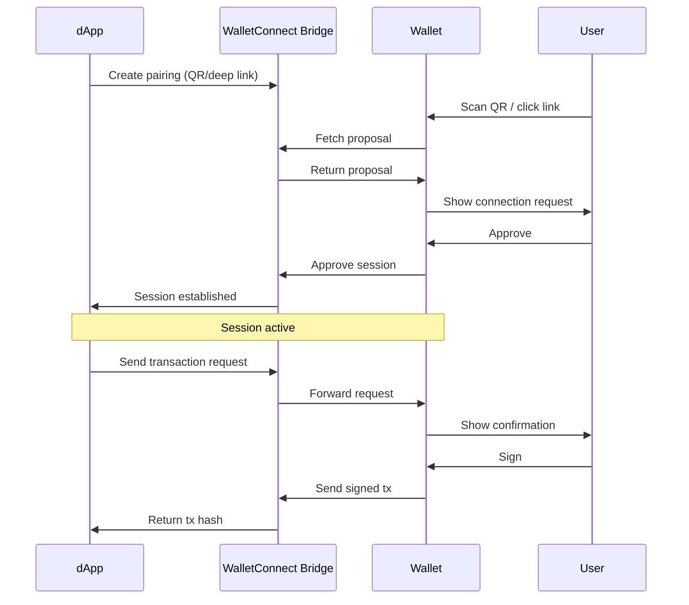
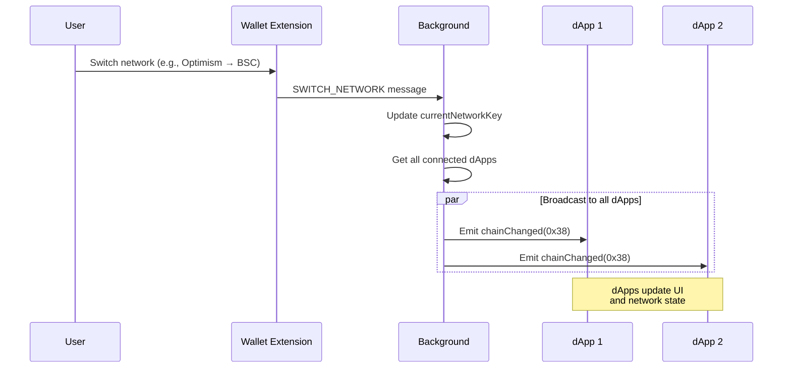
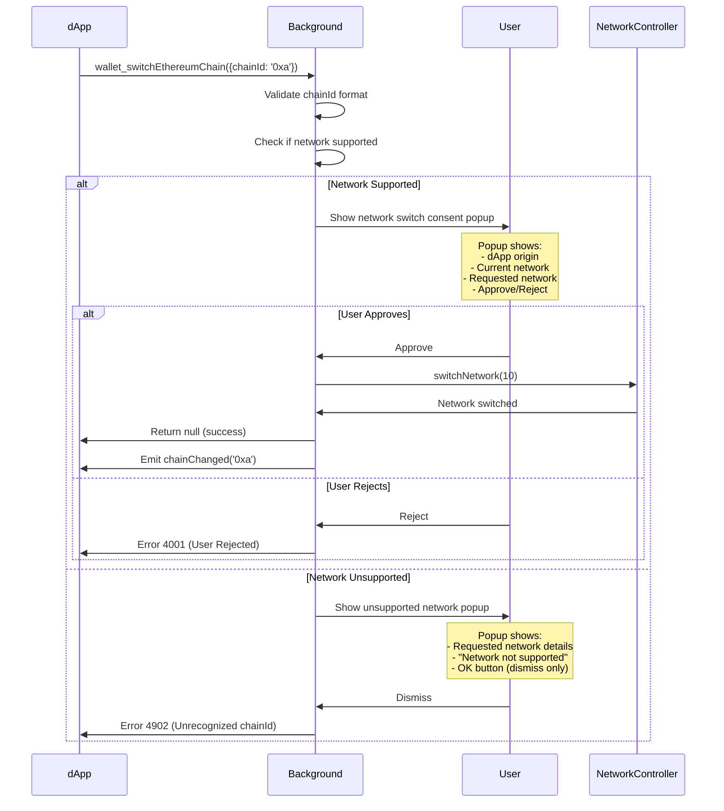
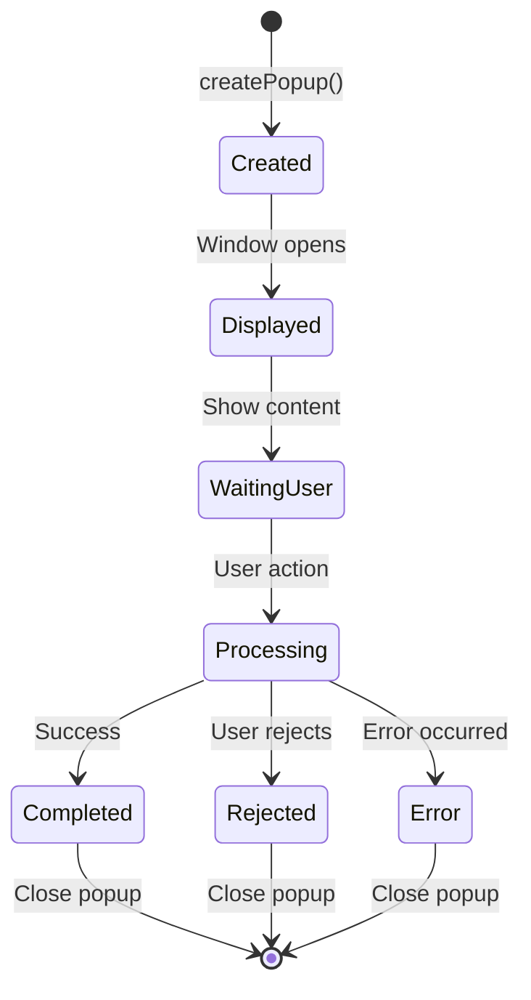

# SuperSafe Wallet - dApp Connections

**Created:** October 13, 2025  
**Last Updated:** February 9, 2026  
**Version:** 3.1.8  
**Status:** ✅ CURRENT  
**Last Code Update:** February 9, 2026

---

## Table of Contents

1. [Connection Overview](#connection-overview)
2. [Handshake Strategy](#handshake-strategy)
3. [Smart Native Connection](#smart-native-connection)
4. [AllowList System](#allowlist-system)
5. [Connection Mechanisms](#connection-mechanisms)
6. [WalletConnect V2](#walletconnect-v2)
7. [Network Management](#network-management)
8. [Popup Management](#popup-management)
9. [Error Handling](#error-handling)
10. [Framework Detection](#framework-detection)

---

## Connection Overview

SuperSafe Wallet implements **Hybrid EIP-6963/Legacy Coexistence** supporting multiple dApp connection methods: direct injection, WalletConnect v2/Reown, EIP-6963 provider discovery, and legacy browser wallet detection.

### Supported Connection Methods

- **✅ EIP-6963**: Provider discovery standard (RainbowKit, Wagmi, Dynamic compatibility)
- **✅ Legacy Injection**: window.ethereum for dApps without wallet selectors
- **✅ WalletConnect V2**: Reown WalletKit integration
- **✅ RainbowKit**: Full compatibility
- **✅ Dynamic**: Framework detection and adaptation
- **✅ Wagmi**: React hooks compatibility


SuperSafe supports **8 active networks** for dApp connections:
- SuperSeed (5330)
- Ethereum (1)
- Optimism (10)
- Base (8453)
- BNB Chain (56)
- Arbitrum One (42161)
- Monad (10143)
- Shardeum (8118)

---

## Handshake Strategy

**Version:** 3.1.7 (January 2026)  
**Status:** ✅ PRODUCTION

### Overview

SuperSafe implements a **hybrid coexistence strategy** to work alongside other wallets (MetaMask, Coinbase Wallet, Rabby). The behavior is controlled by the `handshake` field in the allowlist.

### Handshake Modes

| Mode | Behavior | Use Case |
|------|----------|----------|
| `eip6963` | Only announce via EIP-6963, don't touch `window.ethereum` | dApps with wallet selectors (RainbowKit, Dynamic) |
| `legacy` | Take control of `window.ethereum` | dApps without wallet selectors (Aerodrome, Velodrome) |

### EIP-6963 Mode

For dApps that support EIP-6963 provider discovery (modern wallet selectors):

```javascript
// SuperSafe behavior when handshake: "eip6963"
// ✅ Announce via EIP-6963 standard
window.dispatchEvent(new CustomEvent('eip6963:announceProvider', { detail: { ... } }));

// ✅ DO NOT touch window.ethereum
// MetaMask (or other wallet) remains as window.ethereum
// User can freely choose between wallets in dApp's selector
```

**dApps with this mode:**
- Bebop (uses RainbowKit)
- Uniswap (uses Dynamic/Wagmi)
- PancakeSwap (wallet selector)
- Relay Link (wallet selector)

### Legacy Mode

For dApps that only support `window.ethereum` detection ("Browser Wallet" button):

```javascript
// SuperSafe behavior when handshake: "legacy"
// Store reference to original provider
window.__supersafe_externalProvider = window.ethereum;

// ✅ Take control of window.ethereum
window.ethereum = superSafeProvider;

// ✅ Create providers array with both wallets
window.ethereum.providers = [superSafeProvider, window.__supersafe_externalProvider];
```

**dApps with this mode:**
- Aerodrome (no wallet selector)
- Velodrome (no wallet selector)
- SuperSeed Seeds (simple connection)
- SuperSeed Bridge (simple connection)

### Configuration

**Location:** `public/assets/allowlist.json`

```json
{
  "dapps": [
    {
      "origin": "https://bebop.xyz",
      "name": "Bebop Protocol",
      "handshake": "eip6963",  // User chooses wallet
      "supportedChains": [1, 10, 56, 5330, 8453, 42161]
    },
    {
      "origin": "https://aerodrome.finance",
      "name": "Aerodrome",
      "handshake": "legacy",   // SuperSafe is default
      "supportedChains": [8453]
    }
  ]
}
```

### Decision Matrix

| dApp Characteristic | Handshake Mode |
|---------------------|----------------|
| Has wallet selector (RainbowKit, Dynamic) | `eip6963` |
| Only "Connect Wallet" / "Browser Wallet" button | `legacy` |
| Uses EIP-6963 discovery | `eip6963` |
| Uses `window.ethereum` directly | `legacy` |
| Unknown dApp (not in allowlist) | Not injected |

### Implementation

**Location:** `src/utils/provider.js` (function `injectSuperSafeProvider`)

```javascript
// Read handshake strategy from policy (default to 'legacy')
const handshakeStrategy = policy?.handshake || 'legacy';

// ============================================================================
// EIP-6963 MODE: Only announce, don't touch window.ethereum
// ============================================================================
if (window.ethereum && handshakeStrategy === 'eip6963') {
  logger.debug('🎯 EIP-6963 MODE: Announcing only - user can choose wallet');
  
  // Store reference to external provider
  window.__supersafe_externalProvider = window.ethereum;
  
  // IMPORTANT: announceEIP6963Provider is called for discovery
  announceEIP6963Provider(superSafeProvider);
  
  return; // Exit without modifying window.ethereum
}

// ============================================================================
// LEGACY MODE: SuperSafe takes control of window.ethereum
// ============================================================================
if (window.ethereum && handshakeStrategy === 'legacy') {
  logger.debug('🎯 LEGACY MODE: SuperSafe takes control of window.ethereum');
  
  // Preserve existing provider
  window.__supersafe_externalProvider = window.ethereum;
  
  // Take control of window.ethereum
  window.ethereum = superSafeProvider;
  
  // Create providers array for compatibility (e.g., Dynamic, RainbowKit)
  const providersArray = [superSafeProvider, window.__supersafe_externalProvider];
  Object.defineProperty(window.ethereum, 'providers', {
    value: providersArray,
    writable: false,
    configurable: false
  });
}

// ============================================================================
// NO PROVIDER: Inject when window.ethereum is missing
// ============================================================================
if (!window.ethereum) {
  logger.debug('🎯 NO PROVIDER: Injecting SuperSafe as window.ethereum');
  
  window.ethereum = superSafeProvider;
  
  // Always announce via EIP-6963 as well
  announceEIP6963Provider(superSafeProvider);
}
```

### Benefits

- ✅ **MetaMask coexistence:** Both wallets work independently
- ✅ **No popup blocking:** Each wallet handles its own connection flow
- ✅ **User choice:** EIP-6963 dApps let user pick wallet
- ✅ **Legacy support:** Aerodrome/Velodrome still work with SuperSafe
- ✅ **Flexible configuration:** Per-dApp handshake mode

---

## Smart Native Connection


### Architecture Principles

1. **Real ChainIds Only**: No fake chainIds or compatibility hacks
2. **Network-First**: Respect dApp's supported chains
3. **User Consent**: Always ask permission for network changes
4. **Automatic Detection**: Identify dApp framework automatically
5. **Graceful Disconnection**: Auto-disconnect on unsupported networks

### Connection Flow


```mermaid
sequenceDiagram
    participant D as dApp
    participant P as Provider
    participant BG as Background
    participant AL as AllowList
    participant U as User

    D->>P: window.ethereum.request({method: 'eth_requestAccounts'})
    P->>BG: Forward request
    BG->>AL: Check authorization
    
    alt Not in AllowList
        AL->>BG: Unauthorized
        BG->>D: Error 4100 (Unauthorized)
    else Authorized
        AL->>BG: Authorized
        BG->>BG: Check current network compatibility
        
        alt Network Compatible
            BG->>BG: Check if already connected
            alt Not Connected
                BG->>U: Show connection popup
                U->>BG: Approve/Reject
                
                alt Approved
                    BG->>BG: Store connection
                    BG->>D: Return [address]
                    BG->>D: Emit accountsChanged
                else Rejected
                    BG->>D: Error 4001 (User Rejected)
                end
            else Already Connected
                BG->>D: Return [address]
            end
        else Network Incompatible
            BG->>U: Show network switch modal
            U->>BG: Switch/Cancel
        end
    end
```

### Connection with Network Switch

When a dApp requires a specific network, SuperSafe handles the connection and network switch atomically:


```mermaid
sequenceDiagram
    participant D as dApp
    participant BG as Background
    participant U as User
    participant N as NetworkController

    D->>BG: eth_requestAccounts
    BG->>BG: Check current network vs dApp supportedChains
    
    alt Current Network Unsupported
        BG->>U: Show network switch popup
        Note over U: Popup shows:<br/>- dApp name<br/>- Required networks<br/>- Current network<br/>- Approve/Reject
        
        alt User Approves
            U->>BG: Approve switch
            BG->>N: switchNetwork(newChainId)
            N->>BG: Network switched
            BG->>D: Emit chainChanged event
            BG->>D: Return [address]
            BG->>D: Emit accountsChanged event
        else User Rejects
            U->>BG: Reject
            BG->>D: Error 4001 (User Rejected)
        end
    else Network Compatible
        BG->>U: Show connection popup (standard flow)
        U->>BG: Approve
        BG->>D: Return [address]
    end
```

**Key Features:**
- **Atomic Operation**: Network switch + connection in single user action
- **Clear Communication**: User sees exactly why network switch is needed
- **Graceful Rejection**: Clear error if user declines
- **Event Ordering**: chainChanged always fires before accountsChanged

---

## Allowlist Security (Enhanced - Nov 2025)

### Overview

SuperSafe uses a strict allowlist to control which dApps can connect. This prevents phishing attacks and unauthorized access with enterprise-grade protection.

### Security Enhancements (v3.1)

**November 2025 Updates:**
1. ✅ Eliminated WalletConnect name-based fallback (CRITICAL vulnerability)
2. ✅ Added wildcard subdomain support (`*.domain.com`)
3. ✅ Implemented rate limiting (5 attempts/minute)
4. ✅ Added blocked attempts logging
5. ✅ Strict origin format validation

### Three-Layer Protection

**Layer 1: Provider Injection Gate**
- Content script checks allowlist before injecting provider
- Unauthorized origins never see `window.ethereum`
- Handler: `ProviderStreamHandler.js` (CS_CAN_INJECT)

**Layer 2: Connection Authorization**
- Validates origin on `eth_requestAccounts`
- Strict origin-only matching (no name fallbacks)
- Rate limiting integrated
- Handler: `ProviderStreamHandler.js` (ETH_REQUEST_ACCOUNTS)

**Layer 3: WalletConnect Validation**
- Origin-based validation for mobile connections
- URL normalization and validation
- No name-based fallbacks (security fix Nov 2025)
- Handler: `SessionStreamHandler.js`

### Allowlist Format

**Location:** `public/assets/allowlist.json`

```json
{
  "version": "3.1.0",
  "globalSettings": {
    "defaultChainIdHex": "0x14d2",
    "defaultChainIdDecimal": 5330,
    "unauthorizedOriginMessage": "This dApp is not authorized to connect to SuperSafe Wallet."
  },
  "dapps": [
    {
      "origin": "https://app.uniswap.org",
      "name": "Uniswap",
      "description": "Swap anything, anywhere",
      "supportedChains": [1, 10, 56, 8453, 42161],
      "defaultChain": 1
    },
    {
      "origin": "*.velodrome.finance",
      "name": "Velodrome (All Subdomains)",
      "description": "Superchain DEX with wildcard subdomain support",
      "supportedChains": [10, 5330],
      "defaultChain": 10
    }
  ]
}
```

### Wildcard Support

Authorize all subdomains without individual entries:

```json
{
  "origin": "*.uniswap.org",
  "name": "Uniswap (All Subdomains)",
  "supportedChains": [1, 10, 56, 8453, 42161]
}
```

**Matches:** `app.uniswap.org`, `interface.uniswap.org`, `v3.uniswap.org`  
**Does NOT match:** `fake-uniswap.org`, `uniswap.org.phishing.com`

### Rate Limiting

**Protection:** Prevents brute-force connection attempts

**Configuration:**
- 5 attempts per origin per minute
- 5-minute block on exceeding limit
- Automatic cleanup of old records
- Minimal UX impact on legitimate users

**Implementation:** `src/background/security/ConnectionRateLimiter.js`

**User Experience:**
- Attempts 1-5: Allowed with logging
- Attempt 6+: Blocked with "Too many connection attempts. Please try again in X seconds."
- Successful connection: Counter reset

### Monitoring

**Blocked Attempts Logging:**

View blocked attempts statistics:

```javascript
import { getBlockedAttemptsStats } from '../background/policy/AllowListManager';

const stats = await getBlockedAttemptsStats();
// {
//   totalOrigins: 15,
//   totalAttempts: 247,
//   recentAttempts: [...],  // Last 24h
//   topOffenders: [...]      // Top 10 by count
// }
```

**Data Collected:**
- Origin URL
- Timestamp
- Connection type (web/walletconnect)
- Attempt count
- dApp metadata

**Retention:** Last 100 attempts per origin (local only, privacy-preserving)

### Policy Enforcement

**Location:** `src/background/policy/AllowListManager.js`

**Key Functions:**

```javascript
// Check if origin is authorized (with wildcard support)
export function isOriginAllowed(origin) {
  // Direct match
  if (_ORIGIN_POLICIES.has(origin)) return true;
  
  // Wildcard subdomain match
  const url = new URL(origin);
  for (const [allowedOrigin] of _ORIGIN_POLICIES) {
    if (allowedOrigin.startsWith('*.')) {
      const wildcardDomain = allowedOrigin.slice(2);
      if (url.hostname.endsWith('.' + wildcardDomain)) {
        return true;
      }
    }
  }
  
  return false;
}

// Get policy for origin (with wildcard support + logging)
export function getPolicyForOrigin(origin) {
  let policy = _ORIGIN_POLICIES.get(origin);
  
  // Wildcard match if direct match fails
  if (!policy) {
    // ... wildcard matching logic ...
  }
  
  // Log blocked attempt if no policy found
  if (!policy) {
    logBlockedConnectionAttempt(origin, 'web').catch(() => {});
  }
  
  return policy;
}
```

### Security Properties

1. **No Name-Based Fallbacks** - Only origin matching
2. **Strict Format Validation** - URL normalization enforced
3. **Rate Limiting** - Prevents brute-force attacks
4. **Comprehensive Logging** - Full attack visibility
5. **Fail-Safe Default** - Empty allowlist on load failure

### Adding New dApps

**Process:**
1. Update `public/assets/allowlist.json`
2. Test locally (`npm run build:dev`)
3. Build for production (`npm run build`)
4. Submit to Chrome Web Store
5. Users auto-update within 24-48h

**No hot-reload needed** - Chrome Web Store handles distribution

### Security Audit

See [Allowlist Security Enhancements Audit](./Audits/2025-11-21_ALLOWLIST_SECURITY_ENHANCEMENTS.md) for complete security assessment.

---

## Connection Mechanisms

### Direct Injection (RainbowKit/Wagmi/EIP-6963)

**Provider Injection:**

SuperSafe supports both traditional `window.ethereum` injection and EIP-6963 provider discovery for maximum compatibility.

```javascript
// Location: src/utils/provider.js
function injectProvider() {
  // Create EIP-1193 provider
  const provider = {
    isMetaMask: true,
    isSuperSafe: true,
    
    request: async ({ method, params }) => {
      // Route to background
      return await sendToBackground(method, params);
    },
    
    on: (event, handler) => {
      eventEmitter.on(event, handler);
    },
    
    removeListener: (event, handler) => {
      eventEmitter.removeListener(event, handler);
    }
  };
  
  // Inject into window
  window.ethereum = provider;
  
  // Announce to dApp
  window.dispatchEvent(new Event('ethereum#initialized'));
  
  // EIP-6963 Provider Discovery
  announceProvider(provider);
}
```

### EIP-6963 Provider Discovery

**Purpose:** Standardized provider discovery mechanism for multi-wallet compatibility.

**Implementation:**

```javascript
// EIP-6963: Announce provider to dApps
function announceProvider(provider) {
  const detail = {
    info: {
      uuid: 'super-safe-wallet',
      name: 'SuperSafe',
      icon: 'data:image/svg+xml;base64,...',
      rdns: 'cool.supersafe'
    },
    provider: provider
  };
  
  // Announce provider
  window.dispatchEvent(new CustomEvent('eip6963:announceProvider', {
    detail: detail
  }));
  
  // Listen for provider requests
  window.addEventListener('eip6963:requestProvider', () => {
    window.dispatchEvent(new CustomEvent('eip6963:announceProvider', {
      detail: detail
    }));
  });
}
```

**Benefits:**
- ✅ RainbowKit/Wagmi automatic detection
- ✅ Multi-wallet coexistence
- ✅ Standardized discovery protocol
- ✅ Better dApp compatibility

### Connection Request Handling

**Location:** `src/background/handlers/streams/ProviderStreamHandler.js`

```javascript
case 'ETH_REQUEST_ACCOUNTS': {
  const origin = message.origin;
  
  // 1. Check allowlist
  const policy = getPolicyForOrigin(origin);
  if (!policy) {
    return rpcError(4100, 'Origin not authorized');
  }
  
  // 2. Check if already connected
  const existingConnection = backgroundSessionController.connectedSites.get(origin);
  if (existingConnection) {
    return rpcSuccess(existingConnection.accounts);
  }
  
  // 3. Check network compatibility
  const currentNetwork = backgroundControllers.networkController.getCurrentNetwork();
  const networkCheck = validateNetworkCompatibility(policy, currentNetwork.chainId);
  
  if (!networkCheck.compatible) {
    // Show network switch modal
    return await handleNetworkMismatch(origin, policy, currentNetwork);
  }
  
  // 4. Show connection popup
  const popupId = await popupManager.openPopup('connection', {
    origin: origin,
    dAppName: policy.name,
    supportedChains: policy.supportedChains
  });
  
  // 5. Wait for user decision
  const decision = await waitForUserDecision(popupId);
  
  if (decision.approved) {
    // Store connection
    await backgroundSessionController.connectSite(
      origin,
      [currentWallet.address],
      tabId,
      currentWallet,
      policy
    );
    
    // Emit events
    eip1193EventsManager.emitAccountsChanged(origin, [currentWallet.address]);
    
    return rpcSuccess([currentWallet.address]);
  } else {
    return rpcError(4001, 'User rejected request');
  }
}
```

---

## WalletConnect V2

### Architecture

SuperSafe implements WalletConnect v2 using Reown's WalletKit SDK.

**Location:** `src/utils/walletConnectManager.js`

```javascript
class WalletConnectManager {
  async initialize(projectId, metadata) {
    const { WalletKit } = await import('@reown/walletkit');
    
    this.walletKit = await WalletKit.init({
      projectId: projectId,
      metadata: {
        name: 'SuperSafe Wallet',
        description: 'Modern Ethereum Wallet',
        url: 'https://supersafe.xyz',
        icons: ['https://supersafe.xyz/icon.png']
      }
    });
    
    this.setupEventListeners();
  }
  
  setupEventListeners() {
    // Session proposal (connection request)
    this.walletKit.on('session_proposal', async (proposal) => {
      console.log('[WC] Session proposal:', proposal);
      
      // Validate networks
      const requestedChains = proposal.params.requiredNamespaces.eip155.chains;
      const currentChainId = `eip155:${getCurrentNetwork().chainId}`;
      
      if (!requestedChains.includes(currentChainId)) {
        // Show network switch or reject
        await this.handleNetworkMismatch(proposal, requestedChains);
        return;
      }
      
      // Show connection popup
      await this.showConnectionPopup(proposal);
    });
    
    // Session request (sign/send tx)
    this.walletKit.on('session_request', async (request) => {
      console.log('[WC] Session request:', request);
      await this.handleSessionRequest(request);
    });
  }
  
  async approveSession(proposal, accounts) {
    const session = await this.walletKit.approveSession({
      id: proposal.id,
      namespaces: {
        eip155: {
          accounts: accounts.map(addr => `eip155:${getCurrentChainId()}:${addr}`),
          methods: [
            'eth_sendTransaction',
            'eth_signTransaction',
            'eth_sign',
            'personal_sign',
            'eth_signTypedData',
            'eth_signTypedData_v4'
          ],
          events: ['chainChanged', 'accountsChanged']
        }
      }
    });
    
    return session;
  }
}
```

### WalletConnect Flow


```mermaid
sequenceDiagram
    participant D as dApp
    participant WC as WalletConnect Bridge
    participant W as Wallet
    participant U as User

    D->>WC: Create pairing (QR/deep link)
    U->>W: Scan QR / click link
    W->>WC: Fetch proposal
    WC->>W: Return proposal
    W->>U: Show connection request
    U->>W: Approve
    W->>WC: Approve session
    WC->>D: Session established
    
    Note over D,W: Session active
    
    D->>WC: Send transaction request
    WC->>W: Forward request
    W->>U: Show confirmation
    U->>W: Sign
    W->>WC: Send signed tx
    WC->>D: Return tx hash
```

---

## Network Management

SuperSafe implements bidirectional network switching, allowing both the wallet and dApps to initiate network changes with user consent.

### Wallet → dApp Network Switch

When user changes network in wallet extension:


```mermaid
sequenceDiagram
    participant U as User
    participant W as Wallet Extension
    participant BG as Background
    participant D1 as dApp 1
    participant D2 as dApp 2

    U->>W: Switch network (e.g., Optimism → BSC)
    W->>BG: SWITCH_NETWORK message
    BG->>BG: Update currentNetworkKey
    BG->>BG: Get all connected dApps
    
    par Broadcast to all dApps
        BG->>D1: Emit chainChanged(0x38)
        BG->>D2: Emit chainChanged(0x38)
    end
    
    Note over D1,D2: dApps update UI<br/>and network state
```

**Implementation:**
```javascript
// src/background/managers/NetworkSwitchService.js
async propagateNetworkChangeToConnectedDApps(newChainId) {
  const connectedSites = await getAllConnectedSites();
  
  for (const [origin, siteData] of connectedSites) {
    if (siteData.isConnected) {
      await eip1193EventsManager.notifyChainChanged(origin, newChainId);
    }
  }
}
```

### dApp → Wallet Network Switch

When dApp requests network change via `wallet_switchEthereumChain`:


```mermaid
sequenceDiagram
    participant D as dApp
    participant BG as Background
    participant U as User
    participant N as NetworkController

    D->>BG: wallet_switchEthereumChain({chainId: '0xa'})
    BG->>BG: Validate chainId format
    BG->>BG: Check if network supported
    
    alt Network Supported
        BG->>U: Show network switch consent popup
        Note over U: Popup shows:<br/>- dApp origin<br/>- Current network<br/>- Requested network<br/>- Approve/Reject
        
        alt User Approves
            U->>BG: Approve
            BG->>N: switchNetwork(10)
            N->>BG: Network switched
            BG->>D: Return null (success)
            BG->>D: Emit chainChanged('0xa')
        else User Rejects
            U->>BG: Reject
            BG->>D: Error 4001 (User Rejected)
        end
    else Network Unsupported
        BG->>U: Show unsupported network popup
        Note over U: Popup shows:<br/>- Requested network details<br/>- "Network not supported"<br/>- OK button (dismiss only)
        U->>BG: Dismiss
        BG->>D: Error 4902 (Unrecognized chainId)
    end
```

**Key Implementation Details:**

```javascript
// src/background/handlers/streams/ProviderStreamHandler.js
case 'WALLET_SWITCH_ETHEREUM_CHAIN': {
  const chainIdHex = message.data.params?.[0]?.chainId;
  const chainIdDecimal = parseInt(chainIdHex, 16);
  
  // Validate network is supported
  const networkKey = getNetworkKeyByChainId(chainIdDecimal);
  if (!networkKey) {
    // Show unsupported network popup
    await popupManager.createUnsupportedNetworkPopup(chainIdHex, origin);
    return { error: { code: 4902, message: 'Unrecognized chainId' } };
  }
  
  // Show network switch consent popup
  const approved = await popupManager.createNetworkSwitchPopup(
    origin, 
    chainIdDecimal
  );
  
  if (approved) {
    await networkController.switchNetwork(networkKey);
    return { success: true };
  } else {
    return { error: { code: 4001, message: 'User rejected' } };
  }
}
```

### Network Validation

**validateSigningNetwork()** ensures user never signs on unsupported network:

```javascript
// src/background/handlers/streams/ProviderStreamHandler.js
function validateSigningNetwork(chainId, supportedNetworks, origin) {
  if (!supportedNetworks || supportedNetworks.length === 0) {
    return; // No validation needed
  }
  
  const currentChainIdDecimal = parseInt(chainId, 16);
  
  if (!supportedNetworks.includes(currentChainIdDecimal)) {
    throw new Error(
      `Network mismatch: ${origin} supports [${supportedNetworks}], ` +
      `but wallet is on chain ${currentChainIdDecimal}`
    );
  }
}
```

**Usage:** Called before ALL signing operations (eth_sendTransaction, personal_sign, eth_signTypedData_v4)

### Unsupported Network Handling

When dApp requests a network SuperSafe doesn't support:

1. **Detect Unsupported Network**: Check chainId against supported networks list
2. **Show UnsupportedNetworkScreen**: Display clear error popup
3. **Provide Network Info**: Show requested chainId in hex and decimal
4. **Reject Request**: Return error 4902 (Unrecognized chainId)
5. **Allow Dismissal**: User can dismiss popup (no action taken)

**Benefits:**
- Clear communication to user about limitation
- Prevents silent failures
- Follows EIP-3326 standard
- Professional error messaging

---

## Popup Management

SuperSafe implements a sophisticated popup management system with mutual exclusion and priority-based handling.

### Popup Types

| Type | Priority | Purpose | Mutual Exclusion |
|------|----------|---------|------------------|
| **Personal Sign** | 1 | Sign personal messages | ✅ Always closes extension |
| **Typed Data** | 2 | Sign EIP-712 structured data | ✅ Always closes extension |
| **Transaction** | 3 | Confirm transactions | ✅ Always closes extension |
| **Network Switch** | 4 | Consent for network change | ✅ Always closes extension |
| **Unsupported Network** | 5 | Show unsupported network error | ✅ Always closes extension |
| **Connection** | 6 | Approve dApp connection | ✅ Always closes extension |
| **Unlock** | 7 | Unlock wallet | ✅ Always closes extension |

### Mutual Exclusion System

**Core Principle:** Extension UI and popup windows NEVER coexist (MetaMask-style UX)

**Implementation:**

```javascript
// src/background/managers/PopupManager.js
async createPopup(type, data) {
  // Check for existing popups
  const existingCheck = await this.checkAndFocusExistingPopups();
  
  if (existingCheck.shouldClose) {
    // Another popup exists, focus it instead
    return existingCheck.focusedPopup;
  }
  
  // Create new popup
  const popup = await chrome.windows.create({
    url: chrome.runtime.getURL(`index.html?screen=${type}`),
    type: 'popup',
    width: 375,
    height: 600
  });
  
  // Register popup
  this.activePopups.set(type, popup.id);
  
  return popup;
}
```

**Triple Verification:**

1. **Pre-render Check** (`main.jsx:66-83`)
   - Before React renders, check if window is popup
   - Check for other open popups
   - Close extension if popup exists

2. **Post-render Safety Net** (`App.jsx:58-81`)
   - After React renders, verify no coexistence
   - Emergency closure if popup detected

3. **Centralized Verification** (`PopupManager.checkAndFocusExistingPopups()`)
   - Single source of truth
   - Enforces priority system
   - Focuses highest priority popup

**User Experience:**
- User never sees multiple SuperSafe windows
- Clear focus on current action
- Prevents confusion and errors
- Professional wallet UX

### Popup Lifecycle


```mermaid
stateDiagram-v2
    [*] --> Created: createPopup()
    Created --> Displayed: Window opens
    Displayed --> WaitingUser: Show content
    WaitingUser --> Processing: User action
    Processing --> Completed: Success
    Processing --> Rejected: User rejects
    Processing --> Error: Error occurred
    Completed --> [*]: Close popup
    Rejected --> [*]: Close popup
    Error --> [*]: Close popup
```

**Cleanup on Close:**
- Remove from activePopups map
- Clear pending request data
- Update extension badge
- Notify background of result

---

## Error Handling

SuperSafe implements comprehensive error handling following EIP-1193 and EIP-1474 standards.

### EIP-1193 Error Codes

| Code | Name | Description | Use Case |
|------|------|-------------|----------|
| **4001** | User Rejected | User denied request | Connection/signing/tx rejection |
| **4100** | Unauthorized | dApp not authorized | Not in allowlist |
| **4200** | Unsupported Method | Method not supported | eth_sign (disabled) |
| **4900** | Disconnected | Provider disconnected | Stream closed |
| **4901** | Chain Disconnected | Chain not available | Network unavailable |
| **4902** | Unrecognized chainId | Network not supported | Unknown network requested |
| **-32700** | Parse Error | Invalid JSON | Malformed request |
| **-32600** | Invalid Request | Invalid RPC | Missing params |
| **-32601** | Method Not Found | Unknown method | Invalid method name |
| **-32602** | Invalid Params | Invalid parameters | Wrong param types |
| **-32603** | Internal Error | Internal error | Backend failure |

### Error Response Format

```javascript
{
  error: {
    code: 4001,
    message: "User rejected the request",
    data: {
      origin: "https://app.uniswap.org",
      method: "eth_sendTransaction",
      timestamp: 1698765432000
    }
  }
}
```

### Network Mismatch Errors

**Scenario:** dApp requires Optimism, user on BSC

```javascript
// Error returned to dApp
{
  error: {
    code: 4901,
    message: "Network mismatch: app.uniswap.org supports [10, 1], but wallet is on chain 56"
  }
}
```

**User Experience:**
1. Clear error message in popup
2. Shows current vs required networks
3. Offers to switch network (if supported)
4. Rejects request if user declines

### Recovery Mechanisms

**Automatic Reconnection:**
- Stream disconnection → Auto-reconnect on next request
- Service worker restart → Restore pending requests
- Popup crash → Recover from background state

**Request Recovery:**
```javascript
// src/background/managers/SigningRequestManager.js
recoverPendingRequests() {
  const pendingRequests = this.getAllPendingRequests();
  
  for (const request of pendingRequests) {
    if (request.isExpired()) {
      this.rejectRequest(request.id, 'Request expired');
    } else {
      // Re-create popup for pending request
      this.recreatePopup(request);
    }
  }
}
```

**Graceful Degradation:**
- Token metadata unavailable → Show address instead of symbol
- Transaction decode failed → Show raw data with warning
- Network validation failed → Reject with clear error

---

## Framework Detection

### Automatic Detection System

**Location:** `src/utils/dAppFrameworkDetector.js`

```javascript
export function detectDAppFramework(origin, injectedObjects = {}) {
  const detectionResults = {
    framework: 'unknown',
    confidence: 'low',
    indicators: []
  };
  
  // Check for RainbowKit
  if (injectedObjects.isRainbowKit || 
      window.location.href.includes('rainbow')) {
    detectionResults.framework = 'rainbowkit';
    detectionResults.confidence = 'high';
    detectionResults.indicators.push('RainbowKit detected');
  }
  
  // Check for Wagmi
  else if (injectedObjects.isWagmi) {
    detectionResults.framework = 'wagmi';
    detectionResults.confidence = 'high';
    detectionResults.indicators.push('Wagmi detected');
  }
  
  // Check for Dynamic
  else if (window.dynamic || injectedObjects.isDynamic) {
    detectionResults.framework = 'dynamic';
    detectionResults.confidence = 'high';
    detectionResults.indicators.push('Dynamic detected');
  }
  
  // Check for Web3-React
  else if (injectedObjects.isWeb3React) {
    detectionResults.framework = 'web3-react';
    detectionResults.confidence = 'medium';
  }
  
  return detectionResults;
}
```

### Framework-Specific Strategies

**Location:** `src/background/strategy/ConnectionStrategies.js`

```javascript
export function getConnectionStrategy(framework) {
  const strategies = {
    rainbowkit: {
      name: 'RainbowKit',
      requiresImmediateResponse: true,
      supportsAccountsChanged: true,
      supportsChainChanged: true,
      handshake: null  // Smart Native Connection
    },
    
    wagmi: {
      name: 'Wagmi',
      requiresImmediateResponse: true,
      supportsAccountsChanged: true,
      supportsChainChanged: true,
      handshake: null
    },
    
    walletconnect: {
      name: 'WalletConnect',
      requiresSession: true,
      supportsMultiChain: true,
      usesNamespaces: true
    }
  };
  
  return strategies[framework] || strategies.rainbowkit;
}
```

---

## Related Documentation

- [ARCHITECTURE.md](./ARCHITECTURE.md) - System architecture
- [BACKEND.md](./BACKEND.md) - Backend implementation
- [SECURITY.md](./SECURITY.md) - Security model
- [BLOCKCHAIN_OPERATIONS.md](./BLOCKCHAIN_OPERATIONS.md) - Blockchain operations

---

