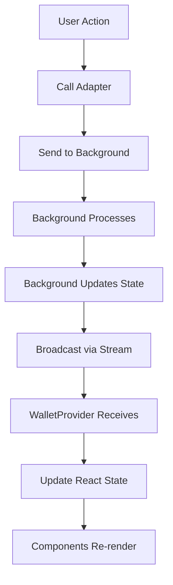

# SuperSafe Wallet - Frontend Architecture

**Created:** October 13, 2025  
**Version:** 3.0.0+  
**Status:** ✅ CURRENT

---

## Table of Contents

1. [Frontend Overview](#frontend-overview)
2. [React Application Structure](#react-application-structure)
3. [Component Hierarchy](#component-hierarchy)
4. [State Management](#state-management)
5. [Adapter Pattern](#adapter-pattern)
6. [Screen Flows](#screen-flows)
7. [Hooks Architecture](#hooks-architecture)

---

## Frontend Overview

SuperSafe Wallet's frontend implements a **Thin Client Pattern** where all business logic resides in the background service worker. The React application is purely presentational, communicating with the background via Chrome streams.

### Frontend Metrics

```
Total Frontend Files: 61 JSX components
Main App Component: 1,569 lines
Total Frontend Code: ~8,000 lines
Framework: React 18.2.0
Styling: TailwindCSS 3.3.3
Build Tool: Vite 6.3.6
```

### Key Principles

- **✅ Thin Client**: Zero business logic in frontend
- **✅ Stream Communication**: Long-lived connections to background
- **✅ Presentational Components**: Pure UI rendering
- **✅ Centralized State**: WalletProvider context
- **✅ Adapter Pattern**: Background communication abstraction

---

## React Application Structure

### App Component (1,569 lines)

**Location:** `src/App.jsx`

**Core Responsibilities:**
- Screen routing based on URL parameters
- Modal state management
- Connection request handling
- Transaction/signing confirmation
- Network switch consent

**Screen Routing:**
```javascript
// Mode detection from URL params
const urlParams = new URLSearchParams(window.location.search);
const mode = urlParams.get('mode');

// Route to appropriate screen
if (mode === 'connection') {
  return <ConnectionRequestScreen />;
} else if (mode === 'transaction') {
  return <TransactionConfirmationScreen />;
} else if (mode === 'signing') {
  return <SigningConfirmationScreen />;
} else if (isUnlocked) {
  return <Dashboard />;
} else {
  return <UnlockWalletModal />;
}
```

---

## Component Hierarchy

### Component Organization

```
src/components/
├── App.jsx                          # Main application
├── Dashboard.jsx                    # Portfolio view
├── Swap.jsx                         # Swap interface
├── Settings.jsx                     # Settings panel
├── Ecosystem.jsx                    # Ecosystem explorer
│
├── screens/                         # Full-screen views
│   ├── ConnectionRequestScreen.jsx
│   ├── TransactionConfirmationScreen.jsx
│   ├── SigningConfirmationScreen.jsx
│   ├── TypedDataConfirmationScreen.jsx
│   ├── NetworkSwitchConfirmationScreen.jsx
│   └── TransactionSuccessScreen.jsx
│
├── modals/                          # Modal dialogs
│   ├── UnlockWalletModal.jsx
│   ├── EditWalletModal.jsx
│   ├── NetworkConsentModal.jsx
│   ├── SignatureModal.jsx
│   └── LoadingModal.jsx
│
├── settings/                        # Settings sections
│   ├── SecuritySection.jsx
│   ├── WalletsSection.jsx
│   ├── NetworkSection.jsx
│   ├── TokensSection.jsx
│   └── WalletConnectSection.jsx
│
└── common/                          # Reusable components
    ├── Dashboard/
    │   ├── PortfolioBalanceSection.jsx
    │   ├── TokensList.jsx
    │   ├── NFTsSection.jsx
    │   └── TokenCardDark.jsx
    ├── TokenImage.jsx
    ├── TokenLogo.jsx
    └── NetworkIcon.jsx
```

---

## State Management

### WalletProvider Context

**Location:** `src/contexts/WalletProvider.jsx`

```javascript
const WalletContext = createContext();

export function WalletProvider({ children }) {
  // Session state from background
  const [isUnlocked, setIsUnlocked] = useState(false);
  const [wallets, setWallets] = useState([]);
  const [currentWallet, setCurrentWallet] = useState(null);
  const [network, setNetwork] = useState(null);
  const [supportsSwap, setSupportsSwap] = useState(false);
  
  // Initialize session stream
  useEffect(() => {
    const initializeSession = async () => {
      const sessionData = await FrontendSessionAdapter.getSessionState();
      
      setIsUnlocked(sessionData.isUnlocked);
      setWallets(sessionData.wallets);
      setCurrentWallet(sessionData.currentWallet);
      setNetwork(sessionData.currentNetwork);
      setSupportsSwap(sessionData.currentNetwork?.bebop?.swapEnabled);
    };
    
    initializeSession();
  }, []);
  
  return (
    <WalletContext.Provider value={{
      isUnlocked,
      wallets,
      currentWallet,
      network,
      supportsSwap,
      // ... methods
    }}>
      {children}
    </WalletContext.Provider>
  );
}
```

### State Flow



---

## Adapter Pattern

### Frontend Adapters

**Purpose:** Abstract background communication from components.

#### FrontendSessionAdapter

**Location:** `src/utils/FrontendSessionAdapter.js`

```javascript
class FrontendSessionAdapter {
  static async getSessionState() {
    return await StreamConnectionManager.sendRequest('session', {
      type: 'GET_SESSION_STATE'
    });
  }
  
  static async unlock(password) {
    return await StreamConnectionManager.sendRequest('session', {
      type: 'UNLOCK',
      payload: { password }
    });
  }
  
  static async createWallet(name, emoji) {
    return await StreamConnectionManager.sendRequest('session', {
      type: 'CREATE_WALLET',
      payload: { name, emoji }
    });
  }
  
  static async switchWallet(index) {
    return await StreamConnectionManager.sendRequest('session', {
      type: 'SWITCH_WALLET',
      payload: { index }
    });
  }
}
```

#### SwapAdapter

**Location:** `src/utils/SwapAdapter.js`

```javascript
class SwapAdapter {
  static async getSwapQuote(params) {
    return await StreamConnectionManager.sendRequest('swap', {
      type: 'SWAP_GET_QUOTE',
      payload: params
    });
  }
  
  static async signAndSubmitOrder(quote, takerAddress, networkKey) {
    return await StreamConnectionManager.sendRequest('swap', {
      type: 'SWAP_SIGN_AND_SUBMIT',
      payload: { quote, takerAddress, networkKey }
    });
  }
  
  static async checkOrderStatus(quoteId, networkKey) {
    return await StreamConnectionManager.sendRequest('swap', {
      type: 'SWAP_CHECK_STATUS',
      payload: { quoteId, networkKey }
    });
  }
}
```

---

## Screen Flows

### Dashboard Flow

```javascript
function Dashboard() {
  const { currentWallet, network, supportsSwap } = useWalletProvider();
  const [tokens, setTokens] = useState([]);
  const [nfts, setNFTs] = useState([]);
  
  // Load tokens on mount
  useEffect(() => {
    const loadTokens = async () => {
      const tokenList = await FrontendControllerAdapter.getTokens(
        network.networkKey,
        currentWallet.address
      );
      setTokens(tokenList);
    };
    
    loadTokens();
  }, [network, currentWallet]);
  
  return (
    <div>
      <AppHeader />
      <PortfolioBalanceSection balance={totalBalance} />
      <ActionButtonsRow 
        onSend={() => navigate('/send')}
        onReceive={() => setShowQR(true)}
        onSwap={() => navigate('/swap')}
        supportsSwap={supportsSwap}
      />
      <TokensList tokens={tokens} />
      <NFTsSection nfts={nfts} />
    </div>
  );
}
```

### Transaction Confirmation Flow

```javascript
function TransactionConfirmationScreen({ transaction, onApprove, onReject }) {
  const [decodedTx, setDecodedTx] = useState(null);
  const [gasEstimate, setGasEstimate] = useState(null);
  
  useEffect(() => {
    // Decode transaction
    const decode = async () => {
      const decoded = await FrontendControllerAdapter.decodeTransaction(transaction);
      setDecodedTx(decoded);
    };
    
    decode();
  }, [transaction]);
  
  return (
    <div className="confirmation-screen">
      <h2>Confirm Transaction</h2>
      
      <div className="transaction-details">
        <p>To: {transaction.to}</p>
        <p>Value: {ethers.formatEther(transaction.value)} ETH</p>
        <p>Function: {decodedTx?.functionName}</p>
        <p>Gas: {gasEstimate} ETH</p>
      </div>
      
      <div className="actions">
        <button onClick={onReject}>Reject</button>
        <button onClick={onApprove}>Confirm</button>
      </div>
    </div>
  );
}
```

---

## Hooks Architecture

### Custom Hooks

#### useSessionWallet

**Location:** `src/hooks/useSessionWallet.js`

```javascript
export function useSessionWallet() {
  const [sessionState, setSessionState] = useState(null);
  const [isLoading, setIsLoading] = useState(true);
  
  useEffect(() => {
    const initSession = async () => {
      try {
        const state = await FrontendSessionAdapter.getSessionState();
        setSessionState(state);
      } catch (error) {
        console.error('[useSessionWallet] Error:', error);
      } finally {
        setIsLoading(false);
      }
    };
    
    initSession();
    
    // Listen for session updates
    const unsubscribe = StreamConnectionManager.onStreamMessage('session', (message) => {
      if (message.type === 'SESSION_UPDATE') {
        setSessionState(message.data);
      }
    });
    
    return () => unsubscribe();
  }, []);
  
  return { sessionState, isLoading };
}
```

#### useSwapLogic

**Location:** `src/hooks/useSwapLogic.js`

```javascript
export function useSwapLogic(network, currentWallet) {
  const [quote, setQuote] = useState(null);
  const [isLoadingQuote, setIsLoadingQuote] = useState(false);
  
  const fetchQuote = useCallback(async (payToken, receiveToken, amount, slippage) => {
    setIsLoadingQuote(true);
    
    try {
      const quoteData = await SwapAdapter.getSwapQuote({
        sellToken: payToken,
        buyToken: receiveToken,
        sellAmount: amount,
        takerAddress: currentWallet.address,
        slippage: slippage,
        chain: { name: network.bebop.bebopName }
      });
      
      setQuote(quoteData);
    } catch (error) {
      console.error('[useSwapLogic] Error fetching quote:', error);
      setQuote(null);
    } finally {
      setIsLoadingQuote(false);
    }
  }, [network, currentWallet]);
  
  return { quote, fetchQuote, isLoadingQuote };
}
```

---

## Related Documentation

- [ARCHITECTURE.md](./ARCHITECTURE.md) - Overall system architecture
- [BACKEND.md](./BACKEND.md) - Backend implementation
- [DAPP_CONNECTIONS.md](./DAPP_CONNECTIONS.md) - dApp integration
- [SWAP_SYSTEM.md](./SWAP_SYSTEM.md) - Swap functionality

---

**Document Status:** ✅ Current as of October 13, 2025  
**Code Version:** v3.0.0+

