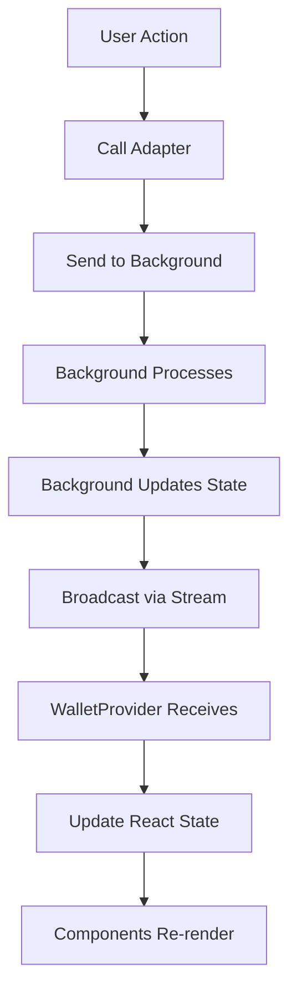
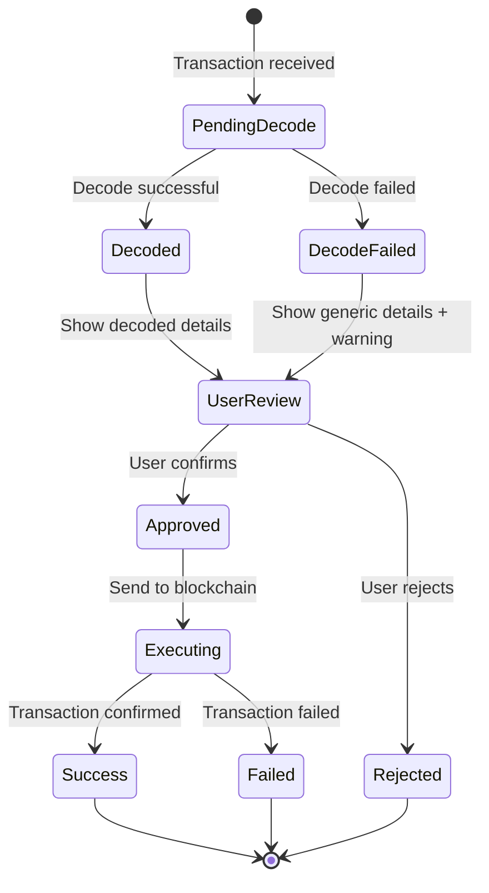
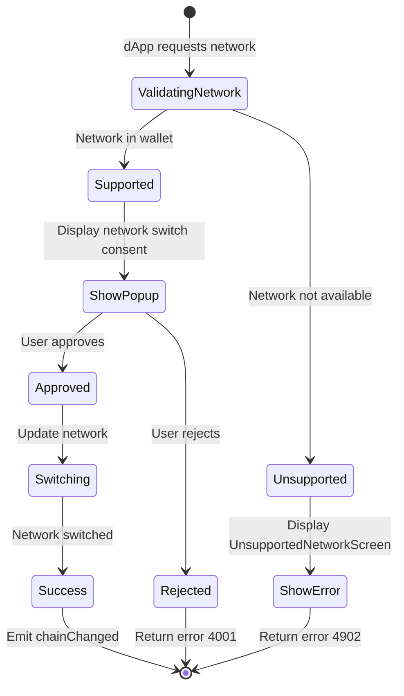

# SuperSafe Wallet - Frontend Architecture

**Created:** October 13, 2025  
**Last Updated:** November 15, 2025  
**Version:** 3.0.0+  
**Status:** ✅ CURRENT

---

## Table of Contents

1. [Frontend Overview](#frontend-overview)
2. [React Application Structure](#react-application-structure)
3. [Component Hierarchy](#component-hierarchy)
4. [State Management](#state-management)
5. [Adapter Pattern](#adapter-pattern)
6. [Screen Flows](#screen-flows)
7. [UI/UX Patterns](#uiux-patterns)
8. [Hooks Architecture](#hooks-architecture)

---

## Frontend Overview

SuperSafe Wallet's frontend implements a **Thin Client Pattern** where all business logic resides in the background service worker. The React application is purely presentational, communicating with the background via Chrome streams.

### Frontend Metrics

```
Total Frontend Files: 61 JSX components
Main App Component: 1,569 lines
Total Frontend Code: ~8,000 lines
Framework: React 18.2.0
Styling: TailwindCSS 3.3.3
Build Tool: Vite 6.3.6
```

### Key Principles

- **✅ Thin Client**: Zero business logic in frontend
- **✅ Stream Communication**: Long-lived connections to background
- **✅ Presentational Components**: Pure UI rendering
- **✅ Centralized State**: WalletProvider context
- **✅ Adapter Pattern**: Background communication abstraction

---

## React Application Structure

### App Component (1,569 lines)

**Location:** `src/App.jsx`

**Core Responsibilities:**
- Screen routing based on URL parameters
- Modal state management
- Connection request handling
- Transaction/signing confirmation
- Network switch consent

**Screen Routing:**
```javascript
// Mode detection from URL params
const urlParams = new URLSearchParams(window.location.search);
const mode = urlParams.get('mode');

// Route to appropriate screen
if (mode === 'connection') {
  return <ConnectionRequestScreen />;
} else if (mode === 'transaction') {
  return <TransactionConfirmationScreen />;
} else if (mode === 'signing') {
  return <SigningConfirmationScreen />;
} else if (isUnlocked) {
  return <Dashboard />;
} else {
  return <UnlockWalletModal />;
}
```

---

## Component Hierarchy

### Component Organization

```
src/components/
├── App.jsx                          # Main application
├── Dashboard.jsx                    # Portfolio view
├── Swap.jsx                         # Swap interface
├── Settings.jsx                     # Settings panel
├── Ecosystem.jsx                    # Ecosystem explorer
│
├── screens/                         # Full-screen views
│   ├── ConnectionRequestScreen.jsx
│   ├── TransactionConfirmationScreen.jsx
│   ├── SigningConfirmationScreen.jsx
│   ├── TypedDataConfirmationScreen.jsx
│   ├── NetworkSwitchConfirmationScreen.jsx
│   └── TransactionSuccessScreen.jsx
│
├── modals/                          # Modal dialogs
│   ├── UnlockWalletModal.jsx
│   ├── EditWalletModal.jsx
│   ├── NetworkConsentModal.jsx
│   ├── SignatureModal.jsx
│   └── LoadingModal.jsx
│
├── settings/                        # Settings sections
│   ├── SecuritySection.jsx
│   ├── WalletsSection.jsx
│   ├── NetworkSection.jsx
│   ├── TokensSection.jsx
│   └── WalletConnectSection.jsx
│
└── common/                          # Reusable components
    ├── Dashboard/
    │   ├── PortfolioBalanceSection.jsx
    │   ├── TokensList.jsx
    │   ├── NFTsSection.jsx
    │   └── TokenCardDark.jsx
    ├── TokenImage.jsx              # Token logo display with fallback
    ├── TokenLogo.jsx               # Advanced logo with orchestrator
    └── NetworkIcon.jsx             # Network/chain logos
```

---

## State Management

### WalletProvider Context

**Location:** `src/contexts/WalletProvider.jsx`

```javascript
const WalletContext = createContext();

export function WalletProvider({ children }) {
  // Session state from background
  const [isUnlocked, setIsUnlocked] = useState(false);
  const [wallets, setWallets] = useState([]);
  const [currentWallet, setCurrentWallet] = useState(null);
  const [network, setNetwork] = useState(null);
  const [supportsSwap, setSupportsSwap] = useState(false);
  
  // Initialize session stream
  useEffect(() => {
    const initializeSession = async () => {
      const sessionData = await FrontendSessionAdapter.getSessionState();
      
      setIsUnlocked(sessionData.isUnlocked);
      setWallets(sessionData.wallets);
      setCurrentWallet(sessionData.currentWallet);
      setNetwork(sessionData.currentNetwork);
      setSupportsSwap(sessionData.currentNetwork?.bebop?.swapEnabled);
    };
    
    initializeSession();
  }, []);
  
  return (
    <WalletContext.Provider value={{
      isUnlocked,
      wallets,
      currentWallet,
      network,
      supportsSwap,
      // ... methods
    }}>
      {children}
    </WalletContext.Provider>
  );
}
```

### State Flow


```mermaid
graph TD
    A[Background Updates State] --> B[Broadcast via Stream]
    B --> C[WalletProvider Receives]
    C --> D[Update React State]
    D --> E[Components Re-render]
    
    F[User Action] --> G[Call Adapter]
    G --> H[Send to Background]
    H --> I[Background Processes]
    I --> A
```

### Enhanced UI States (v3.0+)

**New Screen States:**

```javascript
// App.jsx - Screen routing
const SCREEN_STATES = {
  UNLOCK: 'unlock',
  DASHBOARD: 'dashboard',
  CONNECTION: 'connection',
  TRANSACTION: 'transaction',
  SIGNING: 'signing',
  TYPED_DATA: 'typed_data',
  NETWORK_SWITCH: 'network_switch',
  UNSUPPORTED_NETWORK: 'unsupported_network', // ✅ NEW
  TRANSACTION_SUCCESS: 'transaction_success'
};

// Route based on URL params
const screen = urlParams.get('screen');
switch (screen) {
  case 'unsupported_network':
    return <UnsupportedNetworkScreen 
      chainIdHex={urlParams.get('chainId')}
      origin={urlParams.get('origin')}
    />;
  
  case 'network_switch':
    return <NetworkSwitchConfirmationScreen 
      requestedChainId={urlParams.get('chainId')}
      origin={urlParams.get('origin')}
    />;
    
  case 'transaction':
    return <TransactionConfirmationScreen 
      transaction={pendingTransaction}
      decodedTransaction={decodedTransaction} // ✅ NEW
    />;
  
  case 'typed_data':
    return <TypedDataConfirmationScreen 
      typedData={pendingTypedData}
      isPermitSingle={isPermitSingle} // ✅ NEW
      isPermitBatch={isPermitBatch} // ✅ NEW
    />;
    
  // ... other cases
}
```

**Transaction State Enhancement:**

```javascript
// TransactionConfirmationScreen.jsx - Component state
const [transactionState, setTransactionState] = useState({
  // Basic transaction data
  to: null,
  from: null,
  data: null,
  value: null,
  chainId: null,
  
  // ✅ NEW: Enhanced decoding
  decodedTransaction: {
    type: null,           // "DEX Swap", "Token Approval", "Contract Interaction"
    decodedCall: {
      type: null,         // "Universal Router Swap", "ERC-20 Transfer", etc.
      name: null,
      tokenIn: {
        symbol: null,
        decimals: null,
        address: null
      },
      tokenOut: {
        symbol: null,
        decimals: null,
        address: null
      },
      amountIn: null,
      amountOutMin: null,
      path: [],           // Token path for multi-hop swaps
      steps: [],          // Batch operations
      badges: [],         // UI badges ("Uniswap V3", "Gasless")
      risks: []           // Security warnings
    }
  },
  
  // ✅ NEW: UI state
  showContractDetails: false,
  showBatchOps: false,
  showRawData: false,
  
  // Gas estimation
  gasEstimate: null,
  isEstimatingGas: false
});
```

**Signing State Enhancement:**

```javascript
// TypedDataConfirmationScreen.jsx - Component state
const [signingState, setSigningState] = useState({
  // Basic signing data
  message: null,
  method: null,          // "personal_sign", "eth_signTypedData_v4"
  typedData: null,
  
  // ✅ NEW: Enhanced typed data
  isPermitSingle: false,
  isPermitBatch: false,
  isUnlimitedApproval: false,
  
  // ✅ NEW: Permit2 details
  approvedTokens: [],    // For batch approvals
  spender: null,
  expiration: null,
  deadline: null,
  
  // ✅ NEW: UI state
  showAdditionalDetails: false,
  showRawMessage: false,
  
  // SIWE detection
  isSIWE: false,
  decodedMessage: null
});
```

**Network State Enhancement:**

```javascript
// NetworkSwitchConfirmationScreen.jsx - Component state
const [networkState, setNetworkState] = useState({
  // Current network
  currentChainId: null,
  currentNetworkName: null,
  
  // Requested network
  requestedChainId: null,
  requestedNetworkName: null,
  
  // ✅ NEW: Validation
  isSupported: true,     // false triggers UnsupportedNetworkScreen
  errorMessage: null,
  
  // dApp context
  origin: null,
  supportedNetworks: []
});
```

### State Transitions

**Transaction Confirmation Flow:**


```mermaid
stateDiagram-v2
    [*] --> PendingDecode: Transaction received
    PendingDecode --> Decoded: Decode successful
    PendingDecode --> DecodeFailed: Decode failed
    Decoded --> UserReview: Show decoded details
    DecodeFailed --> UserReview: Show generic details + warning
    UserReview --> Approved: User confirms
    UserReview --> Rejected: User rejects
    Approved --> Executing: Send to blockchain
    Executing --> Success: Transaction confirmed
    Executing --> Failed: Transaction failed
    Success --> [*]
    Failed --> [*]
    Rejected --> [*]
```

**Network Switch Flow:**


```mermaid
stateDiagram-v2
    [*] --> ValidatingNetwork: dApp requests network
    ValidatingNetwork --> Supported: Network in wallet
    ValidatingNetwork --> Unsupported: Network not available
    Supported --> ShowPopup: Display network switch consent
    Unsupported --> ShowError: Display UnsupportedNetworkScreen
    ShowPopup --> Approved: User approves
    ShowPopup --> Rejected: User rejects
    Approved --> Switching: Update network
    Switching --> Success: Network switched
    Success --> [*]: Emit chainChanged
    Rejected --> [*]: Return error 4001
    ShowError --> [*]: Return error 4902
```

**Error Handling States:**

```javascript
// Error state management
const [errorState, setErrorState] = useState({
  hasError: false,
  errorType: null,      // "DECODE_FAILED", "NETWORK_MISMATCH", "UNSUPPORTED_NETWORK"
  errorMessage: null,
  errorCode: null,      // EIP-1193 error codes
  canRetry: false,
  fallbackData: null    // Partial data if decode failed
});

// Error recovery
function handleDecodeError(error) {
  setErrorState({
    hasError: true,
    errorType: 'DECODE_FAILED',
    errorMessage: error.message,
    errorCode: -32603,
    canRetry: true,
    fallbackData: {
      to: transaction.to,
      value: transaction.value,
      data: transaction.data
    }
  });
}
```

---

## Adapter Pattern

### Frontend Adapters

**Purpose:** Abstract background communication from components.

#### FrontendSessionAdapter

**Location:** `src/utils/FrontendSessionAdapter.js`

```javascript
class FrontendSessionAdapter {
  static async getSessionState() {
    return await StreamConnectionManager.sendRequest('session', {
      type: 'GET_SESSION_STATE'
    });
  }
  
  static async unlock(password) {
    return await StreamConnectionManager.sendRequest('session', {
      type: 'UNLOCK',
      payload: { password }
    });
  }
  
  static async createWallet(name, emoji) {
    return await StreamConnectionManager.sendRequest('session', {
      type: 'CREATE_WALLET',
      payload: { name, emoji }
    });
  }
  
  static async switchWallet(index) {
    return await StreamConnectionManager.sendRequest('session', {
      type: 'SWITCH_WALLET',
      payload: { index }
    });
  }
}
```

#### SwapAdapter

**Location:** `src/utils/SwapAdapter.js`

```javascript
class SwapAdapter {
  static async getSwapQuote(params) {
    return await StreamConnectionManager.sendRequest('swap', {
      type: 'SWAP_GET_QUOTE',
      payload: params
    });
  }
  
  static async signAndSubmitOrder(quote, takerAddress, networkKey) {
    return await StreamConnectionManager.sendRequest('swap', {
      type: 'SWAP_SIGN_AND_SUBMIT',
      payload: { quote, takerAddress, networkKey }
    });
  }
  
  static async checkOrderStatus(quoteId, networkKey) {
    return await StreamConnectionManager.sendRequest('swap', {
      type: 'SWAP_CHECK_STATUS',
      payload: { quoteId, networkKey }
    });
  }
}
```

---

## Screen Flows

### Dashboard Flow

```javascript
function Dashboard() {
  const { currentWallet, network, supportsSwap } = useWalletProvider();
  const [tokens, setTokens] = useState([]);
  const [nfts, setNFTs] = useState([]);
  
  // Load tokens on mount
  useEffect(() => {
    const loadTokens = async () => {
      const tokenList = await FrontendControllerAdapter.getTokens(
        network.networkKey,
        currentWallet.address
      );
      setTokens(tokenList);
    };
    
    loadTokens();
  }, [network, currentWallet]);
  
  return (
    <div>
      <AppHeader />
      <PortfolioBalanceSection balance={totalBalance} />
      <ActionButtonsRow 
        onSend={() => navigate('/send')}
        onReceive={() => setShowQR(true)}
        onSwap={() => navigate('/swap')}
        supportsSwap={supportsSwap}
      />
      <TokensList tokens={tokens} />
      <NFTsSection nfts={nfts} />
    </div>
  );
}
```

### Transaction Confirmation Flow

**Location:** `src/components/screens/TransactionConfirmationScreen.jsx`

**Enhanced Features (v3.0+):**
- ✅ Rich transaction decoding (DEX swaps, ERC-20, NFTs)
- ✅ Token logos integration via `getTokenLogo()`
- ✅ Collapsible detail sections (Contract Interaction, Batch Operations, Security, Raw Data)
- ✅ Wei amount detection and formatting
- ✅ "You Send" / "You Receive" prominent display
- ✅ Always-visible Security notice (outside scrollable area)

**Architecture:**
```javascript
function TransactionConfirmationScreen({ transaction, decodedTransaction, origin }) {
  const [showContractDetails, setShowContractDetails] = useState(false);
  const [showBatchOps, setShowBatchOps] = useState(false);
  const [showRawData, setShowRawData] = useState(false);
  
  // Extract decoded call information
  const decodedCall = decodedTransaction?.decodedCall;
  const isSwap = decodedCall?.type?.includes('Swap');
  
  return (
    <div className="confirmation-screen">
      {/* Main Transaction Block */}
      <div className="main-transaction-block">
        <NetworkHeader chainId={chainId} />
        <OriginLine origin={origin} />
        
        {isSwap && (
          <>
            {/* You Send - Always Visible */}
            <div className="you-send">
              <TokenImage address={decodedCall.tokenIn.address} symbol={decodedCall.tokenIn.symbol} />
              <span>{formatAmount(decodedCall.amountIn)} {decodedCall.tokenIn.symbol}</span>
            </div>
            
            {/* You Receive - Always Visible */}
            <div className="you-receive">
              <TokenImage address={decodedCall.tokenOut.address} symbol={decodedCall.tokenOut.symbol} />
              <span>~{formatAmount(decodedCall.amountOutMin)} {decodedCall.tokenOut.symbol}</span>
            </div>
          </>
        )}
        
        {/* Amount (native token) - Always Visible */}
        {transaction.value && BigInt(transaction.value) > 0n && (
          <div className="amount">
            <TokenImage address={null} symbol={nativeSymbol} />
            <span>{formatWei(transaction.value)} {nativeSymbol}</span>
          </div>
        )}
      </div>
      
      {/* Collapsible Sections (collapsed by default) */}
      <CollapsibleSection 
        title="Contract Interaction"
        isOpen={showContractDetails}
        onToggle={() => setShowContractDetails(!showContractDetails)}
      >
        <ContractDetails decodedCall={decodedCall} />
      </CollapsibleSection>
      
      <CollapsibleSection 
        title="Batch Operations"
        isOpen={showBatchOps}
        onToggle={() => setShowBatchOps(!showBatchOps)}
      >
        <BatchOperations steps={decodedCall?.steps} />
      </CollapsibleSection>
      
      <CollapsibleSection 
        title="Raw Data"
        isOpen={showRawData}
        onToggle={() => setShowRawData(!showRawData)}
      >
        <RawDataDisplay transaction={transaction} />
      </CollapsibleSection>
      
      {/* Security Notice - Always Visible (outside scrollable area) */}
      <SecurityNotice origin={origin} warnings={decodedCall?.risks} />
      
      {/* Action Buttons */}
      <div className="actions">
        <button onClick={onReject}>Reject</button>
        <button onClick={onApprove}>Confirm</button>
      </div>
    </div>
  );
}
```

**Wei Amount Detection:**
```javascript
function formatAmount(amountStr) {
  const numValue = parseFloat(amountStr);
  
  // Detect Wei amounts (>= 1e13, typical Wei values)
  if (numValue >= 1e13) {
    return formatWei(amountStr);
  }
  
  // Already formatted, just clean up decimals
  return numValue.toFixed(6);
}

function formatWei(weiStr) {
  return parseFloat(ethers.formatEther(weiStr)).toFixed(6);
}
```

**Token Logo Integration:**
```javascript
function getTokenLogo(chainId, address, symbol) {
  if (!address || address === 'NATIVE_TOKEN') {
    // Native token logo (ETH, BNB, etc.)
    return `https://api.dune.com/api/echo/beta/token/logo/${chainId}`;
  }
  
  // ERC-20 token logo
  return `https://api.dune.com/api/echo/beta/token/logo/${chainId}/${address}`;
}
```

### TypedDataConfirmationScreen

**Location:** `src/components/screens/TypedDataConfirmationScreen.jsx`

**Enhanced Features (v3.0+):**
- ✅ PermitSingle (Permit2) rich display
- ✅ PermitBatchWitnessTransferFrom support
- ✅ Unlimited approval detection (MAX_UINT160)
- ✅ Human-readable expiration dates
- ✅ Token logos for approved tokens
- ✅ Collapsible "Additional Details" section

**Architecture:**
```javascript
function TypedDataConfirmationScreen({ typedData, origin }) {
  const [showAdditionalDetails, setShowAdditionalDetails] = useState(false);
  
  const isPermitSingle = typedData?.primaryType === 'PermitSingle';
  const isPermitBatch = typedData?.primaryType === 'PermitBatchWitnessTransferFrom';
  
  return (
    <div className="confirmation-screen">
      <NetworkHeader chainId={chainId} />
      <OriginLine origin={origin} />
      
      {/* PermitSingle - Always Visible */}
      {isPermitSingle && (
        <>
          <div className="you-approve">
            <TokenImage address={typedData.message.details.token} />
            <span>
              {detectUnlimited(typedData.message.details.amount) 
                ? '∞ Unlimited' 
                : formatAmount(typedData.message.details.amount)
              }
            </span>
            <span className="token-symbol">{tokenSymbol}</span>
          </div>
          
          <div className="to-spender">
            <span>To Spender: {typedData.message.spender}</span>
          </div>
          
          {detectUnlimited(typedData.message.details.amount) && (
            <div className="unlimited-warning">
              ⚠️ Unlimited Approval: Spender can use any amount of your {tokenSymbol}
            </div>
          )}
        </>
      )}
      
      {/* PermitBatch - Always Visible */}
      {isPermitBatch && (
        <div className="batch-permits">
          {typedData.message.permitted.map((permit, idx) => (
            <div key={idx} className="permit-item">
              <TokenImage address={permit.token} />
              <span>{formatAmount(permit.amount)} {getTokenSymbol(permit.token)}</span>
            </div>
          ))}
        </div>
      )}
      
      {/* Additional Details - Collapsible */}
      <CollapsibleSection 
        title="Additional Details"
        isOpen={showAdditionalDetails}
        onToggle={() => setShowAdditionalDetails(!showAdditionalDetails)}
      >
        <div className="expiration">
          Expires: {formatDate(typedData.message.details.expiration)}
        </div>
        <div className="deadline">
          Signature Deadline: {formatDate(typedData.message.sigDeadline)}
        </div>
        <div className="nonce">
          Nonce: {typedData.message.details.nonce}
        </div>
      </CollapsibleSection>
      
      <SecurityNotice origin={origin} />
      
      <div className="actions">
        <button onClick={onReject}>Reject</button>
        <button onClick={onApprove}>Sign</button>
      </div>
    </div>
  );
}
```

**Unlimited Approval Detection:**
```javascript
const MAX_UINT160 = BigInt('1461501637330902918203684832716283019655932542975');

function detectUnlimited(amountStr) {
  const amount = BigInt(amountStr);
  return amount >= MAX_UINT160 * BigInt(99) / BigInt(100);
}
```

### SigningConfirmationScreen

**Location:** `src/components/screens/SigningConfirmationScreen.jsx`

**Enhanced Features (v3.0+):**
- ✅ Hex to UTF-8 decoding for personal_sign
- ✅ SIWE (Sign-In With Ethereum) detection
- ✅ Message preview with scroll
- ✅ Collapsible "Raw Message" section

**Architecture:**
```javascript
function SigningConfirmationScreen({ message, method, origin }) {
  const [showRawMessage, setShowRawMessage] = useState(false);
  
  // Decode hex message to UTF-8
  const decodedMessage = method === 'personal_sign' 
    ? decodeHexMessage(message)
    : message;
  
  // Detect SIWE
  const isSIWE = decodedMessage.includes('Sign-in') || decodedMessage.includes('nonce');
  
  return (
    <div className="confirmation-screen">
      <NetworkHeader chainId={chainId} />
      <OriginLine origin={origin} />
      
      {isSIWE && (
        <div className="siwe-badge">
          🔐 Sign-In With Ethereum
        </div>
      )}
      
      {/* Message Preview - Always Visible */}
      <div className="message-preview">
        <h3>Message to Sign:</h3>
        <div className="message-content">
          {decodedMessage}
        </div>
      </div>
      
      {/* Raw Message - Collapsible */}
      <CollapsibleSection 
        title="Raw Message"
        isOpen={showRawMessage}
        onToggle={() => setShowRawMessage(!showRawMessage)}
      >
        <pre className="raw-message">{message}</pre>
      </CollapsibleSection>
      
      <SecurityNotice origin={origin} />
      
      <div className="actions">
        <button onClick={onReject}>Reject</button>
        <button onClick={onApprove}>Sign</button>
      </div>
    </div>
  );
}
```

### UnsupportedNetworkScreen (NEW)

**Location:** `src/components/screens/UnsupportedNetworkScreen.jsx`

**Purpose:** Display clear error when dApp requests a network SuperSafe doesn't support.

**Architecture:**
```javascript
function UnsupportedNetworkScreen({ chainIdHex, origin }) {
  const chainIdDecimal = parseInt(chainIdHex, 16);
  
  return (
    <div className="unsupported-network-screen">
      <div className="error-icon">⚠️</div>
      
      <h2>Network Not Supported</h2>
      
      <div className="network-details">
        <p><strong>Requested by:</strong> {origin}</p>
        <p><strong>Chain ID (Hex):</strong> {chainIdHex}</p>
        <p><strong>Chain ID (Decimal):</strong> {chainIdDecimal}</p>
      </div>
      
      <div className="explanation">
        <p>
          SuperSafe Wallet does not currently support this network. 
          The dApp has requested a network that is not available.
        </p>
      </div>
      
      <div className="supported-networks">
        <h3>Supported Networks:</h3>
        <ul>
          <li>Ethereum (1)</li>
          <li>Optimism (10)</li>
          <li>Base (8453)</li>
          <li>BSC (56)</li>
          <li>SuperSeed (5330)</li>
        </ul>
      </div>
      
      <button onClick={onDismiss}>OK</button>
    </div>
  );
}
```

---

## UI/UX Patterns

### Collapsible Sections Pattern

**Purpose:** Improve UX by hiding complex details by default while maintaining full transparency.

**Implementation:**
```javascript
function CollapsibleSection({ title, isOpen, onToggle, children }) {
  return (
    <div className="collapsible-section">
      <div className="section-header" onClick={onToggle}>
        <h3>{title}</h3>
        <span className="chevron">{isOpen ? '▼' : '▶'}</span>
      </div>
      
      {isOpen && (
        <div className="section-content">
          {children}
        </div>
      )}
    </div>
  );
}
```

**Usage Pattern:**
```javascript
// All complex sections collapsed by default
const [showContractDetails, setShowContractDetails] = useState(false);
const [showBatchOps, setShowBatchOps] = useState(false);
const [showRawData, setShowRawData] = useState(false);

<CollapsibleSection 
  title="Contract Interaction"
  isOpen={showContractDetails}
  onToggle={() => setShowContractDetails(!showContractDetails)}
>
  <ContractDetails data={contractData} />
</CollapsibleSection>
```

**Philosophy:**
- **Critical info always visible** (You Send, You Receive, Amount, Origin)
- **Technical details collapsible** (Contract Interaction, Batch Operations, Raw Data)
- **Security notice ALWAYS visible** (outside scrollable area, below action buttons)

### Token Logos Integration

**Purpose:** Enhance UX with visual token identification using a modular, multi-source logo resolution system.

The SuperSafe Wallet includes a **modular, extensible logo resolution system** that automatically fetches token logos from multiple sources. The system uses a **cascading provider approach** where it tries each source in priority order until finding a valid logo.

#### Architecture

**Components:**

1. **Logo Providers** (`src/utils/logoProviders/`)
   - Modular, independent sources for token logos
   - Each provider handles one specific source (TrustWallet, SmolDapp, etc.)
   - Consistent interface across all providers

2. **Logo Orchestrator** (`src/utils/logoOrchestrator.js`)
   - Coordinates provider cascade
   - Handles caching (in-memory + persistent)
   - Validates URLs (HTTP HEAD/GET requests)
   - Manages concurrency (deduplication)

3. **React Hook** (`src/hooks/useTokenLogoNew.js`)
   - Easy-to-use interface for React components
   - Automatic loading states and error handling
   - AbortController cleanup on unmount

4. **Configuration** (`src/utils/logoProviders/config.js`)
   - Provider priority order
   - Enable/disable flags
   - Cache and validation settings

#### Provider Priority (Cascade Order)

The system tries providers in this order:

0. **Curated** - Local curated list (instant, no external requests, privacy-friendly)
1. **Backend** - Logos from Moralis/API (from existing metadata, fastest remote)
2. **TrustWallet** - Official TrustWallet assets repository (high quality, EIP-55 compliant)
3. **SmolDapp** - Community-maintained token assets (multiple formats)
4. **Bebop** - Bebop aggregator S3 bucket (good fallback)

First successful match wins!

#### Available Providers

##### 0. Curated Provider (Priority 0 - Highest)

**Location**: `src/utils/logoProviders/logoFromCurated.js`

**Features**:
- Highest priority provider (checked first)
- Local assets bundled with the app
- No external requests (privacy-friendly)
- Instant loading (no network latency)
- Works offline
- Perfect for well-known tokens
- **Dual Purpose:** Also used as security whitelist for token filtering (see below)

**Current Coverage**: **510 tokens** across **6 chains**
- Ethereum (1): 100 tokens
- Optimism (10): 101 tokens
- BSC (56): 100 tokens
- Base (8453): 101 tokens
- Arbitrum (42161): 101 tokens
- Seed (5330): 7 tokens

**Logo Location**: `/public/assets/tokens/<chainid>/<symbol>-<address>.png`

**File Naming Convention**: `<symbol>-<address>.png`
- Example: `BNB-0x0000000000000000000000000000000000000000.png`
- Example: `USDT-0xdac17f958d2ee523a2206206994597c13d831ec7.png`
- This format prevents collisions when different tokens share the same symbol

**Curated List**: `src/utils/curatedTokenLogos.js` (610+ lines, auto-generated from `public/assets/tokens/summary.json`)

**Usage**:
```javascript
import { getTokenLogoFromCurated } from '../utils/logoProviders/logoFromCurated';

const logoPath = getTokenLogoFromCurated({
  chainId: 56,
  address: '0x0000000000000000000000000000000000000000',
});
// Returns: '/assets/tokens/56/BNB-0x0000000000000000000000000000000000000000.png'
```

**Current Curated Tokens** (Examples):
```javascript
// Native tokens (all chains)
'1:0x0000000000000000000000000000000000000000': { symbol: 'ETH' }
'10:0x0000000000000000000000000000000000000000': { symbol: 'ETH' }
'56:0x0000000000000000000000000000000000000000': { symbol: 'BNB' }
'8453:0x0000000000000000000000000000000000000000': { symbol: 'ETH' }
'42161:0x0000000000000000000000000000000000000000': { symbol: 'ETH' }
'5330:0x0000000000000000000000000000000000000000': { symbol: 'SEED' }

// Major stablecoins & tokens
'1:0xdac17f958d2ee523a2206206994597c13d831ec7': { symbol: 'USDT' }
'1:0xa0b86991c6218b36c1d19d4a2e9eb0ce3606eb48': { symbol: 'USDC' }
'1:0x2260fac5e5542a773aa44fbcfedf7c193bc2c599': { symbol: 'WBTC' }
'56:0x55d398326f99059ff775485246999027b3197955': { symbol: 'BSC-USD' }
// ... 500+ more tokens
```

**Adding tokens to curated list**:
```javascript
// In src/utils/curatedTokenLogos.js
export const CURATED_TOKEN_LOGOS = {
  // Auto-generated path format (recommended)
  '56:0x0000000000000000000000000000000000000000': { symbol: 'BNB' },
  '1:0xc02aaa39b223fe8d0a0e5c4f27ead9083c756cc2': { symbol: 'WETH' },
  
  // Custom path format (if needed for special cases)
  '1:0x...': { symbol: 'TOKEN', path: '/custom/path/logo.png' },
};

// The system auto-generates paths as:
// `/assets/tokens/${chainId}/${symbol}-${address}.png`
```

##### 1. TrustWallet Provider

**Location**: `src/utils/logoProviders/logoFromTrustWallet.js`

**Features**:
- EIP-55 checksummed addresses (using `js-sha3`)
- Native coin support with L2 special handling
- L2s using ETH (Optimism, Arbitrum, Base, etc.) return Ethereum logo
- PNG format from GitHub raw

**Supported Chains**:
- Ethereum (1)
- BSC (56)
- Polygon (137)
- Optimism (10)
- Arbitrum (42161)
- Base (8453)
- Avalanche (43114)
- Fantom (250)
- And more...

**Usage**:
```javascript
import { getTokenLogoFromTrustWallet } from '../utils/logoProviders/logoFromTrustWallet';

const logoUrl = getTokenLogoFromTrustWallet({
  chainId: 56,
  address: '0x...',
});
```

**Native Coin**:
```javascript
// Pass 0x000...000 for native coin (BNB, ETH, etc.)
const logoUrl = getTokenLogoFromTrustWallet({
  chainId: 56,
  address: '0x0000000000000000000000000000000000000000',
});
```

##### 2. Backend Provider

**Location**: `src/utils/logoProviders/logoFromBackend.js`

**Features**:
- Extracts logos from existing token metadata
- No external requests (fastest remote option)
- Works with Moralis, SuperSafe API, and other backend sources

**Usage**:
```javascript
import { getTokenLogoFromBackend } from '../utils/logoProviders/logoFromBackend';

const logoUrl = getTokenLogoFromBackend({
  chainId: 56,
  address: '0x...',
  metadata: tokenMetadata // From backend API
});
```

##### 3. SmolDapp Provider

**Location**: `src/utils/logoProviders/logoFromSmolDapp.js`

**Features**:
- Multiple formats: PNG (32px, 128px), SVG
- Community-maintained assets
- Fast GitHub raw CDN

**Supported Chains**:
- Ethereum (1)
- BSC (56)
- Polygon (137)
- Optimism (10)
- Arbitrum (42161)
- And more...

**Usage**:
```javascript
import { getTokenLogoFromSmolDapp } from '../utils/logoProviders/logoFromSmolDapp';

// SVG format (default)
const logoUrl = getTokenLogoFromSmolDapp({
  chainId: 56,
  address: '0x...',
  opts: { format: 'svg' }
});

// PNG format with size
const logoUrl = getTokenLogoFromSmolDapp({
  chainId: 56,
  address: '0x...',
  opts: { size: 32, format: 'png' }
});
```

##### 4. Bebop Provider

**Location**: `src/utils/logoProviders/logoFromBebop.js`

**Features**:
- SVG format
- S3 bucket (fast CDN)
- **Important**: Requires case-sensitive addresses (EIP-55 checksum)

**Supported Chains**:
- Ethereum (1)
- BSC (56)
- Polygon (137)
- Optimism (10)
- Arbitrum (42161)
- And more...

**Usage**:
```javascript
import { getTokenLogoFromBebop } from '../utils/logoProviders/logoFromBebop';

const logoUrl = getTokenLogoFromBebop({
  chainId: 56,
  address: '0x...', // Must be checksummed!
});
```

#### Using the Logo Orchestrator

The orchestrator automatically tries all providers in order:

```javascript
import { resolveLogoURL } from '../utils/logoOrchestrator';

const logoUrl = await resolveLogoURL({
  chainId: 56,
  address: '0x...',
  metadata: tokenMetadata, // Optional
  skipValidation: false, // Optional: skip URL validation
  signal: abortController.signal // Optional: abort signal
});
```

**Features**:
- ✅ Automatic provider cascade
- ✅ In-memory + persistent cache (chrome.storage.local)
- ✅ URL validation (HTTP HEAD/GET)
- ✅ Concurrency control (deduplication)
- ✅ AbortController support

#### React Hook: useTokenLogoNew

The easiest way to use the logo system in React components:

```jsx
import { useTokenLogoNew } from '../hooks/useTokenLogoNew';

function TokenCard({ chainId, address, metadata }) {
  const { logoUrl, isLoading, error, refetch } = useTokenLogoNew({
    chainId,
    address,
    metadata, // Optional
    skipValidation: false, // Optional
    enabled: true // Optional: enable/disable resolution
  });
  
  if (isLoading) return <Spinner />;
  if (error) return <PlaceholderLogo />;
  
  return (
     refetch()} // Retry on error
    />
  );
}
```

#### TokenLogo Component (Primary)

**Location:** `src/components/common/TokenLogo.jsx`

**Features:**
- Uses logo orchestrator for intelligent resolution
- In-memory + persistent caching
- Automatic fallback through providers
- Error handling with placeholder

```javascript
import { useTokenLogo } from '../../hooks/useTokenLogoNew';

function TokenLogo({ chainId, address, symbol, metadata, className }) {
  const { logoUrl, isLoading, error } = useTokenLogo({
    chainId,
    address,
    metadata // Optional: existing token data
  });
  
  if (isLoading) {
    return <div className="logo-skeleton" />;
  }
  
  if (error || !logoUrl) {
    return (
      <div className={`token-placeholder ${className}`}>
        {symbol?.[0] || '?'}
      </div>
    );
  }
  
  return (
     {
        e.target.style.display = 'none';
        e.target.nextSibling.style.display = 'flex';
      }}
    />
  );
}
```

#### TokenImage Component (Simplified)

**Location:** `src/components/common/TokenImage.jsx`

**Features:**
- Simpler component for basic use cases
- Manual logo URL construction
- Fallback to placeholder

```javascript
function TokenImage({ chainId, address, symbol, alt, className }) {
  const [imageError, setImageError] = useState(false);
  
  const logoUrl = getTokenLogo(chainId, address, symbol);
  
  // Fallback to placeholder with first letter
  if (imageError) {
    return (
      <div className={`token-placeholder ${className}`}>
        {symbol?.[0] || '?'}
      </div>
    );
  }
  
  return (
     setImageError(true)}
    />
  );
}
```

#### Logo Resolution Flow

```
User Request
     ↓
Check In-Memory Cache (< 1ms)
     ↓ [miss]
Check Persistent Cache (chrome.storage.local)
     ↓ [miss]
Try Curated List (Priority 0, instant, local)
     ↓ [not found]
Try Backend Metadata (Priority 1, no external request)
     ↓ [not found]
Try TrustWallet (Priority 2, GitHub CDN, ~50-200ms)
     ↓ [not found]
Try SmolDapp (Priority 3, GitHub CDN, ~50-200ms)
     ↓ [not found]
Try Bebop (Priority 4, S3 CDN, ~50-150ms)
     ↓ [not found]
Return Placeholder
```

#### Configuration

##### Provider Priority

Edit `src/utils/logoProviders/config.js` to change provider order:

```javascript
export const PROVIDER_PRIORITY = [
  'curated',      // Try curated list first (instant, local)
  'backend',      // Then backend metadata
  'trustwallet',  // Then TrustWallet
  'smoldapp',     // Then SmolDapp
  'bebop',        // Finally Bebop
];
```

##### Enable/Disable Providers

```javascript
export const PROVIDER_ENABLED = {
  curated: true,
  backend: true,
  trustwallet: true,
  smoldapp: false, // Disable SmolDapp
  bebop: true,
};
```

##### Cache Settings

```javascript
export const CACHE_CONFIG = {
  TTL_SUCCESS: 24 * 60 * 60 * 1000, // 24 hours
  TTL_FAILURE: 60 * 60 * 1000,      // 1 hour
  MAX_ENTRIES: 1000,
  PERSIST_ENABLED: true,
  PERSIST_MAX_ENTRIES: 500,
};
```

##### Validation Settings

```javascript
export const VALIDATION_CONFIG = {
  ENABLED: true,
  TIMEOUT: 5000, // 5 seconds
  MAX_CONCURRENT: 3,
  RETRY_ENABLED: false,
};
```

#### Adding a New Provider

1. **Create provider file**: `src/utils/logoProviders/logoFromNewSource.js`

```javascript
export function getTokenLogoFromNewSource({ chainId, address, opts = {} }) {
  if (!chainId || !address) return null;
  
  // Your logo URL logic here
  return `https://newsource.com/logos/${chainId}/${address}.png`;
}

export function isNewSourceChainSupported(chainId) {
  return [1, 56, 137].includes(chainId);
}

export function getSupportedChainIds() {
  return [1, 56, 137];
}

export default getTokenLogoFromNewSource;
```

2. **Register in index**: `src/utils/logoProviders/index.js`

```javascript
import * as newsource from './logoFromNewSource.js';

export const PROVIDERS = {
  trustwallet,
  smoldapp,
  bebop,
  backend,
  newsource, // Add here
};
```

3. **Add to config**: `src/utils/logoProviders/config.js`

```javascript
export const PROVIDER_PRIORITY = [
  'backend',
  'trustwallet',
  'newsource', // Add in desired position
  'smoldapp',
  'bebop',
];

export const PROVIDER_ENABLED = {
  backend: true,
  trustwallet: true,
  newsource: true, // Enable it
  smoldapp: true,
  bebop: true,
};
```

Done! Your new provider is now part of the cascade.

#### Cache Management

**Cache Structure:**
```javascript
{
  "56:0x0000000000000000000000000000000000000000": {
    url: "https://...",
    timestamp: 1234567890,
    validated: true
  }
}
```

**Cache Methods:**
```javascript
import { clearCache, getCacheStats } from '../utils/logoOrchestrator';

// Clear all cache
clearCache();

// Get cache statistics
const stats = getCacheStats();
console.log(`Cache size: ${stats.size} entries`);
console.log(`Pending requests: ${stats.pending}`);
```

#### Performance

- **Cache hit**: < 1ms (instant)
- **Curated logos**: < 1ms (instant)
- **Backend provider**: < 1ms (no external request)
- **TrustWallet**: ~50-200ms (GitHub raw CDN)
- **SmolDapp**: ~50-200ms (GitHub raw CDN)
- **Bebop**: ~50-150ms (S3 CDN)
- **With validation**: +5-10ms per provider

**Optimization tips**:
- Use backend provider when metadata available
- Enable persistent cache
- Disable validation in production if needed
- Increase cache TTL for stable tokens

#### Dual Purpose: Security Whitelist

**NEW (November 14, 2025)**: The curated token list (`CURATED_TOKEN_LOGOS`) now serves a **dual purpose**:

1. **Logo Resolution** (original purpose) - Provides local token logos
2. **Security Whitelist** (new) - Bypasses security filters for trusted tokens

**How It Works:**

When fetching token balances from blockchain explorers (Moralis, Blockscout), the system applies security filters to prevent displaying scam/spam tokens. However, **tokens in the curated list are always shown**, regardless of API security flags.

**Location:** `src/background/handlers/streams/BlockchainStreamHandler.js`

**Filter Priority:**
```javascript
// CHECK 0: Curated whitelist (highest priority)
const curatedKey = `${chainId}:${token.token_address.toLowerCase()}`;
const isCurated = !!CURATED_TOKEN_LOGOS[curatedKey];

if (isCurated) {
  // ✅ Trusted token - bypass all security checks
  return true;
}

// CHECK 1: Spam filter (for non-curated tokens)
if (token.possible_spam === true) {
  return false; // ❌ Filter out
}

// CHECK 2: Security check (for non-curated tokens)
if (token.security_score === null && token.verified_contract === false) {
  return false; // ❌ Filter out
}

// ✅ All other tokens pass
return true;
```

**Why This Matters:**

Some legitimate tokens (like WETH on Base) may have incomplete or incorrect metadata from explorers:

```javascript
// Example: WETH on Base (8453)
{
  "token_address": "0x4200000000000000000000000000000000000006",
  "symbol": "WETH",
  "verified_contract": false,  // ❌ Flagged as unverified
  "security_score": null,       // ❌ No security score
  "possible_spam": false
}

// Without curated whitelist: ❌ Would be filtered out
// With curated whitelist: ✅ Shown (trusted token)
```

**Benefits:**

1. ✅ **Prevents False Positives:** Legitimate tokens with incomplete API data are always shown
2. ✅ **Better UX:** Users see their WETH, USDC, and other major tokens immediately
3. ✅ **Zero Latency:** Local check, no external API calls
4. ✅ **Reliability:** Works even if explorers incorrectly flag tokens

**Adding Tokens for Dual Purpose:**

When adding a token to `curatedTokenLogos.js`, it automatically:
- ✅ Provides local logo (faster, privacy-friendly)
- ✅ Bypasses security filters (prevents false positives)

```javascript
// In src/utils/curatedTokenLogos.js
export const CURATED_TOKEN_LOGOS = {
  // Adding WETH on Base (8453)
  '8453:0x4200000000000000000000000000000000000006': { symbol: 'WETH' },
  
  // This entry now provides:
  // 1. Logo: /assets/tokens/8453/WETH-0x4200000000000000000000000000000006.png
  // 2. Security: Bypasses all filters, always shown to users
};
```

**CSP Configuration:**
```javascript
// manifest.json - content_security_policy.extension_pages
"img-src 'self' data: blob: https://raw.githubusercontent.com https://assets.smold.app https://tokens.bebop.xyz"
```

### Amount Formatting

**Purpose:** Display amounts in user-friendly format, auto-detecting Wei values.

**Wei Detection Strategy:**
```javascript
/**
 * Auto-detect Wei amounts and format appropriately
 * @param {string|number} value - Amount (could be Wei or formatted)
 * @param {number} decimals - Token decimals (default: 18)
 * @returns {string} Formatted amount
 */
function formatAmount(value, decimals = 18) {
  if (!value) return '0';
  
  const numValue = typeof value === 'string' ? parseFloat(value) : value;
  
  // Wei detection threshold: >= 1e13 (0.00001 ETH with 18 decimals)
  if (numValue >= 1e13) {
    return formatWei(value.toString(), decimals);
  }
  
  // Already formatted, clean up decimals (max 6)
  return numValue.toFixed(Math.min(6, decimals));
}

function formatWei(weiStr, decimals = 18) {
  const formatted = ethers.formatUnits(weiStr, decimals);
  const num = parseFloat(formatted);
  
  // Scientific notation for very small values
  if (num < 0.000001 && num > 0) {
    return num.toExponential(2);
  }
  
  // Standard notation with max 6 decimals
  return num.toFixed(6).replace(/\.?0+$/, '');
}
```

**Usage Examples:**
```javascript
// Native token amount
<span>{formatAmount(transaction.value)} ETH</span>

// ERC-20 amount with decimals
<span>{formatAmount(decodedCall.amountIn, tokenIn.decimals)} {tokenIn.symbol}</span>

// Batch operation amounts
{step.amount && (
  <span>{formatAmount(step.amount, step.decimals)}</span>
)}
```

**Number Localization:**
```javascript
// ✅ ALWAYS use 'en-US' locale for consistent decimal formatting
// This ensures dot (.) as decimal separator regardless of user's system locale

// ❌ BAD: Using undefined locale (uses system locale)
const bad = amount.toLocaleString(undefined, { 
  minimumFractionDigits: 2, 
  maximumFractionDigits: 2 
});
// Result on Spanish system: "1.234,56" (comma decimal!)

// ✅ GOOD: Force English locale
const good = amount.toLocaleString('en-US', { 
  minimumFractionDigits: 2, 
  maximumFractionDigits: 2 
});
// Result on ANY system: "1,234.56" (dot decimal!)

// ✅ EXAMPLES:
// Portfolio balance
const balance = portfolioTotal.toLocaleString('en-US', { 
  minimumFractionDigits: 2, 
  maximumFractionDigits: 2 
});

// Token amounts
const tokenAmount = amount.toLocaleString('en-US', { 
  minimumFractionDigits: 4, 
  maximumFractionDigits: 4 
});

// Large numbers (millions)
const largeNumber = (amount / 1000000).toLocaleString('en-US', { 
  minimumFractionDigits: 1, 
  maximumFractionDigits: 1 
}) + 'M';
```

**Why This Matters:**
- Blockchain values must use dot (.) as decimal separator (international standard)
- User confusion: `$1,234.56` vs `$1.234,56` (Spanish) can cause transaction errors
- Consistency: All users see same format regardless of browser locale
- ✅ **Bug Fix (Nov 2025)**: Changed all `toLocaleString(undefined, ...)` to `toLocaleString('en-US', ...)`

### Security Notices Placement

**Purpose:** Ensure critical security warnings are always visible to user.

**Placement Strategy:**

```javascript
function TransactionConfirmationScreen() {
  return (
    <div className="confirmation-screen-container">
      {/* Scrollable Content */}
      <div className="scrollable-content">
        <MainTransactionBlock />
        <CollapsibleSections />
      </div>
      
      {/* ALWAYS VISIBLE - Outside scrollable area */}
      <div className="security-notice-container">
        <SecurityNotice 
          origin={origin}
          warnings={decodedCall?.risks}
        />
      </div>
      
      {/* Action Buttons - Always visible */}
      <div className="action-buttons">
        <button onClick={onReject}>Reject</button>
        <button onClick={onApprove}>Confirm</button>
      </div>
    </div>
  );
}
```

**SecurityNotice Component:**
```javascript
function SecurityNotice({ origin, warnings = [] }) {
  return (
    <div className="security-notice">
      <div className="notice-header">
        <span className="warning-icon">⚠️</span>
        <span>Security Notice</span>
      </div>
      
      <div className="notice-content">
        <p className="origin-warning">
          Only proceed if you trust <strong>{origin}</strong>
        </p>
        
        {warnings.length > 0 && (
          <ul className="risk-list">
            {warnings.map((risk, idx) => (
              <li key={idx}>{risk}</li>
            ))}
          </ul>
        )}
        
        <p className="general-warning">
          Signing this request grants the dApp permissions. 
          Verify the details carefully.
        </p>
      </div>
    </div>
  );
}
```

**CSS Layout:**
```css
.confirmation-screen-container {
  display: flex;
  flex-direction: column;
  height: 100vh;
}

.scrollable-content {
  flex: 1;
  overflow-y: auto;
  padding: 16px;
}

.security-notice-container {
  /* CRITICAL: Outside scrollable area */
  position: sticky;
  bottom: 60px; /* Above action buttons */
  background: var(--bg-color);
  border-top: 1px solid var(--border-color);
  padding: 12px 16px;
  z-index: 10;
}

.action-buttons {
  position: sticky;
  bottom: 0;
  padding: 12px 16px;
  background: var(--bg-color);
  border-top: 2px solid var(--border-color);
  z-index: 11;
}
```

**Benefits:**
- User ALWAYS sees security warnings before action buttons
- No scroll required to see critical information
- Clear visual hierarchy
- Professional wallet UX

---

## Hooks Architecture

### Custom Hooks

#### useSessionWallet

**Location:** `src/hooks/useSessionWallet.js`

```javascript
export function useSessionWallet() {
  const [sessionState, setSessionState] = useState(null);
  const [isLoading, setIsLoading] = useState(true);
  
  useEffect(() => {
    const initSession = async () => {
      try {
        const state = await FrontendSessionAdapter.getSessionState();
        setSessionState(state);
      } catch (error) {
        console.error('[useSessionWallet] Error:', error);
      } finally {
        setIsLoading(false);
      }
    };
    
    initSession();
    
    // Listen for session updates
    const unsubscribe = StreamConnectionManager.onStreamMessage('session', (message) => {
      if (message.type === 'SESSION_UPDATE') {
        setSessionState(message.data);
      }
    });
    
    return () => unsubscribe();
  }, []);
  
  return { sessionState, isLoading };
}
```

#### useSwapLogic

**Location:** `src/hooks/useSwapLogic.js`

```javascript
export function useSwapLogic(network, currentWallet) {
  const [quote, setQuote] = useState(null);
  const [isLoadingQuote, setIsLoadingQuote] = useState(false);
  
  const fetchQuote = useCallback(async (payToken, receiveToken, amount, slippage) => {
    setIsLoadingQuote(true);
    
    try {
      const quoteData = await SwapAdapter.getSwapQuote({
        sellToken: payToken,
        buyToken: receiveToken,
        sellAmount: amount,
        takerAddress: currentWallet.address,
        slippage: slippage,
        chain: { name: network.bebop.bebopName }
      });
      
      setQuote(quoteData);
    } catch (error) {
      console.error('[useSwapLogic] Error fetching quote:', error);
      setQuote(null);
    } finally {
      setIsLoadingQuote(false);
    }
  }, [network, currentWallet]);
  
  return { quote, fetchQuote, isLoadingQuote };
}
```

#### useTokenLogoNew

**Location:** `src/hooks/useTokenLogoNew.js`

**Purpose:** Intelligent token logo resolution using the logo orchestrator system.

```javascript
export function useTokenLogoNew({ chainId, address, metadata, skipValidation, enabled = true }) {
  const [logoUrl, setLogoUrl] = useState('');
  const [isLoading, setIsLoading] = useState(false);
  const [error, setError] = useState(null);
  const abortControllerRef = useRef(null);
  
  const refetch = useCallback(() => {
    if (!enabled || !chainId || !address) return;
    
    // Abort previous request
    if (abortControllerRef.current) {
      abortControllerRef.current.abort();
    }
    
    const controller = new AbortController();
    abortControllerRef.current = controller;
    
    setIsLoading(true);
    setError(null);
    
    resolveLogoURL({ 
      chainId, 
      address, 
      metadata, 
      skipValidation,
      signal: controller.signal 
    })
      .then((url) => {
        if (!controller.signal.aborted) {
          setLogoUrl(url);
          setError(null);
        }
      })
      .catch((err) => {
        if (!controller.signal.aborted) {
          setError(err);
          setLogoUrl('');
        }
      })
      .finally(() => {
        if (!controller.signal.aborted) {
          setIsLoading(false);
        }
      });
  }, [chainId, address, metadata, skipValidation, enabled]);
  
  useEffect(() => {
    refetch();
    
    return () => {
      if (abortControllerRef.current) {
        abortControllerRef.current.abort();
      }
    };
  }, [refetch]);
  
  return { logoUrl, isLoading, error, refetch };
}
```

**Features:**
- Automatic resolution through 5 providers (curated → backend → trustwallet → smoldapp → bebop)
- In-memory + persistent caching
- AbortController cleanup on unmount
- Error handling with retry capability
- Optional metadata for backend provider optimization

---

## PreSwitchCoordinator API

**Location:** `src/utils/PreSwitchCoordinator.js`

**Purpose:** Promise-based coordination system for network switching that ensures all components are ready before the switch completes.

### Overview

The PreSwitchCoordinator replaces fragile timing-based delays with deterministic handler execution. Components register async handlers that run before network switches, ensuring proper preparation and preventing race conditions.

### Core API

#### registerHandler()

Register an async handler to execute before network switches.

```javascript
preSwitchCoordinator.registerHandler(
  handlerId: string,
  handler: async (targetNetworkKey: string) => Promise<void>,
  options?: {
    name?: string,      // Human-readable name (default: handlerId)
    timeout?: number    // Handler timeout in ms (default: 2000)
  }
): void
```

**Example:**
```javascript
import { preSwitchCoordinator } from '../utils/PreSwitchCoordinator.js';

useEffect(() => {
  const handlerId = 'my-component-handler';
  
  preSwitchCoordinator.registerHandler(
    handlerId,
    async (targetNetworkKey) => {
      console.log(`Preparing for switch to ${targetNetworkKey}`);
      
      // Set locks, clear caches, prepare state
      isLoadingRef.current = true;
      pendingNetworkRef.current = targetNetworkKey;
      
      // Fast synchronous operations - resolve immediately
      return Promise.resolve();
    },
    {
      name: 'My Component Pre-Switch Handler',
      timeout: 500  // Fast operation
    }
  );
  
  // Cleanup on unmount
  return () => {
    preSwitchCoordinator.unregisterHandler(handlerId);
  };
}, []);
```

#### unregisterHandler()

Unregister a handler (typically on component unmount).

```javascript
preSwitchCoordinator.unregisterHandler(
  handlerId: string
): boolean  // Returns true if handler was found and removed
```

#### executeHandlers()

Execute all registered handlers (called internally by network switch system).

```javascript
await preSwitchCoordinator.executeHandlers(
  targetNetworkKey: string,
  options?: {
    context?: string,        // Switch context (default: 'unknown')
    abortOnError?: boolean,  // Abort on handler failure (default: true)
    globalTimeout?: number   // Override global timeout (default: 5000)
  }
): Promise<{
  allSucceeded: boolean,
  results: Array<HandlerResult>,
  succeeded: Array<HandlerResult>,
  failed: Array<HandlerResult>,
  timedOut: boolean,
  duration: number
}>
```

**Returns:** Execution results with detailed per-handler status.

**Throws:** Error if any handler fails (when `abortOnError: true`).

### Timeout Configuration

**Per-Handler Timeout (default: 2000ms)**
- Individual protection for each handler
- Configurable per handler registration
- Should match handler complexity

**Global Timeout (default: 5000ms)**
- Safety net for all handlers combined
- Prevents infinite hangs
- Configurable per execution

**Timeout Best Practices:**
```javascript
// Fast synchronous operations
timeout: 500   // Setting refs, flags

// Network requests
timeout: 3000  // API calls, RPC queries

// Complex operations
timeout: 5000  // Heavy computations
```

### Error Handling

**Abort-on-Failure Strategy:**
When `abortOnError: true` (default), the network switch aborts if any handler fails:

```javascript
try {
  await preSwitchCoordinator.executeHandlers(targetNetworkKey, {
    context: 'manual',
    abortOnError: true
  });
  // All handlers succeeded, continue with switch
} catch (error) {
  // Handler failed, network switch aborted
  console.error('Pre-switch coordination failed:', error);
  // Show error to user
}
```

**Handler Error Visibility:**
All handler failures are logged with detailed context:
```
[PreSwitchCoordinator] ❌ Failed handlers (1/3):
  ❌ Portfolio Data Lock: Handler timeout after 2000ms (TIMEOUT)
```

### Usage Patterns

#### Basic Lock Pattern

```javascript
useEffect(() => {
  preSwitchCoordinator.registerHandler(
    'lock-handler',
    async (networkKey) => {
      isLocked.current = true;
      pendingNetwork.current = networkKey;
    },
    { name: 'Component Lock', timeout: 500 }
  );
  
  return () => preSwitchCoordinator.unregisterHandler('lock-handler');
}, []);
```

#### Async Cleanup Pattern

```javascript
useEffect(() => {
  preSwitchCoordinator.registerHandler(
    'cleanup-handler',
    async (networkKey) => {
      // Cancel pending requests
      abortController.current?.abort();
      
      // Clear caches
      cache.clear();
      
      // Wait for cleanup
      await someAsyncCleanup();
    },
    { name: 'Async Cleanup', timeout: 2000 }
  );
  
  return () => preSwitchCoordinator.unregisterHandler('cleanup-handler');
}, []);
```

#### Validation Pattern

```javascript
useEffect(() => {
  preSwitchCoordinator.registerHandler(
    'validation-handler',
    async (networkKey) => {
      // Validate conditions
      if (!isValidNetworkTransition(currentNetwork, networkKey)) {
        throw new Error('Invalid network transition');
      }
      
      // Prepare for switch
      await prepareForNetwork(networkKey);
    },
    { name: 'Network Validation', timeout: 1000 }
  );
  
  return () => preSwitchCoordinator.unregisterHandler('validation-handler');
}, [currentNetwork]);
```

### Utility Methods

#### getHandlers()

Get information about all registered handlers.

```javascript
const handlers = preSwitchCoordinator.getHandlers();
// Returns: Array<{ handlerId, name, timeout, registeredAt }>
```

#### hasHandler()

Check if a handler is registered.

```javascript
const isRegistered = preSwitchCoordinator.hasHandler('my-handler');
// Returns: boolean
```

#### clear()

Clear all registered handlers (useful for testing).

```javascript
const count = preSwitchCoordinator.clear();
// Returns: number of handlers cleared
```

### Migration from Event-Based

**Old approach (event-based):**
```javascript
// ❌ Fragile timing-based approach
useEffect(() => {
  const handlePreSwitch = (event) => {
    isLocked.current = true;
  };
  
  window.addEventListener('supersafe-network-pre-switch', handlePreSwitch);
  return () => window.removeEventListener('supersafe-network-pre-switch', handlePreSwitch);
}, []);
```

**New approach (promise-based):**
```javascript
// ✅ Deterministic promise-based coordination
useEffect(() => {
  preSwitchCoordinator.registerHandler(
    'lock-handler',
    async (networkKey) => {
      isLocked.current = true;
    },
    { name: 'Lock Handler', timeout: 500 }
  );
  
  return () => preSwitchCoordinator.unregisterHandler('lock-handler');
}, []);
```

### Security Considerations

**Abort-on-Failure:**
The coordinator enforces an abort-on-failure strategy to prevent inconsistent states:
- Network switch aborts if any handler fails
- Prevents showing one network while signing on another
- All errors surfaced to user (no silent failures)

**Timeout Protection:**
- Per-handler timeouts prevent slow handlers from blocking switches
- Global timeout prevents infinite hangs
- Configurable timeouts for different operation types

**Error Visibility:**
- Detailed logging for all handler executions
- Clear error messages for debugging
- Full execution metrics (duration, success/failure per handler)

### Best Practices

1. **Keep Handlers Fast**: Pre-switch handlers should be quick (< 500ms for synchronous ops)
2. **Always Cleanup**: Unregister handlers on component unmount
3. **Use Descriptive Names**: Helps debugging when coordination fails
4. **Set Appropriate Timeouts**: Match timeout to handler complexity
5. **Handle Errors Gracefully**: User will see errors, make them clear
6. **Avoid Heavy Operations**: Don't fetch data in pre-switch handlers
7. **Use Refs for State**: Don't trigger re-renders in handlers

### Complete Example

```javascript
import { useEffect, useRef } from 'react';
import { preSwitchCoordinator } from '../utils/PreSwitchCoordinator.js';

export function useNetworkSwitchPreparation(componentName) {
  const isPreparingRef = useRef(false);
  const pendingNetworkRef = useRef(null);
  
  useEffect(() => {
    const handlerId = `${componentName}-network-preparation`;
    
    preSwitchCoordinator.registerHandler(
      handlerId,
      async (targetNetworkKey) => {
        console.log(`[${componentName}] Preparing for network switch to ${targetNetworkKey}`);
        
        // Set preparation flag
        isPreparingRef.current = true;
        pendingNetworkRef.current = targetNetworkKey;
        
        // Perform any necessary cleanup
        // (Keep this fast - no heavy operations!)
        
        console.log(`[${componentName}] Ready for network switch`);
      },
      {
        name: `${componentName} Network Preparation`,
        timeout: 500  // Fast synchronous operation
      }
    );
    
    return () => {
      preSwitchCoordinator.unregisterHandler(handlerId);
    };
  }, [componentName]);
  
  return {
    isPreparing: isPreparingRef.current,
    pendingNetwork: pendingNetworkRef.current
  };
}
```

---

## Related Documentation

- [ARCHITECTURE.md](./ARCHITECTURE.md) - Overall system architecture
- [BACKEND.md](./BACKEND.md) - Backend implementation
- [DAPP_CONNECTIONS.md](./DAPP_CONNECTIONS.md) - dApp integration
- [SWAP_SYSTEM.md](./SWAP_SYSTEM.md) - Swap functionality

---

**Document Status:** ✅ Current as of November 15, 2025  
**Code Version:** v3.0.0+

