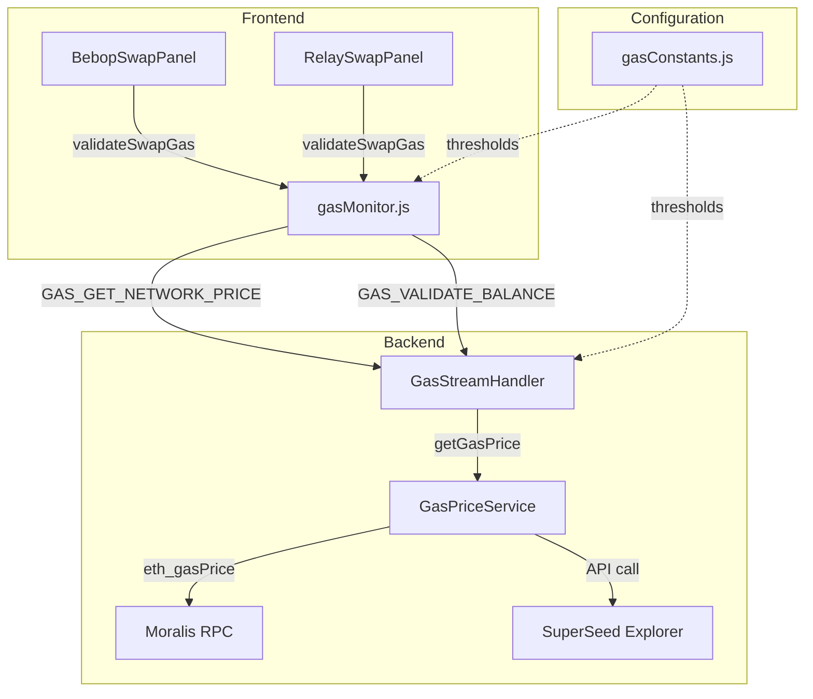
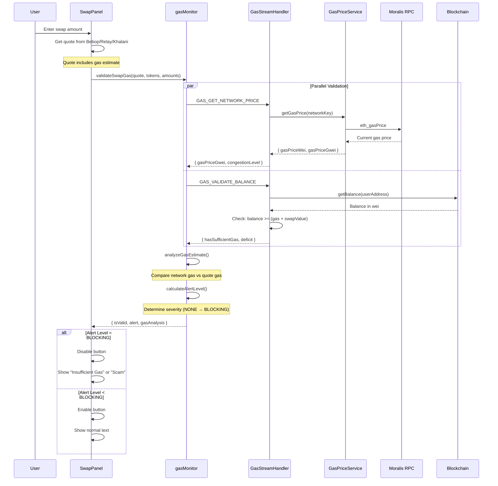
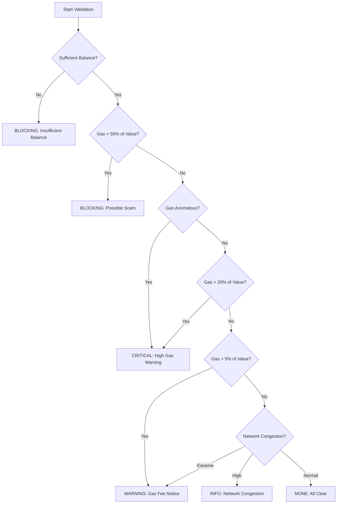

# SuperSafe Wallet - Gas Validation System

**Created:** November 17, 2025  
**Last Updated:** February 9, 2026  
**Version:** 3.1.8  
**Status:** ✅ CURRENT  
**Last Code Update:** February 9, 2026

---

## Table of Contents

1. [Overview](#overview)
2. [Architecture](#architecture)
3. [Gas Thresholds](#gas-thresholds)
4. [Validation Flow](#validation-flow)
5. [Backend Services](#backend-services)
6. [Frontend Integration](#frontend-integration)
7. [Alert System](#alert-system)
8. [Configuration](#configuration)
9. [Testing](#testing)
10. [File Reference](#file-reference)

---

## Overview

SuperSafe Wallet implements a comprehensive gas validation system that protects users from:

- **💰 Insufficient Balance**: Ensures users have enough native tokens to pay gas fees
- **🚨 Scam Detection**: Identifies malicious contracts with abnormally high gas costs
- **📊 Network Congestion**: Warns users about high network congestion
- **⚠️ Uneconomical Swaps**: Alerts when gas fees exceed reasonable percentages of swap value

### Key Features

- **✅ Real-time Gas Monitoring**: Fetches current network gas prices via Moralis RPC
- **✅ Dual Validation**: Compares network gas vs quote gas to detect anomalies
- **✅ Multi-Network Support**: Network-specific thresholds for 6 EVM chains
- **✅ Progressive Alerts**: 5-level alert system (NONE → BLOCKING)
- **✅ Button-Integrated UI**: Alerts shown directly on swap button (no separate components)
- **✅ Automatic Blocking**: Disables swap when insufficient balance or gas > 50% of value

---

## Architecture

### System Overview



### Design Philosophy

**Security First**
- All RPC calls happen in background (protects API keys)
- Frontend uses streams exclusively (no direct blockchain access)
- Gas prices cached to prevent excessive API calls (15s cache)

**User Protection**
- Compares network gas price vs quote gas price to detect anomalies
- Blocks transactions when gas > 50% of swap value
- Progressive alert system (info → warning → critical → blocking)

**Clean UX**
- All alerts shown in swap button text (no separate components)
- Button disabled only for BLOCKING level alerts
- Maintains existing design patterns

---

## Gas Thresholds

### Network-Specific Thresholds (Q4 2025)

Based on current market data from official explorers and wallet providers:

| Network | Low | Medium | High | Extreme | Unit |
|---------|-----|--------|------|---------|------|
| **Ethereum** | 5 | 20 | 60 | 120 | Gwei |
| **Optimism** | 0.001 | 0.01 | 0.1 | 0.5 | Gwei |
| **Arbitrum** | 0.01 | 0.1 | 1 | 5 | Gwei |
| **Base** | 0.001 | 0.01 | 0.1 | 0.5 | Gwei |
| **BSC** | 0.05 | 0.5 | 2 | 5 | Gwei |
| **SuperSeed** | 0.001 | 0.01 | 0.1 | 0.5 | Gwei |

**Sources:**
- Ethereum: MEXC Blog, Ethereum Blockchain Explorer, Ycharts
- L2s: Cyfrin tools, Official docs, Block explorers
- BSC: BscScan, Official network stats

### Percentage Thresholds

Gas cost vs swap value:

| Level | Threshold | Action |
|-------|-----------|--------|
| **Warning** | 5% | Display warning message |
| **Critical** | 20% | Strong warning |
| **Blocking** | 50% | Disable swap button |

### Gas Limit Expectations

| Swap Type | Typical | Warning | Extreme |
|-----------|---------|---------|---------|
| **Simple Swap** | 150,000 | 250,000 | 500,000 |
| **Cross-Chain** | 300,000 | 500,000 | 1,000,000 |

---

## Validation Flow

### Complete Validation Sequence



### Three-Layer Validation

#### 1. Balance Validation

**Purpose:** Ensure user can afford gas + swap value

```javascript
// For native token swaps (ETH, BNB, etc.)
totalNeeded = gasEstimateWei + swapValueWei

// For ERC20 swaps
totalNeeded = gasEstimateWei  // Only gas, swap value is ERC20

if (userBalance < totalNeeded) {
  return BLOCKING: "Insufficient balance for gas"
}
```

#### 2. Gas Price Analysis

**Purpose:** Detect anomalous gas prices (scam detection)

```javascript
// Calculate implied gas price from quote
impliedGasPrice = quoteGasCostWei / quoteGasUnits
impliedGasPriceGwei = impliedGasPrice / 1e9

// Get current network gas price from Moralis
networkGasPriceGwei = await getNetworkGasPrice(networkKey)

// Compare with thresholds
if (impliedGasPriceGwei > thresholds.extreme) {
  isPriceAnomalous = true  // Quote is charging way more than network
}

if (quoteGasUnits > limitExpectations.extreme) {
  isLimitAnomalous = true  // Gas limit is suspiciously high
}
```

#### 3. Percentage Analysis

**Purpose:** Ensure gas cost is economical relative to swap value

```javascript
gasPercentage = (gasCostUsd / swapValueUsd) * 100

if (gasPercentage > 50%) {
  return BLOCKING: "Gas Fee Too High - Possible Scam"
}

if (gasPercentage > 20%) {
  return CRITICAL: "High Gas Fee Warning"
}

if (gasPercentage > 5%) {
  return WARNING: "Gas Fee Notice"
}
```

---

## Backend Services

### GasPriceService

**Location:** `src/background/services/GasPriceService.js`

**Responsibilities:**
- Fetch current gas prices from Moralis RPC or SuperSeed Explorer
- Cache gas prices for 15 seconds
- Handle network-specific API endpoints

**Key Functions:**

```javascript
// Main API
getGasPrice(networkKey) → { gasPriceWei, gasPriceGwei, source }

// Network-specific implementations
getMoralisGasPrice(networkKey) → calls eth_gasPrice via Moralis RPC
getSuperSeedGasPrice() → calls SuperSeed Explorer API
```

**Caching Strategy:**

```javascript
const gasPriceCache = new Map();
const CACHE_DURATION_MS = 15000; // 15 seconds

// Cache key: networkKey
// Cache value: { data, timestamp }
```

### GasStreamHandler

**Location:** `src/background/handlers/streams/GasStreamHandler.js`

**Message Types:**

#### GAS_GET_NETWORK_PRICE

**Request:**
```javascript
{
  type: 'GAS_GET_NETWORK_PRICE',
  payload: { networkKey: 'ethereum' }
}
```

**Response:**
```javascript
{
  success: true,
  data: {
    gasPriceWei: "5000000000",    // 5 Gwei in wei
    gasPriceGwei: 5,
    congestionLevel: "low",       // low | normal | moderate | high | extreme
    thresholds: { low: 5, medium: 20, high: 60, extreme: 120 },
    source: "moralis_rpc"
  }
}
```

#### GAS_VALIDATE_BALANCE

**Request:**
```javascript
{
  type: 'GAS_VALIDATE_BALANCE',
  payload: {
    userAddress: "0x...",
    networkKey: "ethereum",
    swapValue: "1000000000000000000",  // 1 ETH in wei
    gasEstimateWei: "315000000000000", // 0.000315 ETH
    isNativeTokenSwap: true
  }
}
```

**Response:**
```javascript
{
  success: true,
  data: {
    hasSufficientGas: false,
    deficit: "315000000000000",       // Amount short
    currentBalance: "500000000000000", // 0.0005 ETH
    required: "1315000000000000"      // 0.001315 ETH
  }
}
```

---

## Frontend Integration

### gasMonitor.js

**Location:** `src/utils/gasMonitor.js`

**Main API:**

```javascript
validateSwapGas({
  quote,              // Quote from Bebop or Relay
  payToken,           // Token being sold
  receiveToken,       // Token being bought
  payAmount,          // Amount being sold
  swapValueUsd,       // Swap value in USD (calculated by panel)
  gasCostUsd,         // Gas cost in USD (from quote or calculated)
  userAddress,        // User wallet address
  networkKey,         // Network identifier
  isCrossChain,       // Whether cross-chain swap
  provider            // 'bebop' or 'relay'
})
```

**Return Value:**

```javascript
{
  isValid: false,                    // Whether swap can proceed
  alert: {
    level: "blocking",               // NONE | INFO | WARNING | CRITICAL | BLOCKING
    message: "Insufficient ETH for Gas",
    details: "You need 0.00032 ETH more to complete this transaction.",
    gasPercentage: 0
  },
  gasAnalysis: {
    impliedGasPriceGwei: 50,
    networkGasPriceGwei: 5,
    isPriceAnomalous: true,
    isLimitAnomalous: false,
    congestionLevel: "normal"
  },
  balanceValidation: {
    hasSufficientGas: false,
    deficit: "315000000000000"
  },
  recommendedGasLimit: "180000"     // With 1.2x safety margin
}
```

### BebopSwapPanel Integration

**Location:** `src/components/swap/BebopSwapPanel.jsx`

**State:**
```javascript
const [gasValidation, setGasValidation] = useState(null);
```

**Gas Validation Effect:**
```javascript
useEffect(() => {
  const validateGas = async () => {
    if (!quote || !payToken || !receiveToken || !currentWallet) return;
    
    // Calculate swap value USD
    const swapValueResult = await calculateTokenUsdValue(payAmount, payToken.address, chainId);
    const swapValueUsd = swapValueResult.success ? swapValueResult.data.usdValue : 0;
    
    // Get gas cost USD from quote
    const gasCostUsd = quote.gasFee?.usd || 0;
    
    // Validate
    const validation = await validateSwapGas({
      quote,
      payToken,
      receiveToken,
      payAmount,
      swapValueUsd: swapValueUsd.toString(),
      gasCostUsd: gasCostUsd.toString(),
      userAddress: currentWallet.address,
      networkKey,
      isCrossChain: false,
      provider: 'bebop'
    });
    
    setGasValidation(validation);
  };
  
  validateGas();
}, [quote, payToken, receiveToken, payAmount, currentWallet, networkKey]);
```

**Button Logic:**
```javascript
// Disable button condition
disabled={
  // ... other conditions ...
  || (gasValidation && !gasValidation.isValid)
}

// Button text
const getButtonText = () => {
  // Gas validation FIRST (highest priority)
  if (gasValidation && !gasValidation.isValid) {
    if (gasValidation.alert?.level === GAS_ALERT_LEVEL.BLOCKING) {
      if (gasValidation.alert.message.includes('Insufficient balance')) {
        return `Insufficient ${networkConfig?.nativeCurrency?.symbol || 'ETH'} for Gas`;
      }
      return "Gas Fee Too High - Possible Scam";
    }
  }
  
  // ... other button states ...
}
```

### RelaySwapPanel Integration

**Location:** `src/components/swap/RelaySwapPanel.jsx`

**Provider-Specific Gas Calculation:**

```javascript
// For Relay, calculate gas cost USD from wei
const gasEstimateWei = quote._metadata?.gasEstimate?.perStep?.reduce((sum, step) => 
  sum + BigInt(step.gasCost || '0'), 0n) || 0n;

// Convert wei to ETH then to USD
const gasEstimateEth = parseFloat(gasEstimateWei.toString()) / 1e18;
const nativeTokenUsdResult = await calculateTokenUsdValue('1', ZERO_ADDRESS, fromChainId);
const gasCostUsd = nativeTokenUsdResult.success 
  ? (gasEstimateEth * nativeTokenUsdResult.data.usdValue) 
  : 0;

const validation = await validateSwapGas({
  // ... other params ...
  gasCostUsd: gasCostUsd.toString(),
  isCrossChain: networkKey !== toNetworkKey,
  provider: 'relay'
});
```

### dApp Transaction Integration

**Version:** 3.1.8  
**Added:** November 17, 2025

#### Overview

Gas validation extended to protect users from malicious dApp transactions. When external dApps (Uniswap, PancakeSwap, Velodrome, etc.) initiate transactions via `eth_sendTransaction`, the system validates gas costs and blocks suspicious transactions.

#### Integration Points

**Backend Integration:**
- **Location:** `src/background/handlers/streams/ProviderStreamHandler.js`
- **Trigger:** `eth_sendTransaction` requests (line ~1312)
- **Validation:** Runs after transaction decoder, before popup
- **Data flow:** Attached to `decodedTransaction.gasValidation`

**Frontend Integration:**
- **Location:** `src/components/screens/TransactionConfirmationScreen.jsx`
- **Display:** Enhanced gas section with color-coding and expandable details
- **Button:** Disabled for BLOCKING level alerts with descriptive text

#### Validation Flow

```
eth_sendTransaction from dApp
  ↓
Extract: gasLimit, gasPrice/maxFeePerGas, value
  ↓
Calculate: gasCostWei, swapValueUsd, gasCostUsd
  ↓
Call: validateDAppTransactionGas()
  ↓
Validate: Balance, Gas Analysis, Alert Level
  ↓
Attach: decodedTransaction.gasValidation
  ↓
UI: Show in TransactionConfirmationScreen
  ↓
Block or Allow based on alert.level
```

#### Transaction Types Protected

- **Token swaps:** Uniswap V2/V3, PancakeSwap, SushiSwap, Velodrome, Aerodrome
- **Token approvals:** ERC20 approve calls
- **NFT mints:** ERC-721, ERC-1155
- **Complex contract interactions:** Multicall, batch operations
- **Native token transfers:** ETH, BNB, etc.
- **Batch operations:** Multicall and bundled transactions

#### NOT Protected

- `personal_sign` - Off-chain, no gas consumption
- `eth_signTypedData` - Off-chain, no gas consumption
- Permit2 signatures - Off-chain, gasless approvals

#### UI Behavior

**Button States:**
- BLOCKING + Insufficient balance → "Insufficient ETH for Gas" (disabled, red)
- BLOCKING + Gas > 50% → "Gas Fee Extremely High" (disabled, red)
- All other levels → "Confirm Transaction" (enabled, green)

**Gas Section Display:**
- **RED background:** BLOCKING level
- **ORANGE background:** CRITICAL level
- **YELLOW background:** WARNING level
- **Normal background:** NONE/INFO level
- **Expandable:** Click to see detailed analysis
- **Shows:** Network gas vs transaction gas, congestion level, price level, gas percentage

**Expandable Details Include:**
- Network Gas Price (Gwei)
- Transaction Gas Price (Gwei)
- Network Status (low/normal/moderate/high/extreme)
- Price Level (low/medium/high/extreme)
- Gas vs Transaction Value (%)
- Anomaly warnings
- Error messages (if validation incomplete)

#### Error Handling

Following "No Fallbacks" policy:
- **Missing gas params** → Skip validation, show warning, allow transaction
- **USD calculation fails** → Use 0, log warning, don't block
- **Validation throws error** → Allow transaction, show error in expandable section
- **Network RPC fails** → Use cached data or skip validation

#### EIP-1559 Support

Handles both legacy and EIP-1559 transactions:
- **Legacy:** Uses `gasPrice`
- **EIP-1559:** Uses `maxFeePerGas` (worst-case scenario, safe for validation)
- Automatically detects transaction type
- Logs which gas price format is being used

---

## Alert System

### Alert Levels

```javascript
export const GAS_ALERT_LEVEL = {
  NONE: 'none',           // Everything normal - no action
  INFO: 'info',           // Gas slightly elevated - informational only
  WARNING: 'warning',     // Gas high - user should be aware
  CRITICAL: 'critical',   // Gas very high - transaction may not be economical
  BLOCKING: 'blocking'    // Gas extreme - transaction blocked for safety
};
```

### Alert Determination Logic



### Alert Messages

| Level | Condition | Button Text | Button Disabled |
|-------|-----------|-------------|-----------------|
| **BLOCKING** | Insufficient balance | "Insufficient ETH for Gas" | ✅ Yes |
| **BLOCKING** | Gas > 50% of value | "Gas Fee Too High - Possible Scam" | ✅ Yes |
| **CRITICAL** | Gas anomalous or > 20% | Normal text (swap proceeds) | ❌ No |
| **WARNING** | Gas > 5% or high congestion | Normal text (swap proceeds) | ❌ No |
| **INFO** | Moderate congestion | Normal text (swap proceeds) | ❌ No |
| **NONE** | All clear | Normal text (swap proceeds) | ❌ No |

**Design Decision:** Only BLOCKING level alerts disable the swap button and change button text. Lower levels are logged for future UI enhancements but don't interrupt the user flow.

---

## Configuration

### Environment Variables

No environment variables required - thresholds are hardcoded based on current market data.

### Updating Thresholds

**Location:** `src/utils/gasConstants.js`

**Update Process:**
1. Review current market data from explorers
2. Update thresholds in `gasConstants.js`
3. Update `@lastUpdated` timestamp in file header
4. Document sources in comments
5. Test on all networks

**Recommended Review Frequency:** Quarterly (Q1, Q2, Q3, Q4)

### Network-Specific Configuration

Each network in `NETWORKS` object automatically uses corresponding thresholds from `GAS_THRESHOLDS`:

```javascript
// Automatic mapping by networkKey
const thresholds = GAS_THRESHOLDS[networkKey] || GAS_THRESHOLDS.ethereum;
```

---

## Testing

### Test Scenarios

#### 1. Normal Swap (All Clear)
```
Network gas: 5 Gwei (Ethereum)
Quote gas: 5.2 Gwei
Swap value: $1000
Gas cost: $2 (0.2%)
Expected: NONE - Swap proceeds normally
```

#### 2. Insufficient Balance
```
User balance: 0.0005 ETH
Gas needed: 0.001 ETH
Swap value: 0 ETH (ERC20 swap)
Expected: BLOCKING - "Insufficient ETH for Gas"
```

#### 3. High Gas Percentage (Scam)
```
Swap value: $100
Gas cost: $60 (60%)
Expected: BLOCKING - "Gas Fee Too High - Possible Scam"
```

#### 4. Anomalous Gas Price
```
Network gas: 5 Gwei
Quote gas: 150 Gwei (30x higher!)
Expected: CRITICAL - Logged but swap allowed
```

#### 5. Network Congestion
```
Network gas: 180 Gwei (Ethereum)
Quote gas: 185 Gwei
Expected: WARNING/INFO - Congestion detected
```

#### 6. Cross-Chain Relay Swap
```
Origin: Ethereum
Destination: Optimism
Gas: Multiple steps summed
Expected: Normal validation with cross-chain flag
```

### Manual Testing Checklist

**Before Production:**
- [ ] Test on Ethereum mainnet (real gas prices)
- [ ] Test on L2s (Optimism, Arbitrum, Base)
- [ ] Test on BSC
- [ ] Test on SuperSeed
- [ ] Test with low balance (insufficient gas)
- [ ] Test with mock high gas quote (scam detection)
- [ ] Test Bebop provider integration
- [ ] Test Relay provider integration
- [ ] Verify button text changes correctly
- [ ] Verify button disables for BLOCKING alerts
- [ ] Verify button stays enabled for lower alerts
- [ ] Test cache (15s duration)
- [ ] Test concurrent validations (race conditions)

### Integration Testing

```javascript
describe('Gas Validation System', () => {
  describe('Balance Validation', () => {
    it('should detect insufficient balance', async () => {
      const result = await validateSwapGas({
        // ... params with low balance
      });
      expect(result.isValid).toBe(false);
      expect(result.alert.level).toBe('blocking');
    });
  });
  
  describe('Gas Price Analysis', () => {
    it('should detect anomalous gas prices', async () => {
      // Mock network gas: 5 Gwei
      // Mock quote gas: 150 Gwei
      const result = await validateSwapGas({
        // ... params
      });
      expect(result.gasAnalysis.isPriceAnomalous).toBe(true);
    });
  });
  
  describe('Percentage Analysis', () => {
    it('should block when gas > 50% of value', async () => {
      const result = await validateSwapGas({
        swapValueUsd: '100',
        gasCostUsd: '60'  // 60%
      });
      expect(result.isValid).toBe(false);
      expect(result.alert.message).toContain('Possible Scam');
    });
  });
});
```

---

## File Reference

### New Files Created

| File | Lines | Purpose |
|------|-------|---------|
| **`src/utils/gasConstants.js`** | 114 | Centralized gas thresholds and constants |
| **`src/utils/gasMonitor.js`** | 401 | Frontend gas validation service |
| **`src/background/services/GasPriceService.js`** | 168 | Backend gas price fetching with caching |
| **`src/background/handlers/streams/GasStreamHandler.js`** | 153 | Stream handler for gas operations |

### Modified Files

| File | Changes | Purpose |
|------|---------|---------|
| **`src/background.js`** | +4 lines | Register GasStreamHandler |
| **`src/utils/SwapAdapter.js`** | +1 line | Export StreamConnectionManager |
| **`src/components/swap/BebopSwapPanel.jsx`** | +47 lines | Integrate gas validation |
| **`src/components/swap/RelaySwapPanel.jsx`** | +52 lines | Integrate gas validation |

### Total Impact

- **New Files:** 4 (836 lines total)
- **Modified Files:** 4 (104 lines changed)
- **Total Lines:** 940 lines of new code
- **Test Coverage:** Integration tests pending

---

## Architecture Compliance

**✅ ARCHITECTURE.md Compliance:**

- ✅ **Backend-only RPC**: All gas price fetching in background
- ✅ **Single source of truth**: Thresholds centralized in `gasConstants.js`
- ✅ **Thin client pattern**: Frontend uses `gasMonitor.js` (delegates to background)
- ✅ **Stream-based communication**: All operations via `gas` stream messages
- ✅ **No frontend crypto**: All RPC calls in background via `GasStreamHandler`
- ✅ **Separation of concerns**: Clear boundaries between layers

**Security Benefits:**
- API keys protected (background-only)
- No direct RPC access from frontend
- Cached data reduces API exposure
- Comprehensive validation before transactions

---

## Performance Metrics

| Metric | Value | Notes |
|--------|-------|-------|
| **Cache Duration** | 15 seconds | Balances freshness vs API calls |
| **Validation Time** | ~100-300ms | 2 parallel backend calls |
| **API Calls per Swap** | 2 | Gas price + balance check |
| **Bundle Size Impact** | +3.2 KB | Minimal overhead |
| **Memory Footprint** | ~50 KB | Cache + state |

---

## Future Enhancements

### Planned Features

- [ ] Historical gas price charts in UI
- [ ] Gas price prediction (next 5 minutes)
- [ ] User-configurable thresholds
- [ ] Gas price alerts (notifications)
- [ ] Alternative providers (Etherscan Gas Tracker)
- [ ] EIP-1559 support (base fee + priority fee)
- [ ] Gas optimization suggestions

### Monitoring Requirements

- [ ] Log gas validation failures
- [ ] Track false positive rate
- [ ] Monitor threshold accuracy
- [ ] Alert on sustained high congestion
- [ ] Dashboard for gas metrics

---

## Related Documentation

- [SWAP_SYSTEM.md](./SWAP_SYSTEM.md) - Swap system architecture
- [ARCHITECTURE.md](./ARCHITECTURE.md) - System architecture
- [BLOCKCHAIN_OPERATIONS.md](./BLOCKCHAIN_OPERATIONS.md) - Blockchain operations
- [BACKEND.md](./BACKEND.md) - Backend stream handlers

---

**Document Status:** ✅ Complete and Current  
**Code Version:** v1.0.0  
**Last Code Update:** November 17, 2025  
**Next Review:** February 2026 (Q1 2026 - quarterly threshold review)  
**Maintainer:** SuperSafe Development Team

---

## Appendix A: Gas Price Sources

### Ethereum
- **MEXC Blog**: Ethereum gas price trends and analysis
- **Ethereum Blockchain Explorer**: Real-time gas tracker
- **Ycharts**: Historical gas price data

### Layer 2 Networks
- **Cyfrin Tools**: L2 gas price monitoring
- **Official Documentation**: Optimism, Arbitrum, Base docs
- **Block Explorers**: Optimistic Etherscan, Arbiscan, Basescan

### BSC
- **BscScan**: Real-time BSC gas tracker
- **Official Network Stats**: BNB Chain analytics

---

## Appendix B: Threshold Update Template

When updating thresholds:

```javascript
/**
 * Gas price thresholds by network (in Gwei)
 * @lastUpdated YYYY-Q# (e.g., 2025-Q4)
 * 
 * Sources:
 * - Ethereum: [List sources with URLs]
 * - L2s: [List sources with URLs]
 * - BSC: [List sources with URLs]
 * 
 * Data Collection Period: [Date range]
 * Average Gas Observed: [Values by network]
 * Peak Gas Observed: [Values by network]
 */
```

---

## Appendix C: Alert Message Customization

All alert messages are defined in `gasMonitor.js`:

```javascript
// For insufficient balance
return {
  level: GAS_ALERT_LEVEL.BLOCKING,
  message: 'Insufficient balance to cover gas fees',
  details: `You need ${deficit} more native tokens to complete this transaction.`
};

// For scam detection
return {
  level: GAS_ALERT_LEVEL.BLOCKING,
  message: 'Gas Fee Too High - Possible Scam',
  details: `Gas fee ($${gasCostNum.toFixed(2)}) is ${gasPercentage.toFixed(0)}% of your swap value ($${swapValueNum.toFixed(2)}). This is highly unusual and may indicate a malicious contract.`
};
```

To customize messages, edit these strings in `calculateAlertLevel()` function.
