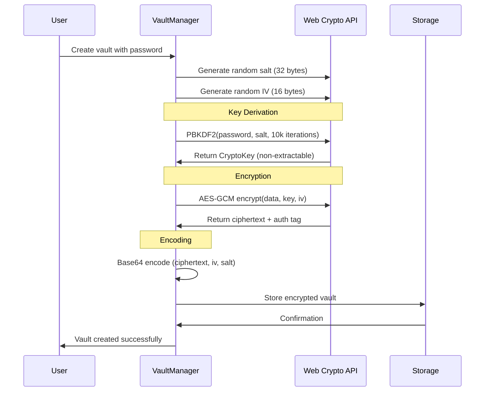
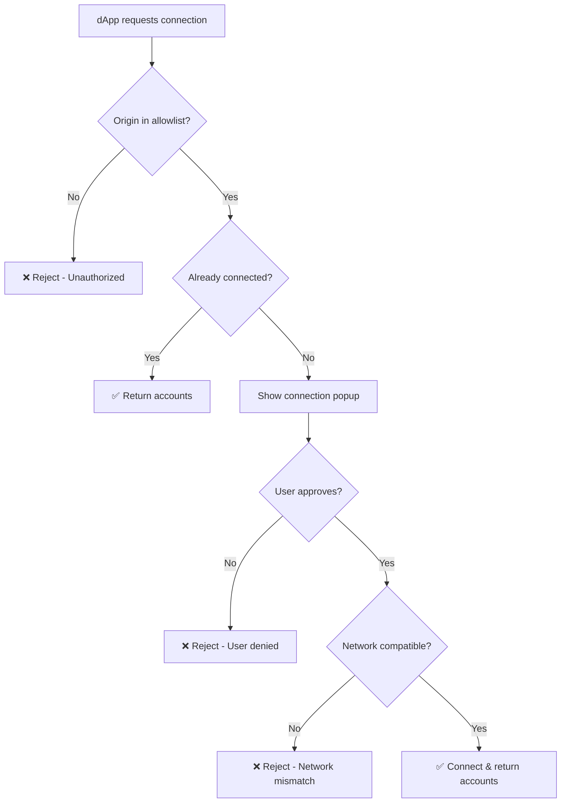

# SuperSafe Wallet - Security Architecture

**Created:** October 13, 2025  
**Version:** 3.0.0+  
**Status:** ✅ CURRENT  
**Security Level:** Enterprise-Grade

---

## Table of Contents

1. [Security Overview](#security-overview)
2. [Security Model](#security-model)
3. [Cryptographic Implementation](#cryptographic-implementation)
4. [Unified Vault System](#unified-vault-system)
5. [Session Security](#session-security)
6. [Memory Protection](#memory-protection)
7. [dApp Security](#dapp-security)
8. [Network Security](#network-security)
9. [Attack Mitigation](#attack-mitigation)
10. [Security Best Practices](#security-best-practices)

---

## Security Overview

SuperSafe Wallet implements a **defense-in-depth security model** with multiple layers of protection. All security-critical operations execute in the isolated background service worker context, with zero exposure of private keys to the frontend.

### Security Scorecard

```
╔════════════════════════════════════════════════╗
║      SuperSafe Security Assessment             ║
╠════════════════════════════════════════════════╣
║ Encryption:          AES-256-GCM     [100/100] ║
║ Key Derivation:      PBKDF2-10k      [98/100]  ║
║ Session Security:    Memory-Only     [100/100] ║
║ Memory Protection:   Auto-Cleanup    [95/100]  ║
║ Rate Limiting:       Adaptive        [90/100]  ║
║ Attack Prevention:   Multi-Layer     [95/100]  ║
╠════════════════════════════════════════════════╣
║ OVERALL SECURITY SCORE:              [96/100]  ║
╚════════════════════════════════════════════════╝
```

### Core Security Principles

1. **✅ Zero-Knowledge Architecture**: Complete local-only security model
2. **✅ Memory-First Security**: Temporary sessions with automatic cleanup
3. **✅ Vault-Centric Design**: Unified encrypted storage for all sensitive data
4. **✅ Defense-in-Depth**: Multiple security layers with failsafe mechanisms
5. **✅ Principle of Least Privilege**: Minimal permissions and access control
6. **✅ Cryptographic Isolation**: All crypto operations in background only

---

## Security Model

### Security Architecture Diagram

```
┌─────────────────────────────────────────────────────────────┐
│                    Security Layers                          │
├─────────────────────────────────────────────────────────────┤
│ Layer 1: Browser Isolation                                  │
│   - Chrome Extension Sandbox                                │
│   - Manifest V3 Security Model                              │
│   - Service Worker Isolation                                │
├─────────────────────────────────────────────────────────────┤
│ Layer 2: Context Separation                                 │
│   - Background (Trusted)                                    │
│   - Frontend (Untrusted)                                    │
│   - Content Script (Isolated)                               │
│   - Web Page (External)                                     │
├─────────────────────────────────────────────────────────────┤
│ Layer 3: Cryptographic Protection                           │
│   - AES-256-GCM Encryption                                  │
│   - PBKDF2 Key Derivation (10,000 iterations)               │
│   - Random Salt & IV Generation                             │
│   - Non-Extractable Keys                                    │
├─────────────────────────────────────────────────────────────┤
│ Layer 4: Session Management                                 │
│   - Memory-Only Storage                                     │
│   - Auto-Lock Timer (15 min default)                        │
│   - Activity Tracking                                       │
│   - Secure Password Handling                                │
├─────────────────────────────────────────────────────────────┤
│ Layer 5: Access Control                                     │
│   - AllowList System                                        │
│   - Origin Validation                                       │
│   - Permission Management                                   │
│   - Connection Tracking                                     │
├─────────────────────────────────────────────────────────────┤
│ Layer 6: Attack Mitigation                                  │
│   - Rate Limiting                                           │
│   - Blacklist Management                                    │
│   - Request Deduplication                                   │
│   - Phishing Protection                                     │
└─────────────────────────────────────────────────────────────┘
```

### Trust Boundaries

```mermaid
graph TB
    subgraph Untrusted["❌ UNTRUSTED ZONE"]
        WEB[Web Pages]
        DAPP[dApp Code]
    end
    
    subgraph Isolated["🔒 ISOLATED ZONE"]
        CONTENT[Content Script]
        PROVIDER[EIP-1193 Provider]
    end
    
    subgraph Trusted["✅ TRUSTED ZONE"]
        FRONTEND[Frontend UI]
        ADAPTERS[Adapters]
    end
    
    subgraph Secure["🛡️ SECURE ZONE"]
        BACKGROUND[Background Script]
        CRYPTO[Crypto Operations]
        VAULT[Encrypted Vault]
    end
    
    WEB -.postMessage.-> CONTENT
    CONTENT -.chrome.runtime.-> BACKGROUND
    FRONTEND -.chrome.streams.-> BACKGROUND
    BACKGROUND --> CRYPTO
    CRYPTO --> VAULT
    
    style WEB fill:#ffebee
    style CONTENT fill:#fff3e0
    style FRONTEND fill:#e8f5e9
    style BACKGROUND fill:#e3f2fd
    style VAULT fill:#f3e5f5
```

---

## Cryptographic Implementation

### Encryption Stack

**Algorithm:** AES-256-GCM (Galois/Counter Mode)
- **Symmetric Encryption**: AES with 256-bit keys
- **Authenticated Encryption**: GCM provides authentication + encryption
- **Tag Length**: 128 bits
- **Non-Extractable Keys**: Keys never leave CryptoKey objects

**Key Derivation:** PBKDF2 (Password-Based Key Derivation Function 2)
- **Hash Function**: SHA-256
- **Iterations**: 10,000 (MetaMask-compatible)
- **Salt**: 32 bytes random per vault
- **Output**: 256-bit AES key

### Vault Encryption Flow



### Vault Structure

```javascript
EncryptedVault {
  data: string,     // Base64(ciphertext + GCM auth tag)
  iv: string,       // Base64(16-byte initialization vector)
  salt: string      // Base64(32-byte random salt)
}

// Decrypted Vault Content
VaultData {
  version: "1.0.0",
  createdAt: timestamp,
  updatedAt: timestamp,
  wallets: [
    {
      address: "0x...",
      name: "Wallet 1",
      emoji: "🦊",
      encryptedPrivateKey: string,  // Double encryption
      isHD: boolean,
      hdPath: string
    }
  ],
  settings: {
    autoLockMinutes: 15,
    currency: "USD",
    language: "en"
  }
}
```

### Implementation Example

```javascript
// Vault Encryption (src/utils/vaultManager.js)
async encryptVault(vaultData, password) {
  // Generate cryptographically secure random values
  const iv = crypto.getRandomValues(new Uint8Array(16));
  const salt = crypto.getRandomValues(new Uint8Array(32));
  
  // Derive encryption key from password
  const deriveKeyFromPassword = async (password, saltBytes) => {
    const pwKey = await crypto.subtle.importKey(
      "raw",
      new TextEncoder().encode(password),
      "PBKDF2",
      false,
      ["deriveKey"]
    );
    return crypto.subtle.deriveKey(
      { 
        name: "PBKDF2", 
        salt: saltBytes, 
        iterations: 10000,  // MetaMask-compatible
        hash: "SHA-256" 
      },
      pwKey,
      { name: "AES-GCM", length: 256 },
      false,  // Non-extractable
      ["encrypt", "decrypt"]
    );
  };
  
  const key = await deriveKeyFromPassword(password, salt);
  
  // Encrypt data with AES-GCM
  const plainBytes = new TextEncoder().encode(JSON.stringify(vaultData));
  const cipherBytes = await crypto.subtle.encrypt(
    { name: "AES-GCM", iv: iv, tagLength: 128 },
    key,
    plainBytes
  );
  
  // Encode to Base64 for storage
  const b64 = (buf) => btoa(String.fromCharCode(...new Uint8Array(buf)));
  
  return {
    data: b64(cipherBytes),
    iv: b64(iv.buffer),
    salt: b64(salt.buffer)
  };
}
```

---

## Unified Vault System

### Vault Architecture

The vault system provides centralized, encrypted storage for all sensitive data.

**Vault Components:**
```
Unified Vault
├── Header Metadata
│   ├── Version: "1.0.0"
│   ├── Created: timestamp
│   └── Updated: timestamp
├── Encrypted Wallets
│   ├── Wallet 1 (address, name, emoji, private key)
│   ├── Wallet 2 (...)
│   └── Wallet N (...)
└── Settings
    ├── Auto-lock timeout
    ├── Currency preference
    └── Language preference
```

### Vault Operations

**Create Vault:**
```javascript
// Location: src/background/BackgroundSessionController.js
async createVault(wallets, settings, password) {
  // 1. Validate password strength
  if (!password || password.length < 8) {
    throw new Error('Password must be at least 8 characters');
  }
  
  // 2. Create vault content
  const vaultContent = {
    version: '1.0.0',
    createdAt: Date.now(),
    updatedAt: Date.now(),
    wallets: wallets,
    settings: settings
  };
  
  // 3. Encrypt vault
  const encryptedVault = await vaultManager.encryptVault(vaultContent, password);
  
  // 4. Store in chrome.storage.local
  await vaultStorage.saveVault(encryptedVault);
  
  // 5. Mark as initialized
  this.hasVault = true;
  
  return { success: true };
}
```

**Unlock Vault:**
```javascript
async unlock(password, origin = null, tokenController = null) {
  // 1. Load encrypted vault
  const encryptedVault = await vaultStorage.loadVault();
  
  // 2. Attempt decryption
  try {
    const decryptedData = await vaultManager.unlockVault(encryptedVault, password);
    
    // 3. Cache in memory
    this.vaultData = decryptedData;
    this.password = password;  // Memory only
    this.isUnlocked = true;
    
    // 4. Extract private keys (double-encrypted)
    this.decryptedWallets = new Map();
    for (const wallet of decryptedData.wallets) {
      const privateKey = await this.decryptWalletKey(wallet, password);
      this.decryptedWallets.set(wallet.address, privateKey);
    }
    
    // 5. Start auto-lock timer
    this.startAutoLockTimer();
    
    // 6. Persist session
    await this.persistSessionState();
    
    return { success: true, wallets: decryptedData.wallets };
  } catch (error) {
    // Rate limiting on failed attempts
    this.recordUnlockAttempt();
    throw new Error('Invalid password');
  }
}
```

**Lock Vault:**
```javascript
async lock() {
  console.log('[Security] 🔒 Locking vault...');
  
  // 1. Clear sensitive data from memory
  this.password = null;
  this.vaultData = null;
  this.decryptedWallets.clear();
  
  // 2. Clear session state
  this.isUnlocked = false;
  
  // 3. Stop auto-lock timer
  this.stopAutoLockTimer();
  
  // 4. Clear session storage
  await this.clearSessionState();
  
  // 5. Notify all contexts
  this.broadcastSessionLocked();
  
  console.log('[Security] ✅ Vault locked successfully');
}
```

### Vault Storage

**Location:** `src/utils/vaultStorage.js`

```javascript
// Uses chrome.storage.local for persistence
export default {
  async saveVault(encryptedVault) {
    await chrome.storage.local.set({
      'supersafe_vault': encryptedVault,
      'supersafe_vault_timestamp': Date.now()
    });
  },
  
  async loadVault() {
    const result = await chrome.storage.local.get('supersafe_vault');
    return result.supersafe_vault || null;
  },
  
  async hasVault() {
    const vault = await this.loadVault();
    return vault !== null;
  },
  
  async deleteVault() {
    await chrome.storage.local.remove([
      'supersafe_vault',
      'supersafe_vault_timestamp'
    ]);
  }
};
```

---

## Session Security

### Session Architecture

```
Session Lifecycle:
┌─────────────┐
│   LOCKED    │ ← Default state
└──────┬──────┘
       │ unlock(password)
       ↓
┌─────────────┐
│  UNLOCKED   │ ← Active session
└──────┬──────┘
       │ auto-lock / manual lock
       ↓
┌─────────────┐
│   LOCKED    │ ← Secure state
└─────────────┘
```

### Session State Management

**Session State (Memory Only):**
```javascript
BackgroundSessionController {
  // Security-critical state (never persisted unencrypted)
  isUnlocked: boolean,
  password: string,                    // Memory only
  vaultData: Object,                   // Decrypted vault
  decryptedWallets: Map<address, key>, // Private keys
  
  // Session metadata
  lastActivityTime: timestamp,
  autoLockTimer: TimerId,
  autoLockTimeoutMs: 900000,  // 15 minutes default
  
  // Connected sites
  connectedSites: Map<origin, siteData>
}
```

### Auto-Lock System

**Purpose:** Automatically lock wallet after inactivity to protect against unauthorized access.

```javascript
// Auto-lock implementation
startAutoLockTimer() {
  this.stopAutoLockTimer();  // Clear existing timer
  
  this.autoLockTimer = setTimeout(() => {
    console.log('[Security] ⏰ Auto-lock triggered');
    this.lock();
  }, this.autoLockTimeoutMs);
  
  console.log(`[Security] 🕐 Auto-lock timer started (${this.autoLockTimeoutMs}ms)`);
}

updateActivity() {
  this.lastActivityTime = Date.now();
  
  if (this.isUnlocked && !this.autoLockPaused) {
    this.startAutoLockTimer();  // Reset timer
  }
}

pauseAutoLock() {
  this.autoLockPaused = true;
  this.stopAutoLockTimer();
  console.log('[Security] ⏸️ Auto-lock paused');
}

resumeAutoLock() {
  this.autoLockPaused = false;
  if (this.isUnlocked) {
    this.startAutoLockTimer();
  }
  console.log('[Security] ▶️ Auto-lock resumed');
}
```

**Auto-Lock Triggers:**
- Inactivity timeout (default 15 minutes)
- Browser close/reload
- Extension update
- Manual lock
- Session expiration

### Session Persistence

**Hybrid Approach:**
- **Memory:** Sensitive data (keys, password)
- **Session Storage:** UI state, preferences
- **Local Storage:** Encrypted vault only

```javascript
// Session state for UI recovery (non-sensitive)
async persistSessionState() {
  const sessionState = {
    isUnlocked: this.isUnlocked,
    hasVault: this.hasVault,
    currentWalletIndex: this.currentWalletIndex,
    currentNetworkKey: this.currentNetworkKey,
    // ❌ NO private keys or password
  };
  
  await chrome.storage.session.set({
    'supersafe_session': sessionState
  });
}
```

---

## Memory Protection

### Sensitive Data Handling

**Principle:** Minimize lifetime of sensitive data in memory.

```javascript
// Memory protection strategies

// 1. Immediate cleanup after use
async signTransaction(tx, privateKey) {
  try {
    const signature = await ethers.Wallet.signTransaction(tx, privateKey);
    return signature;
  } finally {
    // ❌ Cannot zero out string in JavaScript
    // ✅ But can remove references for GC
    privateKey = null;
  }
}

// 2. Scope limitation
async getPrivateKey(address) {
  // Return key in minimal scope
  return this.decryptedWallets.get(address);
}

// 3. Automatic cleanup on lock
async lock() {
  // Clear all sensitive data
  this.password = null;
  this.vaultData = null;
  this.decryptedWallets.clear();  // Clear Map
  
  // Force garbage collection hint
  if (global.gc) global.gc();
}
```

### Memory Security Limitations

**JavaScript Memory Model:**
- Cannot zero memory directly
- Cannot prevent memory dumps
- Cannot prevent swap to disk
- Garbage collection timing uncertain

**Mitigations:**
- Minimize sensitive data lifetime
- Clear references immediately
- Use short-lived sessions
- Auto-lock on inactivity
- Background-only crypto operations

---

## dApp Security

### AllowList System

**Purpose:** Whitelist trusted dApps to prevent phishing and malicious connections.

**AllowList Structure:**
```javascript
// Location: public/assets/allowlist.json
{
  "version": "1.0.0",
  "policies": {
    "https://velodrome.finance": {
      "name": "Velodrome Finance",
      "supportedChains": [10, 5330],  // Optimism, SuperSeed
      "defaultChain": 10,
      "autoApprove": false,
      "requiresConsent": true
    },
    "https://app.uniswap.org": {
      "name": "Uniswap",
      "supportedChains": [1, 10, 42161, 8453, 137],
      "defaultChain": 1,
      "autoApprove": false
    }
  }
}
```

**Validation Flow:**
```javascript
// Location: src/background/policy/AllowListManager.js
export function getPolicyForOrigin(origin) {
  const policies = getAllowlistConfig().policies || {};
  
  // Exact match
  if (policies[origin]) {
    return policies[origin];
  }
  
  // Subdomain match (*.domain.com)
  for (const [policyOrigin, policy] of Object.entries(policies)) {
    if (origin.endsWith(policyOrigin.replace('https://', ''))) {
      return policy;
    }
  }
  
  return null;  // Unauthorized
}
```

### Connection Security

**Connection Request Validation:**


### Signing Request Security

**Request Validation:**
1. **Origin Check**: Verify dApp is connected
2. **User Confirmation**: Always require user approval
3. **Transaction Decoding**: Display human-readable details
4. **Gas Estimation**: Warn about high gas fees
5. **Phishing Detection**: Check for suspicious patterns

**Transaction Confirmation Screen:**
```javascript
// Location: src/components/screens/TransactionConfirmationScreen.jsx
<TransactionConfirmationScreen
  dAppName="Velodrome Finance"
  transaction={{
    to: "0x1234...",
    value: "0.1 ETH",
    data: "0x...",
    decodedFunction: "swap(address,uint256,uint256)"
  }}
  gasEstimate="0.002 ETH"
  onApprove={handleApprove}
  onReject={handleReject}
/>
```

---

## Network Security

### RPC Security

**SuperSeed RPC Wrapper:**
```javascript
// Location: src/background/services/SuperSeedApiWrapper.js
export async function callSuperSeedAPI(method, params, network) {
  const rpcUrl = network.rpcUrl;
  
  try {
    const response = await fetch(rpcUrl, {
      method: 'POST',
      headers: {
        'Content-Type': 'application/json'
      },
      body: JSON.stringify({
        jsonrpc: '2.0',
        id: Date.now(),
        method: method,
        params: params
      })
    });
    
    if (!response.ok) {
      throw new Error(`RPC request failed: ${response.statusText}`);
    }
    
    const data = await response.json();
    
    if (data.error) {
      throw new Error(data.error.message);
    }
    
    return data.result;
  } catch (error) {
    console.error('[SuperSeed API] Error:', error);
    throw error;
  }
}
```

### External API Security

**Secure API Client:**
```javascript
// Location: src/background/services/SecureApiClient.js
class SecureApiClient {
  constructor(config) {
    this.config = config;
    this.rateLimiter = new SimpleRateLimiter();
  }
  
  async request(endpoint, options = {}) {
    // 1. Rate limiting
    if (!this.rateLimiter.allowRequest(endpoint)) {
      throw new Error('Rate limit exceeded');
    }
    
    // 2. Timeout protection
    const controller = new AbortController();
    const timeout = setTimeout(() => controller.abort(), 10000);
    
    try {
      const response = await fetch(endpoint, {
        ...options,
        signal: controller.signal
      });
      
      // 3. Validate response
      if (!response.ok) {
        throw new Error(`HTTP ${response.status}`);
      }
      
      return await response.json();
    } finally {
      clearTimeout(timeout);
    }
  }
}
```

---

## Attack Mitigation

### Rate Limiting

**Unlock Attempt Limiting:**
```javascript
// Prevent brute-force password attacks
recordUnlockAttempt() {
  const now = Date.now();
  this.unlockAttempts.push(now);
  
  // Keep only recent attempts (last 15 minutes)
  this.unlockAttempts = this.unlockAttempts.filter(
    t => now - t < this.lockoutDuration
  );
  
  // Check if exceeded max attempts
  if (this.unlockAttempts.length >= this.maxAttempts) {
    const oldestAttempt = this.unlockAttempts[0];
    const timeRemaining = this.lockoutDuration - (now - oldestAttempt);
    
    throw new Error(
      `Too many failed attempts. Locked for ${Math.ceil(timeRemaining / 60000)} minutes.`
    );
  }
}
```

### Request Deduplication

**Prevent Duplicate Signing Requests:**
```javascript
// Location: src/background/managers/SigningRequestDeduplicator.js
class SigningRequestDeduplicator {
  constructor() {
    this.recentRequests = new Map();  // hash -> timestamp
    this.deduplicationWindow = 2000;  // 2 seconds
  }
  
  isDuplicate(request) {
    const hash = this.hashRequest(request);
    const existing = this.recentRequests.get(hash);
    
    if (existing && Date.now() - existing < this.deduplicationWindow) {
      return true;  // Duplicate
    }
    
    this.recentRequests.set(hash, Date.now());
    return false;
  }
  
  hashRequest(request) {
    // Create deterministic hash
    const data = JSON.stringify({
      method: request.method,
      params: request.params,
      origin: request.origin
    });
    
    return ethers.utils.id(data);  // Keccak256 hash
  }
}
```

### Phishing Protection

**Origin Validation:**
- AllowList enforcement
- No automatic approvals for unknown origins
- Visual indicators for trusted dApps
- Warning messages for suspicious requests

**User Warnings:**
```javascript
// Display warnings for high-risk operations
const WARNING_TRIGGERS = {
  highValue: 1.0,        // > 1 ETH
  unknownContract: true,  // Contract not verified
  suspiciousData: true    // Unusual calldata patterns
};
```

---

## Security Best Practices

### For Developers

1. **✅ Always validate user input**
2. **✅ Use prepared statements/parameterized queries**
3. **✅ Implement rate limiting on all endpoints**
4. **✅ Log security events for audit**
5. **✅ Keep dependencies updated**
6. **✅ Use TypeScript for type safety**
7. **✅ Implement CSP headers**
8. **✅ Regular security audits**

### For Users

1. **✅ Use strong, unique password**
2. **✅ Enable auto-lock**
3. **✅ Verify dApp URLs before connecting**
4. **✅ Review transaction details carefully**
5. **✅ Keep browser and extension updated**
6. **✅ Backup vault securely**
7. **✅ Never share password or private keys**
8. **✅ Use hardware wallet for large amounts**

### Incident Response

**If Private Key Compromised:**
1. Immediately transfer funds to new wallet
2. Lock compromised wallet
3. Create new wallet with different password
4. Review transaction history
5. Report incident if fraud occurred

**If Password Forgotten:**
1. Use recovery phrase if available
2. Import wallets to new vault
3. Previous vault is unrecoverable (by design)

---

## Related Documentation

- [ARCHITECTURE.md](./ARCHITECTURE.md) - System architecture overview
- [BACKEND.md](./BACKEND.md) - Backend implementation details
- [DAPP_CONNECTIONS.md](./DAPP_CONNECTIONS.md) - dApp security model
- [API_REFERENCE.md](./API_REFERENCE.md) - API security considerations

---

**Document Status:** ✅ Current as of October 13, 2025  
**Code Version:** v3.0.0+  
**Next Security Audit:** January 2026

