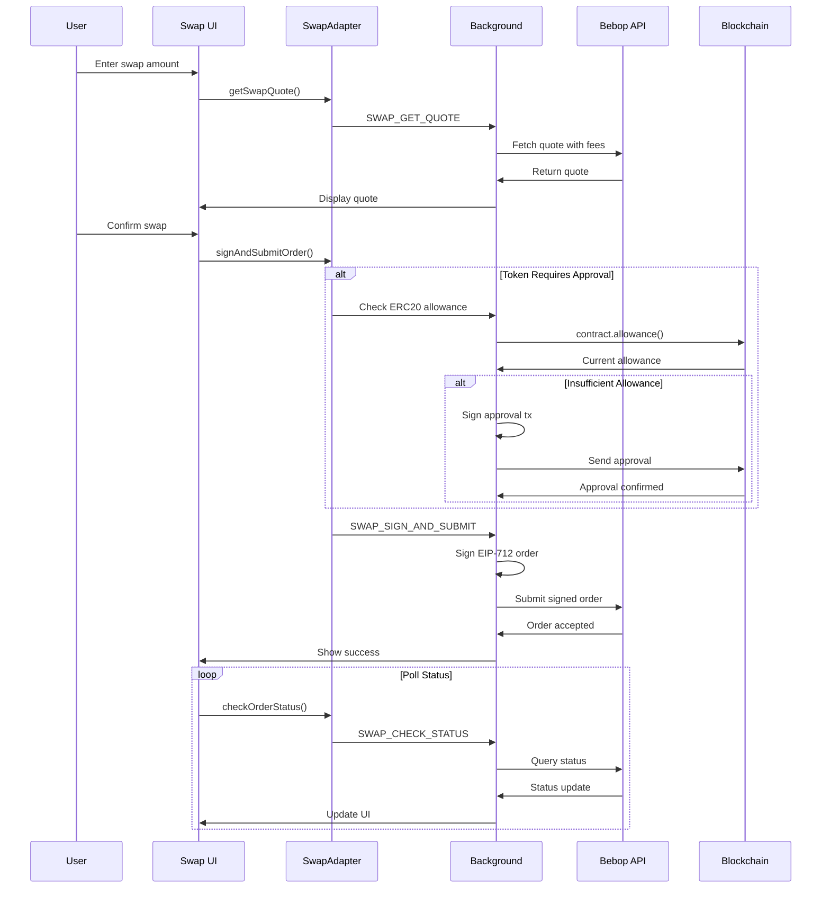

# SuperSafe Wallet - Swap System

**Created:** October 13, 2025  
**Version:** 3.0.0+  
**Status:** ✅ CURRENT

---

## Table of Contents

1. [Swap Overview](#swap-overview)
2. [Bebop Integration](#bebop-integration)
3. [Swap Flow](#swap-flow)
4. [Partner Fee System](#partner-fee-system)
5. [Multi-Chain Support](#multi-chain-support)

---

## Swap Overview

SuperSafe Wallet integrates **Bebop's JAM (Just Another Market) protocol** for gasless, MEV-protected token swaps across multiple EVM networks.

### Key Features

- **✅ Gasless Swaps**: Only pay for token approval (Permit2)
- **✅ MEV Protection**: Protected from frontrunning and sandwich attacks
- **✅ Multi-Chain**: Currently SuperSeed & Optimism (5 more networks planned)
- **✅ Partner Fees**: Configurable revenue sharing
- **✅ Best Prices**: Aggregated liquidity sources

---

## Bebop Integration

### Active Network Support

| Network | Chain ID | Bebop API | Swap Enabled | Contracts |
|---------|----------|-----------|--------------|-----------|
| **SuperSeed** | 5330 | JAM v2 | ✅ Active | Custom deployment |
| **Optimism** | 10 | JAM v2 + RFQ v3 | ✅ Active | Standard EVM |

### Planned Network Support

| Network | Chain ID | Bebop API | Status |
|---------|----------|-----------|--------|
| **Ethereum** | 1 | JAM v2 + RFQ v3 | 💤 Commented |
| **Base** | 8453 | JAM v2 + RFQ v3 | 💤 Commented |
| **BSC** | 56 | JAM v2 + RFQ v3 | 💤 Commented |

### Bebop Contracts

```javascript
// Location: src/utils/networks.js
export const BEBOP_CONTRACTS = {
  // Standard EVM chains
  STANDARD_EVM: {
    JAM_SETTLEMENT_ADDRESS: "0xbEbEbEb035351f58602E0C1C8B59ECBfF5d5f47b",
    BALANCE_MANAGER_ADDRESS: "0xfE96910cF84318d1B8a5e2a6962774711467C0be"
  },
  
  // SuperSeed (custom deployment)
  SUPERSEED: {
    JAM_SETTLEMENT_ADDRESS: "0xbeb0b0623f66bE8cE162EbDfA2ec543A522F4ea6",
    BALANCE_MANAGER_ADDRESS: "0xC5a350853E4e36b73EB0C24aaA4b8816C9A3579a"
  },
  
  // Universal Permit2
  PERMIT2: {
    CONTRACT_ADDRESS: "0x000000000022D473030F116dDEE9F6B43aC78BA3"
  }
};
```

---

## Swap Flow

### Complete Swap Sequence



### Quote Request

**Location:** `src/background/handlers/streams/SwapStreamHandler.js`

```javascript
case 'SWAP_GET_QUOTE': {
  const { sellToken, buyToken, sellAmount, takerAddress, slippage, chain } = payload;
  
  // 1. Validate network
  const networkKey = mapChainNameToNetworkKey(chain.name);
  const networkValidation = validateSwapNetwork(networkKey);
  
  if (!networkValidation.valid) {
    return { success: false, error: networkValidation.reason };
  }
  
  // 2. Get Bebop API endpoint
  const bebopApiUrl = getBebopApiEndpoint(networkKey, 'JAM');
  
  // 3. Get fee configuration
  const feeConfig = getFeeConfiguration();
  console.log('[Swap] Using partner fee:', feeConfig.feeBps, 'bps');
  
  // 4. Convert amount to wei
  const amountInWei = parseToWei(sellAmount, sellToken.decimals);
  
  // 5. Build quote request
  const quoteParams = new URLSearchParams({
    sell_tokens: sellToken.address,
    buy_tokens: buyToken.address,
    sell_amounts: amountInWei,
    taker_address: takerAddress,
    approval_type: sellToken.isNative ? 'Standard' : 'Permit2',
    slippage: slippage * 100,  // Convert to basis points
    // Partner fee parameters
    receiver_address: feeConfig.partnerInfo.receiverAddress,
    buy_tokens_ratios: feeConfig.feeBps
  });
  
  // 6. Fetch quote
  const response = await fetch(`${bebopApiUrl}quote?${quoteParams}`);
  
  if (!response.ok) {
    throw new Error(`Bebop API error: ${response.statusText}`);
  }
  
  const quoteData = await response.json();
  
  return { success: true, data: quoteData };
}
```

### Order Signing and Submission

```javascript
case 'SWAP_SIGN_AND_SUBMIT': {
  const { quote, takerAddress, networkKey } = payload;
  
  // 1. Get network configuration
  const network = NETWORKS[networkKey];
  const chainId = network.chainId;
  
  // 2. Get private key
  const privateKey = await getPrivateKey(takerAddress);
  const wallet = new ethers.Wallet(privateKey);
  
  // 3. Build EIP-712 domain
  const domain = {
    name: 'BebopSettlement',
    version: '1',
    chainId: chainId,
    verifyingContract: quote.settlement_address
  };
  
  // 4. Build EIP-712 types
  const types = {
    Order: [
      { name: 'taker_address', type: 'address' },
      { name: 'maker_address', type: 'address' },
      { name: 'maker_nonce', type: 'uint256' },
      // ... other fields
    ]
  };
  
  // 5. Sign typed data
  const signature = await wallet.signTypedData(domain, types, quote.order);
  
  // 6. Submit to Bebop
  const submitResponse = await fetch(quote.submit_url, {
    method: 'POST',
    headers: { 'Content-Type': 'application/json' },
    body: JSON.stringify({
      signature: signature,
      quote_id: quote.quote_id
    })
  });
  
  const result = await submitResponse.json();
  
  return { success: true, data: result };
}
```

---

## Partner Fee System

### Fee Configuration

**Location:** `src/background/utils/feeConfig.js`

```javascript
const FEE_CONFIG = {
  // Fee in basis points (100 bps = 1%)
  feeBps: 100,  // 1% partner fee
  
  // Partner information
  partnerInfo: {
    name: 'SuperSafe',
    receiverAddress: '0x742d35Cc6634C0532925a3b844Bc9e7595f0bEb',  // SuperSafe fee receiver
    website: 'https://supersafe.xyz'
  },
  
  // Fee validation
  minFeeBps: 0,
  maxFeeBps: 300  // Max 3%
};

export function getFeeConfiguration() {
  return {
    feeBps: FEE_CONFIG.feeBps,
    partnerInfo: FEE_CONFIG.partnerInfo
  };
}
```

### Fee Calculation Example

```
User swaps 100 USDC for ETH
Quote returns: 0.05 ETH

With 1% partner fee:
- User receives: 0.0495 ETH (99%)
- Partner receives: 0.0005 ETH (1%)

Fee is taken from buy token (ETH in this case)
```

---

## Multi-Chain Support

### Network-Specific Configuration

```javascript
// Location: src/utils/networks.js
export const NETWORKS = {
  superseed: {
    // ... network config
    bebop: {
      bebopName: 'superseed',
      displayName: 'SuperSeed',
      apiSupport: ['JAM'],  // No RFQ on SuperSeed
      jamApi: 'https://api.bebop.xyz/jam/superseed/v2/',
      rfqApi: null,
      swapEnabled: true,
      contracts: {
        jamSettlement: '0xbeb0b0623f66bE8cE162EbDfA2ec543A522F4ea6',
        balanceManager: '0xC5a350853E4e36b73EB0C24aaA4b8816C9A3579a',
        permit2: '0x000000000022D473030F116dDEE9F6B43aC78BA3'
      }
    }
  },
  
  optimism: {
    // ... network config
    bebop: {
      bebopName: 'optimism',
      displayName: 'Optimism',
      apiSupport: ['JAM', 'RFQ'],
      jamApi: 'https://api.bebop.xyz/jam/optimism/v2/',
      rfqApi: 'https://api.bebop.xyz/pmm/optimism/',
      swapEnabled: true,
      contracts: {
        jamSettlement: '0xbEbEbEb035351f58602E0C1C8B59ECBfF5d5f47b',
        balanceManager: '0xfE96910cF84318d1B8a5e2a6962774711467C0be',
        permit2: '0x000000000022D473030F116dDEE9F6B43aC78BA3'
      }
    }
  }
};
```

### Validation System

```javascript
export function validateSwapNetwork(networkKey) {
  const network = NETWORKS[networkKey];
  
  if (!network) {
    return {
      valid: false,
      reason: 'Network not supported'
    };
  }
  
  if (!network.bebop || !network.bebop.swapEnabled) {
    return {
      valid: false,
      reason: `Swaps not available on ${network.name}`
    };
  }
  
  return { valid: true };
}
```

---

## Related Documentation

- [ARCHITECTURE.md](./ARCHITECTURE.md) - System architecture
- [BLOCKCHAIN_OPERATIONS.md](./BLOCKCHAIN_OPERATIONS.md) - Blockchain operations
- [FRONTEND.md](./FRONTEND.md) - Swap UI components
- [BACKEND.md](./BACKEND.md) - Swap stream handlers

---

**Document Status:** ✅ Current as of October 13, 2025  
**Code Version:** v3.0.0+

