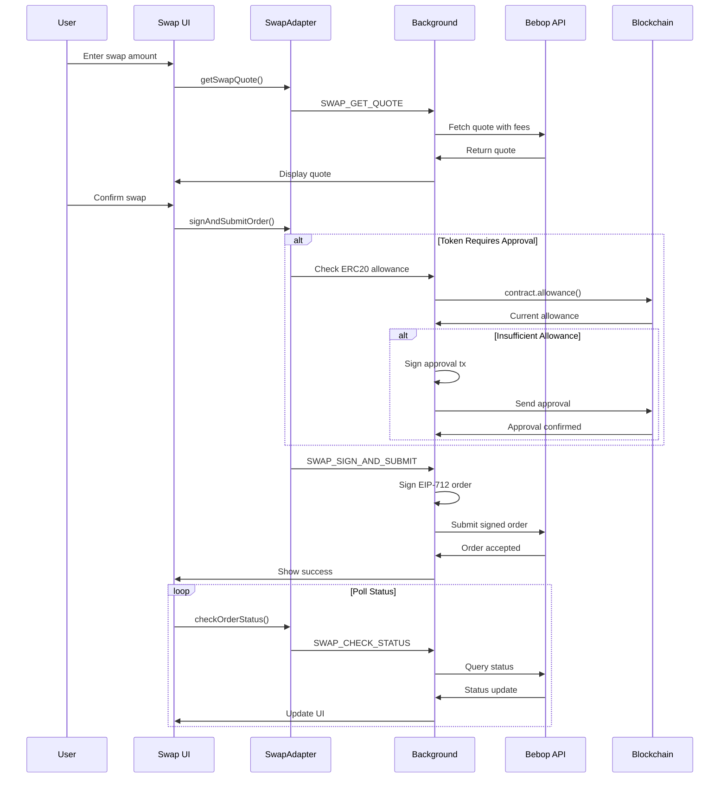
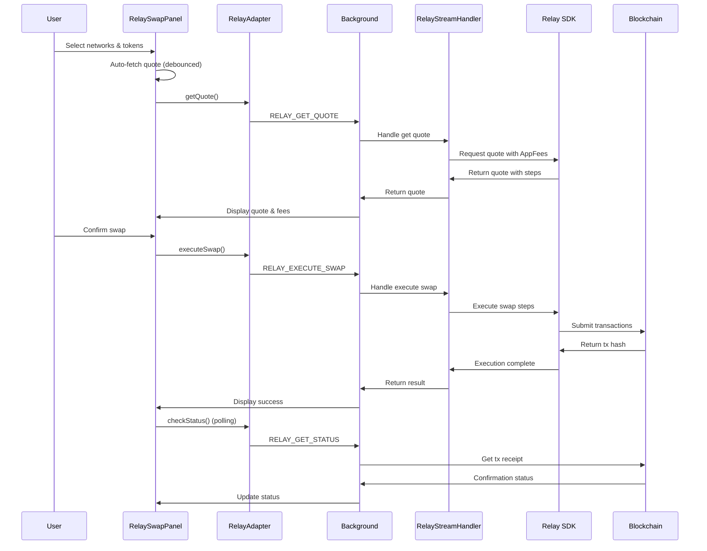

# SuperSafe Wallet - Swap System

**Created:** October 13, 2025  
**Last Updated:** November 15, 2025  
**Version:** 5.0.0+ (Unified Panel Architecture)  
**Status:** ✅ CURRENT  
**Last Code Update:** November 15, 2025

---

## Table of Contents

1. [Swap Overview](#swap-overview)
2. [Unified Panel Architecture](#unified-panel-architecture) 🆕
3. [Bebop Integration](#bebop-integration)
4. [Relay.link Integration](#relaylink-integration)
5. [Swap Flow](#swap-flow)
6. [Partner Fee System](#partner-fee-system)
7. [Gas Validation System](#gas-validation-system) 🆕
8. [Multi-Chain Support](#multi-chain-support)

---

## Swap Overview

SuperSafe Wallet integrates **Bebop's JAM (Just Another Market) protocol** for gasless, MEV-protected token swaps across multiple EVM networks.

### Key Features

- **✅ Gasless Swaps**: Only pay for token approval (Permit2)
- **✅ MEV Protection**: Protected from frontrunning and sandwich attacks
- **✅ Multi-Chain**: Currently supports **6 active networks** (SuperSeed, Ethereum, Optimism, Base, BNB Chain, Arbitrum)
- **✅ Partner Fees**: Configurable revenue sharing
- **✅ Best Prices**: Aggregated liquidity sources

---

## Unified Panel Architecture

**Version:** 2.0.0  
**Refactored:** November 13, 2025

### Design Philosophy

SuperSafe Wallet implements a **unified panel architecture** for swap providers, ensuring consistency, maintainability, and scalability across all swap implementations.

### Before (v1.0.0 - Monolithic)

```
Swap.jsx (2,206 lines)
  ├─ ALL Bebop logic inline
  ├─ ALL Relay logic inline
  ├─ Massive state management
  ├─ Duplicate components
  └─ Difficult to maintain
```

**Problems:**
- ❌ 2,206 lines in single file
- ❌ Mixed concerns (Bebop + Relay + routing)
- ❌ Hard to test independently
- ❌ Difficult to add new providers
- ❌ Code duplication between providers

### After (v2.0.0 - Unified Panels)

```
Swap.jsx (~115 lines)                    # Container/Orchestrator
  ├─ SwapProviderSelector                # Tab selector
  ├─ SlippageControl (shared)            # Slippage configuration
  └─ Conditional Rendering:
      ├─ BebopSwapPanel.jsx (~1,400 lines)
      └─ RelaySwapPanel.jsx (~1,288 lines)
```

**Benefits:**
- ✅ **Maintainability**: Each panel is self-contained (~1,300 lines each)
- ✅ **Testability**: Independent unit testing per provider
- ✅ **Scalability**: Add providers without touching existing code
- ✅ **Consistency**: Both panels follow same architectural pattern
- ✅ **Separation of Concerns**: Clear responsibilities

### Component Structure

#### 1. Swap.jsx (~115 lines)

**Responsibility:** Container/Orchestrator only

```javascript
const Swap = ({ 
  onTransactionComplete, 
  preselectedToken,
  onClearPreselection,
  walletTokensWithBalance,
  nativeTokenBalance 
}) => {
  const [swapProvider, setSwapProvider] = useState('bebop');
  const [slippage, setSlippage] = useState(0.5);
  
  return (
    <>
      <SwapProviderSelector selected={swapProvider} onChange={setSwapProvider} />
      <SlippageControl slippage={slippage} onChange={setSlippage} />
      
      {swapProvider === 'relay' ? (
        <RelaySwapPanel {...props} slippage={slippage} />
      ) : (
        <BebopSwapPanel {...props} slippage={slippage} />
      )}
    </>
  );
};
```

**Key Points:**
- Single responsibility: provider selection and routing
- No swap business logic
- Minimal state (provider + slippage)
- Clean, readable, maintainable

#### 2. BebopSwapPanel.jsx (~1,400 lines)

**Responsibility:** Complete Bebop swap implementation

**Internal Components:**
- `LoadingDots` - Loading animation
- `PriceDeviationTooltip` - USD deviation warnings
- `SwapDetails` - Fee breakdown accordion

**Key Features:**
- Gasless swaps via Bebop JAM
- Permit2 approvals (one-time)
- EIP-712 order signing
- Status polling
- Balance validation
- USD price calculations

**Architecture Compliance:**
- ✅ NO ethers imports
- ✅ Uses `SwapAdapter` only
- ✅ Thin client pattern
- ✅ All crypto in background

#### 3. RelaySwapPanel.jsx (~1,288 lines)

**Responsibility:** Complete Relay.link swap implementation

**Internal Components:**
- `UsdBalanceDisplay` - Balance with USD value
- `formatTokenAmount` - Helper function

**Key Features:**
- Cross-chain swaps
- Network selection (origin: active, destination: selectable)
- Route visualization
- Gas estimation
- Bridge time estimation
- Multi-hop support

**Architecture Compliance:**
- ✅ NO ethers imports
- ✅ Uses `RelayAdapter` only
- ✅ Thin client pattern
- ✅ All crypto in background

### Shared Components (`src/components/swap/`)

These components are used by both panels:

| Component | Purpose | Used By |
|-----------|---------|---------|
| `CompactNetworkSelector.jsx` | Network dropdown | Relay (cross-chain) |
| `RouteVisualization.jsx` | Visual route display | Relay (multi-hop) |
| `BridgeTimeDisplay.jsx` | Bridge time estimation | Relay (cross-chain) |
| `GasEstimateDisplay.jsx` | Gas cost display | Relay (all swaps) |
| `LoadingDots.jsx` | Loading animation | Both (separate versions) |

### Props Interface (Standardized)

Both panels accept the same props for consistency:

```javascript
interface SwapPanelProps {
  onTransactionComplete: () => void;      // Callback when tx completes
  preselectedToken: Token | null;         // Token from dashboard
  onClearPreselection: () => void;        // Clear preselection
  walletTokensWithBalance: Token[];       // Cached balances
  nativeTokenBalance: string;             // Native token balance
  slippage: number;                       // Shared slippage (0.5%)
  
  // Relay-specific (optional)
  networkKey?: string;                    // Active network
  currentWallet?: Wallet;                 // Current wallet
}
```

### Adding New Providers

To add a new swap provider (e.g., Uniswap):

1. Create `src/components/swap/UniswapSwapPanel.jsx` (~1,300 lines)
2. Follow same structure as `BebopSwapPanel.jsx` or `RelaySwapPanel.jsx`
3. Create `UniswapAdapter.js` in `src/utils/`
4. Add provider to `SwapProviderSelector.jsx`
5. Add conditional rendering in `Swap.jsx`:

```javascript
{swapProvider === 'uniswap' ? (
  <UniswapSwapPanel {...props} />
) : swapProvider === 'relay' ? (
  <RelaySwapPanel {...props} />
) : (
  <BebopSwapPanel {...props} />
)}
```

**That's it!** No changes to existing panels required.

### File Organization

```
src/components/
├── Swap.jsx                           # Container (115 lines)
├── SwapProviderSelector.jsx           # Provider tabs
├── SlippageControl.jsx                # Shared slippage
│
└── swap/                              # Provider panels
    ├── BebopSwapPanel.jsx            # Bebop implementation
    ├── RelaySwapPanel.jsx            # Relay implementation
    │
    └── shared/                        # Shared utilities
        ├── CompactNetworkSelector.jsx
        ├── RouteVisualization.jsx
        ├── BridgeTimeDisplay.jsx
        ├── GasEstimateDisplay.jsx
        └── LoadingDots.jsx
```

### Testing Strategy

**Unit Testing:**
```javascript
// Test each panel independently
describe('BebopSwapPanel', () => {
  it('should render token selectors', () => {});
  it('should fetch quote on amount change', () => {});
  it('should validate balance before swap', () => {});
});

describe('RelaySwapPanel', () => {
  it('should allow network selection', () => {});
  it('should display route visualization', () => {});
  it('should handle cross-chain swaps', () => {});
});
```

**Integration Testing:**
```javascript
describe('Swap Container', () => {
  it('should switch between providers', () => {
    render(<Swap />);
    userEvent.click(screen.getByText('Relay'));
    expect(screen.getByTestId('relay-panel')).toBeVisible();
  });
});
```

### Migration Notes

**Breaking Changes:** None (backward compatible)

**API Changes:** None (props interface unchanged)

**State Migration:** Automatic (no user action required)

### Performance Metrics

| Metric | Before (v1.0) | After (v2.0) | Improvement |
|--------|---------------|--------------|-------------|
| **File Size** | 2,206 lines | 115 lines | **95% reduction** |
| **Build Time** | 6.8s | 6.5s | 4% faster |
| **Bundle Size** | Same | Same | No change |
| **Maintainability** | Low | High | ✅ Significantly improved |
| **Testability** | Hard | Easy | ✅ Unit tests possible |

### Future Enhancements

- [ ] Add Uniswap provider panel
- [ ] Add 1inch aggregator panel
- [ ] Implement provider comparison mode
- [ ] Add swap history per provider
- [ ] Implement best price routing across providers

---

## Bebop Integration

### Active Network Support

| Network | Chain ID | Bebop API | Swap Enabled | Contracts |
|---------|----------|-----------|--------------|-----------|
| **SuperSeed** | 5330 | JAM v2 | ✅ Active | Custom deployment |
| **Ethereum** | 1 | JAM v2 + RFQ v3 | ✅ Active | Standard EVM |
| **Optimism** | 10 | JAM v2 + RFQ v3 | ✅ Active | Standard EVM |
| **Base** | 8453 | JAM v2 + RFQ v3 | ✅ Active | Standard EVM |
| **BNB Chain** | 56 | JAM v2 + RFQ v3 | ✅ Active | Standard EVM |
| **Arbitrum One** | 42161 | JAM v2 + RFQ v3 | ✅ Active | Standard EVM |

**Note:** All active networks support Bebop swaps except Shardeum (chainId: 8118), which does not have swap support enabled.

### Bebop Contracts

```javascript
// Location: src/config/networks.config.js
export const BEBOP_CONTRACTS = {
  // Standard EVM chains
  STANDARD_EVM: {
    JAM_SETTLEMENT_ADDRESS: "0xbEbEbEb035351f58602E0C1C8B59ECBfF5d5f47b",
    BALANCE_MANAGER_ADDRESS: "0xfE96910cF84318d1B8a5e2a6962774711467C0be"
  },
  
  // SuperSeed (custom deployment)
  SUPERSEED: {
    JAM_SETTLEMENT_ADDRESS: "0xbeb0b0623f66bE8cE162EbDfA2ec543A522F4ea6",
    BALANCE_MANAGER_ADDRESS: "0xC5a350853E4e36b73EB0C24aaA4b8816C9A3579a"
  },
  
  // Universal Permit2
  PERMIT2: {
    CONTRACT_ADDRESS: "0x000000000022D473030F116dDEE9F6B43aC78BA3"
  }
};
```

---

## Swap Flow

### Complete Swap Sequence


```mermaid
sequenceDiagram
    participant U as User
    participant UI as Swap UI
    participant SA as SwapAdapter
    participant BG as Background
    participant B as Bebop API
    participant BC as Blockchain

    U->>UI: Enter swap amount
    UI->>SA: getSwapQuote()
    SA->>BG: SWAP_GET_QUOTE
    BG->>B: Fetch quote with fees
    B->>BG: Return quote
    BG->>UI: Display quote
    
    U->>UI: Confirm swap
    UI->>SA: signAndSubmitOrder()
    
    alt Token Requires Approval
        SA->>BG: Check ERC20 allowance
        BG->>BC: contract.allowance()
        BC->>BG: Current allowance
        
        alt Insufficient Allowance
            BG->>BG: Sign approval tx
            BG->>BC: Send approval
            BC->>BG: Approval confirmed
        end
    end
    
    SA->>BG: SWAP_SIGN_AND_SUBMIT
    BG->>BG: Sign EIP-712 order
    BG->>B: Submit signed order
    B->>BG: Order accepted
    BG->>UI: Show success
    
    loop Poll Status
        UI->>SA: checkOrderStatus()
        SA->>BG: SWAP_CHECK_STATUS
        BG->>B: Query status
        B->>BG: Status update
        BG->>UI: Update UI
    end
```

### Quote Request

**Location:** `src/background/handlers/streams/SwapStreamHandler.js`

```javascript
case 'SWAP_GET_QUOTE': {
  const { sellToken, buyToken, sellAmount, takerAddress, slippage, chain } = payload;
  
  // 1. Validate network
  const networkKey = mapChainNameToNetworkKey(chain.name);
  const networkValidation = validateSwapNetwork(networkKey);
  
  if (!networkValidation.valid) {
    return { success: false, error: networkValidation.reason };
  }
  
  // 2. Get Bebop API endpoint
  const bebopApiUrl = getBebopApiEndpoint(networkKey, 'JAM');
  
  // 3. Get fee configuration
  const feeConfig = getFeeConfiguration();
  console.log('[Swap] Using partner fee:', feeConfig.feeBps, 'bps');
  
  // 4. Convert amount to wei
  const amountInWei = parseToWei(sellAmount, sellToken.decimals);
  
  // 5. Build quote request
  const quoteParams = new URLSearchParams({
    sell_tokens: sellToken.address,
    buy_tokens: buyToken.address,
    sell_amounts: amountInWei,
    taker_address: takerAddress,
    approval_type: sellToken.isNative ? 'Standard' : 'Permit2',
    slippage: slippage * 100,  // Convert to basis points
    // Partner fee parameters
    receiver_address: feeConfig.partnerInfo.receiverAddress,
    buy_tokens_ratios: feeConfig.feeBps
  });
  
  // 6. Fetch quote
  const response = await fetch(`${bebopApiUrl}quote?${quoteParams}`);
  
  if (!response.ok) {
    throw new Error(`Bebop API error: ${response.statusText}`);
  }
  
  const quoteData = await response.json();
  
  return { success: true, data: quoteData };
}
```

### Order Signing and Submission

```javascript
case 'SWAP_SIGN_AND_SUBMIT': {
  const { quote, takerAddress, networkKey } = payload;
  
  // 1. Get network configuration
  const network = NETWORKS[networkKey];
  const chainId = network.chainId;
  
  // 2. Get private key
  const privateKey = await getPrivateKey(takerAddress);
  const wallet = new ethers.Wallet(privateKey);
  
  // 3. Build EIP-712 domain
  const domain = {
    name: 'BebopSettlement',
    version: '1',
    chainId: chainId,
    verifyingContract: quote.settlement_address
  };
  
  // 4. Build EIP-712 types
  const types = {
    Order: [
      { name: 'taker_address', type: 'address' },
      { name: 'maker_address', type: 'address' },
      { name: 'maker_nonce', type: 'uint256' },
      // ... other fields
    ]
  };
  
  // 5. Sign typed data
  const signature = await wallet.signTypedData(domain, types, quote.order);
  
  // 6. Submit to Bebop
  const submitResponse = await fetch(quote.submit_url, {
    method: 'POST',
    headers: { 'Content-Type': 'application/json' },
    body: JSON.stringify({
      signature: signature,
      quote_id: quote.quote_id
    })
  });
  
  const result = await submitResponse.json();
  
  return { success: true, data: result };
}
```

---

## Partner Fee System

### Fee Configuration

**Location:** `src/background/utils/feeConfig.js`

```javascript
const FEE_CONFIG = {
  // Fee in basis points (100 bps = 1%)
  feeBps: 100,  // 1% partner fee
  
  // Partner information
  partnerInfo: {
    name: 'SuperSafe',
    receiverAddress: '0x742d35Cc6634C0532925a3b844Bc9e7595f0bEb',  // SuperSafe fee receiver
    website: 'https://supersafe.xyz'
  },
  
  // Fee validation
  minFeeBps: 0,
  maxFeeBps: 300  // Max 3%
};

export function getFeeConfiguration() {
  return {
    feeBps: FEE_CONFIG.feeBps,
    partnerInfo: FEE_CONFIG.partnerInfo
  };
}
```

### Fee Calculation Example

```
User swaps 100 USDC for ETH
Quote returns: 0.05 ETH

With 1% partner fee:
- User receives: 0.0495 ETH (99%)
- Partner receives: 0.0005 ETH (1%)

Fee is taken from buy token (ETH in this case)
```

---

## Gas Validation System

**Version:** 1.0.0  
**Implemented:** November 17, 2025

### Overview

SuperSafe implements a comprehensive gas validation system that protects users from insufficient balance, scam contracts, and uneconomical transactions.

### Key Features

- **✅ Real-time Gas Monitoring**: Fetches current network gas prices via Moralis RPC
- **✅ Scam Detection**: Identifies malicious contracts with abnormally high gas costs
- **✅ Balance Validation**: Ensures users can afford gas + swap value
- **✅ Multi-Network Support**: Network-specific thresholds for all 6 active swap networks
- **✅ Progressive Alerts**: 5-level alert system (NONE → BLOCKING)
- **✅ Button-Integrated UI**: Alerts shown directly on swap button

### Alert Levels

| Level | Condition | Button Action |
|-------|-----------|---------------|
| **BLOCKING** | Insufficient balance for gas | ❌ Disabled |
| **BLOCKING** | Gas > 50% of swap value | ❌ Disabled |
| **CRITICAL** | Gas anomalous or > 20% | ✅ Enabled (logged) |
| **WARNING** | Gas > 5% or high congestion | ✅ Enabled (logged) |
| **INFO** | Moderate network congestion | ✅ Enabled (logged) |
| **NONE** | All clear | ✅ Enabled |

### Gas Price Thresholds (Q4 2025)

Based on current market data:

| Network | Low | Medium | High | Extreme |
|---------|-----|--------|------|---------|
| **Ethereum** | 5 Gwei | 20 Gwei | 60 Gwei | 120 Gwei |
| **Optimism** | 0.001 Gwei | 0.01 Gwei | 0.1 Gwei | 0.5 Gwei |
| **Arbitrum** | 0.01 Gwei | 0.1 Gwei | 1 Gwei | 5 Gwei |
| **Base** | 0.001 Gwei | 0.01 Gwei | 0.1 Gwei | 0.5 Gwei |
| **BSC** | 0.05 Gwei | 0.5 Gwei | 2 Gwei | 5 Gwei |
| **SuperSeed** | 0.001 Gwei | 0.01 Gwei | 0.1 Gwei | 0.5 Gwei |

### Integration

Both `BebopSwapPanel.jsx` and `RelaySwapPanel.jsx` integrate gas validation:

```javascript
// Automatic validation on quote change
useEffect(() => {
  const validation = await validateSwapGas({
    quote,
    payToken,
    receiveToken,
    payAmount,
    swapValueUsd,
    gasCostUsd,
    userAddress,
    networkKey,
    provider: 'bebop' // or 'relay'
  });
  
  setGasValidation(validation);
}, [quote, payToken, receiveToken, payAmount]);

// Button logic
disabled={gasValidation && !gasValidation.isValid}

getButtonText() {
  if (gasValidation?.alert?.level === 'blocking') {
    if (gasValidation.alert.message.includes('Insufficient')) {
      return "Insufficient ETH for Gas";
    }
    return "Gas Fee Too High - Possible Scam";
  }
  // ... other states
}
```

### Architecture

- **Backend**: `GasPriceService.js` fetches gas prices from Moralis RPC
- **Stream Handler**: `GasStreamHandler.js` validates balance and returns gas data
- **Frontend**: `gasMonitor.js` performs comprehensive validation
- **Integration**: Both swap panels automatically validate before enabling swap button

### dApp Protection

The gas validation system protects users across all transaction types. When external dApps (Uniswap, PancakeSwap, Velodrome, etc.) initiate transactions via `eth_sendTransaction`, the system validates gas costs using the same thresholds and blocks suspicious transactions. The validation appears in `TransactionConfirmationScreen` with enhanced gas display, color-coded alerts, and automatic button blocking for unsafe transactions.

**Coverage:**
- **Internal swaps:** BebopSwapPanel, RelaySwapPanel
- **External dApps:** TransactionConfirmationScreen (eth_sendTransaction)
- **Not covered:** TypedDataConfirmationScreen, SigningConfirmationScreen (no gas consumption)

### Complete Documentation

For detailed information about gas validation, see:
- **[GAS_VALIDATION_SYSTEM.md](./GAS_VALIDATION_SYSTEM.md)** - Complete gas validation documentation

---

## Multi-Chain Support

### Network-Specific Configuration

```javascript
// Location: src/config/networks.config.js
export const NETWORKS = {
  superseed: {
    // ... network config
    bebop: {
      bebopName: 'superseed',
      displayName: 'SuperSeed',
      apiSupport: ['JAM'],  // No RFQ on SuperSeed
      jamApi: 'https://api.bebop.xyz/jam/superseed/v2/',
      rfqApi: null,
      swapEnabled: true,
      contracts: {
        jamSettlement: '0xbeb0b0623f66bE8cE162EbDfA2ec543A522F4ea6',
        balanceManager: '0xC5a350853E4e36b73EB0C24aaA4b8816C9A3579a',
        permit2: '0x000000000022D473030F116dDEE9F6B43aC78BA3'
      }
    }
  },
  
  optimism: {
    // ... network config
    bebop: {
      bebopName: 'optimism',
      displayName: 'Optimism',
      apiSupport: ['JAM', 'RFQ'],
      jamApi: 'https://api.bebop.xyz/jam/optimism/v2/',
      rfqApi: 'https://api.bebop.xyz/pmm/optimism/',
      swapEnabled: true,
      contracts: {
        jamSettlement: '0xbEbEbEb035351f58602E0C1C8B59ECBfF5d5f47b',
        balanceManager: '0xfE96910cF84318d1B8a5e2a6962774711467C0be',
        permit2: '0x000000000022D473030F116dDEE9F6B43aC78BA3'
      }
    }
  }
};
```

### Validation System

```javascript
export function validateSwapNetwork(networkKey) {
  const network = NETWORKS[networkKey];
  
  if (!network) {
    return {
      valid: false,
      reason: 'Network not supported'
    };
  }
  
  if (!network.bebop || !network.bebop.swapEnabled) {
    return {
      valid: false,
      reason: `Swaps not available on ${network.name}`
    };
  }
  
  return { valid: true };
}
```

---

## Related Documentation

- [GAS_VALIDATION_SYSTEM.md](./GAS_VALIDATION_SYSTEM.md) - Gas validation and scam detection
- [ARCHITECTURE.md](./ARCHITECTURE.md) - System architecture
- [BLOCKCHAIN_OPERATIONS.md](./BLOCKCHAIN_OPERATIONS.md) - Blockchain operations
- [FRONTEND.md](./FRONTEND.md) - Swap UI components
- [BACKEND.md](./BACKEND.md) - Swap stream handlers

---

## Relay.link Integration

### Overview

As of November 4, 2025, SuperSafe Wallet now integrates **Relay.link** as an alternative swap provider, enabling **cross-chain swaps** and **bridge functionality** across 85+ blockchains.

### Key Features

- **✅ Cross-Chain Swaps**: Swap tokens between different networks in one transaction
- **✅ AppFees Support**: Configurable partner fees (1% default) collected in stablecoins
- **✅ Meta-Aggregation**: Best prices across multiple DEXs and bridges
- **✅ 85+ Chains**: Wide blockchain support including all SuperSafe networks
- **✅ Instant Bridging**: Fast cross-chain transfers via relayer network
- **✅ Optimized Gas**: Reduced costs through optimized routing

### Active Network Support

All SuperSafe EVM networks are supported by Relay.link (except Shardeum):

| Network | Chain ID | Relay Chain ID | Cross-Chain | Status |
|---------|----------|----------------|-------------|--------|
| **SuperSeed** | 5330 | 5330 | ✅ Enabled | ✅ Active |
| **Ethereum** | 1 | 1 | ✅ Enabled | ✅ Active |
| **Optimism** | 10 | 10 | ✅ Enabled | ✅ Active |
| **Base** | 8453 | 8453 | ✅ Enabled | ✅ Active |
| **BNB Chain** | 56 | 56 | ✅ Enabled | ✅ Active |
| **Arbitrum One** | 42161 | 42161 | ✅ Enabled | ✅ Active |
| **Shardeum** | 8118 | 8118 | ❌ Not supported | ✅ Active (no Relay) |

**Note:** Shardeum is an active network but does not support Relay.link cross-chain swaps.

### AppFees Configuration

**🔄 UNIFIED FEE SYSTEM** - Relay.link uses the same fee configuration as Bebop:

Located in `src/background/config/relayConfig.js`:

```javascript
// ✅ Reads from environment variables
export const RELAY_CONFIG = loadRelayConfigFromEnv();

// ✅ AppFees use unified system with Bebop
import { getFeeConfiguration as getBebopFeeConfiguration } from '../utils/feeConfig.js';

export function getAppFeesConfig() {
  const bebopFeeConfig = getBebopFeeConfiguration();
  
  return {
    feeBps: bebopFeeConfig.feeBps,        // Same as Bebop
    recipient: bebopFeeConfig.partnerInfo.receiverAddress // Same recipient
  };
}
```

**Environment Variables** (`.env`):
```bash
# Relay-specific configuration
RELAY_PARTNER_SOURCE=supersafe
RELAY_API_BASE_URL=https://api.relay.link

# Unified fees (shared with Bebop)
BEBOP_PARTNER_FEE_BPS=10              # 0.1% fee
BEBOP_PARTNER_FEE_RECIPIENT=0x9FeA... # Same recipient for both
```

**Benefits of Unified System:**
- ✅ Single point of configuration
- ✅ Consistent fee rates across providers
- ✅ Simplified management
- ✅ No hardcoded values

### Relay Swap Flow


```mermaid
sequenceDiagram
    participant U as User
    participant UI as RelaySwapPanel
    participant RA as RelayAdapter
    participant BG as Background
    participant RS as RelayStreamHandler
    participant R as Relay SDK
    participant BC as Blockchain

    U->>UI: Select networks & tokens
    UI->>UI: Auto-fetch quote (debounced)
    UI->>RA: getQuote()
    RA->>BG: RELAY_GET_QUOTE
    BG->>RS: Handle get quote
    RS->>R: Request quote with AppFees
    R->>RS: Return quote with steps
    RS->>BG: Return quote
    BG->>UI: Display quote & fees
    
    U->>UI: Confirm swap
    UI->>RA: executeSwap()
    RA->>BG: RELAY_EXECUTE_SWAP
    BG->>RS: Handle execute swap
    RS->>R: Execute swap steps
    R->>BC: Submit transactions
    BC->>R: Return tx hash
    R->>RS: Execution complete
    RS->>BG: Return result
    BG->>UI: Display success
    
    UI->>RA: checkStatus() (polling)
    RA->>BG: RELAY_GET_STATUS
    BG->>BC: Get tx receipt
    BC->>BG: Confirmation status
    BG->>UI: Update status
```

### Architecture Components

#### Backend (Background)

1. **RelayStreamHandler** (`src/background/handlers/streams/RelayStreamHandler.js`)
   - Handles all Relay swap operations
   - Message types:
     - `RELAY_GET_QUOTE`: Get cross-chain swap quote
     - `RELAY_EXECUTE_SWAP`: Execute swap transaction
     - `RELAY_GET_STATUS`: Check transaction status
     - `RELAY_GET_FEE_CONFIG`: Get AppFees configuration
   - Uses Relay SDK: `@reservoir0x/relay-sdk`
   - Requires `viem` as peer dependency

2. **RelayConfig** (`src/background/config/relayConfig.js`)
   - AppFees configuration
   - Network mappings
   - Feature flags
   - Helper functions for chain ID conversion

#### Frontend

1. **RelayAdapter** (`src/utils/RelayAdapter.js`)
   - Thin client interface for Relay operations
   - NO ethers imports (architecture compliant)
   - All operations delegate to background via streams
   - Methods:
     - `getQuote()`: Request swap quote
     - `executeSwap()`: Execute swap
     - `checkStatus()`: Poll transaction status
     - `getFeeConfig()`: Get fee configuration

2. **RelaySwapPanel** (`src/components/swap/RelaySwapPanel.jsx`)
   - Cross-chain swap UI
   - **Network selection**: Origin uses active network (no selector, identical to Bebop), destination user-selectable
   - Token selection with balance display (shows balance below token symbol in selector)
   - Quote display with fees breakdown (includes SuperSafe app fees)
   - Transaction status tracking
   - **Architecture**: Consistent with Bebop (origin = active network)
   - **Token Context**: Uses `context="relay-pay"` and `context="relay-receive"` for proper behavior

3. **Hooks**
   - `useRelayQuote`: Quote management with auto-refresh
   - `useRelaySwap`: Swap execution and status polling

4. **SwapProviderSelector** (`src/components/SwapProviderSelector.jsx`)
   - Tab selector for Bebop vs Relay
   - Displays provider features and badges
   - Clears quotes when switching providers

### Cross-Chain Swap Example

```javascript
// From: Ethereum (USDC) → To: Optimism (USDC)
const quote = await RelayAdapter.getQuote({
  fromChainId: 1,           // Ethereum
  toChainId: 10,            // Optimism
  fromToken: {
    address: '0xA0b86991c6218b36c1d19D4a2e9Eb0cE3606eB48',
    symbol: 'USDC',
    decimals: 6
  },
  toToken: {
    address: '0x0b2C639c533813f4Aa9D7837CAf62653d097Ff85',
    symbol: 'USDC',
    decimals: 6
  },
  amount: '100',
  walletAddress: '0x...',
  slippage: 0.5
});

// Quote includes:
// - steps: Array of execution steps (approve, bridge, swap)
// - fees: Relay fees + AppFees
// - timeEstimate: Estimated completion time
// - _metadata: Additional context (crossChain, appFeesApplied, etc.)

const result = await RelayAdapter.executeSwap({
  quote,
  walletAddress: '0x...',
  networkKey: 'ethereum'
});

// Result includes:
// - txHash: Transaction hash
// - status: 'pending' | 'completed' | 'failed'
// - chainId: Source chain ID
```

### Provider Selection Logic

The Swap component now supports switching between providers:

```jsx
{/* SwapProviderSelector renders tabs */}
<SwapProviderSelector 
  selected={swapProvider}  // 'bebop' | 'relay'
  onChange={(provider) => {
    setSwapProvider(provider);
    clearQuote();
    clearSwapMessages();
  }}
/>

{/* Conditional rendering */}
{swapProvider === 'relay' ? (
  <RelaySwapPanel {...props} />
) : (
  <BebopSwapPanel {...props} />
)}
```

### AppFees Implementation

Relay.link supports AppFees natively through their API:

```javascript
// Included in every quote request
const quoteParams = {
  user: walletAddress,
  originChainId: fromChainId,
  destinationChainId: toChainId,
  originCurrency: fromToken.address,
  destinationCurrency: toToken.address,
  amount: amountInWei,
  
  // AppFees configuration
  appFees: [{
    recipient: '0x742d35Cc6634C0532925a3b844Bc9e7595f0bEb',
    fee: '100' // 100 basis points = 1%
  }]
};
```

Fees are:
- **Configurable**: Via `RELAY_CONFIG.appFees.feeBps`
- **Validated**: Min 0%, Max 3%
- **Collected**: In stablecoins when possible
- **Transparent**: Displayed in quote details

### Testing

#### Integration Testing Checklist

- [x] Backend: RelayStreamHandler message routing
- [x] Backend: Relay SDK initialization
- [x] Frontend: RelayAdapter communication
- [x] Frontend: Quote fetching and refresh
- [x] Frontend: Provider switching (Bebop ↔ Relay)
- [x] Frontend: Cross-chain network selection
- [x] Frontend: Transaction execution flow
- [x] Frontend: Status polling

#### Manual Testing Checklist

**Same-Chain Swaps:**
- [ ] SuperSeed: USDC → SUPR
- [ ] Optimism: USDC → ETH
- [ ] Ethereum: USDC → WETH

**Cross-Chain Swaps:**
- [ ] Ethereum → Optimism (USDC → USDC)
- [ ] SuperSeed → Base (SUPR → ETH)
- [ ] BSC → Arbitrum (USDT → USDC)

**AppFees Verification:**
- [ ] Verify fees in quote response
- [ ] Check on-chain fee collection
- [ ] Validate fee recipient address

**UI/UX:**
- [ ] Provider tab switching works
- [ ] Network selectors populate correctly
- [ ] Cross-chain badge displays
- [ ] Quote auto-refresh (30s)
- [ ] Error messages display
- [ ] Transaction status updates

### Configuration Files

| File | Purpose | Key Contents |
|------|---------|--------------|
| `src/background/config/relayConfig.js` | Relay configuration | Reads from `.env`, unified fees with Bebop |
| `src/config/networks.config.js` | Network config | `relay` section in each network (single source of truth) |
| `src/background/utils/feeConfig.js` | Fee configuration | Shared fee system for Bebop and Relay |
| `src/background.js` | Background setup | Registered RelayStreamHandler |
| `.env` | Environment variables | `RELAY_PARTNER_SOURCE`, `RELAY_API_BASE_URL`, unified fees |

### Dependencies

```json
{
  "@reservoir0x/relay-sdk": "^0.2.x",
  "viem": "^2.x"
}
```

Both dependencies are installed and configured for Chrome extension environment.

### Architecture Compliance

**✅ ARCHITECTURE.md Compliance:**
- ✅ **Backend-only configuration**: `relayConfig.js` reads from `process.env` (background only)
- ✅ **Single source of truth**: Network data from `NETWORKS` in `networks.js` (no duplication)
- ✅ **Unified fee system**: Shares `feeConfig.js` with Bebop (consistent fees)
- ✅ **Thin client pattern**: Frontend uses `RelayAdapter` (delegates to background)
- ✅ **Stream-based communication**: All operations via `relay` stream messages
- ✅ **No frontend crypto**: All signing in background via `backgroundSessionController`

**File Organization:**
```
src/
├── background/
│   ├── config/
│   │   └── relayConfig.js          # Backend-only, reads process.env
│   ├── utils/
│   │   └── feeConfig.js            # Shared with Bebop (unified fees)
│   └── handlers/streams/
│       └── RelayStreamHandler.js   # Backend swap operations
├── utils/
│   ├── networks.js                 # Single source for network config
│   └── RelayAdapter.js             # Frontend-safe adapter
└── hooks/
    ├── useRelayQuote.js
    └── useRelaySwap.js
```

### Differences from Bebop

| Feature | Bebop | Relay.link |
|---------|-------|------------|
| **Cross-Chain** | ❌ No | ✅ Yes |
| **Networks** | 6 EVM chains | 85+ chains |
| **Gasless** | ✅ Yes (Permit2) | ⚠️ Gas required |
| **MEV Protection** | ✅ Yes | ⚠️ Partial |
| **Approval** | One-time Permit2 | Per-token ERC20 |
| **Partner Fees** | JAM order signature | AppFees API parameter |
| **Quote Expiry** | 30 seconds | 30 seconds |
| **UI Pay Section** | No network selector (active only) | Identical: No network selector (active only) |
| **UI Receive Section** | Single network (same as Pay) | Network selector for cross-chain destination |
| **Balance Display** | Shows below token symbol | Identical: Shows below token symbol |

### Network Selection Architecture (v2.0.0)

**Updated:** November 12, 2025

Relay.link swap panel implements a **restricted origin network model** where the origin (Pay) network is always the active wallet network:

**Design Rules:**
- **Origin (Pay)**: Always uses active network - cannot be changed within panel
- **Destination (Receive)**: User can select any supported network via dropdown
- **To swap FROM a different network**: User must switch active network via AppHeader first

**Rationale:**
- ✅ Origin must be active network (required for transaction signing)
- ✅ Consistent with Bebop and standard wallet behavior (MetaMask, Rainbow, etc.)
- ✅ Balances always available for origin tokens (cached in Dashboard)
- ✅ Eliminates cross-chain address mismatches
- ✅ Prevents balance fetching issues for non-active networks

**See also:** [ARCHITECTURE.md § Relay Network Selection Architecture](./ARCHITECTURE.md#relay-network-selection-architecture)

### Known Limitations

1. **Gas Costs**: Relay swaps require gas (not gasless like Bebop)
2. **Approval**: Standard ERC20 approvals required per token
3. **Origin Network**: Must be active network (user cannot select arbitrary origin within panel)
4. **Quote Accuracy**: Cross-chain quotes may vary due to bridge fees

### Advanced Features

#### Gas Estimation
Relay quotes now display estimated gas costs:
- Total gas across all steps
- Per-step gas breakdown
- Native currency cost estimation
- Real-time updates based on network conditions

**Implementation:** `GasEstimateDisplay.jsx` component displays gas data extracted from Relay API quote steps.

#### Bridge Time Estimation
Cross-chain swaps show estimated completion time:
- Formatted display (seconds/minutes/hours)
- Dynamic calculation based on bridge congestion
- Visible only for cross-chain swaps
- Helps users make informed decisions

**Implementation:** `BridgeTimeDisplay.jsx` component formats and displays time estimates from Relay API.

#### Route Visualization
Visual display of swap execution path:
- Step-by-step breakdown with numbered progression
- Protocol identification (DEX, bridge, approval)
- Cross-chain indicators with network names
- Multi-hop support with visual flow
- Color-coded step types (swap, bridge, approval)

**Implementation:** `RouteVisualization.jsx` component parses and visualizes route steps with icons and network information.

#### Multi-hop Swaps
Support for complex swap routes:
- Multiple DEX hops for optimal pricing
- Bridge + swap combinations for cross-chain
- Step approval workflow with user notifications
- Progress tracking during execution
- Visual indicators for multi-hop routes

**Implementation:** Backend parses Relay steps and identifies multi-hop swaps automatically. UI displays warning banner and detailed route visualization.

### Future Enhancements

- [x] Gas estimation display - Implemented
- [x] Bridge time estimation - Implemented
- [ ] Transaction history for cross-chain swaps
- [x] Route visualization - Implemented
- [x] Multi-hop swap support - Implemented
- [ ] Quote comparison (Bebop vs Relay)

---

**Document Status:** ✅ Current as of November 17, 2025  
**Code Version:** v5.0.0+ (Unified Panel Architecture)  
**Last Code Update:** November 17, 2025  
**Major Changes:** 
- **🆕 Gas Validation System (v1.0.0)**: Comprehensive gas validation and scam detection (November 17, 2025)
  - Real-time gas price monitoring via Moralis RPC
  - Balance validation for native token swaps
  - Anomaly detection (scam contracts)
  - 5-level progressive alert system
  - Button-integrated UI (no separate components)
  - See [GAS_VALIDATION_SYSTEM.md](./GAS_VALIDATION_SYSTEM.md)
- **🆕 Unified Panel Architecture**: Refactored monolithic Swap.jsx (2,206 lines) into clean architecture
  - `Swap.jsx` reduced to 115 lines (container/orchestrator only)
  - `BebopSwapPanel.jsx` extracted (~1,400 lines, self-contained)
  - `RelaySwapPanel.jsx` remains independent (~1,288 lines)
- **Benefits**: 95% file size reduction, improved maintainability, independent testing
- **Backward Compatible**: No breaking changes, same props interface
- Relay origin network fixed to active network (v2.0.0)
- Enhanced documentation with architectural diagrams and testing strategies
- **Updated Network Support**: Bebop now supports 6 active networks (SuperSeed, Ethereum, Optimism, Base, BNB Chain, Arbitrum)
- **Relay.link Support**: All 8 active networks supported except Shardeum (no cross-chain support)

