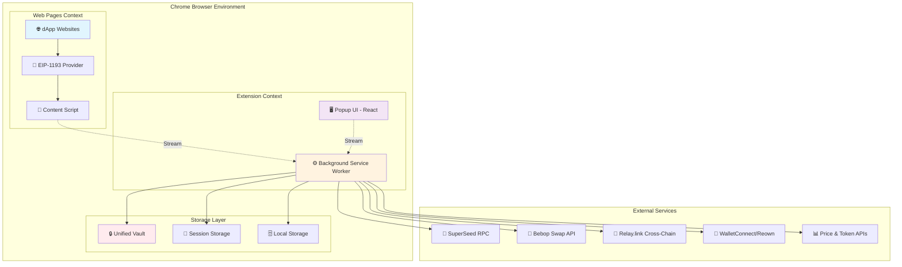
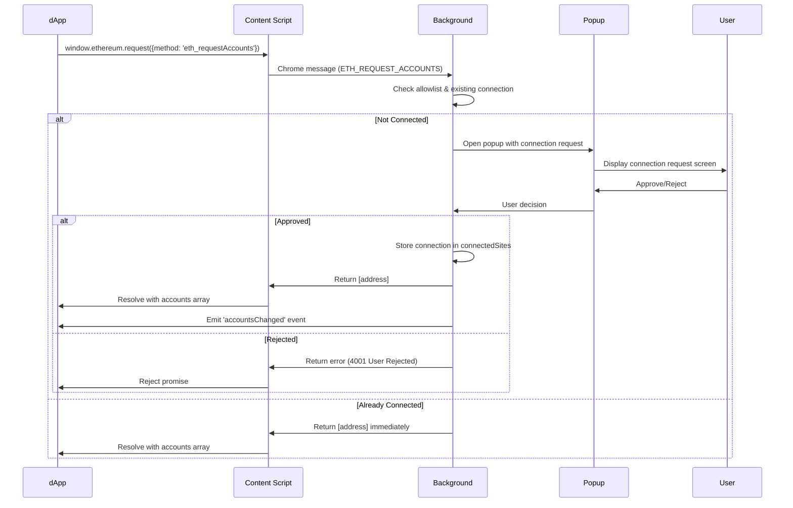
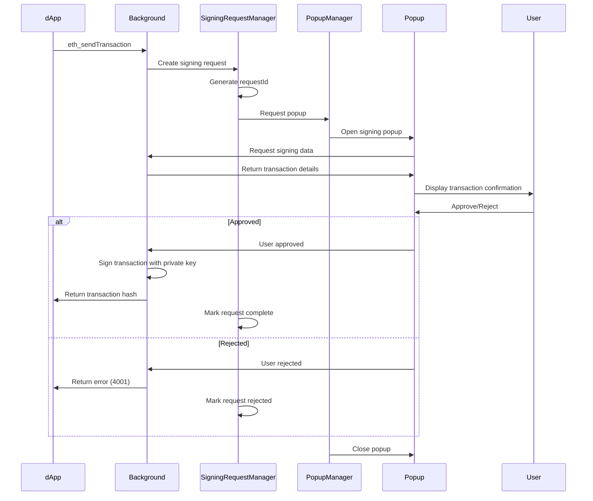
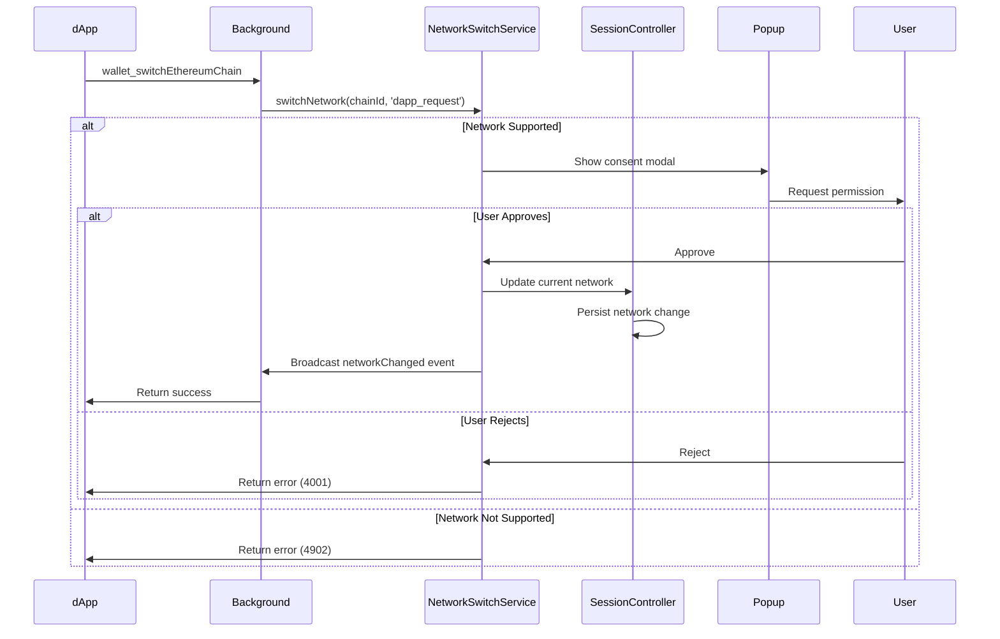
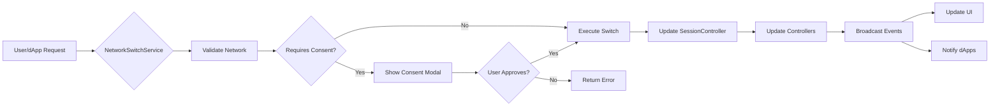

# 🏗️ Architecture Deep Dive

Explore the intricate details of SuperSafe Wallet's Professionally Standardized Service Worker architecture and understand how each component works together.

## Executive Summary

SuperSafe Wallet is a modern Ethereum-compatible browser extension wallet implementing a **Professionally Standardized Service Worker architecture** with **Smart Native Connection** for seamless multichain dApp integration. Built with React 18, ethers.js v6, and Chrome Extension Manifest V3.

### Key Architectural Features

- **✅ Professionally Standardized Architecture**: Service worker as single source of truth
- **✅ Smart Native Connection**: Real chainIds only, zero compatibility hacks
- **✅ Multichain Support**: 8 active networks (SuperSeed, Optimism, Ethereum, Base, BSC, Arbitrum, Monad, Shardeum)
- **✅ Stream-Based Communication**: Native Chrome long-lived connections
- **✅ Unified Vault System**: Military-grade AES-256-GCM encryption
- **✅ Thin Client Pattern**: Frontend as lightweight presentation layer
- **✅ Enterprise Signing System**: Robust request management and recovery
- **✅ Bebop Integration**: Native swap support with partner fees
- **✅ Relay.link Integration**: Cross-chain swaps across 85+ blockchains
- **✅ WalletConnect V2**: Full Reown WalletKit implementation
- **✅ Framework Detection**: Automatic dApp framework identification
- **✅ One Window Policy**: Single active window enforcement (v3.1.3)
- **✅ Responsive Design**: Adaptive layout for popup and fullpage modes (v3.1.3)
- **✅ Gas Validation System**: Real-time scam detection and protection (v3.1.4)

### System Metrics

```
Total Project Files: 195 JavaScript/JSX files
Total Lines of Code: ~33,000 lines
Architecture Pattern: Professionally Standardized Service Worker
Security Level: Military-grade encryption
Supported Networks: 8 active networks
Response Time: <150ms average
Vault Encryption: AES-256-GCM + PBKDF2
UI Modes: Popup (375px) + Fullpage (adaptive)
```

---

## System Architecture

### High-Level Architecture Diagram



### Component Interaction Model

```
┌──────────────────────────────────────────────────────────────────┐
│                      Frontend (Thin Client)                      │
│  ┌──────────────┐  ┌──────────────┐  ┌────────────────────────┐ │
│  │   React UI   │  │   Adapters   │  │   Stream Manager       │ │
│  │  Components  │→→│  (Frontend)  │→→│  (Long-lived ports)    │ │
│  └──────────────┘  └──────────────┘  └────────────────────────┘ │
└──────────────────────────────────┬───────────────────────────────┘
                                   │ Chrome Streams
                                   ↓
┌──────────────────────────────────────────────────────────────────┐
│               Background Script (Single Source of Truth)         │
│  ┌────────────────────────────────────────────────────────────┐ │
│  │                    Stream Handlers                         │ │
│  │  - Session  - Provider  - Swap  - Send  - Blockchain      │ │
│  └────────────────────────────────────────────────────────────┘ │
│  ┌────────────────────────────────────────────────────────────┐ │
│  │                    Core Controllers                        │ │
│  │  - BackgroundSessionController (3,979 lines)               │ │
│  │  - BackgroundControllers (497 lines)                       │ │
│  │    • TokenController  • NetworkController                  │ │
│  │    • TransactionController  • NetworkSwitchService         │ │
│  └────────────────────────────────────────────────────────────┘ │
│  ┌────────────────────────────────────────────────────────────┐ │
│  │                 Enterprise Managers                        │ │
│  │  - SigningRequestManager  - PopupManager                   │ │
│  │  - EIP1193EventsManager   - AutoEscalationManager          │ │
│  │  - StreamPersistenceManager                                │ │
│  └────────────────────────────────────────────────────────────┘ │
│  ┌────────────────────────────────────────────────────────────┐ │
│  │                   Handler Layer                           │ │
│  │  - walletHandlers  - contractHandlers                      │ │
│  │  - providerHandlers  - AllowListManager                    │ │
│  └────────────────────────────────────────────────────────────┘ │
│  ┌────────────────────────────────────────────────────────────┐ │
│  │               External Integrations                       │ │
│  │  - WalletConnect Manager  - Bebop Integration              │ │
│  │  - Relay.link Integration  - Cross-chain swaps             │ │
│  │  - Transaction History Service  - Explorer Adapters        │ │
│  │  - SuperSeed API Wrapper  - Secure API Client              │ │
│  └────────────────────────────────────────────────────────────┘ │
└──────────────────────────────────────────────────────────────────┘
                                   │
                                   ↓
┌──────────────────────────────────────────────────────────────────┐
│                        Storage Layer                             │
│  ┌──────────────┐  ┌──────────────┐  ┌───────────────────────┐ │
│  │ Unified Vault│  │   Session    │  │      Local            │ │
│  │ (Encrypted)  │  │   Storage    │  │      Storage          │ │
│  └──────────────┘  └──────────────┘  └───────────────────────┘ │
└──────────────────────────────────────────────────────────────────┘
```

---

## Core Design Principles

### 1. Single Source of Truth

**All state lives in the background service worker.**

- Frontend components are purely presentational
- No direct storage access from frontend
- All mutations go through background controllers
- State synchronization via Chrome streams

**Benefits:**
- Eliminates race conditions
- Prevents storage context isolation issues
- Simplified state management
- Single point of control for security

### 2. Thin Client Pattern

**Frontend is a lightweight presentation layer.**

```javascript
// ❌ WRONG: Frontend doing business logic
const wallet = await createWallet(privateKey);
await saveToStorage(wallet);

// ✅ CORRECT: Frontend delegates to background
const result = await FrontendSessionAdapter.createWallet(privateKey);
```

**Frontend Responsibilities:**
- Render UI components
- Handle user input
- Display data from background
- Route user actions to background

**Background Responsibilities:**
- State management
- Cryptographic operations
- Storage access
- Business logic
- External API calls

### 3. Stream-Based Communication

**Native Chrome long-lived connections for efficiency.**

```javascript
// Frontend creates persistent connection
const port = chrome.runtime.connect({ name: 'session' });

// Background listens on named channels
backgroundStreamManager.onMessage('session', async (message, port) => {
  // Handle message
  return { success: true, data: result };
});
```

**Stream Channels:**
- `session` - Session and wallet operations
- `provider` - dApp provider requests (EIP-1193)
- `swap` - Swap quote and execution
- `send` - Token transfer operations
- `blockchain` - Blockchain queries
- `api` - External API calls

### 4. Zero Frontend Crypto

**All cryptographic operations isolated in background.**

- Private keys never leave background context
- Vault encryption/decryption in background only
- Signing operations in background only
- Password handling in background only

**Security Benefits:**
- Reduced attack surface
- Memory isolation
- Audit-friendly architecture
- Simplified security model

### 5. Professionally Standardized Controllers

**Modular controller pattern for separation of concerns.**

```javascript
BackgroundControllers {
  tokenController       // ERC20 token management
  networkController     // Network switching & configuration
  transactionController // Transaction history & management
  networkSwitchService  // Centralized network switching
}
```

Each controller:
- Single responsibility
- Independent initialization
- Event-driven architecture
- Stateless where possible

---

## Component Architecture

### Background Script (3,220 lines)

**Location:** `src/background.js`

**Primary Responsibilities:**
- Service worker initialization and lifecycle
- Stream handler registration
- Manager orchestration
- WalletConnect integration
- Global state coordination

**Key Components:**
```javascript
// Core Controllers
backgroundSessionController  // Session & wallet management
backgroundControllers        // Token, network, transaction controllers

// Enterprise Managers
signingRequestManager       // Signing request lifecycle
popupManager               // Popup window management
eip1193EventsManager       // EIP-1193 event broadcasting
autoEscalationManager      // Auto-approval for trusted dApps

// External Integrations
walletConnectManager       // WalletConnect v2 / Reown
secureApiClient           // Secure external API calls
bebopTokenService         // Bebop token list management
```

### BackgroundSessionController (3,979 lines)

**Location:** `src/background/BackgroundSessionController.js`

**Core Functionality:**
- Vault management (create, unlock, lock)
- Wallet management (create, import, remove)
- Session state management
- Auto-lock functionality
- Connected sites management
- Network switching coordination

**Session State:**
```javascript
{
  isUnlocked: boolean,
  password: string (memory only),
  vaultData: Object (decrypted),
  decryptedWallets: Map<address, privateKey>,
  connectedSites: Map<origin, siteData>,
  currentNetworkKey: string
}
```

### BackgroundControllers (497 lines)

**Location:** `src/background/BackgroundControllers.js`

**Architecture:**
```javascript
class BackgroundControllers {
  tokenController         // ERC20 operations
  networkController      // Network management
  transactionController  // Transaction history
  networkSwitchService   // Unified switching
  
  async initialize(networkKey, provider, getPrivateKeyFn)
  async handleTokenMessage(message)
  async handleNetworkMessage(message)
  async handleTransactionMessage(message)
}
```

### Frontend Application (1,569 lines)

**Location:** `src/App.jsx`

**Main React Component:**
- Screen routing logic
- Modal management
- Connection request handling
- Transaction confirmation
- Signing request UI
- Network switch consent

**State Management:**
```javascript
// Wallet state (from background)
const { 
  currentWallet, 
  wallets, 
  network, 
  isUnlocked,
  supportsSwap 
} = useWalletProvider();
```

### Swap Architecture (v2.0.0 - Refactored Nov 2025)

**Design Philosophy:** Unified panel architecture for provider-agnostic swap interface.

**Structure:**
```
Swap.jsx (~115 lines)              # Container/Orchestrator
  ├─ SwapProviderSelector          # Tab selector (Bebop | Relay)
  ├─ SlippageControl               # Shared slippage configuration
  └─ Conditional Rendering:
      ├─ BebopSwapPanel.jsx (~1,400 lines)   # Bebop JAM protocol
      └─ RelaySwapPanel.jsx (~1,288 lines)   # Relay.link cross-chain
```

**Key Benefits:**
1. ✅ **Consistency**: Both panels follow same architectural pattern
2. ✅ **Maintainability**: Each panel is self-contained and independently testable
3. ✅ **Scalability**: Easy to add new providers (Uniswap, 1inch, etc.)
4. ✅ **Separation of Concerns**: `Swap.jsx` only handles routing, not implementation
5. ✅ **Reduced Complexity**: From 2,206 lines monolith to 115-line orchestrator

**BebopSwapPanel (~1,400 lines):**
- Gasless MEV-protected swaps via Bebop JAM protocol
- Permit2 approvals (one-time per token)
- Internal components: `LoadingDots`, `PriceDeviationTooltip`, `SwapDetails`
- Uses `SwapAdapter` for all backend communication
- NO ethers imports (architecture compliance)

**RelaySwapPanel (~1,288 lines):**
- Cross-chain swaps via Relay.link
- Network selection: Origin fixed (active network), Destination selectable
- Internal components: `UsdBalanceDisplay`, `formatTokenAmount`
- Uses `RelayAdapter` for all backend communication
- Advanced features: Route visualization, gas estimation, bridge time

### Stream Handlers

**Location:** `src/background/handlers/streams/`

| Handler | Purpose | Key Operations |
|---------|---------|----------------|
| **SessionStreamHandler** | Session operations | unlock, createWallet, switchWallet |
| **ProviderStreamHandler** | dApp requests | eth_requestAccounts, eth_sendTransaction |
| **SwapStreamHandler** | Bebop swaps | getQuote, signOrder, checkStatus |
| **SendStreamHandler** | Token transfers | estimateGas, sendTransaction |
| **BlockchainStreamHandler** | Blockchain queries | getBalance, getTokens, getNFTs |
| **ApiStreamHandler** | External APIs | price feeds, token lists |

### Managers

**Location:** `src/background/managers/`

| Manager | Purpose | Key Features |
|---------|---------|--------------|
| **SigningRequestManager** | Signing request lifecycle | Timeout protection, request recovery |
| **PopupManager** | Popup window management | Mutual exclusion, priority system |
| **EIP1193EventsManager** | Event broadcasting | accountsChanged, chainChanged |
| **AutoEscalationManager** | Auto-approval system | Trusted dApp whitelist |
| **WalletConnectManager** | WalletConnect v2 | Session management, request handling |

### Services

**Location:** `src/background/services/`

| Service | Purpose | Implementation |
|---------|---------|---------------|
| **TokenMetadataService** | Token metadata lookup | Multi-layer: Cache → BebopTokenService → RPC |
| **BebopTokenService** | Token list management | Local database, 2000+ tokens |
| **NetworkSwitchService** | Unified network switching | Bidirectional dApp-wallet sync |

---

## Transaction Decoder Architecture

### Overview

SuperSafe Wallet implements a professional-grade transaction decoding system that transforms raw blockchain transactions into human-readable information. The system supports major DEX protocols (Uniswap V2/V3/V4, PancakeSwap Infinity, Velodrome, Aerodrome) across 8 EVM networks with a strict "no fallbacks" security policy.

### Core Components

**TransactionDecoder** - Main orchestrator (`src/background/decoders/TransactionDecoder.js`)
- Routes transactions to specialized decoders based on function selector
- Manages token metadata resolution
- Enforces strict "no fallbacks" policy

**UniversalRouterDecoder** - Universal Router transactions (`src/background/decoders/UniversalRouterDecoder.js`)
- Decodes Uniswap and Velodrome Universal Router transactions
- Supports 11 command types (V2/V3/V4 swaps, wrap/unwrap, permit2)
- Context-aware opcode interpretation (detects Uniswap vs PancakeSwap)

**UniversalRouterDecoderPancake** - PancakeSwap Infinity (`src/background/decoders/UniversalRouterDecoderPancake.js`)
- Specialized decoder for PancakeSwap Infinity concentrated liquidity swaps
- Heuristic-based decoding for complex CL structures
- Handles both native (BNB) and ERC-20 inputs

**TokenMetadataService** - Token metadata management (`src/background/services/TokenMetadataService.js`)
- Multi-layer lookup: Cache → BebopTokenService → On-Chain RPC
- LRU cache with 1000 entry limit
- Strict validation with no fallbacks
- Request deduplication to prevent redundant RPC calls

### Protocol Support

| Protocol | Networks | Status |
|----------|----------|--------|
| Uniswap V2/V3/V4 | ETH, OPT, BASE | ✅ Full support |
| Universal Router | ETH, OPT, BASE, BSC | ✅ Full support |
| PancakeSwap Infinity | BSC | ✅ Heuristic decode |
| Velodrome | Optimism | ✅ Full support |
| Aerodrome | Base | ✅ Full support |
| ERC-20 Operations | All networks | ✅ Full support |
| Permit2 | All networks | ✅ Single/batch |

### "No Fallbacks" Security Policy

**Core Principle:** Never use default or guessed values for critical transaction parameters.

**Examples:**
```javascript
// ✅ CORRECT
const metadata = await tokenMetadataService.getTokenMetadata(address, chainId, provider);
if (!metadata) {
  throw new Error(`Cannot fetch metadata for token ${address}`);
}

// ❌ NEVER DO THIS
const decimals = metadata?.decimals || 18; // Dangerous!
```

**Rationale:**
- Better to show error than incorrect amounts/tokens
- Prevents user from signing wrong information
- Eliminates network mismatch risks

---

## Signing System Architecture

### Overview

Unified signing system handling all signing request types (transactions, personal messages, typed data) with consistent request management, network validation, and security controls.

### Core Components

**SigningRequestManager** (`src/background/managers/SigningRequestManager.js`)
- Centralized manager for all signing requests
- Request lifecycle management (created → pending → completed/rejected/expired)
- Timeout protection (5 minutes default)
- Request recovery on popup crash

**SigningModalAdapter** (`src/background/adapters/SigningModalAdapter.js`)
- Transforms raw RPC requests into user-friendly modal data
- Handles personal_sign hex-to-UTF8 decoding
- Parses eth_signTypedData_v4 structured data
- Detects Permit2 approvals for enhanced UI

### Supported Signing Methods

| Method | Status | Purpose |
|--------|--------|---------|
| `personal_sign` | ✅ Active | SIWE, message authentication |
| `eth_signTypedData_v4` | ✅ Active | Permit2, structured data |
| `eth_signTypedData_v3` | ✅ Active | Legacy support |
| `eth_sign` | ❌ Disabled | Blind signing risk |

**Snake_case Support:** Both `personal_sign` and `personalSign` work (industry compatibility).

### Request Lifecycle

```
1. createRequest() → Generate requestId, set timeout
2. buildModalRequestFromRpc() → Transform to modal format
3. createSigningPopup() → Show popup to user
4. User approves/rejects
5. handleResponse() → Process response
6. Complete/reject/expire → Cleanup
```

### Security Validation

**Network Validation:**

```javascript
validateSigningNetwork(chainId, supportedNetworks, origin)
```

- Prevents signing on unsupported networks
- Clear error messages
- Protects against replay attacks

**eth_sign Disablement:**
- Permanently disabled for security
- Returns error code 4200
- Users must use personal_sign or eth_signTypedData_v4

---

## dApp Connection Architecture

### PopupManager Mutual Exclusion

**Purpose:** Ensures extension UI and popup windows never coexist (Professionally Standardized UX).

**Implementation:**
- When popup opens → Extension closes
- When extension opens while popup active → Extension closes, popup gains focus
- Applies to ALL popup types

**Popup Priority Order:**
1. Personal Sign
2. Typed Data
3. Transaction
4. Network Switch
5. Connection
6. Unlock

### Network Management

**Bidirectional Network Switching:**

SuperSafe supports network switching initiated from both sides:

1. **Extension → dApp**: User changes network in wallet → `eth_chainChanged` event propagated to all connected dApps
2. **dApp → Wallet**: dApp requests network switch via `wallet_switchEthereumChain` → Popup shown to user

**Network Validation:**

```javascript
validateSigningNetwork(chainId, supportedNetworks, origin)
```

- Validates signing requests against dApp's supported networks
- Prevents cross-network signing attacks
- Shows clear error for unsupported networks

### Stream Architecture

**Long-Lived Connections:**

SuperSafe uses native Chrome message ports for bidirectional communication:

```javascript
// Content Script → Background
const port = chrome.runtime.connect({ name: 'provider-stream' });

// Background maintains open connections
providerStreams.set(origin, { port, metadata });
```

**Stream Types:**
- **Provider Stream** - dApp RPC requests (eth_sendTransaction, personal_sign, etc.)
- **Session Stream** - Extension UI communication
- **WalletConnect Stream** - Mobile wallet protocol

**Lifecycle Management:**
- Streams auto-reconnect on service worker restart
- Pending requests recovered from memory
- Disconnect cleanup removes stale connections

---

## Service Worker Lifecycle

### Manifest V3 Architecture

SuperSafe runs as Manifest V3 service worker with different lifecycle than traditional background pages.

**Lifecycle States:**
- Installing → Activated → Running → Idle (30s) → Terminated (5min)
- Wake-up events restart from Terminated to Running

### Wakeup Mechanism

**Problem:** Service workers terminate after inactivity, breaking long-lived connections.

**Solution:** Proactive keep-alive ping system.

**Implementation:**
```javascript
// Keep service worker alive with periodic ping
setInterval(() => {
  chrome.runtime.getPlatformInfo(() => {
    // Ping prevents termination
  });
}, 20000); // Every 20 seconds
```

**Benefits:**
- Maintains stream connections
- Prevents timeout-related disconnections
- Ensures WalletConnect sessions stay alive
- Preserves in-memory session state

### Persistence Strategy

- **Critical State** → Chrome Storage (encrypted vault, network selection)
- **Session State** → In-memory with auto-lock timeout
- **Transient State** → Streams with reconnection logic

### Session Recovery

**Automatic Corruption Detection:**

SuperSafe implements self-healing session restoration that automatically detects and cleans corrupted session data:

```javascript
// checkPersistentSession() in BackgroundSessionController
const success = await this.restoreSessionWithLoginToken(loginToken, timeElapsed);

if (!success) {
  // Auto-cleanup corrupted session data
  await this.clearSessionState();
  return false;  // User sees login screen
}
```

**Recovery Triggers:**
- Decryption failure (OperationError)
- Invalid credentials (vault mismatch)
- Restoration exceptions

**Benefits:**
- ✅ Prevents error loops on every extension open
- ✅ Self-healing without user intervention
- ✅ Maintains vault integrity (only clears session state)

---

## Data Flow Patterns

### Connection Request Flow



### Transaction Signing Flow



### Network Switch Flow



---

## Technology Stack

### Core Technologies

| Technology | Version | Purpose |
|------------|---------|---------|
| **React** | 18.2.0 | UI framework |
| **ethers.js** | 6.13.0 | Ethereum library |
| **Vite** | 6.3.6 | Build tool |
| **TailwindCSS** | 3.3.3 | Styling |
| **Chrome Extension** | Manifest V3 | Platform |

### Key Dependencies

```json
{
  "@reown/walletkit": "^1.2.8",
  "@reservoir0x/relay-sdk": "^2.4.0",
  "@metamask/eth-sig-util": "^8.2.0",
  "ethereum-cryptography": "^3.2.0",
  "buffer": "^6.0.3",
  "idb": "^7.1.1",
  "axios": "^1.12.0"
}
```

### Build Configuration

**Multiple Vite Configs:**
- `vite.config.js` - Frontend popup build
- `vite.config.worker.js` - Background service worker
- `vite.config.content.js` - Content script injection

**Output Structure:**
```
dist/
├── index.html              # Popup entry
├── popup.js                # Frontend bundle
├── background.js           # Service worker bundle
├── content-script.js       # Content script bundle
├── provider.js             # EIP-1193 provider
├── manifest.json           # Extension manifest
└── assets/                 # Static resources
```

---

## Directory Structure

### Backend Architecture

```
src/background/
├── BackgroundSessionController.js    # Session management (3,979 lines)
├── BackgroundControllers.js          # Controller orchestration (497 lines)
│
├── handlers/                         # Request handlers
│   ├── streams/                      # Stream-based handlers
│   │   ├── SessionStreamHandler.js   # Session operations
│   │   ├── ProviderStreamHandler.js  # dApp provider requests
│   │   ├── SwapStreamHandler.js      # Bebop swap operations
│   │   ├── SendStreamHandler.js      # Token transfers
│   │   ├── BlockchainStreamHandler.js # Blockchain queries
│   │   ├── ApiStreamHandler.js       # External API calls
│   │   └── GenericStreamHandlers.js  # Generic utilities
│   ├── walletHandlers.js             # Wallet operations
│   ├── contractHandlers.js           # Smart contract calls
│   └── providerHandlers.js           # Provider management
│
├── managers/                         # Enterprise managers
│   ├── SigningRequestManager.js      # Signing lifecycle
│   ├── PopupManager.js               # Popup orchestration
│   ├── EIP1193EventsManager.js       # Event broadcasting
│   ├── AutoEscalationManager.js      # Auto-approval logic
│   ├── StreamPersistenceManager.js   # Stream persistence
│   ├── SigningRequestRecovery.js     # Request recovery
│   └── SigningRequestDeduplicator.js # Duplicate prevention
│
├── services/                         # External services
│   ├── NetworkSwitchService.js       # Unified network switching
│   ├── SecureApiClient.js            # Secure HTTP client
│   └── SuperSeedApiWrapper.js        # SuperSeed RPC wrapper
│
├── adapters/                         # Adapters
│   └── SigningModalAdapter.js        # Modal communication
│
├── decoders/                         # Data decoders
│   └── TransactionDecoder.js         # Transaction decoding
│
├── policy/                           # Security policies
│   └── AllowListManager.js           # dApp allowlist
│
├── security/                         # Security modules
│   ├── SimpleRateLimiter.js          # Rate limiting
│   └── SimpleBlacklistManager.js     # Blacklist management
│
├── config/                           # Configuration
│   ├── apiConfig.js                  # API endpoints
│   ├── bebopPartnerConfig.js         # Bebop partner settings
│   └── walletConnectConfig.js        # WalletConnect settings
│
├── strategy/                         # Strategy patterns
│   └── ConnectionStrategies.js       # dApp connection strategies
│
├── api/                              # API layer
│   └── blockchainApi.js              # Unified blockchain API
│
└── utils/                            # Utilities
    └── feeConfig.js                  # Fee configuration
```

### Frontend Architecture

```
src/
├── App.jsx                           # Main app component (1,569 lines)
├── main.jsx                          # React entry point
│
├── components/                       # UI components
│   ├── Dashboard.jsx                 # Portfolio view
│   ├── Swap.jsx                      # Swap container/orchestrator (~115 lines)
│   ├── SwapProviderSelector.jsx      # Bebop/Relay provider selector
│   ├── Settings.jsx                  # Settings panel
│   ├── Ecosystem.jsx                 # Ecosystem explorer
│   │
│   ├── swap/                         # Swap-specific components
│   │   ├── BebopSwapPanel.jsx        # Bebop swap implementation (~1,400 lines)
│   │   ├── RelaySwapPanel.jsx        # Relay swap implementation (~1,288 lines)
│   │   ├── CompactNetworkSelector.jsx # Compact network selector for cross-chain
│   │   ├── RouteVisualization.jsx    # Visual swap route display
│   │   ├── BridgeTimeDisplay.jsx     # Bridge time estimation
│   │   ├── GasEstimateDisplay.jsx    # Gas cost estimation
│   │   └── LoadingDots.jsx           # Loading animation
│   │
│   ├── screens/                      # Full-screen views
│   │   ├── ConnectionRequestScreen.jsx
│   │   ├── TransactionConfirmationScreen.jsx
│   │   ├── SigningConfirmationScreen.jsx
│   │   ├── TypedDataConfirmationScreen.jsx
│   │   ├── NetworkSwitchConfirmationScreen.jsx
│   │   └── TransactionSuccessScreen.jsx
│   │
│   ├── modals/                       # Modal dialogs
│   │   ├── UnlockWalletModal.jsx
│   │   ├── EditWalletModal.jsx
│   │   ├── NetworkConsentModal.jsx
│   │   ├── SignatureModal.jsx
│   │   ├── LoadingModal.jsx
│   │   └── StyledModal.jsx
│   │
│   ├── settings/                     # Settings sections
│   │   ├── SecuritySection.jsx
│   │   ├── WalletsSection.jsx
│   │   ├── NetworkSection.jsx
│   │   ├── TokensSection.jsx
│   │   ├── WalletConnectSection.jsx
│   │   └── AppInfoSection.jsx
│   │
│   └── common/                       # Reusable components
│       ├── Dashboard/
│       │   ├── PortfolioBalanceSection.jsx
│       │   ├── TokensList.jsx
│       │   ├── NFTsSection.jsx
│       │   └── TokenCardDark.jsx
│       ├── TokenImage.jsx
│       ├── TokenLogo.jsx
│       ├── NetworkIcon.jsx
│       └── TokenPriceChart.jsx
│
├── contexts/                         # React contexts
│   ├── WalletProvider.jsx            # Wallet state context
│   └── BalancesProvider.jsx          # Balances context
│
├── hooks/                            # Custom hooks
│   ├── useSessionWallet.js           # Session management
│   ├── useSwapLogic.js               # Swap logic
│   ├── useSwapQuote.js               # Swap quote management
│   ├── useTokenList.js               # Token list management
│   ├── usePortfolioData.js           # Portfolio data aggregation
│   ├── useUnifiedNetworkSwitch.js    # Network switching
│   ├── useNativeStreamConnection.js  # Stream connection management
│   ├── useAutoLock.js                # Auto-lock functionality
│   ├── useNotification.js            # Notification system
│   └── useApiProxy.js                # API proxy utilities
│
├── utils/                            # Frontend utilities
│   ├── FrontendSessionAdapter.js     # Session communication
│   ├── FrontendControllerAdapter.js  # Controller communication
│   ├── SwapAdapter.js                # Swap communication
│   ├── SendAdapter.js                # Send communication
│   ├── NativeStreamManager.js        # Stream management
│   ├── provider.js                   # EIP-1193 provider
│   ├── walletConnectManager.js       # WalletConnect client
│   ├── vaultManager.js               # Vault operations
│   ├── vaultStorage.js               # Vault storage layer
│   ├── crypto.js                     # Cryptography utilities
│   ├── networks.js                   # Network configurations
│   ├── ethereumUtils.js              # Ethereum utilities
│   ├── bebopTokenService.js          # Bebop token list service
│   ├── superseedApi.js               # SuperSeed API client
│   ├── apiProxy.js                   # API proxy layer
│   ├── portfolioCalculator.js        # Portfolio calculations
│   ├── addressBook.js                # Address book management
│   ├── storage.js                    # Storage utilities
│   ├── tokenConfig.js                # Token configuration
│   ├── swapConfig.js                 # Swap configuration
│   ├── swapContracts.js              # Swap contract addresses
│   ├── curatedTokenLogos.js          # Token logo mappings
│   ├── feeConfigClient.js            # Fee configuration client
│   ├── dAppFrameworkDetector.js      # dApp framework detection
│   └── networkMismatchDetector.js    # Network mismatch detection
│
├── controllers/                      # Frontend controllers
│   ├── TokenController.js            # Token operations
│   ├── NetworkController.js          # Network management
│   └── TransactionController.js      # Transaction history
│
└── services/                         # Frontend services
    └── NetworkSwitchService.js       # Network switching service
```

---

## Network Architecture

### Supported Networks

**Active Networks (7):**

| Network | Chain ID | Swap Support | Relay Support | Status |
|---------|----------|-------------|---------------|--------|
| **SuperSeed** | 5330 | ✅ Bebop (JAM) | ✅ Cross-chain | ✅ Active |
| **Optimism** | 10 | ✅ Bebop (JAM+RFQ) | ✅ Cross-chain | ✅ Active |
| **Ethereum** | 1 | ✅ Bebop (JAM+RFQ) | ✅ Cross-chain | ✅ Active |
| **Base** | 8453 | ✅ Bebop (JAM+RFQ) | ✅ Cross-chain | ✅ Active |
| **BNB Chain** | 56 | ✅ Bebop (JAM+RFQ) | ✅ Cross-chain | ✅ Active |
| **Arbitrum One** | 42161 | ✅ Bebop (JAM+RFQ) | ✅ Cross-chain | ✅ Active |
| **Shardeum** | 8118 | ❌ Not supported | ❌ Not supported | ✅ Active |

**Key Features:**
- **Bebop Support**: 6 networks support Bebop swaps (JAM and/or RFQ)
- **Relay.link Support**: 6 networks support cross-chain swaps via Relay.link
- **Network Tokens**: Each network has wrapped native token (WETH, WBNB, etc.)
- **Stable Tokens**: USDC/USDT configured per network
- **Explorer APIs**: Moralis (ETH, OPT, BASE, BSC, ARB), Blockscout (SuperSeed)

### Network Switching Architecture



**Context-Aware Switching:**
- `manual` - User-initiated from UI
- `dapp_request` - dApp-requested via wallet_switchEthereumChain
- `connection` - During dApp connection
- `automatic` - System-initiated

### Pre-Switch Coordination System

**Purpose:** Ensures all components are ready before network switch completes, preventing race conditions and state inconsistencies.

**Architecture:** Promise-based coordination replaces fragile timing-based delays with deterministic handler execution.

```javascript
// Pre-switch handler registration
preSwitchCoordinator.registerHandler(
  'portfolio-data-lock',
  async (targetNetworkKey) => {
    // Prepare for network switch
    isNetworkSwitchingRef.current = true;
    pendingNetworkSwitchRef.current = targetNetworkKey;
  },
  { name: 'Portfolio Lock', timeout: 500 }
);

// Coordinated execution during switch
await preSwitchCoordinator.executeHandlers(targetNetworkKey, {
  context: 'manual',
  abortOnError: true  // Abort switch on handler failure
});
```

**Key Features:**
- **Deterministic Execution**: Waits for actual handler completion, not arbitrary delays
- **Abort-on-Failure**: Network switch aborts if any handler fails/times out
- **Per-Handler Timeouts**: Individual 2s timeout protection (configurable)
- **Global Timeout**: 5s safety net prevents infinite hangs
- **Detailed Logging**: Full visibility into handler execution and failures
- **Cleanup Support**: Automatic unregistration on component unmount

**Security Benefits:**
- Prevents showing one network while signing on another
- Eliminates race conditions in portfolio data fetching
- Ensures UI state consistency across network switches
- No silent failures - all errors surfaced to user

---

## One Window Policy (v3.1.3)

SuperSafe implements **single active window enforcement** to ensure consistent UX and prevent conflicts.

### Design Principle

Only ONE wallet window can be active at any time:
- **Extension UI** (popup) OR **Popup window** (confirmation screens)
- Never both simultaneously

### Implementation

**PopupManager Mutual Exclusion:**

```javascript
// When popup opens → Extension closes
await PopupManager.openPopup('connection', { origin, tabId });
// Automatically closes any existing extension window

// When extension opens while popup active
// → Extension closes, popup gains focus
```

**Priority Order for Popup Types:**
1. Personal Sign requests
2. Typed Data requests (Permit2)
3. Transaction confirmations
4. Network switch consent
5. Connection requests
6. Unlock prompts

### Pre-render and Post-render Checks

```javascript
// Before rendering
const shouldRender = await checkOneWindowPolicy();
if (!shouldRender) {
  window.close();
  return;
}

// After rendering (periodic check)
setInterval(enforceOneWindowPolicy, 1000);
```

### Benefits

- ✅ **MetaMask-style UX**: Familiar behavior for users
- ✅ **No stream disconnections**: Single point of communication
- ✅ **No stuck requests**: Clear ownership of pending operations
- ✅ **Reduced complexity**: Simpler state management

---

## Responsive Design System (v3.1.3)

SuperSafe implements adaptive layouts for different viewport contexts.

### Viewport Modes

| Mode | Dimensions | Context |
|------|------------|------|
| **Popup** | 375px × 600px (fixed) | Browser action click |
| **Fullpage** | Adaptive (min 800px width) | New tab / dashboard |

### Detection

```javascript
const isPopupMode = () => {
  return window.innerWidth <= 400 && window.innerHeight <= 650;
};

const isFullpageMode = () => {
  return window.innerWidth > 600;
};
```

### Responsive Components

**Dashboard:**
- Popup: Single-column token list
- Fullpage: Multi-column grid with expanded details

**Settings:**
- Popup: Stacked sections
- Fullpage: Sidebar navigation

**Confirmation Screens:**
- Popup: Scrollable compact layout
- Fullpage: Expanded details with side-by-side comparisons

### CSS Implementation

```css
/* Base: Mobile-first (popup) */
.container {
  width: 100%;
  max-width: 375px;
  padding: 16px;
}

/* Fullpage expansion */
@media (min-width: 600px) {
  .container {
    max-width: 1200px;
    padding: 24px 32px;
  }
  
  .dashboard-grid {
    display: grid;
    grid-template-columns: repeat(auto-fill, minmax(300px, 1fr));
  }
}
```

### Key Components

| Component | Popup Behavior | Fullpage Behavior |
|-----------|---------------|------------------|
| **TokensList** | Compact rows | Expanded cards with charts |
| **SwapPanel** | Stacked inputs | Side-by-side with details |
| **TransactionConfirmation** | Scrollable | Fixed layout with expanded info |
| **Settings** | Accordion sections | Sidebar + content pane |

---

## Performance Metrics

### Response Times

| Operation | Target | Actual | Status |
|-----------|--------|--------|--------|
| **Session unlock** | &lt;500ms | ~200ms | ✅ Excellent |
| **dApp response** | &lt;200ms | &lt;150ms | ✅ Excellent |
| **Network switch** | &lt;1s | ~300ms | ✅ Good |
| **Swap quote** | &lt;2s | ~800ms | ✅ Good |
| **Transaction sign** | &lt;100ms | ~50ms | ✅ Excellent |

### Optimization Strategies

1. **Stream Persistence**: Long-lived connections eliminate handshake overhead
2. **Pre-decrypted Keys**: Private keys cached in memory during session
3. **Controller Caching**: Network state and tokens cached in memory
4. **Lazy Loading**: Components loaded on-demand
5. **Event-Driven**: Zero polling, all updates via events

### Bundle Sizes

```
Frontend (popup.js): ~2.1 MB (includes React, ethers.js)
Background (background.js): ~1.8 MB (includes ethers.js, WalletConnect)
Content Script: ~150 KB (minimal injection)
```

---

## Related Documentation

- [Security Overview](../security/overview.md) - Security implementation
- [Transaction Decoding](./transaction-decoding.md) - Transaction decoder system
- [Signing System](./signing-system.md) - Unified signing system
- [Swap Integration](./swap-integration.md) - Bebop swap integration

---

**Document Status:** ✅ Current as of February 10, 2026  
**Code Version:** v3.1.8
