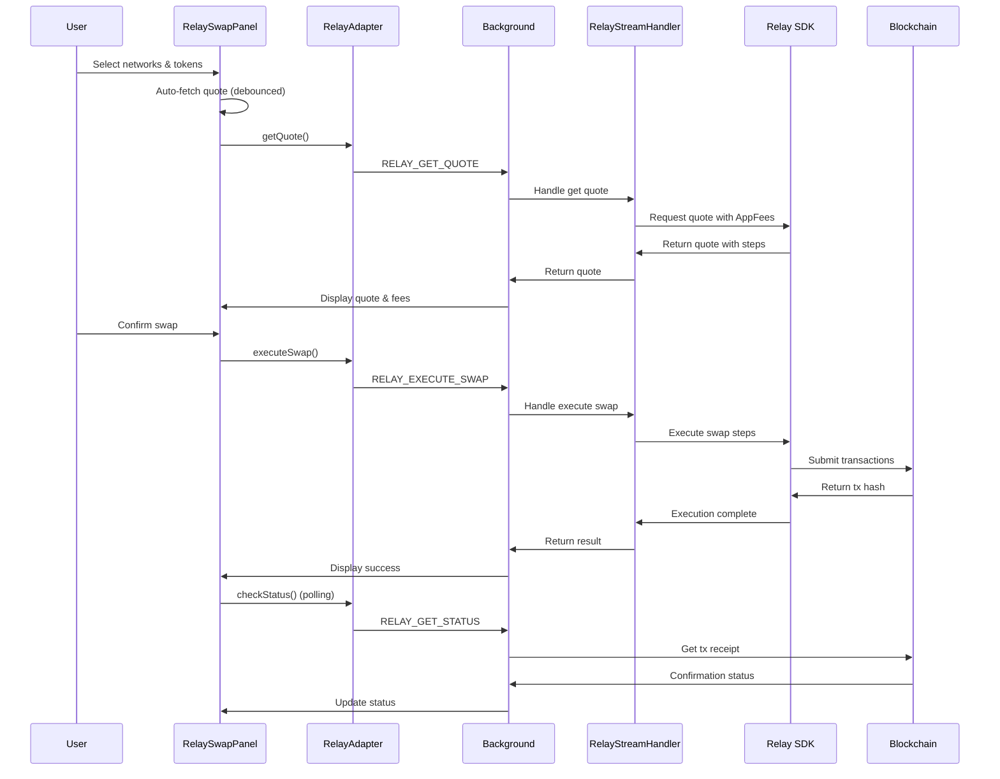
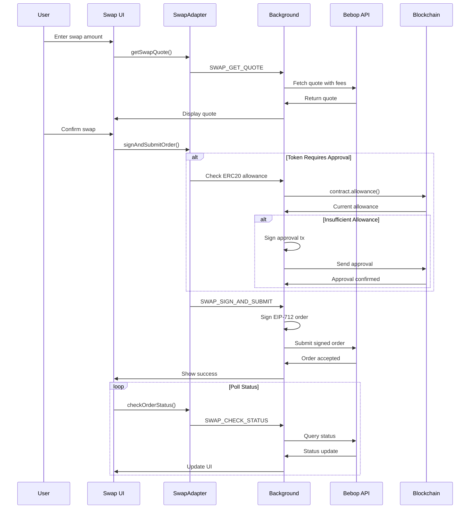

# 🔄 Swap Integration

SuperSafe Wallet integrates **Bebop's JAM (Just Another Market) protocol** and **Relay.link** for gasless, MEV-protected token swaps and cross-chain swaps across multiple EVM networks.

## Swap Overview

### Key Features

- **✅ Gasless Swaps**: Only pay for token approval (Permit2) via Bebop
- **✅ MEV Protection**: Protected from frontrunning and sandwich attacks
- **✅ Multi-Chain**: Currently supports **6 active networks** for Bebop (SuperSeed, Ethereum, Optimism, Base, BNB Chain, Arbitrum)
- **✅ Cross-Chain Swaps**: Relay.link supports swaps across 85+ blockchains
- **✅ Partner Fees**: Configurable revenue sharing (1% default)
- **✅ Best Prices**: Aggregated liquidity sources

---

## Unified Panel Architecture

**Version:** 2.0.0  
**Refactored:** November 13, 2025

### Design Philosophy

SuperSafe Wallet implements a **unified panel architecture** for swap providers, ensuring consistency, maintainability, and scalability across all swap implementations.

### Before (v1.0.0 - Monolithic)

```
Swap.jsx (2,206 lines)
  ├─ ALL Bebop logic inline
  ├─ ALL Relay logic inline
  ├─ Massive state management
  ├─ Duplicate components
  └─ Difficult to maintain
```

**Problems:**
- ❌ 2,206 lines in single file
- ❌ Mixed concerns (Bebop + Relay + routing)
- ❌ Hard to test independently
- ❌ Difficult to add new providers
- ❌ Code duplication between providers

### After (v2.0.0 - Unified Panels)

```
Swap.jsx (~115 lines)                    # Container/Orchestrator
  ├─ SwapProviderSelector                # Tab selector
  ├─ SlippageControl (shared)            # Slippage configuration
  └─ Conditional Rendering:
      ├─ BebopSwapPanel.jsx (~1,400 lines)
      └─ RelaySwapPanel.jsx (~1,288 lines)
```

**Benefits:**
- ✅ **Maintainability**: Each panel is self-contained (~1,300 lines each)
- ✅ **Testability**: Independent unit testing per provider
- ✅ **Scalability**: Add providers without touching existing code
- ✅ **Consistency**: Both panels follow same architectural pattern
- ✅ **Separation of Concerns**: Clear responsibilities

### Component Structure

#### 1. Swap.jsx (~115 lines)

**Responsibility:** Container/Orchestrator only

```javascript
const Swap = ({ 
  onTransactionComplete, 
  preselectedToken,
  onClearPreselection,
  walletTokensWithBalance,
  nativeTokenBalance 
}) => {
  const [swapProvider, setSwapProvider] = useState('bebop');
  const [slippage, setSlippage] = useState(0.5);
  
  return (
    <>
      <SwapProviderSelector selected={swapProvider} onChange={setSwapProvider} />
      <SlippageControl slippage={slippage} onChange={setSlippage} />
      
      {swapProvider === 'relay' ? (
        <RelaySwapPanel {...props} slippage={slippage} />
      ) : (
        <BebopSwapPanel {...props} slippage={slippage} />
      )}
    </>
  );
};
```

**Key Points:**
- Single responsibility: provider selection and routing
- No swap business logic
- Minimal state (provider + slippage)
- Clean, readable, maintainable

#### 2. BebopSwapPanel.jsx (~1,400 lines)

**Responsibility:** Complete Bebop swap implementation

**Internal Components:**
- `LoadingDots` - Loading animation
- `PriceDeviationTooltip` - USD deviation warnings
- `SwapDetails` - Fee breakdown accordion

**Key Features:**
- Gasless swaps via Bebop JAM
- Permit2 approvals (one-time)
- EIP-712 order signing
- Status polling
- Balance validation
- USD price calculations

**Architecture Compliance:**
- ✅ NO ethers imports
- ✅ Uses `SwapAdapter` only
- ✅ Thin client pattern
- ✅ All crypto in background

#### 3. RelaySwapPanel.jsx (~1,288 lines)

**Responsibility:** Complete Relay.link swap implementation

**Internal Components:**
- `UsdBalanceDisplay` - Balance with USD value
- `formatTokenAmount` - Helper function

**Key Features:**
- Cross-chain swaps
- Network selection (origin: active, destination: selectable)
- Route visualization
- Gas estimation
- Bridge time estimation
- Multi-hop support

**Architecture Compliance:**
- ✅ NO ethers imports
- ✅ Uses `RelayAdapter` only
- ✅ Thin client pattern
- ✅ All crypto in background

### Shared Components (`src/components/swap/`)

These components are used by both panels:

| Component | Purpose | Used By |
|-----------|---------|---------|
| `CompactNetworkSelector.jsx` | Network dropdown | Relay (cross-chain) |
| `RouteVisualization.jsx` | Visual route display | Relay (multi-hop) |
| `BridgeTimeDisplay.jsx` | Bridge time estimation | Relay (cross-chain) |
| `GasEstimateDisplay.jsx` | Gas cost display | Relay (all swaps) |
| `LoadingDots.jsx` | Loading animation | Both (separate versions) |

### Performance Metrics

| Metric | Before (v1.0) | After (v2.0) | Improvement |
|--------|---------------|--------------|-------------|
| **File Size** | 2,206 lines | 115 lines | **95% reduction** |
| **Build Time** | 6.8s | 6.5s | 4% faster |
| **Bundle Size** | Same | Same | No change |
| **Maintainability** | Low | High | ✅ Significantly improved |
| **Testability** | Hard | Easy | ✅ Unit tests possible |

---

## Bebop Integration

### Active Network Support

| Network | Chain ID | Bebop API | Swap Enabled | Contracts |
|---------|----------|-----------|--------------|-----------|
| **SuperSeed** | 5330 | JAM v2 | ✅ Active | Custom deployment |
| **Ethereum** | 1 | JAM v2 + RFQ v3 | ✅ Active | Standard EVM |
| **Optimism** | 10 | JAM v2 + RFQ v3 | ✅ Active | Standard EVM |
| **Base** | 8453 | JAM v2 + RFQ v3 | ✅ Active | Standard EVM |
| **BNB Chain** | 56 | JAM v2 + RFQ v3 | ✅ Active | Standard EVM |
| **Arbitrum One** | 42161 | JAM v2 + RFQ v3 | ✅ Active | Standard EVM |

**Note:** All active networks support Bebop swaps except Shardeum (chainId: 8118), which does not have swap support enabled.

### Bebop Contracts

```javascript
// Location: src/utils/networks.js
export const BEBOP_CONTRACTS = {
  // Standard EVM chains
  STANDARD_EVM: {
    JAM_SETTLEMENT_ADDRESS: "0xbEbEbEb035351f58602E0C1C8B59ECBfF5d5f47b",
    BALANCE_MANAGER_ADDRESS: "0xfE96910cF84318d1B8a5e2a6962774711467C0be"
  },
  
  // SuperSeed (custom deployment)
  SUPERSEED: {
    JAM_SETTLEMENT_ADDRESS: "0xbeb0b0623f66bE8cE162EbDfA2ec543A522F4ea6",
    BALANCE_MANAGER_ADDRESS: "0xC5a350853E4e36b73EB0C24aaA4b8816C9A3579a"
  },
  
  // Universal Permit2
  PERMIT2: {
    CONTRACT_ADDRESS: "0x000000000022D473030F116dDEE9F6B43aC78BA3"
  }
};
```

---

## Relay.link Integration

### Overview

As of November 4, 2025, SuperSafe Wallet now integrates **Relay.link** as an alternative swap provider, enabling **cross-chain swaps** and **bridge functionality** across 85+ blockchains.

### Key Features

- **✅ Cross-Chain Swaps**: Swap tokens between different networks in one transaction
- **✅ AppFees Support**: Configurable partner fees (1% default) collected in stablecoins
- **✅ Meta-Aggregation**: Best prices across multiple DEXs and bridges
- **✅ 85+ Chains**: Wide blockchain support including all SuperSafe networks
- **✅ Instant Bridging**: Fast cross-chain transfers via relayer network
- **✅ Optimized Gas**: Reduced costs through optimized routing

### Active Network Support

All SuperSafe EVM networks are supported by Relay.link (except Shardeum):

| Network | Chain ID | Relay Chain ID | Cross-Chain | Status |
|---------|----------|----------------|-------------|--------|
| **SuperSeed** | 5330 | 5330 | ✅ Enabled | ✅ Active |
| **Ethereum** | 1 | 1 | ✅ Enabled | ✅ Active |
| **Optimism** | 10 | 10 | ✅ Enabled | ✅ Active |
| **Base** | 8453 | 8453 | ✅ Enabled | ✅ Active |
| **BNB Chain** | 56 | 56 | ✅ Enabled | ✅ Active |
| **Arbitrum One** | 42161 | 42161 | ✅ Enabled | ✅ Active |
| **Shardeum** | 8118 | 8118 | ❌ Not supported | ✅ Active (no Relay) |

### AppFees Configuration

**🔄 UNIFIED FEE SYSTEM** - Relay.link uses the same fee configuration as Bebop:

Located in `src/background/config/relayConfig.js`:

```javascript
// ✅ Reads from environment variables
export const RELAY_CONFIG = loadRelayConfigFromEnv();

// ✅ AppFees use unified system with Bebop
import { getFeeConfiguration as getBebopFeeConfiguration } from '../utils/feeConfig.js';

export function getAppFeesConfig() {
  const bebopFeeConfig = getBebopFeeConfiguration();
  
    return {
    feeBps: bebopFeeConfig.feeBps,        // Same as Bebop
    recipient: bebopFeeConfig.partnerInfo.receiverAddress // Same recipient
  };
}
```

**Benefits of Unified System:**
- ✅ Single point of configuration
- ✅ Consistent fee rates across providers
- ✅ Simplified management
- ✅ No hardcoded values

### Relay Swap Flow



### Network Selection Architecture (v2.0.0)

**Updated:** November 12, 2025

Relay.link swap panel implements a **restricted origin network model** where the origin (Pay) network is always the active wallet network:

**Design Rules:**
- **Origin (Pay)**: Always uses active network - cannot be changed within panel
- **Destination (Receive)**: User can select any supported network via dropdown
- **To swap FROM a different network**: User must switch active network via AppHeader first

**Rationale:**
- ✅ Origin must be active network (required for transaction signing)
- ✅ Consistent with Bebop and standard wallet behavior (MetaMask, Rainbow, etc.)
- ✅ Balances always available for origin tokens (cached in Dashboard)
- ✅ Eliminates cross-chain address mismatches
- ✅ Prevents balance fetching issues for non-active networks

### Differences from Bebop

| Feature | Bebop | Relay.link |
|---------|-------|------------|
| **Cross-Chain** | ❌ No | ✅ Yes |
| **Networks** | 6 EVM chains | 85+ chains |
| **Gasless** | ✅ Yes (Permit2) | ⚠️ Gas required |
| **MEV Protection** | ✅ Yes | ⚠️ Partial |
| **Approval** | One-time Permit2 | Per-token ERC20 |
| **Partner Fees** | JAM order signature | AppFees API parameter |
| **Quote Expiry** | 30 seconds | 30 seconds |

---

## Swap Flow

### Complete Swap Sequence



---

## Partner Fee System

### Fee Configuration

**Location:** `src/background/utils/feeConfig.js`

```javascript
const FEE_CONFIG = {
  // Fee in basis points (100 bps = 1%)
  feeBps: 100,  // 1% partner fee
  
  // Partner information
  partnerInfo: {
    name: 'SuperSafe',
    receiverAddress: '0x742d35Cc6634C0532925a3b844Bc9e7595f0bEb',  // SuperSafe fee receiver
    website: 'https://supersafe.xyz'
  },
  
  // Fee validation
  minFeeBps: 0,
  maxFeeBps: 300  // Max 3%
};

export function getFeeConfiguration() {
    return {
    feeBps: FEE_CONFIG.feeBps,
    partnerInfo: FEE_CONFIG.partnerInfo
  };
}
```

### Fee Calculation Example

```
User swaps 100 USDC for ETH
Quote returns: 0.05 ETH

With 1% partner fee:
- User receives: 0.0495 ETH (99%)
- Partner receives: 0.0005 ETH (1%)

Fee is taken from buy token (ETH in this case)
```

---

## Multi-Chain Support

### Network-Specific Configuration

```javascript
// Location: src/utils/networks.js
export const NETWORKS = {
  superseed: {
    // ... network config
    bebop: {
      bebopName: 'superseed',
      displayName: 'SuperSeed',
      apiSupport: ['JAM'],  // No RFQ on SuperSeed
      jamApi: 'https://api.bebop.xyz/jam/superseed/v2/',
      rfqApi: null,
      swapEnabled: true,
    contracts: {
        jamSettlement: '0xbeb0b0623f66bE8cE162EbDfA2ec543A522F4ea6',
        balanceManager: '0xC5a350853E4e36b73EB0C24aaA4b8816C9A3579a',
        permit2: '0x000000000022D473030F116dDEE9F6B43aC78BA3'
      }
    },
    relay: {
      enabled: true,
      relayChainId: 5330,
      crossChainEnabled: true
    }
  },
  
  optimism: {
    // ... network config
    bebop: {
      bebopName: 'optimism',
      displayName: 'Optimism',
      apiSupport: ['JAM', 'RFQ'],
      jamApi: 'https://api.bebop.xyz/jam/optimism/v2/',
      rfqApi: 'https://api.bebop.xyz/pmm/optimism/',
      swapEnabled: true,
    contracts: {
        jamSettlement: '0xbEbEbEb035351f58602E0C1C8B59ECBfF5d5f47b',
        balanceManager: '0xfE96910cF84318d1B8a5e2a6962774711467C0be',
        permit2: '0x000000000022D473030F116dDEE9F6B43aC78BA3'
      }
    },
    relay: {
      enabled: true,
      relayChainId: 10,
      crossChainEnabled: true
    }
  }
};
```

### Validation System

```javascript
export function validateSwapNetwork(networkKey) {
  const network = NETWORKS[networkKey];
  
  if (!network) {
    return {
      valid: false,
      reason: 'Network not supported'
    };
  }

  if (!network.bebop || !network.bebop.swapEnabled) {
    return {
      valid: false,
      reason: `Swaps not available on ${network.name}`
    };
  }
  
  return { valid: true };
}
```

---

## Adding New Providers

To add a new swap provider (e.g., Uniswap):

1. Create `src/components/swap/UniswapSwapPanel.jsx` (~1,300 lines)
2. Follow same structure as `BebopSwapPanel.jsx` or `RelaySwapPanel.jsx`
3. Create `UniswapAdapter.js` in `src/utils/`
4. Add provider to `SwapProviderSelector.jsx`
5. Add conditional rendering in `Swap.jsx`:

```javascript
{swapProvider === 'uniswap' ? (
  <UniswapSwapPanel {...props} />
) : swapProvider === 'relay' ? (
  <RelaySwapPanel {...props} />
) : (
  <BebopSwapPanel {...props} />
)}
```

**That's it!** No changes to existing panels required.

---

## Future Enhancements

- [ ] Add Uniswap provider panel
- [ ] Add 1inch aggregator panel
- [ ] Implement provider comparison mode
- [ ] Add swap history per provider
- [ ] Implement best price routing across providers

---

## Gas Validation System

SuperSafe implements a comprehensive gas validation system that protects users during swaps:

- **✅ Real-time Gas Monitoring**: Fetches current network gas prices
- **✅ Scam Detection**: Blocks transactions with gas > 50% of swap value
- **✅ Balance Validation**: Ensures sufficient native tokens for gas
- **✅ Button-Integrated UI**: Alerts shown directly on swap button

### Alert Levels

| Level | Condition | Button Action |
|-------|-----------|---------------|
| **BLOCKING** | Insufficient balance for gas | ❌ Button Disabled |
| **BLOCKING** | Gas > 50% of swap value | ❌ Button Disabled |
| **CRITICAL** | Gas anomalous or > 20% | ✅ Enabled (warning logged) |
| **WARNING** | Gas > 5% or high congestion | ✅ Enabled (warning logged) |

:::tip Complete Documentation
For comprehensive gas validation documentation, see **[Gas Validation System](/docs/advanced/gas-validation)**.
:::

---

**Document Status:** ✅ Current as of December 18, 2025  
**Code Version:** v3.1.4 (Unified Panel Architecture)  
**Last Code Update:** December 18, 2025  
**Major Changes:** 
- **🆕 Gas Validation System**: Real-time scam detection and protection
- **🆕 Unified Panel Architecture**: Refactored monolithic Swap.jsx (2,206 lines) into clean architecture
- **🆕 Relay.link Integration**: Cross-chain swaps across 85+ blockchains
- **Updated Network Support**: Bebop supports 6 active networks, Relay supports 6 active networks
