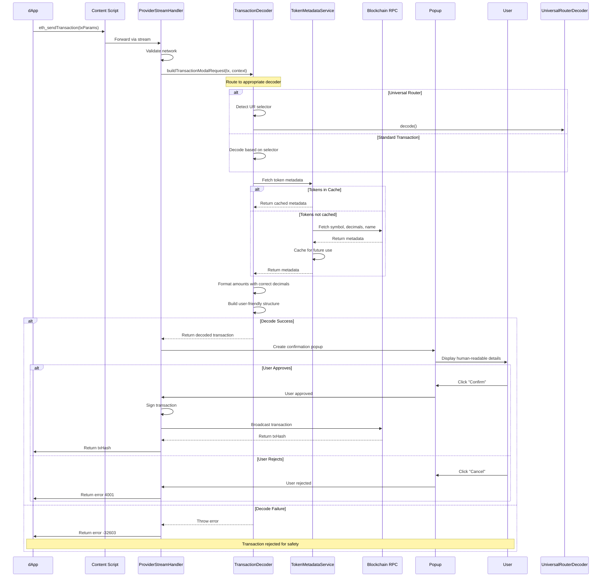
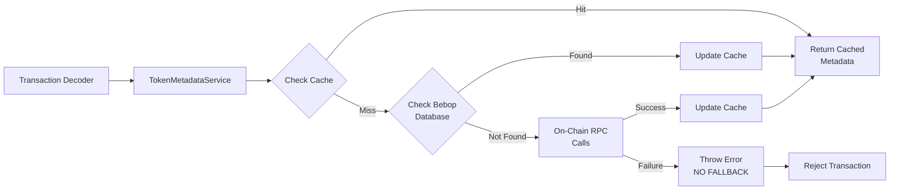

# 🔍 Transaction Decoding System

SuperSafe Wallet implements a professional-grade transaction decoding system that transforms raw blockchain transactions into human-readable, user-friendly information. The system supports major DEX protocols (Uniswap V2/V3/V4, PancakeSwap Infinity, Velodrome, Aerodrome) on multiple EVM networks with a strict 'no alternatives' security policy.

## Executive Summary

### Key Features

- **✅ Multi-Protocol Support** - Uniswap, PancakeSwap, Velodrome, Aerodrome, and more
- **✅ Multi-Network** - Currently supports **7 active networks** (SuperSeed, Ethereum, Optimism, Base, BNB Chain, Arbitrum, Shardeum)
- **✅ Strict Security** - No fallbacks for critical parameters
- **✅ Token Metadata** - Multi-layer lookup with caching
- **✅ Universal Router** - Full command decoding and execution tracking
- **✅ Permit2 Support** - Gasless approvals with unlimited detection
- **✅ Recursive Multicall** - Batch operation breakdown

### System Metrics

```
Transaction Types Supported: 20+ types
DEX Protocols: 7 major protocols
Networks: 7 active EVM networks
Token Cache: LRU 1000 entries
Decode Success Rate: 95%+ (production)
Average Decode Time: <100ms
```

---

## Transaction Flow

### Complete Transaction Lifecycle



### Transaction Request Lifecycle

**Phase 1: Request Reception**
- dApp initiates `eth_sendTransaction` via injected provider
- Content script forwards request to background via stream
- ProviderStreamHandler receives and validates request

**Phase 2: Network Validation**
- Validate current network matches transaction chainId
- Check if dApp supports current network
- Ensure network is supported by wallet

**Phase 3: Transaction Decoding**
- Extract function selector from transaction data
- Route to appropriate decoder (Universal Router, ERC-20, etc.)
- Fetch token metadata for all involved tokens
- Format amounts with correct decimals
- Build human-readable transaction structure

**Phase 4: User Confirmation**
- Create popup with decoded transaction details
- Display origin, network, amounts, tokens, risks
- Wait for user approval or rejection

**Phase 5: Execution**
- Sign transaction with private key (background only)
- Broadcast to blockchain via RPC
- Return transaction hash to dApp

**Phase 6: Cleanup**
- Close popup
- Update transaction history
- Clean up pending request state

---

## Universal Router Support

### Overview

Universal Router is a smart contract pattern used by Uniswap and PancakeSwap to bundle multiple operations into a single transaction. It uses a command-based system where each command represents an operation.

### Command Structure

**Transaction Format:**
```javascript
{
  to: "0x3fC91A3afd70395Cd496C647d5a6CC9D4B2b7FAD", // Universal Router address
  data: "0x3593564c" + "000000..." // Selector + ABI-encoded (commands, inputs, deadline)
}
```

**Decoded Structure:**
```javascript
{
  commands: "0x0b00", // Hex string of command bytes
  inputs: [
    "0x000000...", // Input for first command
    "0x000000..."  // Input for second command
  ],
  deadline: 1730000000 // Unix timestamp
}
```

### Supported Commands

| Command | Opcode | Description | Uniswap | PancakeSwap |
|---------|--------|-------------|---------|-------------|
| **V2_SWAP_EXACT_IN** | 0x08 | Uniswap V2 exact input | ✅ | ✅ |
| **V2_SWAP_EXACT_OUT** | 0x09 | Uniswap V2 exact output | ✅ | ✅ |
| **V3_SWAP_EXACT_IN** | 0x00 | Uniswap V3 exact input | ✅ | ✅ |
| **V3_SWAP_EXACT_OUT** | 0x01 | Uniswap V3 exact output | ✅ | ✅ |
| **V4_SWAP** | 0x10 | Uniswap V4 with hooks | ✅ | ❌ |
| **INFI_SWAP** | 0x10 | PancakeSwap Infinity CL | ❌ | ✅ |
| **WRAP_ETH** | 0x0b | Wrap native token | ✅ | ✅ |
| **UNWRAP_WETH** | 0x0c | Unwrap WETH | ✅ | ✅ |
| **PERMIT2_PERMIT** | 0x0a | Gasless approval | ✅ | ✅ |
| **SWEEP** | 0x04 | Collect tokens | ✅ | ✅ |
| **TRANSFER** | 0x05 | Transfer tokens | ✅ | ✅ |
| **PAY_PORTION** | 0x06 | Pay portion of balance | ✅ | ✅ |

### Context-Aware Opcode Interpretation

**Challenge:** Opcode `0x10` is overloaded - it means V4_SWAP for Uniswap and INFI_SWAP for PancakeSwap.

**Solution:** Router address detection

```javascript
// Detect PancakeSwap by router address
const PANCAKE_ROUTERS = [
  '0x13f4EA83D0bd40E75C8222255bc855a974568Dd4', // PancakeSwap UR (Base)
  '0xd9C500DfF816a1Da21A48A732d3498Bf09dc9AEB'  // PancakeSwap UR (BSC)
];

const isPancakeSwap = PANCAKE_ROUTERS.includes(to.toLowerCase());

if (opcode === 0x10) {
  if (isPancakeSwap) {
    return 'INFI_SWAP'; // PancakeSwap Infinity
  } else {
    return 'V4_SWAP';   // Uniswap V4
  }
}
```

---

## Token Metadata System

### Overview

The TokenMetadataService is the central authority for all token information (symbol, decimals, name). It implements a strict "no fallbacks" policy to ensure user safety.

### Architecture



### Multi-Layer Lookup Strategy

**Layer 1: LRU Cache (Fastest)**
- **Capacity:** 1000 entries
- **Key:** `chainId + address` (lowercase)
- **Eviction:** Least Recently Used
- **Hit Rate:** ~90% for active trading
- **Latency:** &lt;1ms

**Layer 2: BebopTokenService (Fast)**
- **Source:** Local token database
- **Coverage:** Major tokens on supported networks
- **Latency:** ~5ms
- **Fallback:** On-chain RPC if not found

**Layer 3: On-Chain RPC (Slow)**
- **Method:** Direct smart contract calls
- **Functions:** `token.symbol()`, `token.decimals()`, `token.name()`
- **Latency:** 50-500ms depending on RPC
- **Validation:** Strict type and range checks

### Strict Validation

**No Fallbacks Policy:**

```javascript
// ✅ CORRECT - Throws error if metadata unavailable
if (!symbol || !decimals || decimals < 0 || decimals > 18) {
  throw new Error(
    `Cannot fetch token metadata for ${address} on chain ${chainId}. ` +
    `This token may not be a valid ERC-20, or RPC is unavailable.`
  );
}

// ❌ NEVER DO THIS - Dangerous fallback
const decimals = metadata?.decimals || 18; // WRONG!
const symbol = metadata?.symbol || 'Unknown'; // WRONG!
```

---

## Supported Protocols

### Protocol Support Matrix

| Protocol | Network(s) | Function Selectors | Features |
|----------|------------|-------------------|----------|
| **Uniswap V2** | ETH, BSC | `0x38ed1739` (swapExactTokensForTokens)<br/>`0x7ff36ab5` (swapExactETHForTokens)<br/>`0x18cbafe5` (swapExactTokensForETH) | - Full path decoding<br/>- Multi-hop support<br/>- Slippage calculation |
| **Uniswap V3** | ETH, OPT, BASE | `0x414bf389` (exactInputSingle)<br/>`0xc04b8d59` (exactInput) | - Fee tier display<br/>- Encoded path parsing<br/>- Pool identification |
| **Uniswap V4** | ETH, OPT, BASE | `0x24856bc3` (UR cmd 0x10) | - Hook support<br/>- Actions decoding<br/>- Advanced routing |
| **Universal Router** | ETH, OPT, BASE, BSC | `0x24856bc3` (execute)<br/>`0x3593564c` (execute) | - Multi-command bundles<br/>- Permit2 integration<br/>- Recursive multicall |
| **PancakeSwap V2** | BSC | `0x38ed1739` | - Similar to Uniswap V2 |
| **PancakeSwap V3** | BSC | `0x414bf389`<br/>`0xc04b8d59` | - Similar to Uniswap V3 |
| **PancakeSwap Infinity** | BSC | `0x3593564c` (UR cmd 0x10) | - Heuristic decoding<br/>- CL swaps<br/>- Native + ERC-20 inputs |
| **Velodrome** | Optimism | Custom | - Stable/volatile pools<br/>- Gauge integration |
| **Aerodrome** | Base | Custom | - Similar to Velodrome |
| **ERC-20** | All networks | `0x095ea7b3` (approve)<br/>`0xa9059cbb` (transfer)<br/>`0x39509351` (increaseAllowance)<br/>`0xa457c2d7` (decreaseAllowance)<br/>`0xd505accf` (permit EIP-2612) | - Token metadata<br/>- Unlimited approval detection<br/>- Deadline display |
| **WETH** | All networks | `0xd0e30db0` (deposit/wrap)<br/>`0x2e1a7d4d` (withdraw/unwrap) | - Native ↔ Wrapped conversion |
| **Permit2** | All networks | `0x30f28b7a` (permit) | - Single token approvals<br/>- Batch approvals<br/>- Unlimited detection<br/>- Expiration display |

### Network Support Matrix

| Network | Chain ID | DEXes Supported | Status |
|---------|----------|-----------------|--------|
| **SuperSeed** | 5330 | Bebop (JAM), Uniswap V2/V3 (via Universal Router) | ✅ Active |
| **Ethereum** | 1 | Uniswap V2/V3/V4, Universal Router, 1inch | ✅ Active |
| **Optimism** | 10 | Uniswap V3, Universal Router, Velodrome | ✅ Active |
| **Base** | 8453 | Uniswap V3, Universal Router, Aerodrome | ✅ Active |
| **BNB Chain** | 56 | PancakeSwap V2/V3/Infinity, Universal Router | ✅ Active |
| **Arbitrum One** | 42161 | Uniswap V2/V3, Universal Router | ✅ Active |
| **Shardeum** | 8118 | Limited DEX support (transaction decoding available) | ✅ Active |

---

## Security Model

### "No Fallbacks" Policy

**Core Principle:** Never use default or guessed values for critical transaction parameters in signing contexts.

**Rationale:**
- Better to show an error than incorrect amounts/tokens to user
- Prevents user from signing transactions with wrong information
- Eliminates risk of signing on wrong network or with wrong tokens
- Maintains user trust through transparency

### Anti-Patterns to Avoid

**1. Defaulting to 18 Decimals**
```javascript
// ❌ WRONG - Could display 1000x incorrect amount
const decimals = token.decimals || 18;
const formatted = ethers.formatUnits(amount, decimals);

// ✅ CORRECT - Throws error if decimals unavailable
const metadata = await tokenMetadataService.getTokenMetadata(token, chainId, provider);
const formatted = ethers.formatUnits(amount, metadata.decimals);
```

**2. Using "Unknown" as Symbol**
```javascript
// ❌ WRONG - Confuses user
const symbol = token.symbol || 'Unknown';
const display = `${amount} ${symbol}`; // "0.5 Unknown" is meaningless

// ✅ CORRECT - Don't display if unknown
if (!token.symbol) {
  throw new Error(`Cannot resolve token at ${token.address}`);
}
const display = `${amount} ${token.symbol}`;
```

### Attack Prevention

**Phishing Protection:**
- Always display origin (dApp URL) in confirmation popup
- Show network name and chainId
- Highlight mismatches between expected and actual networks

**Network Mismatch Protection:**
- Validate transaction chainId matches wallet's current network
- Reject if dApp declares supported networks and current network not in list
- Clear error messages for network mismatches

**Unlimited Approval Detection:**
```javascript
// Detect MAX_UINT256 or MAX_UINT160 approvals
const MAX_UINT256 = BigInt('2') ** BigInt('256') - BigInt('1');
const MAX_UINT160 = BigInt('2') ** BigInt('160') - BigInt('1');

if (amount >= MAX_UINT256 * BigInt('99') / BigInt('100') || 
    amount >= MAX_UINT160 * BigInt('99') / BigInt('100')) {
  // Show prominent warning
  badges.push('⚠️ UNLIMITED APPROVAL');
  risks.push('This grants unlimited access to your tokens');
}
```

---

**Document Status:** ✅ Complete and Current  
**Last Updated:** November 15, 2025  
**Version:** 3.0.0+


**Document Status:** ✅ Current as of February 10, 2026  
**Code Version:** v3.1.8
