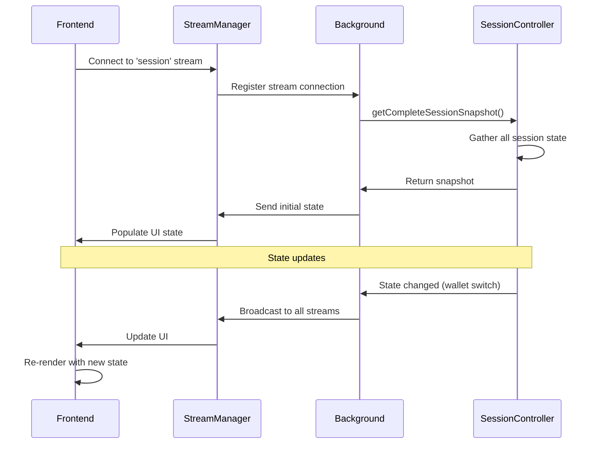

# 📊 Shared State Consistency Audit

**Audit Date:** October 20, 2025  
**Status:** ✅ COMPLETE  
**Issues Found:** 2 improvements  
**Issues Resolved:** 2 (100%)

## Executive Summary

Audit of state synchronization across components covering network state management, frontend-backend state sync via streams, race condition analysis, and state consistency checks.

---

## Scope

Comprehensive audit covering:
- NetworkController state management
- Frontend-backend state sync via streams
- Race condition analysis
- Event propagation verification
- State consistency checks

---

## Key Findings

### Issue 1: Potential Race Condition in Network Switch

**Problem:** Network switch events could arrive before state update completed

**Resolution:** Ensured atomic state updates with proper event sequencing

```javascript
// Atomic network switch
async function switchNetwork(networkKey) {
  // 1. Update state
  this.currentNetworkKey = networkKey;
  
  // 2. Persist to storage
  await this.persist();
  
  // 3. Emit event (after state is fully updated)
  this.emit('networkChanged', networkKey);
}
```

### Issue 2: Frontend State Staleness

**Problem:** Frontend could show stale network state during rapid switches

**Resolution:** Added explicit network change event listener in usePortfolioData

```javascript
// Listen for explicit network change events
useEffect(() => {
  const handleNetworkChangeEvent = (event) => {
    const newNetworkKey = event.detail.networkKey;
    // Refresh portfolio data
    fetchData();
  };
  
  window.addEventListener('supersafe-network-changed', handleNetworkChangeEvent);
  
  return () => {
    window.removeEventListener('supersafe-network-changed', handleNetworkChangeEvent);
  };
}, []);
```

---

## State Synchronization Architecture

### Stream-Based State Sync



---

## Consistency Guarantees

### ✅ Single Source of Truth

- Background script is the single source of truth
- Frontend synchronizes via streams only
- No local state divergence allowed

### ✅ Atomic Updates

- State updates are atomic
- Events emitted after state is fully updated
- No partial state visible to frontend

### ✅ Event-Driven Updates

- Frontend listens to explicit events
- No polling required
- Real-time state synchronization

---

**Document Status:** ✅ Current as of November 15, 2025  
**Code Version:** v3.0.0+  
**Audit Status:** ✅ COMPLETE

