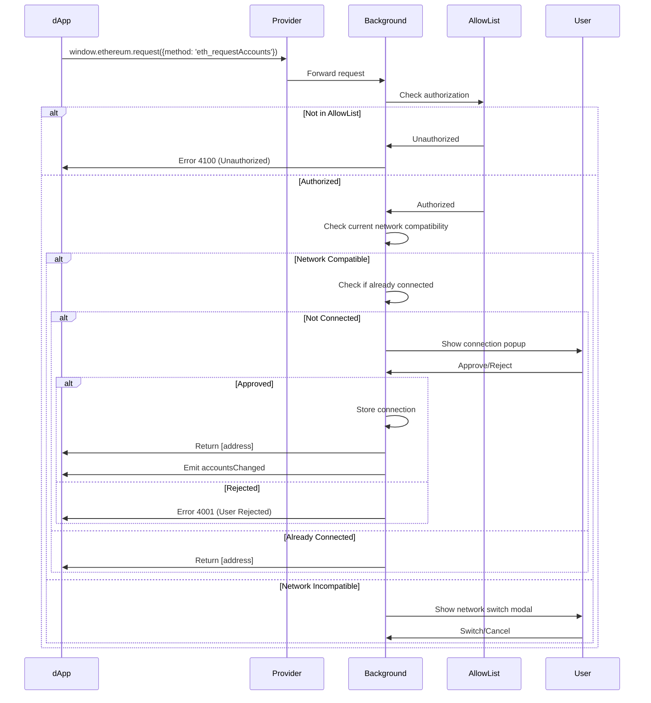
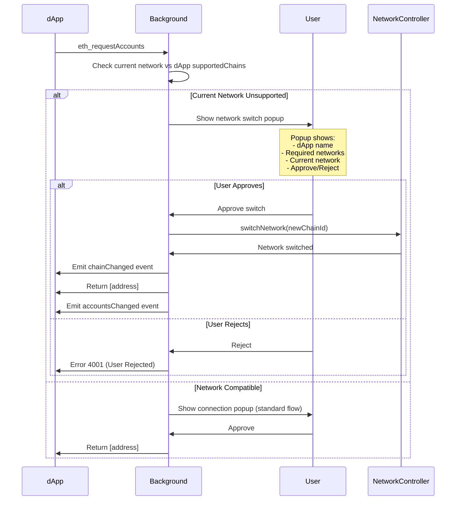
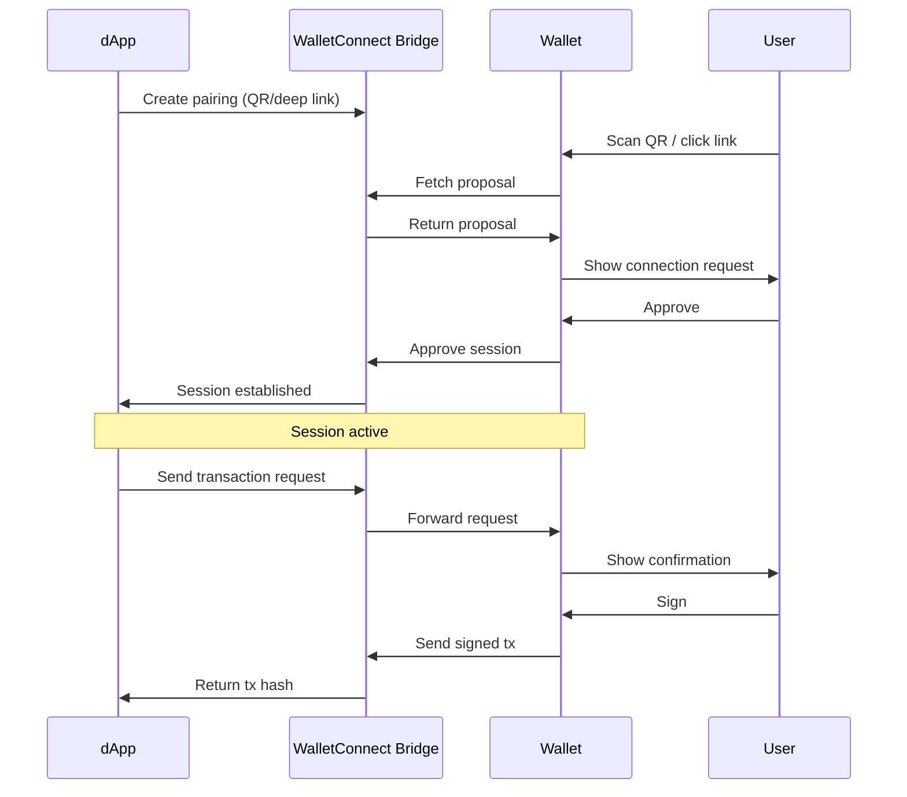
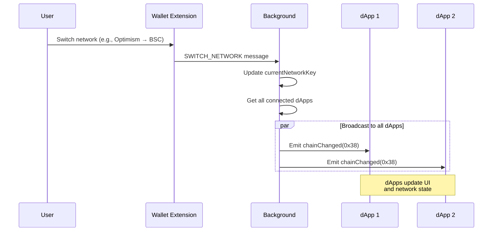
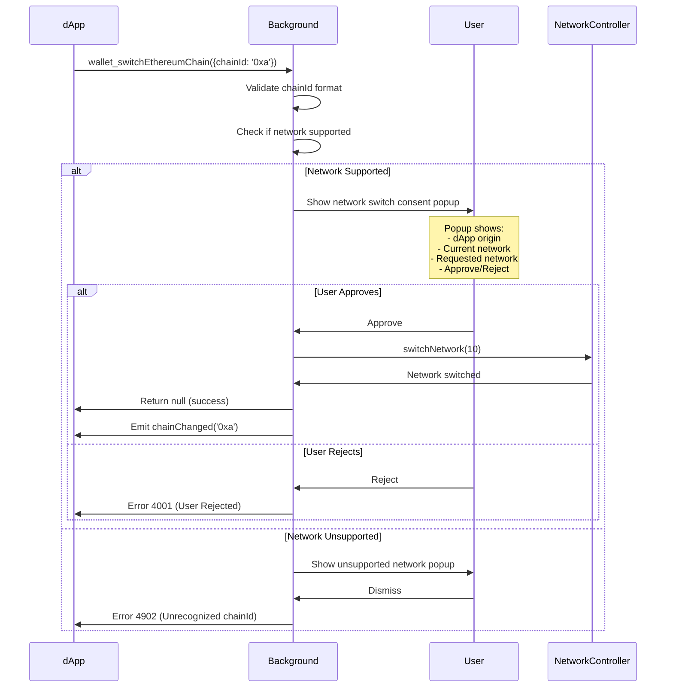

# 🔗 How dApp Connections Work

SuperSafe Wallet implements **Smart Native Connection Architecture** supporting multiple dApp connection methods: direct injection (RainbowKit, Wagmi), WalletConnect v2/Reown, EIP-6963 provider discovery, and Dynamic framework.

## Overview

### Supported Connection Methods

- **✅ Direct Injection**: window.ethereum EIP-1193 provider
- **✅ EIP-6963**: Provider discovery standard (RainbowKit, Wagmi compatibility)
- **✅ WalletConnect V2**: Reown WalletKit integration
- **✅ RainbowKit**: Full compatibility
- **✅ Dynamic**: Framework detection and adaptation
- **✅ Wagmi**: React hooks compatibility

### Supported Networks

SuperSafe supports **7 active networks** for dApp connections:
- SuperSeed (5330)
- Ethereum (1)
- Optimism (10)
- Base (8453)
- BNB Chain (56)
- Arbitrum One (42161)
- Shardeum (8118)

---

## Smart Native Connection

### Architecture Principles

1. **Real ChainIds Only**: No fake chainIds or compatibility hacks
2. **Network-First**: Respect dApp's supported chains
3. **User Consent**: Always ask permission for network changes
4. **Automatic Detection**: Identify dApp framework automatically
5. **Graceful Disconnection**: Auto-disconnect on unsupported networks

### Connection Flow



### Connection with Network Switch

When a dApp requires a specific network, SuperSafe handles the connection and network switch atomically:



**Key Features:**
- **Atomic Operation**: Network switch + connection in single user action
- **Clear Communication**: User sees exactly why network switch is needed
- **Graceful Rejection**: Clear error if user declines
- **Event Ordering**: chainChanged always fires before accountsChanged

---

## AllowList System

### Purpose

The AllowList system provides whitelist-based authorization for trusted dApps, preventing phishing and malicious connections.

### AllowList Structure

**Location:** `public/assets/allowlist.json`

```json
{
  "version": "1.0.0",
  "policies": {
    "https://velodrome.finance": {
      "name": "Velodrome Finance",
      "supportedChains": [10, 5330],
      "defaultChain": 10,
      "autoApprove": false,
      "requiresConsent": true,
      "framework": "rainbowkit"
    },
    "https://app.uniswap.org": {
      "name": "Uniswap",
      "supportedChains": [1, 10, 56, 8453, 42161],
      "defaultChain": 1,
      "autoApprove": false,
      "framework": "web3-react"
    }
  }
}
```

### Policy Enforcement

**Location:** `src/background/policy/AllowListManager.js`

```javascript
export function getPolicyForOrigin(origin) {
  const policies = getAllowlistConfig().policies || {};
  
  // Exact match
  if (policies[origin]) {
    return policies[origin];
  }
  
  // Subdomain match
  for (const [policyOrigin, policy] of Object.entries(policies)) {
    if (origin.endsWith(policyOrigin.replace('https://', ''))) {
      return policy;
    }
  }
  
  return null;  // Unauthorized
}

export function validateNetworkCompatibility(policy, currentChainId) {
  if (!policy || !policy.supportedChains) {
    return { compatible: false, reason: 'No policy' };
  }
  
  if (!policy.supportedChains.includes(currentChainId)) {
    return {
      compatible: false,
      reason: `Current network (${currentChainId}) not supported by dApp`,
      supportedChains: policy.supportedChains
    };
  }
  
  return { compatible: true };
}
```

---

## Connection Mechanisms

### Direct Injection (RainbowKit/Wagmi/EIP-6963)

**Provider Injection:**

SuperSafe supports both traditional `window.ethereum` injection and EIP-6963 provider discovery for maximum compatibility.

```javascript
// Location: src/utils/provider.js
function injectProvider() {
  // Create EIP-1193 provider
  const provider = {
    isMetaMask: true,
    isSuperSafe: true,
    
    request: async ({ method, params }) => {
      // Route to background
      return await sendToBackground(method, params);
    },
    
    on: (event, handler) => {
      eventEmitter.on(event, handler);
    },
    
    removeListener: (event, handler) => {
      eventEmitter.removeListener(event, handler);
    }
  };
  
  // Inject into window
  window.ethereum = provider;
  
  // Announce to dApp
  window.dispatchEvent(new Event('ethereum#initialized'));
  
  // EIP-6963 Provider Discovery
  announceProvider(provider);
}
```

### EIP-6963 Provider Discovery

**Purpose:** Standardized provider discovery mechanism for multi-wallet compatibility.

**Implementation:**

```javascript
// EIP-6963: Announce provider to dApps
function announceProvider(provider) {
  const detail = {
    info: {
      uuid: 'super-safe-wallet',
      name: 'SuperSafe',
      icon: 'data:image/svg+xml;base64,...',
      rdns: 'cool.supersafe'
    },
    provider: provider
  };
  
  // Announce provider
  window.dispatchEvent(new CustomEvent('eip6963:announceProvider', {
    detail: detail
  }));
  
  // Listen for provider requests
  window.addEventListener('eip6963:requestProvider', () => {
    window.dispatchEvent(new CustomEvent('eip6963:announceProvider', {
      detail: detail
    }));
  });
}
```

**Benefits:**
- ✅ RainbowKit/Wagmi automatic detection
- ✅ Multi-wallet coexistence
- ✅ Standardized discovery protocol
- ✅ Better dApp compatibility

---

## WalletConnect V2

### Architecture

SuperSafe implements WalletConnect v2 using Reown's WalletKit SDK.

**Location:** `src/utils/walletConnectManager.js`

```javascript
class WalletConnectManager {
  async initialize(projectId, metadata) {
    const { WalletKit } = await import('@reown/walletkit');
    
    this.walletKit = await WalletKit.init({
      projectId: projectId,
      metadata: {
        name: 'SuperSafe Wallet',
        description: 'Modern Ethereum Wallet',
        url: 'https://supersafe.xyz',
        icons: ['https://supersafe.xyz/icon.png']
      }
    });
    
    this.setupEventListeners();
  }
  
  setupEventListeners() {
    // Session proposal (connection request)
    this.walletKit.on('session_proposal', async (proposal) => {
      console.log('[WC] Session proposal:', proposal);
      
      // Validate networks
      const requestedChains = proposal.params.requiredNamespaces.eip155.chains;
      const currentChainId = `eip155:${getCurrentNetwork().chainId}`;
      
      if (!requestedChains.includes(currentChainId)) {
        // Show network switch or reject
        await this.handleNetworkMismatch(proposal, requestedChains);
        return;
      }
      
      // Show connection popup
      await this.showConnectionPopup(proposal);
    });
  }
}
```

### WalletConnect Flow



---

## Network Management

SuperSafe implements bidirectional network switching, allowing both the wallet and dApps to initiate network changes with user consent.

### Wallet → dApp Network Switch

When user changes network in wallet extension:



### dApp → Wallet Network Switch

When dApp requests network change via `wallet_switchEthereumChain`:



### Network Validation

**validateSigningNetwork()** ensures user never signs on unsupported network:

```javascript
// src/background/handlers/streams/ProviderStreamHandler.js
function validateSigningNetwork(chainId, supportedNetworks, origin) {
  if (!supportedNetworks || supportedNetworks.length === 0) {
    return; // No validation needed
  }
  
  const currentChainIdDecimal = parseInt(chainId, 16);
  
  if (!supportedNetworks.includes(currentChainIdDecimal)) {
    throw new Error(
      `Network mismatch: ${origin} supports [${supportedNetworks}], ` +
      `but wallet is on chain ${currentChainIdDecimal}`
    );
  }
}
```

**Usage:** Called before ALL signing operations (eth_sendTransaction, personal_sign, eth_signTypedData_v4)

---

## Popup Management

SuperSafe implements a sophisticated popup management system with mutual exclusion and priority-based handling.

### Popup Types

| Type | Priority | Purpose | Mutual Exclusion |
|------|----------|---------|------------------|
| **Personal Sign** | 1 | Sign personal messages | ✅ Always closes extension |
| **Typed Data** | 2 | Sign EIP-712 structured data | ✅ Always closes extension |
| **Transaction** | 3 | Confirm transactions | ✅ Always closes extension |
| **Network Switch** | 4 | Consent for network change | ✅ Always closes extension |
| **Unsupported Network** | 5 | Show unsupported network error | ✅ Always closes extension |
| **Connection** | 6 | Approve dApp connection | ✅ Always closes extension |
| **Unlock** | 7 | Unlock wallet | ✅ Always closes extension |

### Mutual Exclusion System

**Core Principle:** Extension UI and popup windows NEVER coexist (Professionally Standardized UX)

**Triple Verification:**

1. **Pre-render Check** (`main.jsx:66-83`)
   - Before React renders, check if window is popup
   - Check for other open popups
   - Close extension if popup exists

2. **Post-render Safety Net** (`App.jsx:58-81`)
   - After React renders, verify no coexistence
   - Emergency closure if popup detected

3. **Centralized Verification** (`PopupManager.checkAndFocusExistingPopups()`)
   - Single source of truth
   - Enforces priority system
   - Focuses highest priority popup

**User Experience:**
- User never sees multiple SuperSafe windows
- Clear focus on current action
- Prevents confusion and errors
- Professional wallet UX

---

## Error Handling

SuperSafe implements comprehensive error handling following EIP-1193 and EIP-1474 standards.

### EIP-1193 Error Codes

| Code | Name | Description | Use Case |
|------|------|-------------|----------|
| **4001** | User Rejected | User denied request | Connection/signing/tx rejection |
| **4100** | Unauthorized | dApp not authorized | Not in allowlist |
| **4200** | Unsupported Method | Method not supported | eth_sign (disabled) |
| **4900** | Disconnected | Provider disconnected | Stream closed |
| **4901** | Chain Disconnected | Chain not available | Network unavailable |
| **4902** | Unrecognized chainId | Network not supported | Unknown network requested |
| **-32700** | Parse Error | Invalid JSON | Malformed request |
| **-32600** | Invalid Request | Invalid RPC | Missing params |
| **-32601** | Method Not Found | Unknown method | Invalid method name |
| **-32602** | Invalid Params | Invalid parameters | Wrong param types |
| **-32603** | Internal Error | Internal error | Backend failure |

### Error Response Format

```javascript
{
  error: {
    code: 4001,
    message: "User rejected the request",
    data: {
      origin: "https://app.uniswap.org",
      method: "eth_sendTransaction",
      timestamp: 1698765432000
    }
  }
}
```

### Network Mismatch Errors

**Scenario:** dApp requires Optimism, user on BSC

```javascript
// Error returned to dApp
{
  error: {
    code: 4901,
    message: "Network mismatch: app.uniswap.org supports [10, 1], but wallet is on chain 56"
  }
}
```

**User Experience:**
1. Clear error message in popup
2. Shows current vs required networks
3. Offers to switch network (if supported)
4. Rejects request if user declines

---

**Document Status:** ✅ Current as of November 15, 2025  
**Code Version:** v3.0.0+  
**Maintenance:** Review after major connection system changes

**Document Status:** ✅ Current as of February 10, 2026  
**Code Version:** v3.1.8
