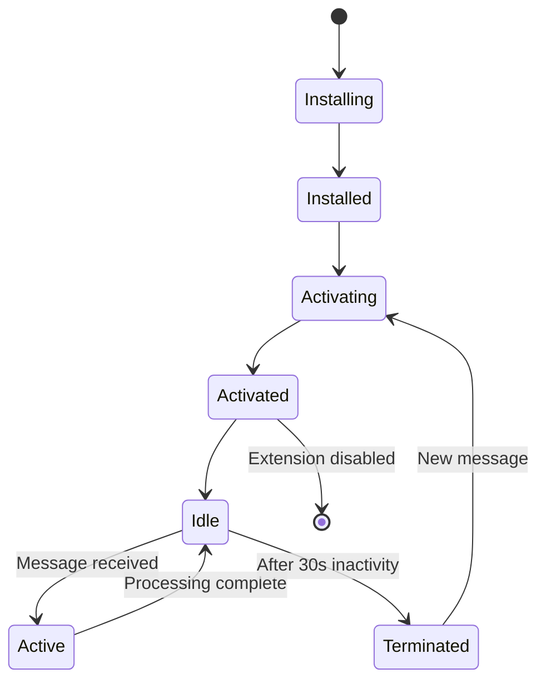
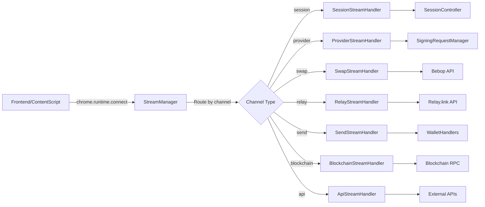

# 🔧 Service Worker Architecture

SuperSafe Wallet's backend implements a **Professionally Standardized Service Worker architecture** as the single source of truth for all wallet operations. The backend is built on Chrome Extension Manifest V3 with persistent service workers.

## Overview

### Key Characteristics

- **✅ Single Source of Truth**: All state management centralized
- **✅ Professionally Standardized Controllers**: Modular controller pattern
- **✅ Stream-Based Communication**: Long-lived Chrome connections
- **✅ Enterprise Managers**: Robust signing and popup management
- **✅ Zero Frontend Logic**: All business logic in background
- **✅ Event-Driven Architecture**: No polling, pure events

### Backend Metrics

```
Total Backend Files: 32 files
Total Lines of Code: ~15,000 lines
Main Background Script: 3,220 lines
Session Controller: 3,979 lines
Response Time: <150ms average
Architecture Pattern: MetaMask-compatible
```

---

## Service Worker Lifecycle



**Key Points:**
- Service worker can terminate after 30 seconds of inactivity
- All state must survive termination (persistence required)
- Long-lived streams keep worker alive during active operations
- Background script automatically restarts on new messages

---

## Background.js (3,220 lines)

**Location:** `src/background.js`

**Primary Responsibilities:**

```javascript
// Service worker initialization
chrome.runtime.onInstalled.addListener(async (details) => {
  console.log('[SuperSafe Background] 🚀 Extension installed/updated');
  
  // Initialize allowlist
  await loadAllowlist();
  
  // Initialize WalletConnect
  await initializeWalletConnect();
  
  // Set up badge
  chrome.action.setBadgeText({ text: '' });
});

// Stream handler registration
setupSessionStreamHandler(backgroundStreamManager, dependencies);
setupProviderStreamHandler(backgroundStreamManager, dependencies);
setupSwapStreamHandler(backgroundStreamManager, dependencies);
setupRelayStreamHandler(backgroundStreamManager, dependencies);
setupSendStreamHandler(backgroundStreamManager, dependencies);
setupBlockchainStreamHandler(backgroundStreamManager, dependencies);
setupApiStreamHandler(backgroundStreamManager, dependencies);

// Manager initialization
signingRequestManager = new SigningRequestManager(
  backgroundSessionController,
  popupManager
);

popupManager = new PopupManager(
  backgroundSessionController,
  backgroundControllers
);
```

**Global State:**

```javascript
// Enterprise managers
let signingRequestManager;
let popupManager;
let eip1193EventsManager;
let autoEscalationManager;

// Connection tracking
const pendingConnectRpc = new Map();
const connectedSites = {};

// WalletConnect state
let pendingWCProposal = null;
let pendingWCRequest = null;
let wcPopupId = null;

// Security
const secureApiClient = new SecureApiClient(API_CONFIG);
const simpleRateLimiter = new SimpleRateLimiter();
```

---

## High-Level Architecture

```
┌────────────────────────────────────────────────────────────────┐
│                  Background Service Worker                     │
│                      (src/background.js)                       │
├────────────────────────────────────────────────────────────────┤
│                                                                │
│  ┌──────────────────────────────────────────────────────────┐ │
│  │                Core Controllers                          │ │
│  │  • BackgroundSessionController (3,979 lines)             │ │
│  │  • BackgroundControllers (497 lines)                     │ │
│  │    - TokenController                                     │ │
│  │    - NetworkController                                   │ │
│  │    - TransactionController                               │ │
│  │    - NetworkSwitchService                                │ │
│  └──────────────────────────────────────────────────────────┘ │
│                                                                │
│  ┌──────────────────────────────────────────────────────────┐ │
│  │                Stream Handlers                           │ │
│  │  • SessionStreamHandler - Session operations             │ │
│  │  • ProviderStreamHandler - dApp requests (EIP-1193)      │ │
│  │  • SwapStreamHandler - Bebop swap operations             │ │
│  │  • RelayStreamHandler - Relay.link cross-chain swaps     │ │
│  │  • SendStreamHandler - Token transfers                   │ │
│  │  • BlockchainStreamHandler - Blockchain queries          │ │
│  │  • ApiStreamHandler - External API calls                 │ │
│  └──────────────────────────────────────────────────────────┘ │
│                                                                │
│  ┌──────────────────────────────────────────────────────────┐ │
│  │                Enterprise Managers                       │ │
│  │  • SigningRequestManager - Signing lifecycle             │ │
│  │  • PopupManager - Popup orchestration                    │ │
│  │  • EIP1193EventsManager - Event broadcasting             │ │
│  │  • AutoEscalationManager - Auto-approval                 │ │
│  │  • StreamPersistenceManager - Stream recovery              │ │
│  └──────────────────────────────────────────────────────────┘ │
│                                                                │
│  ┌──────────────────────────────────────────────────────────┐ │
│  │                Handler & Policy Layer                    │ │
│  │  • walletHandlers - Wallet operations                   │ │
│  │  • contractHandlers - Smart contract calls               │ │
│  │  • providerHandlers - Provider management                │ │
│  │  • AllowListManager - dApp authorization                 │ │
│  └──────────────────────────────────────────────────────────┘ │
│                                                                │
│  ┌──────────────────────────────────────────────────────────┐ │
│  │                External Services                         │ │
│  │  • WalletConnect Manager - WalletConnect v2/Reown        │ │
│  │  • Bebop Token Service - Token list management           │ │
│  │  • Relay.link Integration - Cross-chain swaps            │ │
│  │  • Secure API Client - HTTP client with security         │ │
│  │  • SuperSeed API Wrapper - RPC abstraction               │ │
│  └──────────────────────────────────────────────────────────┘ │
│                                                                │
└────────────────────────────────────────────────────────────────┘
                             ↕
┌────────────────────────────────────────────────────────────────┐
│                     Chrome Storage Layer                       │
│  • chrome.storage.local - Encrypted vault (persistent)        │
│  • chrome.storage.session - Session state (temporary)         │
└────────────────────────────────────────────────────────────────┘
```

---

## Stream Communication Model

```
Frontend/Content Script
       │
       │ chrome.runtime.connect({ name: 'session' })
       ↓
┌────────────────┐
│  Stream Port   │ ← Long-lived connection
└────────┬───────┘
         │ postMessage({ type: 'GET_SESSION_STATE' })
         ↓
┌─────────────────────────────────────────┐
│  BackgroundStreamManager                │
│  onMessage('session', handler)         │
└────────┬────────────────────────────────┘
         │ Route to SessionStreamHandler
         ↓
┌─────────────────────────────────────────┐
│  SessionStreamHandler                   │
│  switch (message.type) {                │
│    case 'GET_SESSION_STATE':            │
│      return sessionSnapshot;            │
│  }                                      │
└────────┬────────────────────────────────┘
         │ Response
         ↓
    Return to Frontend
```

---

## Stream Handlers Overview

| Handler | Channel | Purpose | Key Messages |
|---------|---------|---------|--------------|
| **SessionStreamHandler** | `session` | Session & wallet operations | GET_SESSION_STATE, CREATE_WALLET, SWITCH_WALLET, UNLOCK, LOCK |
| **ProviderStreamHandler** | `provider` | dApp EIP-1193 requests | ETH_REQUEST_ACCOUNTS, ETH_SEND_TRANSACTION, ETH_SIGN, WALLET_SWITCH_ETHEREUM_CHAIN |
| **SwapStreamHandler** | `swap` | Bebop swap operations | SWAP_GET_QUOTE, SWAP_SIGN_AND_SUBMIT, SWAP_CHECK_STATUS |
| **RelayStreamHandler** | `relay` | Relay.link cross-chain swaps | RELAY_GET_QUOTE, RELAY_EXECUTE_SWAP, RELAY_GET_STATUS, RELAY_GET_FEE_CONFIG |
| **SendStreamHandler** | `send` | Token transfer operations | SEND_ESTIMATE_GAS, SEND_TRANSACTION |
| **BlockchainStreamHandler** | `blockchain` | Blockchain queries | GET_BALANCE, GET_TOKENS, GET_NFTS, GET_TRANSACTION_HISTORY |
| **ApiStreamHandler** | `api` | External API calls | API_CALCULATE_PORTFOLIO_CHANGE_24H, API_GET_TRANSACTION_HISTORY |

---

## Message Routing

### Message Flow Architecture



### Stream Registration

```javascript
// Background script stream setup
function setupAllStreamHandlers() {
  const dependencies = {
    backgroundSessionController,
    backgroundControllers,
    ethers,
    NETWORKS,
    signingRequestManager,
    popupManager,
    eip1193EventsManager
  };
  
  // Register all handlers
  setupSessionStreamHandler(backgroundStreamManager, dependencies);
  setupProviderStreamHandler(backgroundStreamManager, dependencies);
  setupSwapStreamHandler(backgroundStreamManager, dependencies);
  setupRelayStreamHandler(backgroundStreamManager, dependencies);
  setupSendStreamHandler(backgroundStreamManager, dependencies);
  setupBlockchainStreamHandler(backgroundStreamManager, dependencies);
  setupApiStreamHandler(backgroundStreamManager, dependencies);
}
```

---

## External Integrations

### WalletConnect Manager

**Purpose:** Handle WalletConnect v2 / Reown WalletKit integration.

```javascript
// Location: src/utils/walletConnectManager.js
class WalletConnectManager {
  async initialize(projectId, metadata) {
    const { WalletKit } = await import('@reown/walletkit');
    
    this.walletKit = await WalletKit.init({
      projectId: projectId,
      metadata: {
        name: 'SuperSafe Wallet',
        description: 'Modern Ethereum Wallet',
        url: 'https://supersafe.xyz',
        icons: ['https://supersafe.xyz/icon.png']
      }
    });
    
    this.setupEventListeners();
  }
}
```

### Bebop Integration

**Location:** `src/background/handlers/streams/SwapStreamHandler.js`

**Purpose:** Handle Bebop JAM and RFQ swap operations for same-chain swaps.

### Relay.link Integration

**Location:** `src/background/handlers/streams/RelayStreamHandler.js`

**Purpose:** Handle Relay.link cross-chain swap operations across 85+ blockchains.

**Supported Operations:**
- `RELAY_GET_QUOTE` - Get cross-chain swap quote with route details
- `RELAY_EXECUTE_SWAP` - Execute cross-chain swap transaction
- `RELAY_GET_STATUS` - Check transaction status and bridge progress
- `RELAY_GET_FEE_CONFIG` - Get unified fee configuration

---

**Document Status:** ✅ Current as of November 15, 2025  
**Code Version:** v3.0.2+  
**Maintenance:** Review after major backend changes

