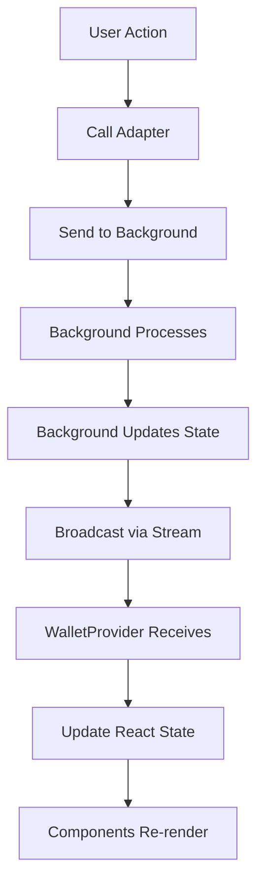
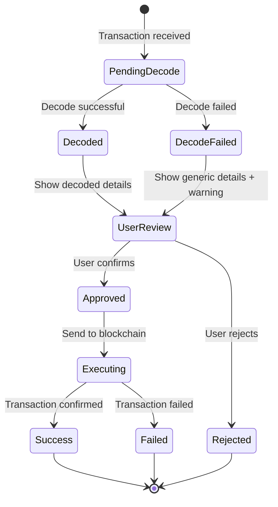
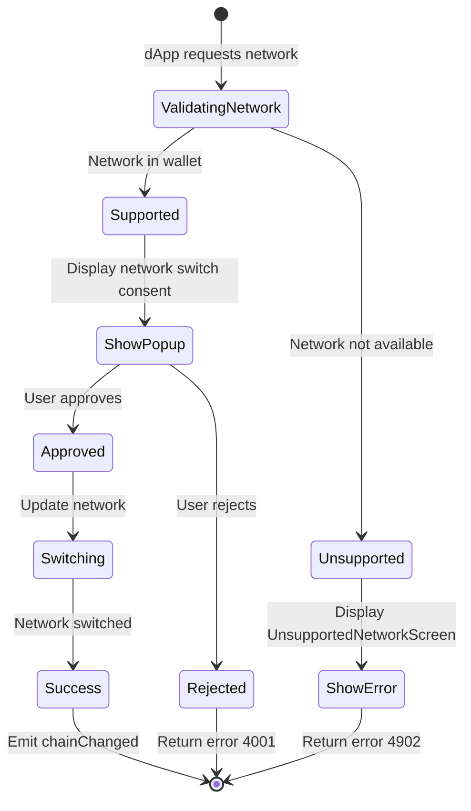
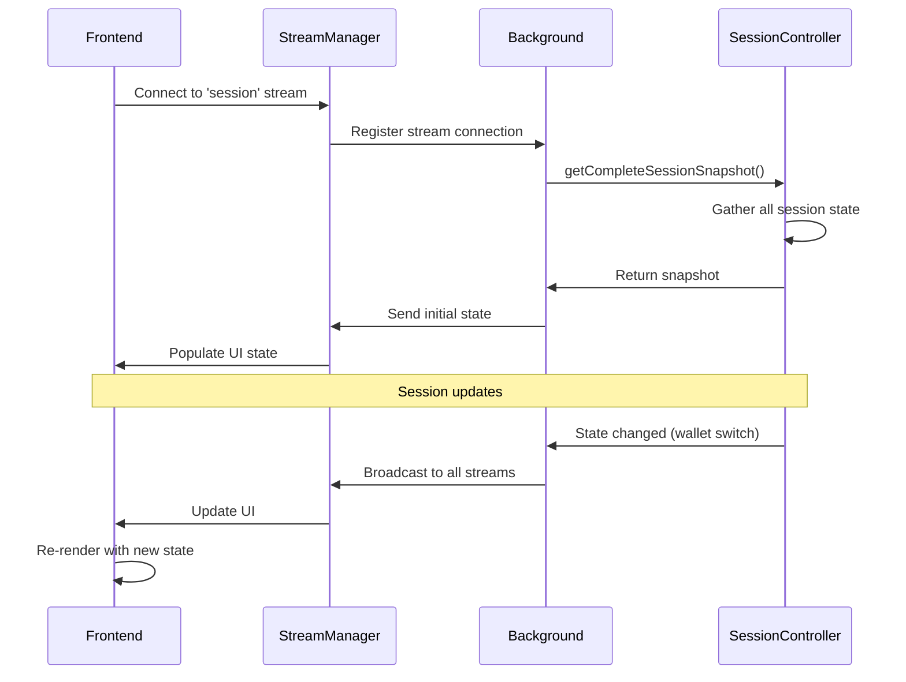

# 📊 State Management

SuperSafe Wallet's frontend uses React Context API for centralized state management, with all state synchronized from the background service worker via streams.

## Overview

### State Flow



---

## WalletProvider Context

**Location:** `src/contexts/WalletProvider.jsx`

```javascript
const WalletContext = createContext();

export function WalletProvider({ children }) {
  // Session state from background
  const [isUnlocked, setIsUnlocked] = useState(false);
  const [wallets, setWallets] = useState([]);
  const [currentWallet, setCurrentWallet] = useState(null);
  const [network, setNetwork] = useState(null);
  const [supportsSwap, setSupportsSwap] = useState(false);
  
  // Initialize session stream
  useEffect(() => {
    const initializeSession = async () => {
      const sessionData = await FrontendSessionAdapter.getSessionState();
      
      setIsUnlocked(sessionData.isUnlocked);
      setWallets(sessionData.wallets);
      setCurrentWallet(sessionData.currentWallet);
      setNetwork(sessionData.currentNetwork);
      setSupportsSwap(sessionData.currentNetwork?.bebop?.swapEnabled);
    };
    
    initializeSession();
    
    // Listen for session updates
    const port = chrome.runtime.connect({ name: 'session' });
    port.onMessage.addListener((message) => {
      if (message.type === 'SESSION_UPDATED') {
        initializeSession();
      }
    });
    
    return () => port.disconnect();
  }, []);
  
  return (
    <WalletContext.Provider value={{
      isUnlocked,
      wallets,
      currentWallet,
      network,
      supportsSwap,
      // ... methods
    }}>
      {children}
    </WalletContext.Provider>
  );
}
```

---

## Enhanced UI States (v3.0+)

### Screen States

```javascript
// App.jsx - Screen routing
const SCREEN_STATES = {
  UNLOCK: 'unlock',
  DASHBOARD: 'dashboard',
  CONNECTION: 'connection',
  TRANSACTION: 'transaction',
  SIGNING: 'signing',
  TYPED_DATA: 'typed_data',
  NETWORK_SWITCH: 'network_switch',
  UNSUPPORTED_NETWORK: 'unsupported_network', // ✅ NEW
  TRANSACTION_SUCCESS: 'transaction_success'
};
```

### Transaction State Enhancement

```javascript
// TransactionConfirmationScreen.jsx - Component state
const [transactionState, setTransactionState] = useState({
  // Basic transaction data
  to: null,
  from: null,
  data: null,
  value: null,
  chainId: null,
  
  // ✅ NEW: Enhanced decoding
  decodedTransaction: {
    type: null,           // "DEX Swap", "Token Approval", "Contract Interaction"
    decodedCall: {
      type: null,         // "Universal Router Swap", "ERC-20 Transfer", etc.
      name: null,
      tokenIn: {
        symbol: null,
        decimals: null,
        address: null
      },
      tokenOut: {
        symbol: null,
        decimals: null,
        address: null
      },
      amountIn: null,
      amountOutMin: null,
      path: [],           // Token path for multi-hop swaps
      steps: [],          // Batch operations
      badges: [],         // UI badges ("Uniswap V3", "Gasless")
      risks: []           // Security warnings
    }
  },
  
  // ✅ NEW: UI state
  showContractDetails: false,
  showBatchOps: false,
  showRawData: false,
  
  // Gas estimation
  gasEstimate: null,
  isEstimatingGas: false
});
```

### Signing State Enhancement

```javascript
// TypedDataConfirmationScreen.jsx - Component state
const [signingState, setSigningState] = useState({
  // Basic signing data
  message: null,
  method: null,          // "personal_sign", "eth_signTypedData_v4"
  typedData: null,
  
  // ✅ NEW: Enhanced typed data
  isPermitSingle: false,
  isPermitBatch: false,
  isUnlimitedApproval: false,
  
  // ✅ NEW: Permit2 details
  approvedTokens: [],    // For batch approvals
  spender: null,
  expiration: null,
  deadline: null,
  
  // ✅ NEW: UI state
  showAdditionalDetails: false,
  showRawMessage: false,
  
  // SIWE detection
  isSIWE: false,
  decodedMessage: null
});
```

### Network State Enhancement

```javascript
// NetworkSwitchConfirmationScreen.jsx - Component state
const [networkState, setNetworkState] = useState({
  // Current network
  currentChainId: null,
  currentNetworkName: null,
  
  // Requested network
  requestedChainId: null,
  requestedNetworkName: null,
  
  // ✅ NEW: Validation
  isSupported: true,     // false triggers UnsupportedNetworkScreen
  errorMessage: null,
  
  // dApp context
  origin: null,
  supportedNetworks: []
});
```

---

## State Transitions

### Transaction Confirmation Flow



### Network Switch Flow



---

## Error Handling States

```javascript
// Error state management
const [errorState, setErrorState] = useState({
  hasError: false,
  errorType: null,      // "DECODE_FAILED", "NETWORK_MISMATCH", "UNSUPPORTED_NETWORK"
  errorMessage: null,
  errorCode: null,      // EIP-1193 error codes
  canRetry: false,
  fallbackData: null    // Partial data if decode failed
});

// Error recovery
function handleDecodeError(error) {
  setErrorState({
    hasError: true,
    errorType: 'DECODE_FAILED',
    errorMessage: error.message,
    errorCode: -32603,
    canRetry: true,
    fallbackData: {
      to: transaction.to,
      value: transaction.value,
      data: transaction.data
    }
  });
}
```

---

## Session Synchronization



---

**Document Status:** ✅ Current as of November 15, 2025  
**Code Version:** v3.0.0+  
**Maintenance:** Review after major state management changes

