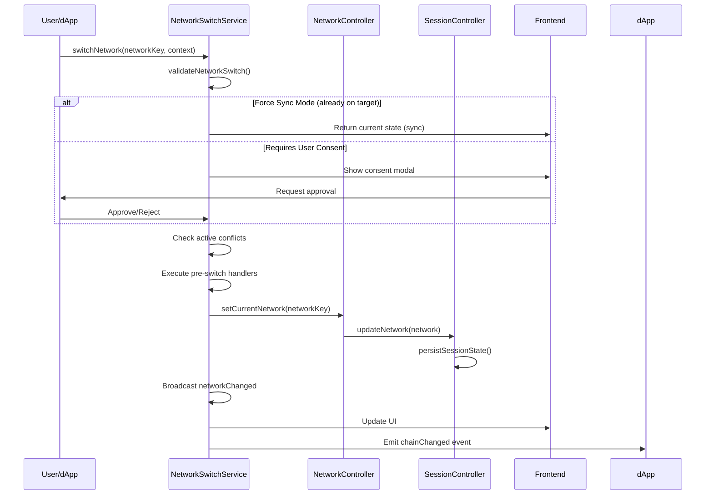

# 🌐 Network Compatibility & Blockchain Operations

SuperSafe Wallet provides comprehensive blockchain operations across multiple EVM-compatible networks (currently **7 active networks**), implementing EIP-1193 and EIP-6963 provider specifications with ethers.js v6 integration.

## Blockchain Overview

### Supported Operations

- **✅ Account Management**: Create, import, switch wallets
- **✅ Balance Queries**: Native & ERC20 token balances
- **✅ Transaction Signing**: eth_sendTransaction, personal_sign, eth_signTypedData
- **✅ Contract Interactions**: ERC20, ERC721, custom contracts
- **✅ Gas Estimation**: Dynamic fee calculation (EIP-1559 and legacy)
- **✅ Network Switching**: Multi-chain support with consent
- **✅ Token Swaps**: Bebop JAM and RFQ integration
- **✅ Cross-Chain**: Relay.link integration for cross-chain operations

---

## Multi-Chain Support

### Active Networks (7)

| Network | Chain ID | RPC | Swap Support | Explorer API | Status |
|---------|----------|-----|--------------|--------------|--------|
| **SuperSeed** | 5330 | https://mainnet.superseed.xyz | ✅ Bebop (JAM) | Blockscout | ✅ Active |
| **Optimism** | 10 | Alchemy RPC | ✅ Bebop (JAM+RFQ) | Moralis | ✅ Active |
| **Ethereum** | 1 | Alchemy RPC | ✅ Bebop (JAM+RFQ) | Etherscan | ✅ Active |
| **Base** | 8453 | Base RPC | ✅ Bebop (JAM+RFQ) | Moralis | ✅ Active |
| **BNB Chain** | 56 | BSC RPC | ✅ Bebop (JAM+RFQ) | Moralis | ✅ Active |
| **Arbitrum One** | 42161 | Public RPC | ✅ Bebop (JAM+RFQ) | Arbiscan | ✅ Active |
| **Shardeum** | 8118 | Shardeum RPC | ❌ Not supported | Shardeum Explorer | ✅ Active |

### Inactive/Testnet Networks

| Network | Chain ID | Swap Support | Status |
|---------|----------|--------------|--------|
| **Ethereum Sepolia** | 11155111 | ❌ Testnet | 💤 Inactive |
| **SuperSeed Sepolia** | 53302 | ❌ Testnet | 💤 Inactive |
| **Injective** | 1776 | ❌ Not supported | 💤 Inactive |

**Notes:**
- Base, Optimism, BSC, Ethereum, and Arbitrum use Moralis API for balance and transaction history queries
- Base network includes curated token whitelist for enhanced security
- SuperSeed uses Blockscout API for transaction history
- All active networks support Relay.link cross-chain operations (except Shardeum)

---

## Network Configuration

**Location:** `src/utils/networks.js`

### Complete Network Structure

```javascript
export const NETWORKS = {
  superseed: {
    active: true,
    networkKey: 'superseed',
    name: "SuperSeed",
    chainId: 5330,
    rpcUrl: "https://mainnet.superseed.xyz",
    wsUrl: "wss://mainnet.superseed.xyz",
    currency: "ETH",
    explorer: "https://explorer.superseed.xyz",
    testnet: false,
    localLogoNetworkPath: "assets/networks/5330_network.png",
    nativeCurrency: {
      name: "Ethereum",
      symbol: "ETH",
      decimals: 18
    },
    networkToken: {
      name: "Superseed",
      symbol: "SUPR",
      decimals: 18,
      address: "0x4200000000000000000000000000000000000042"
    },
    networkStableToken: {
      name: "USDC",
      symbol: "USDC",
      decimals: 6,
      address: "0xC316C8252B5F2176d0135Ebb0999E99296998F2e"
    },
    supportBebopSwap: true,
    bebop: {
      bebopName: 'superseed',
      displayName: 'SuperSeed',
      apiSupport: ['JAM'], // JAM only (no RFQ)
      jamApi: 'https://api.bebop.xyz/jam/superseed/v2/',
      rfqApi: null,
      swapEnabled: true,
      contracts: {
        jamSettlement: "0xbeb0b0623f66bE8cE162EbDfA2ec543A522F4ea6",
        balanceManager: "0xC5a350853E4e36b73EB0C24aaA4b8816C9A3579a",
        permit2: "0x000000000022D473030F116dDEE9F6B43aC78BA3"
      }
    },
    relay: {
      enabled: true,
      relayChainId: 5330,
      displayName: 'SuperSeed',
      crossChainEnabled: true
    }
  },
  // ... other networks follow similar structure
};
```

### Key Configuration Fields

- `active`: Boolean flag indicating if network is enabled
- `networkToken`: Wrapped native token (WETH, WBNB, etc.)
- `networkStableToken`: Primary stablecoin (USDC, USDT)
- `bebop.apiSupport`: Array of supported Bebop APIs (`['JAM']` or `['JAM', 'RFQ']`)
- `relay`: Relay.link cross-chain configuration
- `localLogoNetworkPath`: Path to network logo asset

### Utility Functions

```javascript
// Get only active networks
export function getActiveNetworks() {
  return Object.fromEntries(
    Object.entries(NETWORKS).filter(([, network]) => network.active === true)
  );
}

// Check if network is active
export function isNetworkActive(networkKey) {
  return NETWORKS[networkKey]?.active === true;
}

// Get network key by chainId (strict validation, no fallbacks)
export function getNetworkKeyByChainId(chainId) {
  const targetChainId = parseInt(chainId, 10);
  for (const [networkKey, networkConfig] of Object.entries(NETWORKS)) {
    if (networkConfig.chainId === targetChainId) {
      return networkKey;
    }
  }
  throw new Error(`Unsupported chainId: ${chainId}`);
}
```

---

## Network Architecture

### Network Switching Flow



### Network Switch Service

**Location:** `src/services/NetworkSwitchService.js`

**Key Features:**
- ✅ Strict validation (no fallbacks)
- ✅ Force sync mode detection
- ✅ Pre-switch coordination handlers
- ✅ Conflict detection and resolution
- ✅ Switch history tracking
- ✅ Context-aware switching (manual, connection, dapp-requested)

**Context Types:**
- `manual`: User-initiated switching (AppHeader, Settings)
- `connection`: Connection-time network mismatch resolution
- `dapp-requested`: dApp-requested network switching via `wallet_switchEthereumChain`

---

## Transaction Management

### Transaction Lifecycle

```
┌──────────────┐
│   Pending    │ ← Transaction created
└──────┬───────┘
       │ Broadcast to network
       ↓
┌──────────────┐
│   Submitted  │ ← TX hash received
└──────┬───────┘
       │ Mining
       ↓
┌──────────────┐
│  Confirmed   │ ← Block confirmation
└──────┬───────┘
       │ Final
       ↓
┌──────────────┐
│   Finalized  │ ← Irreversible
└──────────────┘
```

### Send Transaction

**Location:** `src/background/handlers/walletHandlers.js`

**Features:**
- Automatic gas estimation
- EIP-1559 fee calculation (with legacy fallback)
- Transaction history storage
- Error handling and retry logic

```javascript
export async function sendTransaction(txRequest, privateKey, provider) {
  // 1. Create wallet
  const wallet = new ethers.Wallet(privateKey, provider);
  
  // 2. Estimate gas
  if (!txRequest.gasLimit) {
    txRequest.gasLimit = await wallet.estimateGas(txRequest);
  }
  
  // 3. Get fee data (EIP-1559 or legacy)
  if (!txRequest.maxFeePerGas) {
    const feeData = await provider.getFeeData();
    if (feeData.maxFeePerGas) {
      // EIP-1559
      txRequest.maxFeePerGas = feeData.maxFeePerGas;
      txRequest.maxPriorityFeePerGas = feeData.maxPriorityFeePerGas;
    } else {
      // Legacy
      txRequest.gasPrice = feeData.gasPrice;
    }
  }
  
  // 4. Send transaction
  const tx = await wallet.sendTransaction(txRequest);
  
  // 5. Store in history
  await transactionController.addTransaction({
    hash: tx.hash,
    from: tx.from,
    to: tx.to,
    value: tx.value.toString(),
    timestamp: Date.now(),
    status: 'submitted'
  });
  
  return tx;
}
```

---

## Smart Contract Interactions

### ERC20 Token Operations

**Location:** `src/utils/networks.js` (ERC20_ABI exported)

**Complete ERC20 ABI:**

```javascript
export const ERC20_ABI = [
  // Read-only functions
  "function name() view returns (string)",
  "function symbol() view returns (string)",
  "function decimals() view returns (uint8)",
  "function balanceOf(address) view returns (uint256)",
  "function totalSupply() view returns (uint256)",
  "function allowance(address owner, address spender) view returns (uint256)",
  // Write functions
  "function transfer(address to, uint amount) returns (bool)",
  "function approve(address spender, uint amount) returns (bool)",
  // Events
  "event Transfer(address indexed from, address indexed to, uint amount)",
  "event Approval(address indexed owner, address indexed spender, uint amount)"
];
```

**Usage Example:**

```javascript
// Get ERC20 balance
export async function getERC20Balance(tokenAddress, walletAddress, provider) {
  const contract = new ethers.Contract(tokenAddress, ERC20_ABI, provider);
  const balance = await contract.balanceOf(walletAddress);
  return balance.toString();
}

// Approve ERC20 spending
export async function approveERC20(tokenAddress, spenderAddress, amount, privateKey, provider) {
  const wallet = new ethers.Wallet(privateKey, provider);
  const contract = new ethers.Contract(tokenAddress, ERC20_ABI, wallet);
  
  const tx = await contract.approve(spenderAddress, amount);
  await tx.wait();
  
  return tx.hash;
}
```

---

## Provider Implementation

### EIP-1193 & EIP-6963 Provider

**Location:** `src/utils/provider.js`

**Key Features:**
- ✅ EIP-1193 standard compliance
- ✅ EIP-6963 provider discovery (RainbowKit, Wagmi compatibility)
- ✅ Policy-based injection (AllowList security)
- ✅ Event deduplication
- ✅ Account caching for performance
- ✅ MetaMask compatibility flags

**Provider Creation:**

```javascript
function createSuperSafeProvider(policy = null) {
  const provider = {
    isMetaMask: true,  // MetaMask compatibility
    isSuperSafe: true,
    
    // EIP-1193 request method
    request: async ({ method, params }) => {
      logger.debug('[Provider] Request:', method);
      
      switch (method) {
        case 'eth_requestAccounts':
          return await requestAccounts();
          
        case 'eth_accounts':
          return await getAccounts();
          
        case 'eth_chainId':
          return await getChainId();
          
        case 'eth_sendTransaction':
          return await sendTransaction(params[0]);
          
        case 'personal_sign':
          return await personalSign(params[0], params[1]);
          
        case 'eth_signTypedData_v4':
          return await signTypedData(params[0], params[1]);
          
        case 'wallet_switchEthereumChain':
          return await switchChain(params[0].chainId);
          
        default:
          throw new Error(`Method ${method} not supported`);
      }
    },
    
    // Event emitter (EIP-1193)
    on: (event, handler) => {
      logger.debug('[Provider] Listener added:', event);
      eventEmitter.on(event, handler);
    },
    
    removeListener: (event, handler) => {
      eventEmitter.removeListener(event, handler);
    }
  };
  
  return provider;
}
```

### EIP-6963 Provider Discovery

**Implementation:**

```javascript
// Announce provider via EIP-6963
window.dispatchEvent(new CustomEvent('eip6963:announceProvider', {
  detail: {
    info: {
      uuid: 'super-safe-wallet',
      name: 'SuperSafe',
      icon: 'data:image/svg+xml;base64,...',
      rdns: 'cool.supersafe'
    },
    provider: createSuperSafeProvider(policy)
  }
}));

// Listen for provider requests
window.addEventListener('eip6963:requestProvider', () => {
  window.dispatchEvent(new CustomEvent('eip6963:announceProvider', {
    detail: { info, provider }
  }));
});
```

### Provider Injection

**Location:** `src/content-script.js`

**Injection Flow:**

1. **Policy Injection**: Content script injects policy into DOM
2. **Provider Script**: Injects `provider.js` script tag
3. **Policy Reading**: Provider reads policy from DOM element
4. **Provider Creation**: Creates provider instance with policy
5. **Window Exposure**: Exposes `window.ethereum` and EIP-6963 provider

**Event Forwarding:**

```javascript
// Content script forwards EIP-1193 events to page
window.addEventListener('message', (event) => {
  if (event.data?.type === 'EIP1193_EVENT' && event.data?.__supersafe) {
    // Forward to page provider
    window.postMessage({
      __supersafe: true,
      type: 'EIP1193_EVENT',
      event: event.data.event,
      payload: event.data.payload
    }, '*');
  }
});
```

---

## Network Detection for dApps

### Current Network Detection

```javascript
const getCurrentNetwork = async () => {
  try {
    const chainId = await window.ethereum.request({
      method: 'eth_chainId'
    });
    
    const networkInfo = getNetworkInfo(chainId);
    console.log('Current network:', networkInfo);
    return networkInfo;
  } catch (error) {
    console.error('Failed to get current network:', error);
    throw error;
  }
};
```

### Network Change Detection

```javascript
const setupNetworkListener = () => {
  window.ethereum.on('chainChanged', (chainId) => {
    console.log('Network changed to:', chainId);
    
    const networkInfo = getNetworkInfo(chainId);
    updateUIForNetwork(networkInfo);
    
    // Check if dApp supports this network
    if (!isNetworkSupported(chainId)) {
      showNetworkSwitchModal(chainId);
    }
  });
};
```

### Request Network Switch

```javascript
const switchToNetwork = async (targetChainId) => {
  try {
    await window.ethereum.request({
      method: 'wallet_switchEthereumChain',
      params: [{ chainId: targetChainId }]
    });
    
    console.log('Network switched successfully');
  } catch (error) {
    if (error.code === 4902) {
      // Chain not added, request to add it
      await addNetwork(targetChainId);
    } else {
      console.error('Failed to switch network:', error);
      throw error;
    }
  }
};
```

---

## Best Practices

### Network Handling Guidelines

#### Always Check Network

```javascript
const initializeDApp = async () => {
  // Check if wallet is connected
  const accounts = await window.ethereum.request({
    method: 'eth_accounts'
  });
  
  if (accounts.length === 0) {
    showConnectButton();
    return;
  }
  
  // Check network compatibility
  const isCompatible = await checkNetworkCompatibility();
  if (!isCompatible) {
    return;
  }
  
  // Initialize dApp
  initializeApp();
};
```

#### Handle Network Changes

```javascript
const setupNetworkHandling = () => {
  // Listen for network changes
  window.ethereum.on('chainChanged', handleNetworkChange);
  
  // Check network on page load
  checkNetworkCompatibility();
  
  // Check network periodically
  setInterval(checkNetworkCompatibility, 30000); // Every 30 seconds
};
```

### Error Handling

#### Network Switch Errors

```javascript
const handleNetworkSwitchError = (error) => {
  switch (error.code) {
    case 4001:
      showError('User rejected network switch');
      break;
    case 4902:
      showError('Network not added to wallet');
      break;
    default:
      showError('Failed to switch network');
  }
};
```

---

**Document Status:** ✅ Current as of November 15, 2025  
**Code Version:** v3.0.0+
